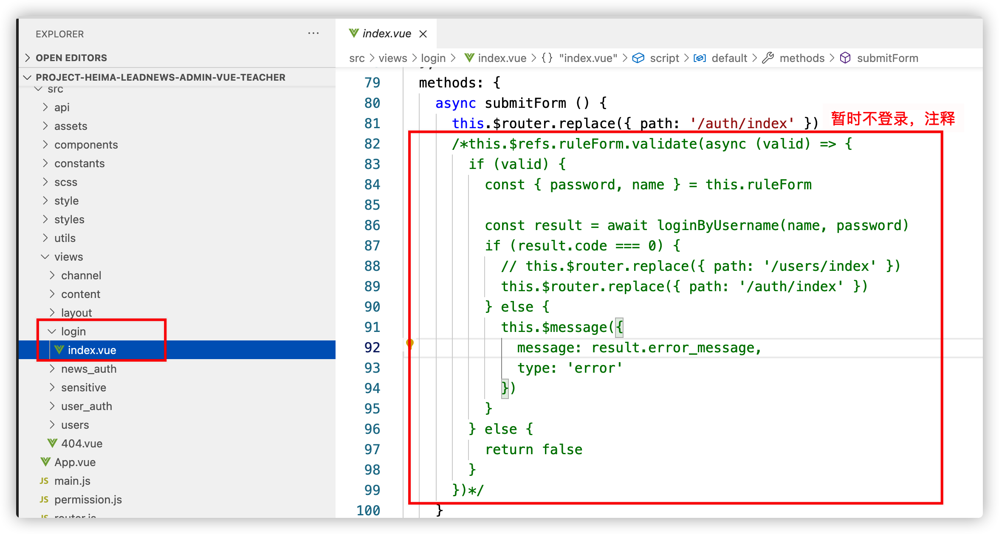
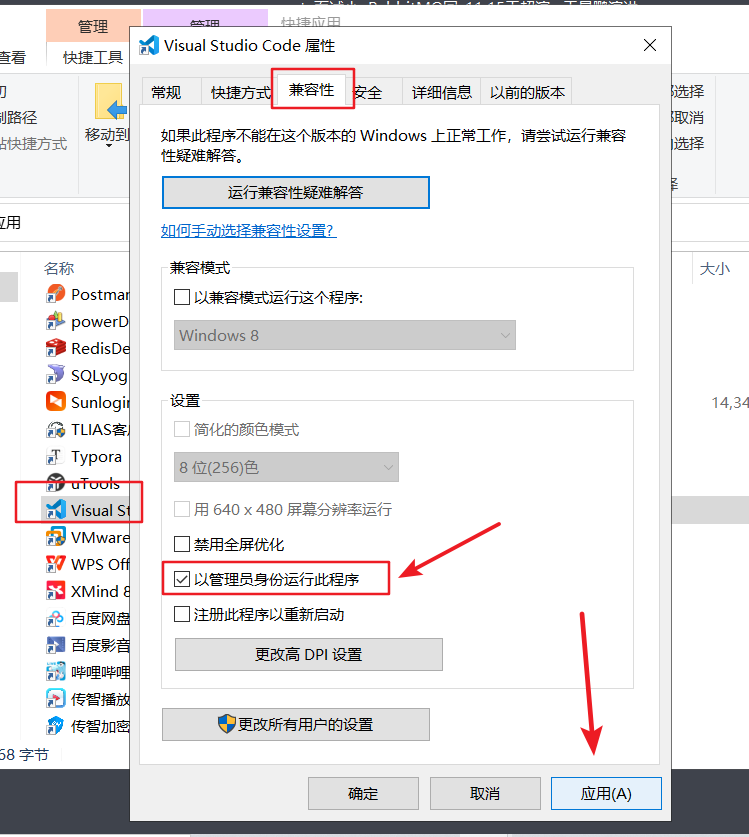

## 前端相关基础知识

### nodejs

```
默认的npm下载镜像源比较缓慢


方式一: 安装cnpm命令 使用淘宝镜像源
npm install cnpm -g --registry=https://registry.npm.taobao.org

使用这种方式，后面操作时   使用cnpm命令开头


方式二: 直接修改npm的镜像中心地址
npm config set registry http://registry.npm.taobao.org

使用这种方式，后面操作时   可以继续使用npm命令开头
```


### webpack

#### 什么是webpack

webpack 是一个现代 JavaScript 应用程序的模块打包器(module bundler)，分析你的项目结构，找到JavaScript模块以及其它的一些浏览器不能直接运行的拓展语言（Sass，TypeScript等），并将其转换和打包为合适的格式供浏览器使用。


#### webpack安装

注意：请先安装node环境

webpack基于node.js运行，首先需要安装node.js。(须安装)  

**安装webpack**

方式一：  `cnpm install webpack@4.41.5 -g`  


方式二： `npm install webpack@4.41.5 -g`  

### 导入admin前端工程

前端代码：https://gitee.com/xiaoT_CJ/heima-leadnews-front

使用VsCode 工具打开前端项目


* heima-leadnews-admin：admin管理平台
* heima-leadnews-app：app端
* heima-leadnews-wemedia：自媒体端

打开项目


（1）安装js依赖，保证有网络，在项目的根目录执行命令`cnpm install`


> 注意：前端项目中如果没有node_models 文件夹，则需要使用 npm install 安装

(2)修改文件，暂时不登录

文件的位置：`\src\views\login\index.vue`

注释登录请求，直接跳转到列表页面，添加跳转代码：

```js
this.$router.replace({path:'/auth/index'})
```

修改效果如下：



（3）修改 `config/index.js` 中后端地址


（4）启动项目

执行 `npm run dev`  就能启动项目了


（5）启动成功以后，用浏览器打开，可以测试已开发好的频道功能


```
联调技巧: 
	1. 确认前端访问后端工程的网关地址正确
	
	
	2. 测试请求时  前端可以点击F12打开控制台
			console   控制台日志
				可查看前端控制台日志，查看是否报错
			network   网络请求 
				可查看所有请求 和响应的所有信息
			
			前端源码 可以添加debugger 关键字用于前端打断点
	
	3. 测试后端接口 后端可以在入参处打断点 可以在重要流程处打印日志
```


**如果在vscode中 无法使用cnpm命令，可以按照下面操作更改**




终端中执行此命令

```
set-ExecutionPolicy RemoteSigned
```

