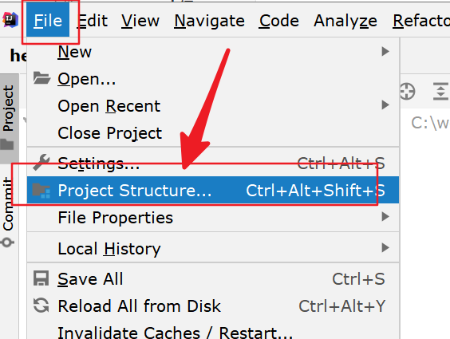
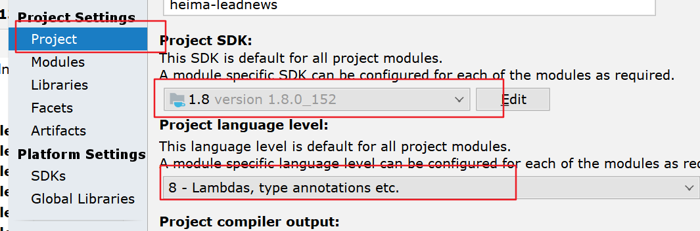
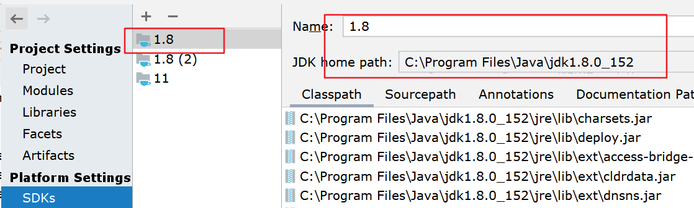
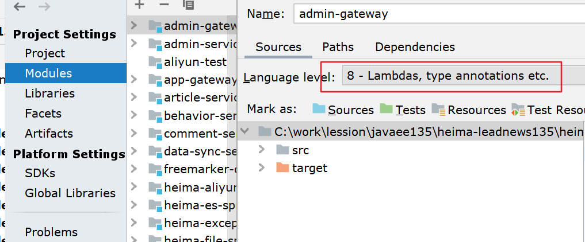
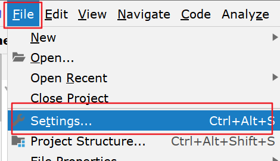
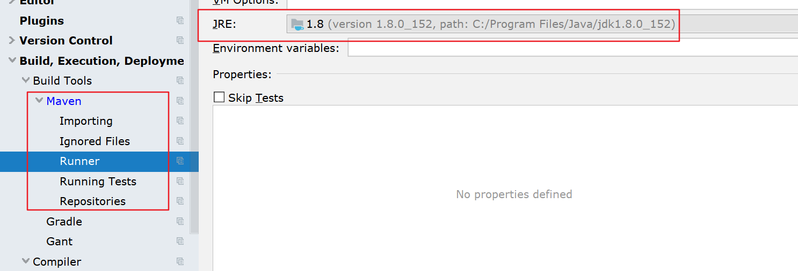
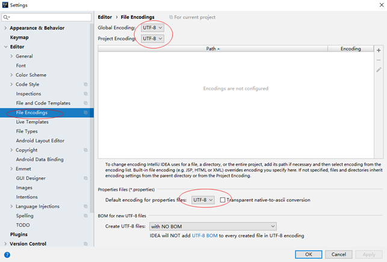
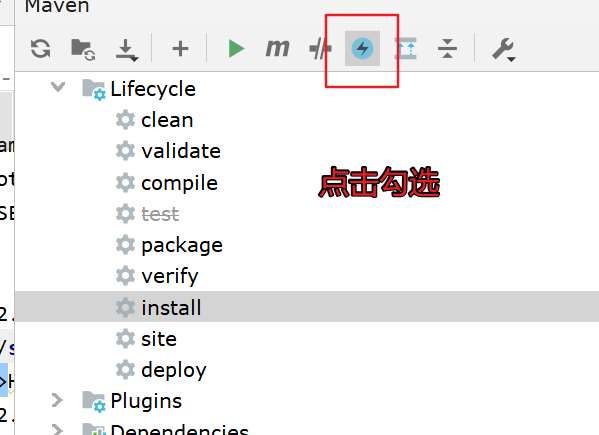
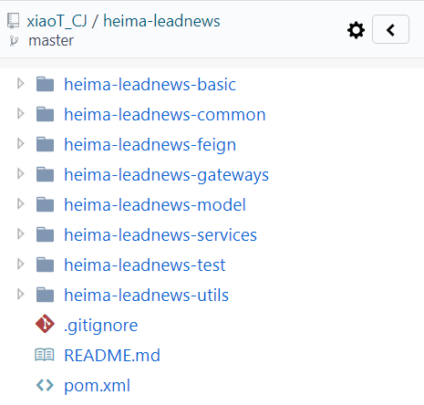

### 后端通用工程搭建

#### 开发环境说明

项目依赖环境（需提前安装好）：

- **JDK1.8**
- Intellij Idea
- Tomcat 8.5
- **Git**

#### IDEA开发工具配置

确保JDK设置

确保 java compiler为JDK8

确保 maven 为JDK8

- 设置本地仓库

- 设置项目编码格式

**maven设置忽略**

平时在clean install时 ，会触发工程中的单元测试方法  点击后可以忽略测试

#### 导入微服务基础工程

根据git地址导入基础工程: https://gitee.com/xiaoT_CJ/heima-leadnews.git

后端工程基于Spring-boot 2.3.2.RELEASE 版本构建，工程父项目为heima-leadnews，并通过继承方式集成Spring-boot。

【父项目下公共子项目】：

- heima-leadnews-common :  主要存储常量定义;
- heima-leadnews-basic:  新加入模块，基于springboot的自动配置，提供通用第三方框架的配置, 如: OSS, Redis, XXLJOB,内容安全 等等
- heima-leadnews-model ：项目中用到的Dto、Pojo、Mapper、Enums定义工程;
- heima-leadnews-utils : 工程公用工具类项目，包含加密/解密、Date、JSON等工具类;
- heima-leadnews-services: 抽取的微服务聚合工程，在此工程下创建所有业务微服务
- heima-leadnews-gateways: 抽取的网关服务聚合工程, 在此工程下创建需要的网关
- heima-leadnews-feigns: 抽取统一的feign接口，并做好自动配置，所有需要远程调用的工程引此依赖即可

【多个微服务】：

- user-service：用于实现APP端用户中心的功能，比如我的收藏、我的粉丝等功能；
- article-service：用于实现APP端文章的获取与搜索等功能；还包括频道、标签等功能；
- behavior-service：用于实现APP端各类行为数据的上传服务；
- search-service：用于封装项目中es搜索微服务；
- comment-service：用于实现APP端评论功能微服务；
- wemedia-service：用于实现自媒体管理端的功能；
- admin-service：用于实现后台管理系统的功能；
- gateway-service：网关服务

