# 第一章 环境搭建

## 学习目标

- 能够描述黑马头条项目有哪些业务
- 能够了解黑马头条项目使用到什么技术
- 能够掌握初始化工程的搭建
- 能够掌握接口开发的流程
- 能够完成频道管理的功能开发
- 能够掌握使用接口swagger、postman、knife4j
- 能够搭建nacos注册中心
- 能够搭建admin网关
- 能够初始化前端工程


## 1 项目介绍

### 1.1 项目背景

随着智能手机的普及，人们更加习惯于通过手机来看新闻。由于生活节奏的加快，很多人只能利用碎片时间来获取信息，因此，对于移动资讯客户端的需求也越来越高。黑马头条项目正是在这样背景下开发出来。黑马头条项目采用当下火热的微服务+大数据技术架构实现。本项目主要着手于获取最新最热新闻资讯，通过大数据分析用户喜好精确推送咨询新闻


### 1.2 项目概述

黑马头条项目是对在线教育平台业务进行大数据统计分析的系统。碎片化、切换频繁、社交化和个性化现如今成为人们阅读行为的标签。黑马头条对海量信息进行搜集，通过系统计算分类，分析用户的兴趣进行推送从而满足用户的需求。


### 1.3 项目术语定义

- 项目：泛指黑马头条整个项目或某一项目模块
- 工程：泛指黑马头条某一项目的源码工程


- App用户：泛指黑马头条APP用户端用户
- 自媒体人：泛指通过黑马自媒体系统发送文章的用户
- 管理员：泛指黑马头条管理系统的使用用户


- App：泛指黑马头条APP 
- WeMedia：泛指黑马头条自媒体系统
- Admin：泛指黑马头条管理系统

## 2 业务说明

项目演示地址：

平台管理：http://heima-admin-java.research.itcast.cn/

自媒体：http://heime-media-java.research.itcast.cn/

app端：http://heima-app-java.research.itcast.cn/

用谷歌浏览器打开，改成移动端调试，如下图或者直接使用手机微信或浏览器打开


### 2.1 功能架构图

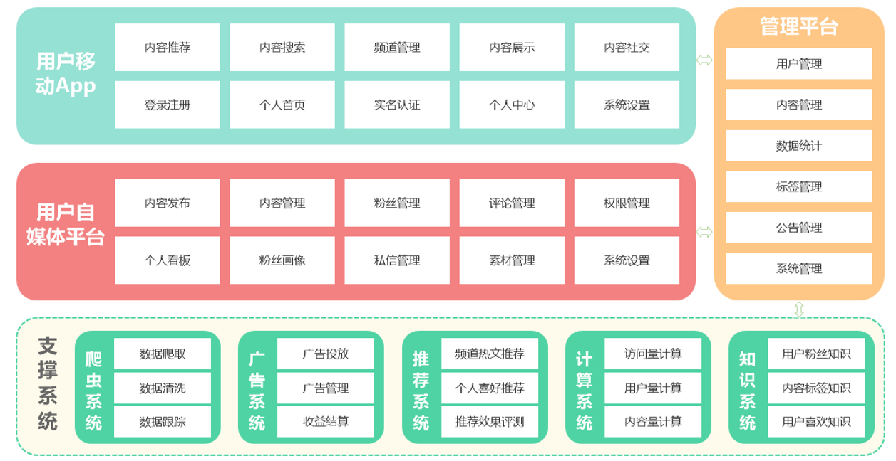

### 2.2 APP主要功能大纲

- 频道栏：用户可以通过此功能添加自己感兴趣的频道，在添加标签时，系统可依据用户喜好进行推荐
- 文章列表：需要显示文章标题、文章图片、评论数等信息，且需要监控文章是否在APP端展现的行为

- 搜索文章：联想用户想搜索的内容，并记录用户的历史搜索信息
- 个人中心：用户可以在其个人中心查看收藏、关注的人、以及系统设置等功能
- 查看文章：用户点击文章进入查看文章页面，在此页面上可进行点赞、评论、不喜欢、分享等操作；除此之外还需要收集用户查看文章的时间，是否看我等行为信息

- 实名认证：用户可以进行身份证认证和实名认证，实名认证之后即可成为自媒体人，在平台上发布文章
- 注册登录：登录时，验证内容为手机号登录/注册，通过手机号验证码进行登录/注册，首次登录用户自动注册账号。

### 2.3 自媒体端功能大纲

- 内容管理：自媒体用户管理文章页面，可以根据条件进行筛选，文章包含草稿、已发布、未通过、已撤回状态。用户可以对文章进行修改，上/下架操作、查看文章状态等操作
- 评论管理：管理文章评论页面，显示用户已发布的全部文章，可以查看文章总评论数和粉丝评论数，可以对文章进行关闭评论等操作

- 素材管理：管理自媒体文章发布的图片，便于用户发布带有多张图片的文章

- 图文数据：自媒体人发布文章的数据：阅读数、评论数、收藏了、转发量，用户可以查看对应文章的阅读数据
- 粉丝画像：内容包括：粉丝性别分布、粉丝年龄分布、粉丝终端分布、粉丝喜欢分类分布

### 2.4 平台管理端功能大纲

- 用户管理：系统后台用来维护用户信息，可以对用户进行增删改查操作，对于违规用户可以进行冻结操
- 用户审核：管理员审核用户信息页面，用户审核分为身份审核和实名审核，身份审核是对用户的身份信息进行审核，包括但不限于工作信息、资质信息、经历信息等；实名认证是对用户实名身份进行认证

- 内容管理：管理员查询现有文章，并对文章进行新增、删除、修改、置顶等操作
- 内容审核：管理员审核自媒体人发布的内容，包括但不限于文章文字、图片、敏感信息等
- 频道管理：管理频道分类界面，可以新增频道，查看频道，新增或修改频道关联的标签
- 网站统计：统计内容包括：日活用户、访问量、新增用户、访问量趋势、热门搜索、用户地区分布等数据
- 内容统计：统计内容包括：文章采集量、发布量、阅读量、阅读时间、评论量、转发量、图片量等数据
- 权限管理：超级管理员对后台管理员账号进行新增或删除角色操作

### 2.5 其它需求


## 3 技术结构图

包括前端（Weex、Vue、Echarts、WS）、网关（GateWay）、DevOps（单元测试、代码规范）

服务层中包括中间件（Kafka）、索引、微服务、大数据存储等重难点技术

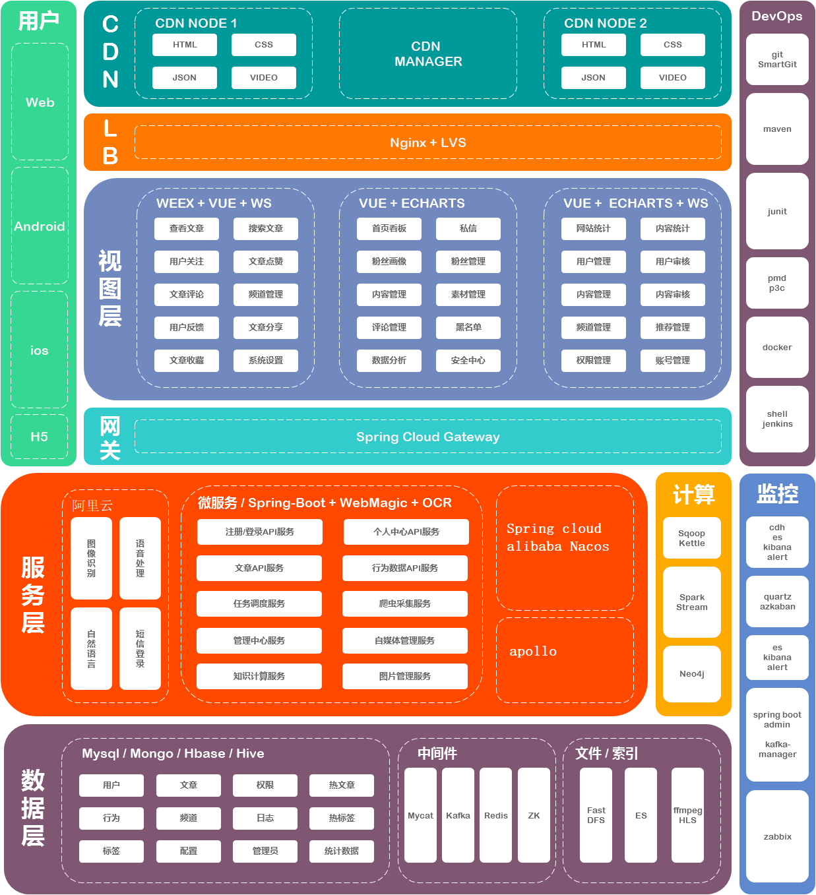

- Weex+Vue+WebSocket ：使用Weex跨平台开发工具，整合集成VUE框架，完成黑马头条移动端功能开发，并集成WebSocket实现即时消息（文章推荐、私信）的推送
- Vue+Echarts ： 自媒体系统使用Vue开发关键，集成Echarts图表框架，完成相关粉丝画像、数据分析等功能
- Vue+Echarts+WebSocket ： 管理系统也是使用Vue开发，集成Echarts，完成网站统计、内容统计等功能，集成WebSocket，实现系统看板实时数据自动化更新
- Spring-Cloud-Gateway : 微服务之前架设的网关服务，实现服务注册中的API请求路由，以及控制流速控制和熔断处理都是常用的架构手段，而这些功能Gateway天然支持
- PMD&P3C : 静态代码扫描工具，在项目中扫描项目代码，检查异常点、优化点、代码规范等，为开发团队提供规范统一，提升项目代码质量
- Junit : 在持续集成思想中，单元测试偏向自动化过程，项目通过Junit+Maven的集成实现这种过程
- 运用Spring Boot快速开发框架，构建项目工程；并结合Spring Cloud全家桶技术，实现后端个人中心、自媒体、管理中心等微服务。
- 运用RabbitMQ完成内部系统消息通知；与客户端系统消息通知；以及实时数据计算
- 运用Redis缓存技术，实现热数据的计算，NoSession等功能，提升系统性能指标
- 使用Mysql存储用户数据，以保证上层数据查询的高性能
- 使用Mongo存储用户热数据，以保证用户热数据高扩展和高性能指标
- 使用FastDFS/OSS作为静态资源存储器，在其上实现热静态资源缓存、淘汰等功能
- 运用ES搜索技术，对冷数据、文章数据建立索引，以保证冷数据、文章查询性能
- 实现实时数据分析与应用；比如文章推荐
- 运用AI技术，来完成系统自动化功能，以提升效率及节省成本。比如实名认证自动化

## 4 数据库设计

### 4.1 分库设计

黑马头条项目采用的分库分表设计，因为业务比较复杂，后期的访问量巨大，为了分摊数据库的压力，整个项目用的不只是一个数据库。其中核心库有**6**个，每一个数据库解决的是一个业务点，非常接近与实际项目设计。

- **user数据库** app用户信息库，主要存储用户信息，用户动态，用户评论，用户认证等信息
- **Behavior数据库**  用户行为库，主要存储用户行为，包括用户的转发，点赞，评论行为等
- **wemedia数据库**  自媒体库，主要存储自媒体人图文数据统计，账号信息，粉丝相关信息等。
- **article数据库**   app文章信息库，主要存储成功发布的文章信息。
- **admin数据库**  后台管理库，主要存储后台管理员的信息。
- **search数据库**  存储搜索相关数据   

### 4.2 核心数据流转图


> 说明：整个项目其核心数据为文章信息，上图主要说明文章的数据流转
>
> 1 爬虫系统从外网采集数据后入**爬虫库**，即爬虫库中保存了一份采集的文章信息
>
> 2 自媒体人可以通过发布文章后首先进入**自媒体库**
>
> 3 爬虫文章和自媒体文章最后都要经过审核成功后入**appinfo库**，这里面的文章信息，最终是要给app端用户所查看
>
> 4 在app端用户查看的时候，需要记录用户的一些行为，如转发、评论、点赞等需要入**用户行为库**

### 4.3 冗余设计

黑马头条项目全部采用逻辑关联，没有采用主外键约束。也是方便数据源冗余，尽可能少的使用多表关联查询。冗余是为了效率，减少join。单表查询比关联查询速度要快。某个访问频繁的字段可以冗余存放在两张表里，不用关联了。

如查询一个订单表需要查询该条订单的用户名称，就必须join另外用户表，如果业务表很大，那么就会查询的很慢，这个时候我们就可以使用冗余来解决这个问题，在新建订单的同时不仅仅需要把用户ID存储，同时也需要存储用户的名称，这样我们在查询订单表的时候就不需要去join另外用户表，也能查询出该条订单的用户名称。这样的冗余可以直接的提高查询效率，单表更快。

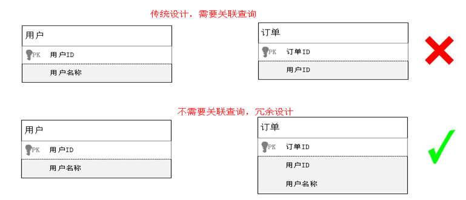

### 4.4 导入数据库

**创建 mysql容器**

```shell
docker run -id -p 3306:3306 --name=mysql -v /root/mysql/conf:/etc/mysql/conf.d -v /root/mysql/logs:/logs -v /root/mysql/data:/var/lib/mysql -e MYSQL_ROOT_PASSWORD=root mysql:5.7.25
```

**导入mysql脚本**

当天资料文件夹下：数据库脚本

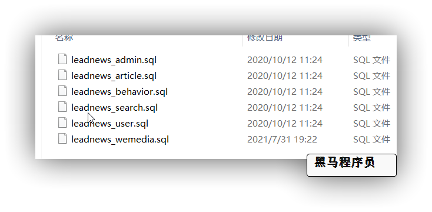

## 5 初始工程导入

### 5.1 主体结构说明

根据git地址导入基础工程: https://gitee.com/xiaoT_CJ/heima-leadnews.git


后端工程基于Spring-boot 2.3.2.RELEASE 版本构建，工程父项目为heima-leadnews，并通过继承方式集成Spring-boot。

【父项目下公共子项目】：

- heima-leadnews-common :  主要存储常量定义;
- heima-leadnews-basic:  新加入模块，基于springboot的自动配置，提供通用第三方框架的配置, 如: OSS, Redis, XXLJOB,内容安全 等等
- heima-leadnews-model ：项目中用到的Dto、Pojo、Mapper、Enums定义工程;
- heima-leadnews-utils : 工程公用工具类项目，包含加密/解密、Date、JSON等工具类;
- heima-leadnews-services: 抽取的微服务聚合工程，在此工程下创建所有业务微服务
- heima-leadnews-gateways: 抽取的网关服务聚合工程, 在此工程下创建需要的网关
- heima-leadnews-feigns: 抽取统一的feign接口，并做好自动配置，所有需要远程调用的工程引此依赖即可

【多个微服务】：

- user-service：用于实现APP端用户中心的功能，比如我的收藏、我的粉丝等功能；
- article-service：用于实现APP端文章的获取与搜索等功能；还包括频道、标签等功能；
- behavior-service：用于实现APP端各类行为数据的上传服务；
- search-service：用于封装项目中es搜索微服务；
- comment-service：用于实现APP端评论功能微服务；
- wemedia-service：用于实现自媒体管理端的功能；
- admin-service：用于实现后台管理系统的功能；
- gateway-service：网关服务

### 5.2 后端通用工程搭建

#### 5.2.1 开发环境说明

项目依赖环境（需提前安装好）：

- **JDK1.8**
- Intellij Idea
- Tomcat 8.5
- **Git**

#### 5.2.2 IDEA开发工具配置

- 设置本地仓库

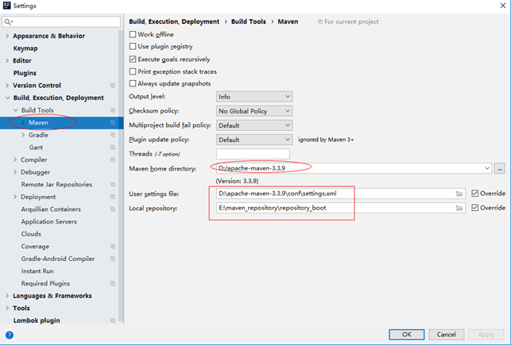


- 设置项目编码格式


## 6 后端开发-通用说明及开发规范

### 6.1 什么是前后端开发

项目基于前后端分离的架构进行开发，前后端分离架构总体上包括前端和服务端，通常是多人协作开发

- 对于后端java工程师：

  把精力放在设计模式，spring+springmvc，linux，mysql事务隔离与锁机制，mongodb，http/tcp，多线程，分布式架构，弹性计算架构，微服务架构，java性能优化，以及相关的项目管理等等。

- 对于前端工程师：

  把精力放在html5，css3，vuejs，webpack，nodejs，Google V8引擎，javascript多线程，模块化，面向切面编程，设计模式，浏览器兼容性，性能优化等等。

#### 6.1.1 前后端分离开发流程


#### 6.1.2 前后端开发流程

1. 需求分析

梳理用户的需求，分析业务流程

2. 接口定义

根据需求分析定义接口，定义出接口文档

3. 服务端和前端并行开发

服务端：依据接口文档进行服务端接口开发

前端：根据用户需求开发操作界面，并根据接口文档制作mock数据，进行测试

4. 前后端集成接口联调

最终前端调用服务端接口完成业务

5. 项目开发上线测试

### 6.2 后端接口开发规范

#### 6.2.1 开发原则

- 自顶向下的设计原则：功能应该从表现层分析再到控制层、服务层、持久层逐层设计

​         controller：接收的参数、请求方式、请求路径、返1回值  

​         service：业务代码   

​         mapper：MP接口

- 自底向上的开发原则：上层需调用下层，因此开发应从底层向上层逐层开发

  项目中开发的层次次序参考  DB->中间件->持久层->服务层->控制层

- 单一职责的开发原则：类或者方法提供的功能应该单一明确，特别越底层越应单一职责，以便维护

  项目中Mapper方法必须功能单一，参数明确，拒绝两种以上的持久逻辑使用同一个Mapper方法

- 依赖倒置的开发原则：上层依赖下层，是依赖下层接口，并不是依赖下层的实现   

  项目中每层都是通过接口调用Controller->Service->Mapper

#### 6.2.2 开发步骤

- 明确类定义：明确哪些是重用类，哪些是需要新增的类 
- 明确主键规则：确认操作表的ID生成规则，自增或id_work
- Mapper实现:使用mybatis-plus封装的方法还是自定义mapper映射
- Service实现：可用通过时序图帮助我们梳理实现逻辑
- Controller实现：简单的Service层调用
- 单元测试或接口测试或前端直接联调测试

#### 6.2.3 接口版本规范说明

随着业务的复杂，同一个接口可能出现多个版本，为了方便后期切换和AB测试，需要定义接口的版本号

- 在某一个微服务下访问controller的时候在包名下加一个版本号,如下

  ```properties
  com.heima.article.controller.v1
  ```

- 在访问具体的接口方法的url映射的时候也应该加上版本说明，如下：

  ```java
  @RequestMapping("/api/v1/article")
  ```

### 6.3 接口通用请求和响应

领域驱动模型设计: 

controller -> service( DTO)

**DTO(Data Transfer Object)**:数据传输对象,用于展示层与服务层之间的数据传输对象

> 前端传给后端的参数封装

  

**VO（View Object）** 视图对象     

> 后端返回给前端的数据对象


**POJO**: 和数据库对应的实体


#### 6.3.1 通用的响应对象

不分页：com.heima.model.common.dtos.ResponseResult

```

code : 状态码 

errorMessage: 错误信息 

data:  数据

host: 图片前缀服务器
```

```java
/**
 * 通用的结果返回类
 * @param <T>
 */
public class ResponseResult<T> implements Serializable {

    private String host;  // 图片服务器前缀路径   http://image.server.url    /xxxx.xxx.xx.jpg
    private Integer code; // 状态码 
    private String errorMessage; // 提示信息 
    private T data;  // 数据
		// ser/get 代码省略
}
```

分页通用返回：com.heima.model.common.dtos.PageResponseResult

```java
public class PageResponseResult extends ResponseResult {
    private Integer currentPage;
    private Integer size;
    private Integer total;

    public PageResponseResult(Integer currentPage, Integer size, Integer total) {
        this.currentPage = currentPage;
        this.size = size;
        this.total = total;
    }
	 // set/get 代码省略
}
```

#### 6.3.2 通用的请求dtos

com.heima.model.common.dtos.PageRequestDto

```java
@Data
@Slf4j
public class PageRequestDto {
    protected Integer size;
    protected Integer page;
    // 查询分页参数
    public void checkParam() {
        if (this.page == null || this.page < 0) {
            setPage(1);
        }
        if (this.size == null || this.size < 0 || this.size > 100) {
            setSize(10);
        }
    }
}
```

#### 6.3.3 通用的异常枚举

com.heima.model.common.enums.AppHttpCodeEnum

```java
public enum AppHttpCodeEnum {
    // 成功段0
    SUCCESS(0,"操作成功"),
    // 登录段1~50
    NEED_LOGIN(1,"需要登录后操作"),
    LOGIN_PASSWORD_ERROR(2,"密码错误"),
    // TOKEN50~100
    TOKEN_INVALID(50,"无效的TOKEN"),
    TOKEN_EXPIRE(51,"TOKEN已过期"),
    TOKEN_REQUIRE(52,"TOKEN是必须的"),
    // SIGN验签 100~120
    SIGN_INVALID(100,"无效的SIGN"),
    SIG_TIMEOUT(101,"SIGN已过期"),
    // 参数错误 500~1000
    PARAM_REQUIRE(500,"缺少参数"),
    PARAM_INVALID(501,"无效参数"),
    PARAM_IMAGE_FORMAT_ERROR(502,"图片格式有误"),
    SERVER_ERROR(503,"服务器内部错误"),
    // 数据错误 1000~2000
    DATA_EXIST(1000,"数据已经存在"),
    AP_USER_DATA_NOT_EXIST(1001,"ApUser数据不存在"),
    DATA_NOT_EXIST(1002,"数据不存在"),
    // 数据错误 3000~3500
    NO_OPERATOR_AUTH(3000,"无权限操作");

    int code;
    String errorMessage;

    AppHttpCodeEnum(int code, String errorMessage){
        this.code = code;
        this.errorMessage = errorMessage;
    }

    public int getCode() {
        return code;
    }

    public String getErrorMessage() {
        return errorMessage;
    }
}
```

### 6.4 通用环境说明

#### 6.4.1 实体类

所有实体类都是按业务模板划分，如下图

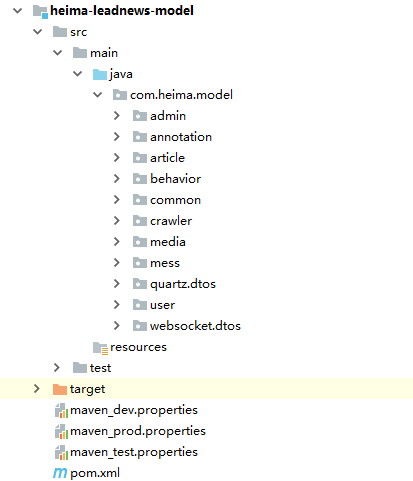


## 7 频道管理


### 7.1 需求说明


ad_channel  频道表


对应实体类：

```java
package com.heima.model.admin.pojos;

import com.baomidou.mybatisplus.annotation.IdType;
import com.baomidou.mybatisplus.annotation.TableField;
import com.baomidou.mybatisplus.annotation.TableId;
import com.baomidou.mybatisplus.annotation.TableName;
import lombok.Data;
import java.io.Serializable;
import java.util.Date;
/**
 * <p>
 * 频道信息表
 * </p>
 * @author itheima
 */
@Data
@TableName("ad_channel")
public class AdChannel implements Serializable {
    private static final long serialVersionUID = 1L;
    @TableId(value = "id", type = IdType.AUTO)
    private Integer id;
    /**
     * 频道名称
     */
    @TableField("name")
    private String name;
    /**
     * 频道描述
     */
    @TableField("description")
    private String description;
    /**
     * 是否默认频道
     */
    @TableField("is_default")
    private Boolean isDefault;
    @TableField("status")
    private Boolean status;
    /**
     * 默认排序
     */
    @TableField("ord")
    private Integer ord;
    /**
     * 创建时间
     */
    @TableField("created_time")
    private Date createdTime;
}
```

### 7.2 平台运营微服务搭建（admin）

(1) 在**heima-leadnews-services** 工程的pom中引入依赖

```xml
<dependencies>
  <dependency>
    <groupId>com.heima</groupId>
    <artifactId>heima-leadnews-model</artifactId>
  </dependency>
  <dependency>
    <groupId>com.heima</groupId>
    <artifactId>heima-leadnews-common</artifactId>
  </dependency>
  <dependency>
    <groupId>com.heima</groupId>
    <artifactId>heima-leadnews-utils</artifactId>
  </dependency>
  <!-- Spring boot starter -->
  <dependency>
    <groupId>org.springframework.boot</groupId>
    <artifactId>spring-boot-starter-web</artifactId>
  </dependency>
  <dependency>
    <groupId>org.springframework.boot</groupId>
    <artifactId>spring-boot-starter-test</artifactId>
    <scope>test</scope>
  </dependency>
</dependencies>
```

（2）在**heima-leadnews-services**下创建模块： **admin-service**

创建好启动类，及配置文件


命名规范：

- com.heima.${模块名称}为基础包名  如平台管理就是  com.heima.admin
- config  配置信息
- controller.v1  控制层
- service  业务层
- mapper  持久层

（3）依赖信息  在父工程中已经引入，无需在引

**注意**：其中mybatis-plus相关的依赖在**heima-leadnews-model**中定义  其中实体类需要mybatis-plus的注解

（3）在`resources`下创建`application.yml`文件

```yaml
server:
  port: 9001
spring:
  application:
    name: leadnews-admin
  datasource:
    driver-class-name: com.mysql.jdbc.Driver
    url: jdbc:mysql://192.168.200.130:3306/leadnews_admin?useUnicode=true&useSSL=false&characterEncoding=UTF-8&serverTimezone=UTC
    username: root
    password: root
# 设置Mapper接口所对应的XML文件位置，如果你在Mapper接口中有自定义方法，需要进行该配置
mybatis-plus:
  mapper-locations: classpath*:mapper/*.xml
  # 设置别名包扫描路径，通过该属性可以给包中的类注册别名
  type-aliases-package: com.heima.model.admin.pojos
```

（4）创建引导类：AdminApplication

```java
package com.heima.admin;

import com.baomidou.mybatisplus.extension.plugins.PaginationInterceptor;
import org.mybatis.spring.annotation.MapperScan;
import org.springframework.boot.SpringApplication;
import org.springframework.boot.autoconfigure.SpringBootApplication;
import org.springframework.context.annotation.Bean;

@SpringBootApplication
@MapperScan("com.heima.admin.mapper")
public class AdminApplication {
    public static void main(String[] args) {
        SpringApplication.run(AdminApplication.class,args);
    }
    /**
     * mybatis-plus分页插件
     */
    @Bean
    public PaginationInterceptor paginationInterceptor() {
        return new PaginationInterceptor();
    }
}
```

### 7.3 频道列表

#### 7.3.1 接口定义

**接口地址**:  `/api/v1/channel/list`

**请求方式**:  `POST`

**请求数据类型**: `application/json`

**响应数据类型**: `application/json`

**接口描述**: 按照条件分页查询频道列表,按照顺序编号升序排序

**请求示例**:


```javascript
{
    "status": 0 ,    
	"name": "",
	"page": 0,
	"size": 0
}
```

**请求参数**:


| 参数名称           | 参数说明     | in   | 是否必须 | 数据类型       | schema     |
| ------------------ | ------------ | ---- | -------- | -------------- | ---------- |
| dto                | dto          | body | true     | ChannelDto     | ChannelDto |
| &emsp;&emsp;name   | 频道名称     |      | false    | string         |            |
| &emsp;&emsp;page   | 当前页       |      | true     | integer(int32) |            |
| &emsp;&emsp;size   | 每页显示条数 |      | true     | integer(int32) |            |
| &emsp;&emsp;status | 频道状态     |      | false    | integer(int32) |            |

在 model 模块下定义ChannelDTO类：

```java
package com.heima.model.admin.dtos;
@Data
public class ChannelDTO extends PageRequestDTO {
    /**
     * 频道名称
     */
    private String name;
    /**
     * 频道状态
     */
    private Integer status;
}
```


#### 7.3.2 持久层

在`heima-leadnews-services`下的 `admin-service `模块中 `com.heima.admin.mapper` 包下定义接口

```java
package com.heima.admin.mapper;

import com.baomidou.mybatisplus.core.mapper.BaseMapper;
import com.heima.model.admin.pojos.AdChannel;
import org.apache.ibatis.annotations.Mapper;

public interface AdChannelMapper extends BaseMapper<AdChannel> {
}
```

#### 7.3.3 业务层

在`heima-leadnews-services`下的 `admin-service `模块中 `com.heima.admin.service` 包下定义接口

```java
package com.heima.admin.service;
import com.baomidou.mybatisplus.extension.service.IService;
import com.heima.model.admin.dtos.ChannelDTO;
import com.heima.model.admin.pojos.AdChannel;
import com.heima.model.common.dtos.ResponseResult;
public interface AdChannelService extends IService<AdChannel> {
    /**
     * 根据名称分页查询频道列表
     * @param dto
     * @return
     */
    public ResponseResult findByNameAndPage(ChannelDTO dto);
}
```

创建实现类：`com.heima.admin.service.impl.AdChannelServiceImpl`

```java
package com.heima.admin.service.impl;
import com.baomidou.mybatisplus.core.conditions.query.LambdaQueryWrapper;
import com.baomidou.mybatisplus.core.metadata.IPage;
import com.baomidou.mybatisplus.core.toolkit.Wrappers;
import com.baomidou.mybatisplus.extension.plugins.pagination.Page;
import com.baomidou.mybatisplus.extension.service.impl.ServiceImpl;
import com.heima.admin.mapper.AdChannelMapper;
import com.heima.admin.service.AdChannelService;
import com.heima.model.admin.dtos.ChannelDTO;
import com.heima.model.admin.pojos.AdChannel;
import com.heima.model.common.dtos.PageResponseResult;
import com.heima.model.common.dtos.ResponseResult;
import com.heima.model.common.enums.AppHttpCodeEnum;
import org.apache.commons.lang3.StringUtils;
import org.springframework.stereotype.Service;
@Service
public class AdChannelServiceImpl extends ServiceImpl<AdChannelMapper, AdChannel> implements AdChannelService {
      @Override
    public ResponseResult findByNameAndPage(ChannelDTO dto) {
        // 1. 校验参数
        if (dto == null) {
            return ResponseResult.errorResult(AppHttpCodeEnum.PARAM_INVALID);
        }
        dto.checkParam(); // 检查分页
        // 2. 封装条件 执行查询
        LambdaQueryWrapper<AdChannel> queryWrapper = Wrappers.<AdChannel>lambdaQuery();

        // 频道名称
        if (StringUtils.isNotBlank(dto.getName())) {
            queryWrapper.like(AdChannel::getName, dto.getName());
        }
        // 状态
        if (dto.getStatus() != null) {
            queryWrapper.eq(AdChannel::getStatus, dto.getStatus());
        }
        // 序号升序
        queryWrapper.orderByAsc(AdChannel::getOrd);
        // 分页
        Page<AdChannel> pageReq = new Page<>(dto.getPage(), dto.getSize());
        // 执行查询
        IPage<AdChannel> pageResult = this.page(pageReq, queryWrapper);
        // 3. 封装响应结果
        PageResponseResult pageResponseResult = new PageResponseResult(dto.getPage(), dto.getSize(), pageResult.getTotal(), pageResult.getRecords());
        return pageResponseResult;
    }
}
```

#### 7.3.4 控制层

在`heima-leadnews-services`下的 `admin-service `模块中 `com.heima.admin.controller.v1` 包下定义Controller

定义`AdChannelController`

```java
package com.heima.admin.controller.v1;
import com.heima.admin.service.AdChannelService;
import com.heima.model.admin.dtos.ChannelDTO;
import com.heima.model.common.dtos.ResponseResult;
import org.springframework.beans.factory.annotation.Autowired;
import org.springframework.web.bind.annotation.PostMapping;
import org.springframework.web.bind.annotation.RequestBody;
import org.springframework.web.bind.annotation.RequestMapping;
import org.springframework.web.bind.annotation.RestController;
@RestController
@RequestMapping("/api/v1/channel")
public class AdChannelController {
    @Autowired
    private AdChannelService channelService;
    @PostMapping("/list")
    public ResponseResult findByNameAndPage(@RequestBody ChannelDTO dto) {
        return channelService.findByNameAndPage(dto);
    }
}
```

### 7.4 接口测试工具

#### 7.4.1 postman

(1)简介

Postman是一款功能强大的网页调试与发送网页**HTTP请求**的Chrome插件。**postman被500万开发者和超100,000家公司用于每月访问1.3亿个API。**java开发通常是作为后台开发语言，通常的项目中的接口开发需要一款测试工具来调试接口，这样无需前端页面也不耽误后台代码的开发进度，postman作为一个接口测试工具，是一个非常不错的选择。

官方网址：https://www.postman.com/

(2)安装

解压资料文件夹中的软件，安装即可

(3)请求和响应

- 发送请求，请求方式的选择

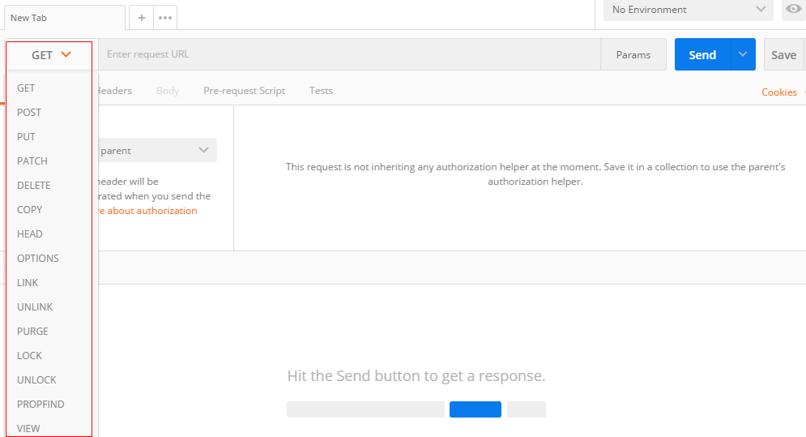

- 输入请求的url,并发送请求


- 通常的接口测试，请求和响应都是json（重要）

请求参数设置


结果返回：


通过以上描述，希望初学者可以快速的安装和使用postman来进行接口的测试，当然，这里描述并不详尽，postman作为一个接口测试的利器，还有很多特别强大的功能并没有介绍，后面随着项目的深入会继续使用。

#### 7.4.2 Swagger介绍

(1) 简介

Swagger 是一个规范和完整的框架，用于生成、描述、调用和可视化 RESTful 风格的 Web 服务(<https://swagger.io/>)。 它的主要作用是：

1. 使得前后端分离开发更加方便，有利于团队协作

2. 接口的文档在线自动生成，降低后端开发人员编写接口文档的负担

3. 功能测试 

   Spring已经将Swagger纳入自身的标准，建立了Spring-swagger项目，现在叫Springfox。通过在项目中引入Springfox ，即可非常简单快捷的使用Swagger。

(2) SpringBoot集成Swagger

- 引入依赖,在 **heima-leadnews-model** 模块中引入该依赖 **(已经引入)**

  ```xml
  <dependency>
      <groupId>io.springfox</groupId>
      <artifactId>springfox-swagger2</artifactId>
  </dependency>
  <dependency>
      <groupId>io.springfox</groupId>
      <artifactId>springfox-swagger-ui</artifactId>
  </dependency>
  ```


- 在 **admin-service** 工程的config包中添加一个配置类

```java
package com.heima.admin.config;
import org.springframework.boot.autoconfigure.condition.ConditionalOnProperty;
import org.springframework.context.annotation.Bean;
import org.springframework.context.annotation.Configuration;
import springfox.documentation.builders.ApiInfoBuilder;
import springfox.documentation.builders.PathSelectors;
import springfox.documentation.builders.RequestHandlerSelectors;
import springfox.documentation.service.ApiInfo;
import springfox.documentation.service.Contact;
import springfox.documentation.spi.DocumentationType;
import springfox.documentation.spring.web.plugins.Docket;
import springfox.documentation.swagger2.annotations.EnableSwagger2;
@Configuration
@EnableSwagger2
public class SwaggerConfiguration {
   @Bean
   public Docket buildDocket() {
      return new Docket(DocumentationType.SWAGGER_2)
              .apiInfo(buildApiInfo())
              .select()
              // 要扫描的API(Controller)基础包
              .apis(RequestHandlerSelectors.basePackage("com.heima"))
              .paths(PathSelectors.any())
              .build();
   }
   private ApiInfo buildApiInfo() {
      Contact contact = new Contact("黑马程序员","","");
      return new ApiInfoBuilder()
              .title("黑马头条-平台管理API文档")
              .description("平台管理服务api")
              .contact(contact)
              .version("1.0.0").build();
   }
}
```

（3）Swagger常用注解

在Java类中添加Swagger的注解即可生成Swagger接口文档，常用Swagger注解如下：

@Api：修饰整个类，描述Controller的作用  

@ApiOperation：描述一个类的一个方法，或者说一个接口 

@ApiParam：单个参数的描述信息  

@ApiModel：用对象来接收参数  

@ApiModelProperty：用对象接收参数时，描述对象的一个字段  

@ApiResponse：HTTP响应其中1个描述  

@ApiResponses：HTTP响应整体描述  

@ApiIgnore：使用该注解忽略这个API  

@ApiError ：发生错误返回的信息  

@ApiImplicitParam：一个请求参数  

@ApiImplicitParams：多个请求参数的描述信息


 @ApiImplicitParam属性：

| 属性         | 取值   | 作用                                          |
| ------------ | ------ | --------------------------------------------- |
| paramType    |        | 查询参数类型                                  |
|              | path   | 以地址的形式提交数据                          |
|              | query  | 直接跟参数完成自动映射赋值                    |
|              | body   | 以流的形式提交 仅支持POST                     |
|              | header | 参数在request headers 里边提交                |
|              | form   | 以form表单的形式提交 仅支持POST               |
| dataType     |        | 参数的数据类型 只作为标志说明，并没有实际验证 |
|              | Long   |                                               |
|              | String |                                               |
| name         |        | 接收参数名                                    |
| value        |        | 接收参数的意义描述                            |
| required     |        | 参数是否必填                                  |
|              | true   | 必填                                          |
|              | false  | 非必填                                        |
| defaultValue |        | 默认值                                        |

我们在AdChannelController中添加Swagger注解，代码如下所示：

```java
@RestController
@RequestMapping("/api/v1/channel")
@Api(value = "频道管理", tags = "频道管理", description = "频道管理API")
public class AdChannelController {
    /**
     * 根据名称分页查询频道列表
     * @param dto
     * @return
     */
    @PostMapping("/list")
    @ApiOperation("频道分页列表查询")
    public ResponseResult findByNameAndPage(@RequestBody ChannelDTO dto) {
        return channelService.findByNameAndPage(dto);
    }
}
```

ChannelDTO

```java
@Data
public class ChannelDTO extends PageRequestDTO {
    /**
     * 频道名称
     */
    @ApiModelProperty("频道名称")
    private String name;
}
```

PageRequestDTO

```java
@Data
@Slf4j
public class PageRequestDTO {

    @ApiModelProperty(value="当前页",required = true)
    protected Integer page;
    @ApiModelProperty(value="每页显示条数",required = true)
    protected Integer size;

    public void checkParam() {
        if (this.page == null || this.page < 0) {
            setPage(1);
        }
        if (this.size == null || this.size < 0 || this.size > 100) {
            setSize(10);
        }
    }
}
```

启动admin微服务，访问地址：http://localhost:9001/swagger-ui.html

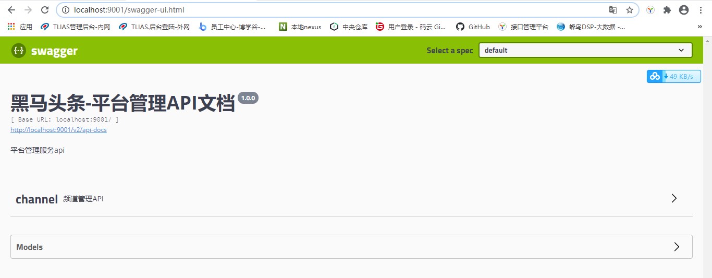

查询：

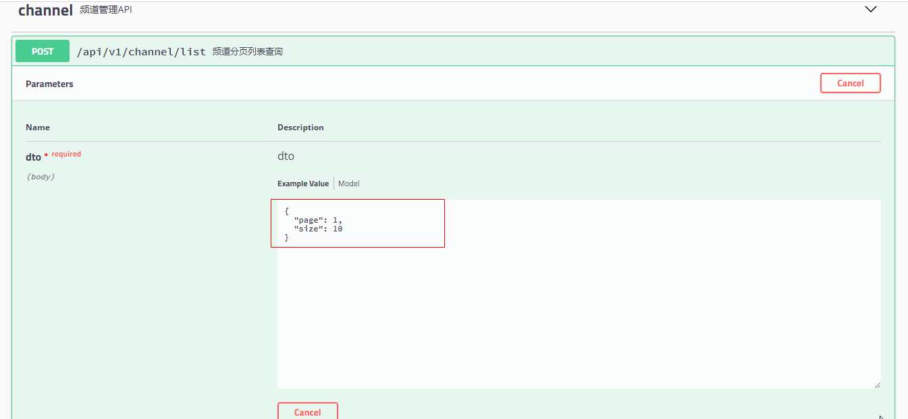

先点击**Try it out** 输入参数，然后点击**Execute**,结果如下：

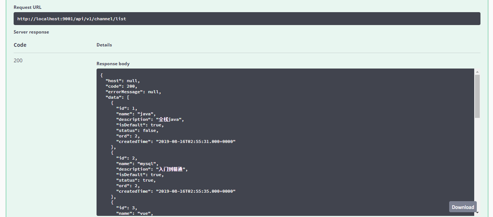


#### 7.4.3 knife4j

(1)简介

knife4j是为Java MVC框架集成Swagger生成Api文档的增强解决方案,前身是swagger-bootstrap-ui,取名kni4j是希望它能像一把匕首一样小巧,轻量,并且功能强悍!

gitee地址：https://gitee.com/xiaoym/knife4j

官方文档：https://doc.xiaominfo.com/

效果演示：http://knife4j.xiaominfo.com/doc.html

(2)核心功能

该UI增强包主要包括两大核心功能：文档说明 和 在线调试

- 文档说明：根据Swagger的规范说明，详细列出接口文档的说明，包括接口地址、类型、请求示例、请求参数、响应示例、响应参数、响应码等信息，使用swagger-bootstrap-ui能根据该文档说明，对该接口的使用情况一目了然。
- 在线调试：提供在线接口联调的强大功能，自动解析当前接口参数,同时包含表单验证，调用参数可返回接口响应内容、headers、Curl请求命令实例、响应时间、响应状态码等信息，帮助开发者在线调试，而不必通过其他测试工具测试接口是否正确,简介、强大。
- 个性化配置：通过个性化ui配置项，可自定义UI的相关显示信息
- 离线文档：根据标准规范，生成的在线markdown离线文档，开发者可以进行拷贝生成markdown接口文档，通过其他第三方markdown转换工具转换成html或pdf，这样也可以放弃swagger2markdown组件
- 接口排序：自1.8.5后，ui支持了接口排序功能，例如一个注册功能主要包含了多个步骤,可以根据swagger-bootstrap-ui提供的接口排序规则实现接口的排序，step化接口操作，方便其他开发者进行接口对接

(3) 快速集成knife4j


- 在`heima-leadnews-basic ` 模块下，右键创建子工程 `heima-knife4j-spring-boot-starter`, 并引入依赖

```xml
<dependencies>
  <dependency>
    <groupId>com.github.xiaoymin</groupId>
    <artifactId>knife4j-spring-boot-starter</artifactId>
  </dependency>
</dependencies>
```

- 在`heima-leadnews-basic ` -->  `heima-knife4j-spring-boot-starter`下 创建Swagger配置文件

新建Swagger的配置文件`SwaggerConfiguration.java`文件,创建springfox提供的Docket分组对象,代码如下：

```java
package com.heima.knife4j.config;

import com.github.xiaoymin.knife4j.spring.annotations.EnableKnife4j;
import org.springframework.context.annotation.Bean;
import org.springframework.context.annotation.Configuration;
import org.springframework.context.annotation.Import;
import springfox.bean.validators.configuration.BeanValidatorPluginsConfiguration;
import springfox.documentation.builders.ApiInfoBuilder;
import springfox.documentation.builders.PathSelectors;
import springfox.documentation.builders.RequestHandlerSelectors;
import springfox.documentation.service.ApiInfo;
import springfox.documentation.spi.DocumentationType;
import springfox.documentation.spring.web.plugins.Docket;
import springfox.documentation.swagger2.annotations.EnableSwagger2;

@Configuration
@EnableSwagger2
@EnableKnife4j
@Import(BeanValidatorPluginsConfiguration.class)
public class Swagger2Configuration {

    @Bean(value = "defaultApi2")
    public Docket defaultApi2() {
        Docket docket=new Docket(DocumentationType.SWAGGER_2)
                .apiInfo(apiInfo())
                //分组名称
                .groupName("1.0")
                .select()
                //这里指定Controller扫描包路径
                .apis(RequestHandlerSelectors.basePackage("com.heima"))
                .paths(PathSelectors.any())
                .build();
        return docket;
    }
    private ApiInfo apiInfo() {
        return new ApiInfoBuilder()
                .title("黑马头条API文档")
                .description("黑马头条API文档")
                .version("1.0")
                .build();
    }
}
```

以上有两个注解需要特别说明，如下表：

| 注解              | 说明                                                         |
| ----------------- | ------------------------------------------------------------ |
| `@EnableSwagger2` | 该注解是Springfox-swagger框架提供的使用Swagger注解，该注解必须加 |
| `@EnableKnife4j`  | 该注解是`knife4j`提供的增强注解,Ui提供了例如动态参数、参数过滤、接口排序等增强功能,如果你想使用这些增强功能就必须加该注解，否则可以不用加 |

- 在`heima-leadnews-basic ` --> `heima-knife4j-spring-boot-starter` 资源目录resources文件夹下添加

  `META-INF/spring.factories` 文件：

  ```properties
org.springframework.boot.autoconfigure.EnableAutoConfiguration=\
    com.heima.knife4j.config.Swagger2Configuration
  ```

-  `heima-leadnews-services` 下的pom中，加入该 knife4j通用配置依赖 ，所有的微服务即可使用api文档生成功能

```xml
<!-- 接口文档起步依赖starter  引入后可使用knife接口文档 -->
        <dependency>
            <artifactId>heima-knife4j-spring-boot-starter</artifactId>
            <groupId>com.heima</groupId>
            <version>1.0-SNAPSHOT</version>
        </dependency>

```


重启`admin-service`服务，并在浏览器输入地址：`http://host:port/doc.html`


查询频道列表：


### 7.5 频道新增

**需求:**

   频道名称不能为空, 不能大于10个字符

   且频道名称不可以重复

#### 7.5.1 接口定义

**接口地址**:`/api/v1/channel/save`

**请求方式**:`POST`

**请求数据类型**:`application/json`

**响应数据类型**:`application/json`

**接口描述**: 频道新增

**请求示例**:


```javascript
{
  "name": "",
	"description": "",
  "status": true,
	"isDefault": true,
	"ord": 0
}
```


**请求参数**:


| 参数名称                | 参数说明  | in   | 是否必须 | 数据类型          | schema    |
| ----------------------- | --------- | ---- | -------- | ----------------- | --------- |
| adChannel               | adChannel | body | true     | AdChannel         | AdChannel |
| &emsp;&emsp;createdTime |           |      | false    | string(date-time) |           |
| &emsp;&emsp;description |           |      | false    | string            |           |
| &emsp;&emsp;id          |           |      | false    | integer(int32)    |           |
| &emsp;&emsp;isDefault   |           |      | false    | boolean           |           |
| &emsp;&emsp;name        |           |      | false    | string            |           |
| &emsp;&emsp;ord         |           |      | false    | integer(int32)    |           |
| &emsp;&emsp;status      |           |      | false    | boolean           |           |


#### 7.5.2 业务层

在AdChannelService中新增方法

```java
/**
     * 新增
     * @param channel
     * @return
     */
public ResponseResult insert(AdChannel channel);
```

实现类：

```java
/**
     * 新增
     * @param adChannel
     * @return
     */
    @Override
    public ResponseResult insert(AdChannel adChannel) {
        // 1 参数校验
        if (adChannel == null || StringUtils.isBlank(adChannel.getName())) {
            return ResponseResult.errorResult(AppHttpCodeEnum.PARAM_REQUIRE);
        }
        // 2 判断该频道是否存在

        int count = this.count(Wrappers.<AdChannel>lambdaQuery()
                .eq(AdChannel::getName, adChannel.getName()));
        if(count > 0){
            return ResponseResult.errorResult(AppHttpCodeEnum.DATA_EXIST,"该频道已存在");
        }
        // 3 执行新增
        adChannel.setCreatedTime(new Date());
        save(adChannel);
        // 4 返回结果
        return ResponseResult.okResult();
    }
```

#### 7.5.3 控制层

```java
@ApiOperation("频道新增")
@PostMapping("/save")
public ResponseResult insert(@RequestBody AdChannel channel) {
    return channelService.insert(channel);
}
```

#### 7.5.4 测试


### 7.6 频道修改&频道有效无效设置

需求说明

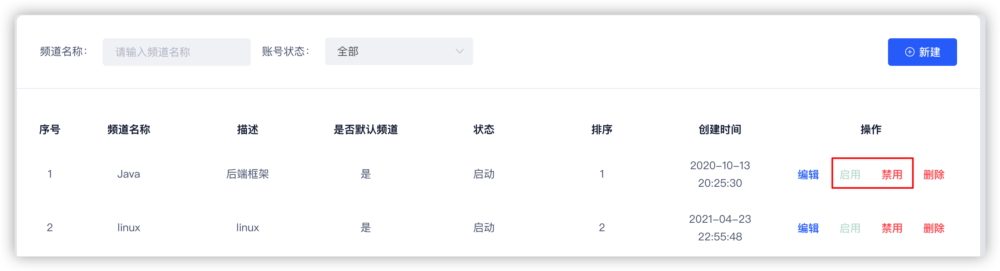

修改频道：

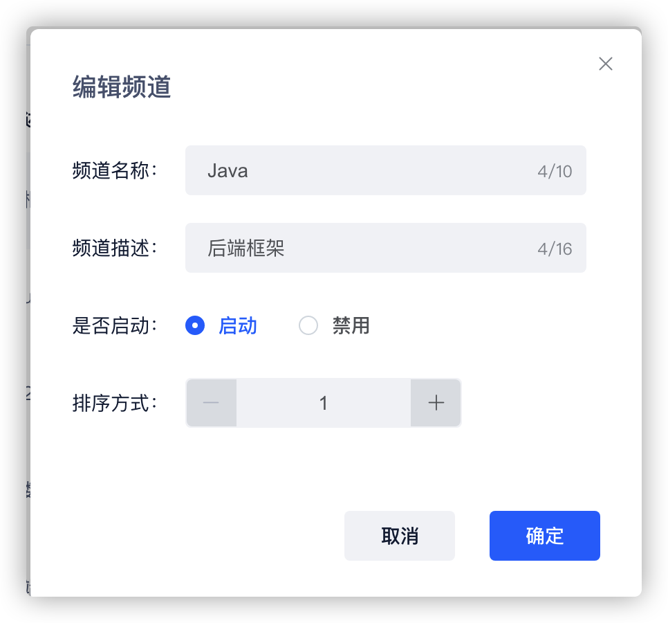

其中设置状态（有效和无效）和弹窗修改都属于同一个修改即可

注意:   如果name无值不用处理 （因为启用禁用不用传name）

​            如果name有值，需要检查是否改变 是否重复  长度是否合格

#### 7.6.1 接口定义

**接口地址**:`/api/v1/channel/update`

**请求方式**:`POST`


**请求数据类型**:`application/json`


**响应数据类型**:`*/*`

**接口描述**: 频道修改


**请求示例**:


```javascript
{
  "name": "",
	"description": "",
  "status": true,
	"isDefault": true,
	"ord": 0
}
```


**请求参数**:


| 参数名称                | 参数说明  | in   | 是否必须 | 数据类型          | schema    |
| ----------------------- | --------- | ---- | -------- | ----------------- | --------- |
| adChannel               | adChannel | body | true     | AdChannel         | AdChannel |
| &emsp;&emsp;createdTime |           |      | false    | string(date-time) |           |
| &emsp;&emsp;description |           |      | false    | string            |           |
| &emsp;&emsp;id          |           |      | false    | integer(int32)    |           |
| &emsp;&emsp;isDefault   |           |      | false    | boolean           |           |
| &emsp;&emsp;name        |           |      | false    | string            |           |
| &emsp;&emsp;ord         |           |      | false    | integer(int32)    |           |
| &emsp;&emsp;status      |           |      | false    | boolean           |           |


#### 7.6.2 业务层

AdChannelService中定义修改方法

```java
 /**
     * 修改
     * @param adChannel
     * @return
     */
public ResponseResult update(AdChannel adChannel);
```

实现类：

```java
/**
     * 修改频道及频道状态
     * @param adChannel
     * @return
     */
    @Override
    public ResponseResult update(AdChannel adChannel) {
        //1 参数校验
        if (adChannel == null || adChannel.getId() == null) {
            return ResponseResult.errorResult(AppHttpCodeEnum.PARAM_INVALID);
        }
        //2 执行修改
        AdChannel channel = getById(adChannel.getId());
        if (channel == null) {
            return ResponseResult.errorResult(AppHttpCodeEnum.DATA_NOT_EXIST,"频道信息不存在");
        }
        //3. 校验名称唯一性
        if(StringUtils.isNotBlank(adChannel.getName())
                &&
                !adChannel.getName().equals(channel.getName())){
            int count = this.count(Wrappers.<AdChannel>lambdaQuery()
                    .eq(AdChannel::getName, adChannel.getName()));
            if(count > 0){
                return ResponseResult.errorResult(AppHttpCodeEnum.DATA_EXIST,"该频道已存在");
            }
        }
        updateById(adChannel);
        //4 返回结果
        return ResponseResult.okResult();
    }
```

#### 7.6.3 控制层

```java
@ApiOperation("频道修改")
@PostMapping("/update")
public ResponseResult update(@RequestBody AdChannel adChannel) {
    return channelService.update(adChannel);
}
```

#### 7.6.4 测试


### 7.7 频道删除

参数: id 


如果当前状态为有效则不能删除

#### 7.7.1 接口定义

**接口地址**:`/api/v1/channel/del/{id}`

**请求方式**:`GET`

**请求数据类型**:`*`

**响应数据类型**: `application/json`

**接口描述**: 频道删除

**请求参数**:


| 参数名称 | 参数说明 | in   | 是否必须 | 数据类型       | schema |
| -------- | -------- | ---- | -------- | -------------- | ------ |
| id       | 文档的ID | path | true     | integer(int32) |        |

#### 7.7.2 业务层

AdChannelService中新增deleteById方法

```java
/**
     * 删除
     * @param id
     * @return
     */
public ResponseResult deleteById(Integer id);
```

实现类

```java
@Override
public ResponseResult deleteById(Integer id) {

  //1.检查参数
  if(id == null){
    return ResponseResult.errorResult(AppHttpCodeEnum.PARAM_INVALID);
  }
  //2.判断当前频道是否存在 和 是否有效
  AdChannel adChannel = getById(id);
  if(adChannel==null){
    return ResponseResult.errorResult(AppHttpCodeEnum.DATA_NOT_EXIST);
  }
  // 启用状态下不能删除
  if (adChannel.getStatus()) {
    return ResponseResult.errorResult(AppHttpCodeEnum.PARAM_REQUIRE);
  }
  //3.删除频道
  removeById(id);
  return ResponseResult.okResult(AppHttpCodeEnum.SUCCESS);
}
```

#### 7.7.3 控制层

```java
@ApiOperation("根据频道ID删除")
@GetMapping("/del/{id}")
public ResponseResult deleteById(@PathVariable("id") Integer id) {
    return channelService.deleteById(id);
}
```


## 8 项目全局异常处理

### 8.1 不可预知异常

#### 8.1.1 问题分析

目前的代码中如果发生系统异常，则直接会给用户抛出不友好的异常信息。为了增加用户的体验，应该给一些适当信息进行提示。例如删除频道的代码，如下


目前红框圈起来的是可以给用户友好提示的，但是当执行删除这一行代码，如何失败了该如何处理。有可能系统会抛出异常。那这个时候就不应该把异常信息直接返回给用户。那该如何处理呢？

项目开发中肯定会设置**全局异常处理**，不管系统发生了任何不可知的异常信息，都应该给用户返回友好提示信息。


#### 8.1.2 代码完成

在`heima-leadnews-basic`模块下 新建`heima-exception-spring-boot-starter` 工程

（1） pom中引入依赖

```xml
<dependencies>
  <dependency>
    <groupId>org.springframework</groupId>
    <artifactId>spring-web</artifactId>
    <scope>provided</scope>
  </dependency>
  <dependency>
    <groupId>com.heima</groupId>
    <artifactId>heima-leadnews-model</artifactId>
    <scope>provided</scope>
  </dependency>
</dependencies>
```

**依赖范围介绍:**https://blog.csdn.net/xiaojin21cen/article/details/106925972

(2) 创建通用异常处理类 com.heima.common.exception.ExceptionCatch

```java
package com.heima.common.exception;

import com.heima.model.common.dtos.ResponseResult;
import com.heima.model.common.enums.AppHttpCodeEnum;
import lombok.extern.slf4j.Slf4j;
import org.springframework.context.annotation.Configuration;
import org.springframework.web.bind.annotation.ExceptionHandler;
import org.springframework.web.bind.annotation.RestControllerAdvice;

/**
 * @Description:  目的是给用户提供友好的提示信息
 * @Version: V1.0
 */
@Slf4j
@Configuration
@RestControllerAdvice   // Springmvc 异常处理拦截注解
public class ExceptionCatch {
    /**
     * 解决项目中所有的异常拦截
     * @return
     */
    @ExceptionHandler(Exception.class)  // exception 所有子类
    public ResponseResult exception(Exception ex) {
        ex.printStackTrace();
        // 记录日志
        log.error("ExceptionCatch ex:{}", ex);
        return ResponseResult.errorResult(AppHttpCodeEnum.SERVER_ERROR, "您的网络异常，请稍后重试");
    }
}
```

`@ControllerAdvice`  控制器增强注解

`@ExceptionHandler` 异常处理器 与上面注解一起使用，可以拦截指定的异常信息

在 `META-INF/spring.factories` 配置文件中添加：

```properties
org.springframework.boot.autoconfigure.EnableAutoConfiguration=\
  com.heima.common.exception.ExceptionCatch
```

(3) `heima-leadnews-services`服务聚合工程引入统一异常依赖

```xml
<!-- 统一异常处理依赖 引入后就不用在try catch异常啦 ~~ -->
        <dependency>
            <groupId>com.heima</groupId>
            <artifactId>heima-exception-spring-boot-starter</artifactId>
            <version>1.0-SNAPSHOT</version>
        </dependency>
```

#### 8.1.4 测试

业务代码修改：

```java
@Override
public ResponseResult deleteById(Integer id) {
  //1.检查参数
  if(id == null){
    return ResponseResult.errorResult(AppHttpCodeEnum.PARAM_INVALID);
  }
  //2.判断当前频道是否存在 和 是否有效
  AdChannel adChannel = getById(id);
  if(adChannel==null){
    return ResponseResult.errorResult(AppHttpCodeEnum.DATA_NOT_EXIST);
  }
  // 启用状态下不能删除
  if (adChannel.getStatus()) {
    return ResponseResult.errorResult(AppHttpCodeEnum.PARAM_REQUIRE);
  }
  // int i = 1 / 0;
  //3.删除频道
  removeById(id);
  return ResponseResult.okResult(AppHttpCodeEnum.SUCCESS);
}
```

添加异常信息以后，返回如下：


### 8.2 可预知异常处理

可预知异常是程序员在代码中手动抛出本系统定义的特定异常类型，由于是程序员抛出的异常，通常异常信息比较
齐全，程序员在抛出时会指定错误代码及错误信息，获取异常信息也比较方便。

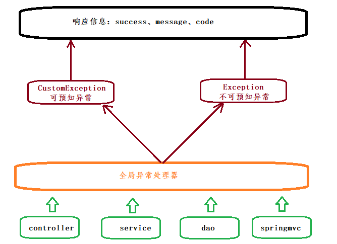

#### 8.2.1 定义自定义异常

```java
package com.heima.common.exception;

import com.heima.model.common.enums.AppHttpCodeEnum;

public class CustomException extends RuntimeException {

    // 异常处理的枚举
    private AppHttpCodeEnum appHttpCodeEnum;

    public CustomException(AppHttpCodeEnum appHttpCodeEnum) {
        this.appHttpCodeEnum = appHttpCodeEnum;
    }
    public CustomException(AppHttpCodeEnum appHttpCodeEnum,String msg) {
        appHttpCodeEnum.setErrorMessage(msg);
        this.appHttpCodeEnum = appHttpCodeEnum;
    }
    public AppHttpCodeEnum getAppHttpCodeEnum() {
        return appHttpCodeEnum;
    }
}
```

#### 8.2.2 配置到全局异常处理

修改全局异常处理ExceptionCatch，拦截自定义异常

```java
package com.heima.common.exception;
/**
 * @Description:  目的是给用户提供友好的提示信息
 * @Version: V1.0
 */
@Slf4j
@RestControllerAdvice   // Springmvc 异常处理拦截注解
public class ExceptionCatch {
    /**
     * 解决项目中所有的异常拦截
     * @return
     */
    @ExceptionHandler(Exception.class)  // exception 所有子类
    public ResponseResult exception(Exception ex) {
        ex.printStackTrace();
        // 记录日志
        log.error("ExceptionCatch ex:{}", ex);
        return ResponseResult.errorResult(AppHttpCodeEnum.SERVER_ERROR, "您的网络异常，请稍后重试");
    }

    /**
     * 拦截自定义异常
     * @return
     */
    @ExceptionHandler(CustomException.class)
    public ResponseResult custException(CustomException ex) {
        ex.printStackTrace();
        log.error("CustomException ex:{}", ex);
        AppHttpCodeEnum codeEnum = ex.getAppHttpCodeEnum();
        return ResponseResult.errorResult(codeEnum);
    }
}
```

补充：可以定义主动抛出异常的工具类，我们就可以直接调用工具类抛出异常。如下：

```java
package com.heima.common.exception;

import com.heima.model.common.enums.AppHttpCodeEnum;
/**
 * @Description:  抛异常工具类
 * @Version: V1.0
 */
public class CustException {
    public static void cust(AppHttpCodeEnum codeEnum) {
        throw new CustomException(codeEnum );
    }
    public static void cust(AppHttpCodeEnum codeEnum,String msg) {
        throw new CustomException(codeEnum,msg);
    }
}
```

#### 8.2.3 测试

任意代码手动抛出自定义异常，如下是在控制器的删除方法中抛出

```java
@GetMapping("/del/{id}")
@Override
public ResponseResult deleteById(@PathVariable("id") Integer id) {
    if(true){
       CustException.cust(AppHttpCodeEnum.DATA_NOT_EXIST);
    }
    return adChannelService.deleteById(id);
}
```

### 8.3 总结

在项目开发中有两种异常处理方式，一个是不可知异常，一个是可知异常，切记不可返回错误信息给用户。


## 9 admin服务注册到nacos

### 9.1 简介

Nacos是阿里的一个开源产品，它是针对微服务架构中的服务发现、配置管理、服务治理的综合型解决方案。
官方介绍是这样的：

Nacos  致力于帮助您发现、配置和管理微服务。Nacos 提供了一组简单易用的特性集，帮助您实现动态服务
发现、服务配置管理、服务及流量管理。 Nacos 帮助您更敏捷和容易地构建、交付和管理微服务平台。
Nacos 是构建以“服务”为中心的现代应用架构的服务基础设施。  

官网地址：https://nacos.io

官方文档：https://nacos.io/zh-cn/docs/what-is-nacos.html

Nacos主要提供以下四大功能：

1. 服务发现与服务健康检查
   Nacos使服务更容易注册，并通过DNS或HTTP接口发现其他服务，Nacos还提供服务的实时健康检查，以防
   止向不健康的主机或服务实例发送请求。
2. 动态配置管理
   动态配置服务允许您在所有环境中以集中和动态的方式管理所有服务的配置。Nacos消除了在更新配置时重新
   部署应用程序，这使配置的更改更加高效和灵活。
3. 动态DNS服务
   Nacos提供基于DNS 协议的服务发现能力，旨在支持异构语言的服务发现，支持将注册在Nacos上的服务以
   域名的方式暴露端点，让三方应用方便的查阅及发现。
4. 服务和元数据管理
   Nacos 能让您从微服务平台建设的视角管理数据中心的所有服务及元数据，包括管理服务的描述、生命周
   期、服务的静态依赖分析、服务的健康状态、服务的流量管理、路由及安全策略。

### 9.2 安装Nacos Server

**docker安装nacos**

导入数据库

```
所有微服务的配置需要统一由 nacos管理， 配置数据会存储到mysql数据库中

导入资料中的nacos.sql数据库脚本   创建配置中心数据库
```

拉取镜像

```shell
docker pull nacos/nacos-server:1.3.2
```

创建容器

```shell
docker run -d \
-e PREFER_HOST_MODE=hostname \
-e MODE=standalone \
-e SPRING_DATASOURCE_PLATFORM=mysql \
-e MYSQL_SERVICE_HOST=192.168.200.130 \
-e MYSQL_SERVICE_PORT=3306 \
-e MYSQL_SERVICE_USER=root \
-e MYSQL_SERVICE_PASSWORD=root \
-e MYSQL_SERVICE_DB_NAME=nacos_config \
-e NACOS_SERVER_IP=192.168.200.130 \
-e JVM_XMS=256m \
-e JVM_XMX=256m \
-e JVM_XMN=128m \
-p 8848:8848 --restart=always \
--name nacos  \
nacos/nacos-server:1.3.2

```

- MODE=standalone  单机版
- --restart=always  开机启动
- -p 8848:8848   映射端口
- -d 创建一个守护式容器在后台运行


> 提供虚拟机已安装启动，无需重复安装


### 9.3 注册及管理配置

在`heima-leadnews-services`聚合服务中加入依赖

```xml
		<!-- nacos 注册中心  客户端依赖 -->
        <dependency>
            <groupId>com.alibaba.cloud</groupId>
            <artifactId>spring-cloud-starter-alibaba-nacos-discovery</artifactId>
        </dependency>


		<!-- nacos 配置中心  客户端依赖 -->
        <dependency>
            <groupId>com.alibaba.cloud</groupId>
            <artifactId>spring-cloud-starter-alibaba-nacos-config</artifactId>
        </dependency>
```

改造`admin-service`配置

注释掉原来的application.yml

新增**bootstrap.yml**

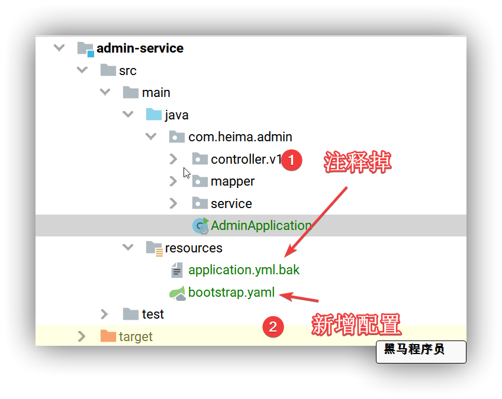

`bootstrap.yml`配置内容

```yml
spring:
  application:
    name: leadnews-admin # 服务名称
  profiles:
    active: dev # 开发环境配置
    ip: 192.168.200.130  # 环境ip地址
  cloud:
    nacos:
      server-addr: ${spring.profiles.ip}:8848
      discovery: # 注册中心地址配置
        namespace: ${spring.profiles.active}
      config: # 配置中心地址配置
        namespace: ${spring.profiles.active}
        file-extension: yml # data-id 后缀
        name: ${spring.application.name} # data-id名称
```


在nacos的dev空间添加配置

**data-id:**  ` leadnews-admin.yml`

```yml
server:
  port: 9001
spring:
  datasource:
    driver-class-name: com.mysql.jdbc.Driver
    url: jdbc:mysql://${spring.profiles.ip}:3306/leadnews_admin?useUnicode=true&useSSL=false&characterEncoding=UTF-8&serverTimezone=UTC
    username: root
    password: root
# 设置Mapper接口所对应的XML文件位置，如果你在Mapper接口中有自定义方法，需要进行该配置
mybatis-plus:
  mapper-locations: classpath*:mapper/*.xml
  # 设置别名包扫描路径，通过该属性可以给包中的类注册别名
  type-aliases-package: com.heima.model.admin.pojos
```

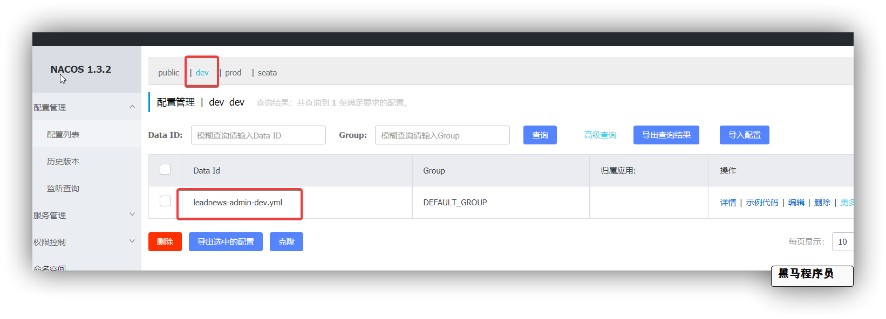

启动admin微服务，启动nacos，可以查看到admin服务正常启动，且服务信息已经在dev环境中的服务列表中了

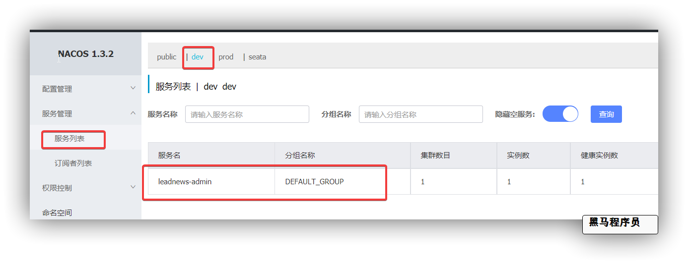


### 9.4 共享配置管理

黑马头条中有非常多的微服务，有很多微服务有一些相同的配置，可以将这些共享的配置 放到一个配置文件中，通过nacos的设置可以共享这些配置

如:  feign的服务降级 和 线程隔离的配置，  微服务中都需要使用


方案一： 在每个微服务中都加入对应配置


方案二:   在nacos单独创建一个共享配置，每个bootstrap中设置该共享配置


我们选择方案二：

在配置中心nacos中 创建配置`share-feign.yml`

```yml
feign:
  hystrix:
    enabled: true  # 开启服务熔断功能
hystrix:
  command:
    default:
      execution.isolation.thread.timeoutInMilliseconds: 10000 # 设置线程隔离时间
ribbon:
  ReadTimeout: 5000   # 读取超时时长
  ConnectTimeout: 2000   # 建立链接的超时时长
  eager-load:
    enabled: true
logging:
  level:
    com.alibaba.nacos.client.config.impl: WARN  # 将nacos相关日志级别 调整为warn
```

修改`admin-service`中`bootstrap.yml`

```yml
spring:
  application:
    name: leadnews-admin # 服务名称
  profiles:
    active: dev # 开发环境配置
    ip: 192.168.200.130  # 环境ip地址
  cloud:
    nacos:
      discovery: # 注册中心地址配置
        server-addr: ${spring.profiles.ip}:8848
        namespace: ${spring.profiles.active}
      config: # 配置中心地址配置
        server-addr: ${spring.profiles.ip}:8848
        namespace: ${spring.profiles.active}
        file-extension: yml # data-id 后缀
        name: ${spring.application.name} # data-id名称
        
        shared-configs: # 共享配置
          - data-id: share-feign.yml
            group: DEFAULT_GROUP
            refresh: false
```

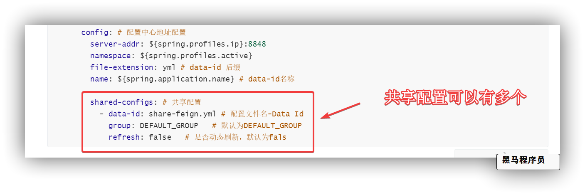


## 10 admin服务集成网关gateway

### 10.1 微服务网关概述


不同的微服务一般会有不同的网络地址，而外部客户端可能需要调用多个服务的接口才能完成一个业务需求，如果让客户端直接与各个微服务通信，会有以下的问题：

- 客户端会多次请求不同的微服务，增加了客户端的复杂性
- 存在跨域请求，在一定场景下处理相对复杂
- 认证复杂，每个服务都需要独立认证
- 难以重构，随着项目的迭代，可能需要重新划分微服务。例如，可能将多个服务合并成一个或者将一个服务拆分成多个。如果客户端直接与微服务通信，那么重构将会很难实施
- 某些微服务可能使用了防火墙 / 浏览器不友好的协议，直接访问会有一定的困难

以上这些问题可以借助网关解决。

网关是介于客户端和服务器端之间的中间层，所有的外部请求都会先经过 网关这一层。也就是说，API 的实现方面更多的考虑业务逻辑，而安全、性能、监控可以交由 网关来做，这样既提高业务灵活性又不缺安全性，典型的架构图如图所示：


优点如下：

- 安全 ，只有网关系统对外进行暴露，微服务可以隐藏在内网，通过防火墙保护。
- 易于监控。可以在网关收集监控数据并将其推送到外部系统进行分析。
- 易于认证。可以在网关上进行认证，然后再将请求转发到后端的微服务，而无须在每个微服务中进行认证。
- 减少了客户端与各个微服务之间的交互次数
- 易于统一授权。

总结：微服务网关就是一个系统，通过暴露该微服务网关系统，方便我们进行相关的鉴权，安全控制，日志统一处理，易于监控的相关功能。

实现微服务网关的技术有很多，

- nginx  Nginx (engine x) 是一个高性能的[HTTP](https://baike.baidu.com/item/HTTP)和[反向代理](https://baike.baidu.com/item/%E5%8F%8D%E5%90%91%E4%BB%A3%E7%90%86/7793488)web服务器，同时也提供了IMAP/POP3/SMTP服务
- zuul ,Zuul 是 Netflix 出品的一个基于 JVM 路由和服务端的负载均衡器。 1.x  servlet 2.5  
- spring-cloud-gateway, 是spring 出品的 基于spring 的网关项目，集成断路器，路径重写，性能比Zuul好。

我们使用gateway这个网关技术，无缝衔接到基于spring cloud的微服务开发中来。

gateway官网：https://spring.io/projects/spring-cloud-gateway

### 10.2 搭建gateway网关微服务

（1）创建 `heima-leadnews-gateways` 网关聚合maven工程

pom文件

```xml
	<dependencies>
        <dependency>
            <groupId>org.apache.commons</groupId>
            <artifactId>commons-lang3</artifactId>
        </dependency>
        <dependency>
            <groupId>com.alibaba</groupId>
            <artifactId>fastjson</artifactId>
        </dependency>
        <dependency>
            <groupId>org.springframework.cloud</groupId>
            <artifactId>spring-cloud-starter-gateway</artifactId>
        </dependency>
        <dependency>
            <groupId>com.alibaba.cloud</groupId>
            <artifactId>spring-cloud-starter-alibaba-nacos-discovery</artifactId>
        </dependency>
        <dependency>
            <groupId>com.alibaba.cloud</groupId>
            <artifactId>spring-cloud-starter-alibaba-nacos-config</artifactId>
        </dependency>
        <dependency>
            <groupId>io.jsonwebtoken</groupId>
            <artifactId>jjwt</artifactId>
        </dependency>
    </dependencies>
```

（2）在`heima-leadnews-gateways` 工程下创建admin端网关  `admin-gateway`

配置文件`bootstrap.yml`

```yaml
spring:
  application:
    name: admin-gateway # 服务名称
  profiles:
    active: dev # 开发环境配置
    ip: 192.168.200.130  # 环境ip地址
  cloud:
    nacos:
      discovery: # 注册中心地址配置
        server-addr: ${spring.profiles.ip}:8848
        namespace: ${spring.profiles.active}
      config: # 配置中心地址配置
        server-addr: ${spring.profiles.ip}:8848
        namespace: ${spring.profiles.active}
        file-extension: yml # data-id 后缀
        name: ${spring.application.name} # data-id名称
```


配置中心dev环境添加配置  :  `admin-gateway.yml`

```yaml
server:
  port: 6001
spring:
  cloud:
    gateway:
      globalcors:
        cors-configurations:
          '[/**]': # 匹配所有请求
            allowedOrigins: "*" #跨域处理 允许所有的域
            allowedMethods: # 支持的方法
            - GET
            - POST
            - PUT
            - DELETE
      routes:
      # 平台管理
      - id: admin
        uri: lb://leadnews-admin
        predicates:
        - Path=/admin/**
        filters:
        - StripPrefix= 1
```

引导类：

```java
package com.heima.admin.gateway;
@SpringBootApplication
public class AdminGatewayApplication {
    public static void main(String[] args) {
        SpringApplication.run(AdminGatewayApplication.class,args);
    }
}
```

### 10.3 前后端联调

前端代码：https://gitee.com/xiaoT_CJ/heima-leadnews-front

使用VsCode 工具打开前端项目


* heima-leadnews-admin：admin管理平台
* heima-leadnews-app：app端
* heima-leadnews-wemedia：自媒体端

打开项目

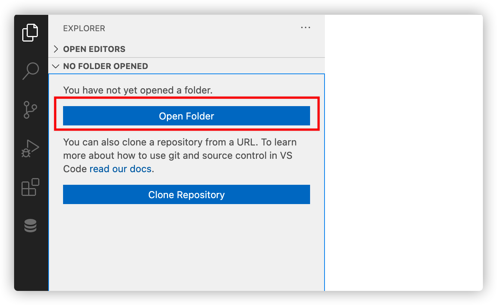

（1）安装js依赖，保证有网络，在项目的根目录执行命令`cnpm install`

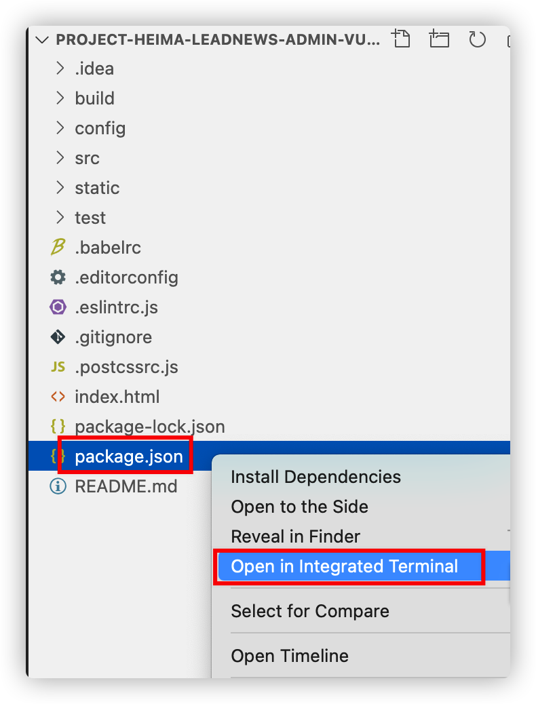

> 注意：前端项目中如果没有node_models 文件夹，则需要使用 npm install 安装

(2)修改文件，暂时不登录

文件的位置：`\src\views\login\index.vue`

注释登录请求，直接跳转到列表页面，添加跳转代码：

```js
this.$router.replace({path:'/auth/index'})
```

修改效果如下：


（3）修改 `config/index.js` 中后端地址


（4）启动项目

执行 `npm run dev`  就能启动项目了


（5）启动成功以后，用浏览器打开，可以测试已开发好的频道功能


```
联调技巧: 
	1. 确认前端访问后端工程的网关地址正确
	
	
	2. 测试请求时  前端可以点击F12打开控制台
			console   控制台日志
				可查看前端控制台日志，查看是否报错
			network   网络请求 
				可查看所有请求 和响应的所有信息
			
			前端源码 可以添加debugger 关键字用于前端打断点
	
	3. 测试后端接口 后端可以在入参处打断点 可以在重要流程处打印日志
```


## 11 敏感词管理 （作业）

需求效果图：


ad_sensitive 敏感词


实体类：

```java
package com.heima.model.admin.pojo;
import com.baomidou.mybatisplus.annotation.IdType;
import com.baomidou.mybatisplus.annotation.TableField;
import com.baomidou.mybatisplus.annotation.TableId;
import com.baomidou.mybatisplus.annotation.TableName;
import lombok.Data;

import java.io.Serializable;
import java.util.Date;

/**
 * <p>
 * 敏感词信息表
 * </p>
 *
 * @author itheima
 */
@Data
@TableName("ad_sensitive")
public class AdSensitive implements Serializable {
    private static final long serialVersionUID = 1L;
    /**
     * 主键
     */
    @TableId(value = "id", type = IdType.AUTO)
    private Integer id;
    /**
     * 敏感词
     */
    @TableField("sensitives")
    private String sensitives;
    /**
     * 创建时间
     */
    @TableField("created_time")
    private Date createdTime;
}
```

### 11.1 接口定义

分别要完成敏感词管理的如下功能

- 敏感词的分页按照关键字模糊查询

- 敏感词新增

- 敏感词修改

- 敏感词删除


`admin-service`微服务中定义敏感词Controller

分别定义查询，新增，修改，删除方法

```java
package com.heima.admin.controller.v1;

import com.heima.model.admin.dtos.SensitiveDto;
import com.heima.model.admin.pojos.AdSensitive;
import com.heima.model.common.dtos.ResponseResult;
import io.swagger.annotations.Api;
import io.swagger.annotations.ApiOperation;
import org.springframework.web.bind.annotation.*;
@Api(value = "敏感词管理API",tags = "敏感词管理API")
@RestController
@RequestMapping("/api/v1/sensitive")
public class AdSensitiveController{
    @ApiOperation(value = "敏感词查询")
    @PostMapping("/list")
    public ResponseResult list(@RequestBody SensitiveDTO dto) {
        return null;
    }
  
    @ApiOperation("敏感词添加")
    @PostMapping("/save")
    public ResponseResult insert(@RequestBody AdSensitive adSensitive) {
        return null;
    }
  
    @ApiOperation("敏感词修改")
    @PostMapping("/update")
    public ResponseResult update(@RequestBody AdSensitive adSensitive) {
        return null;
    }
  
    @ApiOperation("敏感词删除")
    @DeleteMapping("/del/{id}")
    public ResponseResult delete(@PathVariable("id") Integer id) {
        return null;
    }
}
```

封装请求参数: `SensitiveDto`

```java
package com.heima.model.admin.dtos;
import com.heima.model.common.dtos.PageRequestDTO;
import lombok.Data;
@Data
public class SensitiveDTO extends PageRequestDTO {
    /**
     * 敏感词名称
     */
    private String name;
}
```

### 11.2 mapper接口

定义敏感词mapper接口：com.heima.admin.mapper.AdSensitiveMapper

```java
package com.heima.admin.mapper;
import com.baomidou.mybatisplus.core.mapper.BaseMapper;
import com.heima.model.admin.pojos.AdSensitive;
public interface AdSensitiveMapper extends BaseMapper<AdSensitive> {
}
```

### 11.3 业务层

定义敏感词业务接口com.heima.admin.service.AdSensitiveService

```java
package com.heima.admin.service;

import com.baomidou.mybatisplus.extension.service.IService;
import com.heima.model.admin.dtos.SensitiveDTO;
import com.heima.model.admin.pojos.AdSensitive;
import com.heima.model.common.dtos.ResponseResult;

public interface AdSensitiveService extends IService<AdSensitive> {

    /**
     * 查询敏感词列表
     * @param dto
     * @return
     */
    public ResponseResult list(SensitiveDTO dto);

    /**
     * 新增
     * @param adSensitive
     * @return
     */
    public ResponseResult insert(AdSensitive adSensitive);

    /**
     * 修改
     * @param adSensitive
     * @return
     */
    public ResponseResult update(AdSensitive adSensitive);

    /**
     * 删除
     * @param id
     * @return
     */
    public ResponseResult delete(Integer id);
}
```

实现类：

```java
package com.heima.admin.service.impl;
import com.baomidou.mybatisplus.core.conditions.query.LambdaQueryWrapper;
import com.baomidou.mybatisplus.core.metadata.IPage;
import com.baomidou.mybatisplus.core.toolkit.Wrappers;
import com.baomidou.mybatisplus.extension.plugins.pagination.Page;
import com.baomidou.mybatisplus.extension.service.impl.ServiceImpl;
import com.heima.admin.mapper.AdSensitiveMapper;
import com.heima.admin.service.AdSensitiveService;
import com.heima.model.admin.dtos.SensitiveDTO;
import com.heima.model.admin.pojos.AdSensitive;
import com.heima.model.common.dtos.PageResponseResult;
import com.heima.model.common.dtos.ResponseResult;
import com.heima.model.common.enums.AppHttpCodeEnum;
import org.apache.commons.lang3.StringUtils;
import org.springframework.stereotype.Service;
import org.springframework.transaction.annotation.Transactional;
@Service
@Transactional
public class AdSensitiveServiceImpl extends ServiceImpl<AdSensitiveMapper, AdSensitive> implements AdSensitiveService {
    @Override
    public ResponseResult list(SensitiveDTO dto) {
        //1.检查参数
        dto.checkParam();
        //2.根据名称模糊分页查询
        IPage pageParam = new Page(dto.getPage(),dto.getSize());
        LambdaQueryWrapper<AdSensitive> lambdaQueryWrapper = new LambdaQueryWrapper();
        if(StringUtils.isNotBlank(dto.getName())){
            lambdaQueryWrapper.like(AdSensitive::getSensitives,dto.getName());
        }
        IPage page = page(pageParam, lambdaQueryWrapper);
        //3.结果返回
        ResponseResult responseResult = new PageResponseResult(dto.getPage(),dto.getSize(),page.getTotal());
        responseResult.setData(page.getRecords());
        return responseResult;
    }
  
    @Override
    public ResponseResult insert(AdSensitive adSensitive) {
        //1.检查参数
        if(adSensitive == null||StringUtils.isBlank(adSensitive.getSensitives())){
            return ResponseResult.errorResult(AppHttpCodeEnum.PARAM_INVALID);
        }
        //2. 判断是否存在
        int count = this.count(Wrappers.<AdSensitive>lambdaQuery().eq(AdSensitive::getSensitives, adSensitive.getSensitives()));
        if(count > 0){
            return ResponseResult.errorResult(AppHttpCodeEnum.DATA_EXIST);
        }
        //3.保存
        adSensitive.setCreatedTime(new Date());
        save(adSensitive);
        return ResponseResult.okResult(AppHttpCodeEnum.SUCCESS);
    }
  
    @Override
    public ResponseResult update(AdSensitive adSensitive) {
        //1.检查参数
        if(adSensitive.getId() == null){
            return ResponseResult.errorResult(AppHttpCodeEnum.PARAM_INVALID);
        }
        // 如果名称修改 ， 检查是否存在

        //2.修改
        updateById(adSensitive);
        return ResponseResult.okResult(AppHttpCodeEnum.SUCCESS);
    }
  
    @Override
    public ResponseResult delete(Integer id) {
        //1.检查参数
        if(id == null){
            return ResponseResult.errorResult(AppHttpCodeEnum.PARAM_INVALID);
        }
        //2.查询敏感词是否存在
        AdSensitive adSensitive = getById(id);
        if(adSensitive == null){
            return ResponseResult.errorResult(AppHttpCodeEnum.DATA_NOT_EXIST);
        }
        //3.删除
        removeById(id);
        return ResponseResult.okResult(AppHttpCodeEnum.SUCCESS);
    }
}
```

### 11.4 控制层

定义com.heima.admin.controller.v1.SensitiveController实现SensitiveControllerApi接口

```java
package com.heima.admin.controller.v1;
import com.heima.admin.service.AdSensitiveService;
import com.heima.model.admin.dtos.SensitiveDTO;
import com.heima.model.admin.pojos.AdSensitive;
import com.heima.model.common.dtos.ResponseResult;
import io.swagger.annotations.Api;
import io.swagger.annotations.ApiOperation;
import org.springframework.beans.factory.annotation.Autowired;
import org.springframework.web.bind.annotation.*;
@Api(value = "敏感词管理API",tags = "敏感词管理API")
@RestController
@RequestMapping("/api/v1/sensitive")
public class AdSensitiveController{
    @Autowired
    AdSensitiveService sensitiveService;
  
    @ApiOperation(value = "敏感词查询")
    @PostMapping("/list")
    public ResponseResult list(@RequestBody SensitiveDTO dto) {
        return sensitiveService.list(dto);
    }
  
    @ApiOperation("敏感词添加")
    @PostMapping("/save")
    public ResponseResult insert(@RequestBody AdSensitive adSensitive) {
        return sensitiveService.insert(adSensitive);
    }
  
    @ApiOperation("敏感词修改")
    @PostMapping("/update")
    public ResponseResult update(@RequestBody AdSensitive adSensitive) {
        return sensitiveService.update(adSensitive);
    }
  
    @ApiOperation("敏感词删除")
    @DeleteMapping("/del/{id}")
    public ResponseResult delete(@PathVariable("id") Integer id) {
        return sensitiveService.delete(id);
    }
}
```

### 11.5 测试

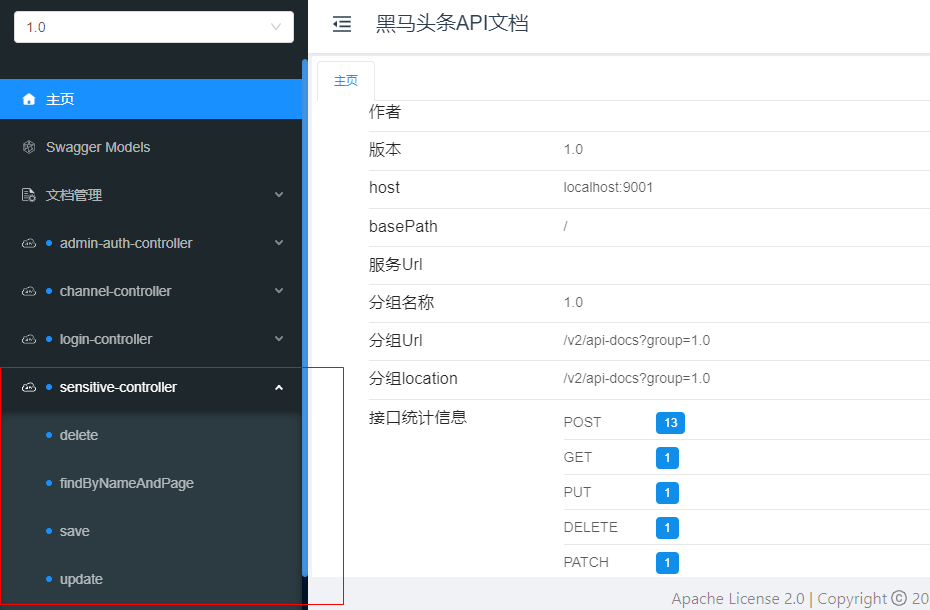

如果集成页面进行测试，请严格按照讲义中的控制层路径进行定义


**思考面试提问:**

**请简单介绍一下你们的项目?**

**你们项目的技术架构是怎样的?**

**你们Springboot及SpringCloud使用的版本?**

**你是如何理解前后端分离开发的?**

**你们后端接口是如何测试的?**

**SpringMVC接收参数的注解有哪些?**    @RequestBody  @RequestParam  @PathVaribale

**你们的接口文档是如何定义的**: 

**你们项目的数据库设计情况？ 你是否有独立设计过数据库?**

**能否说出SpringBoot的自动装配原理?**

**项目中是否自定义过starter起步依赖，如何定义?**

**项目中异常是怎么处理的?**

**项目中注册中心的作用?**

**项目中api网关的作用?**

