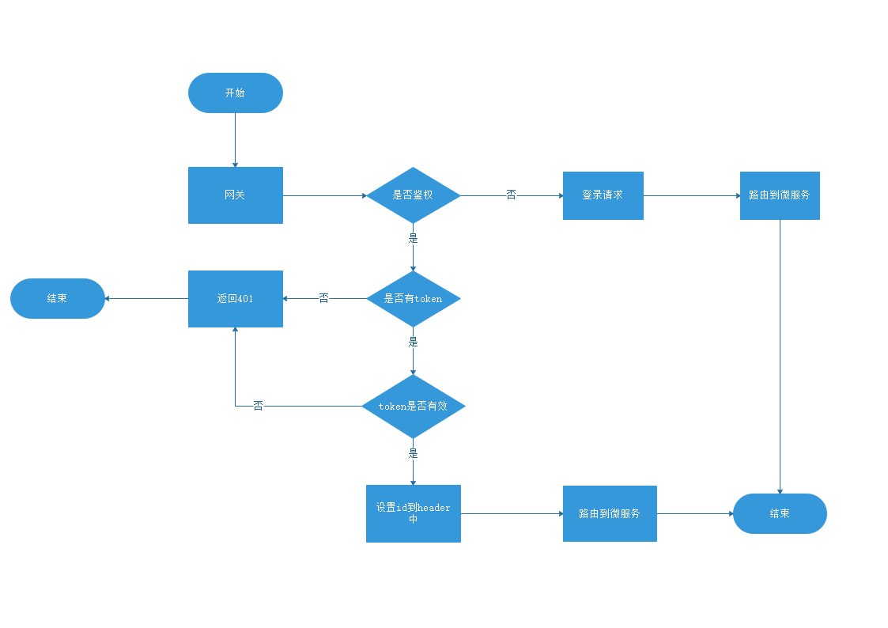
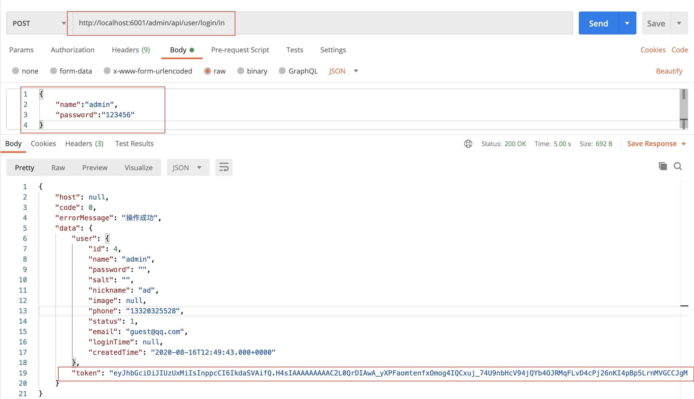
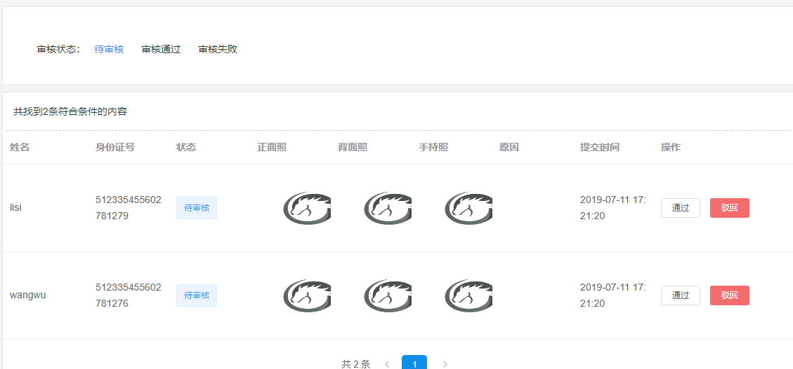
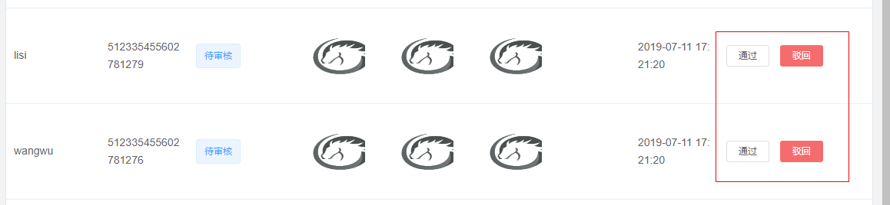
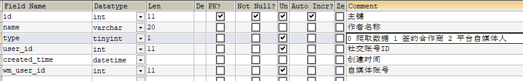
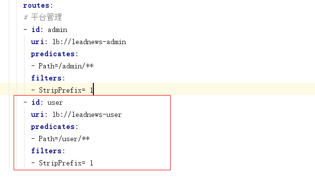
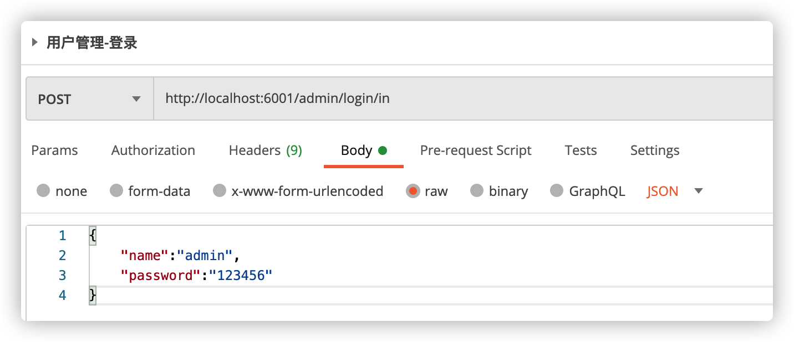

# 第 2 章 登录鉴权_实名认证

## 今日目标

- 能够熟悉常用密码加密方式
- 能够实现运营端登录功能
- 能够完成网关统一鉴权的功能
- 能够完成认证用户列表查询
- 能够熟悉app端用户认证审核流程
- 能够完成app用户审核代码开发


## 1 常见的加密方式回顾

**由于在学习JWT的时候会涉及使用很多加密算法, 所以在这里做下扫盲, 简单了解就可以**

加密算法种类有:

### 1.1.可逆加密算法

**解释:**  加密后, 密文可以反向解密得到密码原文.

#### 1.1.1. 对称加密

【**文件加密和解密使用相同的密钥，即加密密钥也可以用作解密密钥**】 


**解释:** 在对称加密算法中，数据发信方将明文和加密密钥一起经过特殊的加密算法处理后，使其变成复杂的加密密文发送出去，收信方收到密文后，若想解读出原文，则需要使用加密时用的密钥以及相同加密算法的逆算法对密文进行解密，才能使其回复成可读明文。在对称加密算法中，使用的密钥只有一个，收发双方都使用这个密钥，这就需要解密方事先知道加密密钥。

**优点:**  对称加密算法的优点是算法公开、计算量小、加密速度快、加密效率高。

**缺点:**  没有非对称加密安全.

**用途：** 一般用于保存用户手机号、身份证等敏感但能解密的信息。

**常见的对称加密算法有**: `AES、DES、3DES、Blowfish、IDEA、RC4、RC5、RC6、HS256 `

#### 1.1.2. 非对称加密

【**两个密钥：公开密钥（publickey）和私有密钥，公有密钥加密，私有密钥解密**】


**解释: ** 同时生成两把密钥：私钥和公钥，私钥隐秘保存，公钥可以下发给信任客户端.

加密与解密:

* 私钥加密，持有公钥才可以解密
* 公钥加密，持有私钥才可解密

签名:

* 私钥签名,  持有公钥进行验证是否被篡改过.

**优点: ** 非对称加密与对称加密相比，其安全性更好；

**缺点:**  非对称加密的缺点是加密和解密花费时间长、速度慢，只适合对少量数据进行加密。


**用途：** 一般用于签名和认证。私钥服务器保存, 用来加密,  公钥客户拿着用于对于令牌或者签名的解密或者校验使用.

**常见的非对称加密算法有：** `RSA、DSA（数字签名用）、ECC（移动设备用）、RS256 (采用SHA-256 的 RSA 签名) `

### 1.2.不可逆加密算法

**解释:**  一旦加密就不能反向解密得到密码原文.

**种类:**  Hash加密算法, 散列算法, 摘要算法等

**用途：**一般用于校验下载文件正确性，一般在网站上下载文件都能见到；存储用户敏感信息，如密码、 卡号等不可解密的信息。


**常见的不可逆加密算法有：** `MD5、SHA、HMAC`

### 1.3.Base64编码 

Base64是网络上最常见的用于传输8Bit字节代码的编码方式之一。Base64编码可用于在HTTP环境下传递较长的标识信息。采用Base64Base64编码解码具有不可读性，即所编码的数据不会被人用肉眼所直接看到。**注意：Base64只是一种编码方式，不算加密方法。**

在线编码工具：

https://www.bejson.com


### 1.4 MD5密码加密


```java
//md5加密  DegestUtils：spring框架提供的工具类  
String md5Str = DigestUtils.md5DigestAsHex("abc".getBytes());
System.out.println(md5Str);//900150983cd24fb0d6963f7d28e17f72
```

md5相同的密码每次加密都一样，不太安全

### 1.5 混淆加密（md5+随机字符串）

在md5的基础上手动加盐（salt）处理  

hello   +   314h1u2h3uh1      ad_user    salt(314h1u2h3uh1      )


aa123214ji314h1u2h3uh1

```java
//uername:zhangsan  password:123   salt:随时字符串
String salt = RandomStringUtils.randomAlphanumeric(10);//获取一个10位的随机字符串


System.out.println(salt); // 124ewfdsfdsd
String pswd = "123"+salt;
String saltPswd = DigestUtils.md5DigestAsHex(pswd.getBytes());
System.out.println(saltPswd);
```

这样同样的密码，加密多次值是不相同的，因为加入了随机字符串

## 2 登录认证jwt介绍

### 2.1 token认证

随着 Restful API、微服务的兴起，基于 Token 的认证现在已经越来越普遍。基于token的用户认证是一种**服务端无状态**的认证方式，所谓服务端无状态指的token本身包含登录用户所有的相关数据，而客户端在认证后的每次请求都会携带token，因此服务器端无需存放token数据。

当用户认证后，服务端生成一个token发给客户端，客户端可以放到 cookie 或 **localStorage** 等存储中，每次请求时带上 token，服务端收到token通过验证后即可确认用户身份。


### 2.2 什么是JWT？

我们现在了解了基于token认证的交互机制，但令牌里面究竟是什么内容？什么格式呢？市面上基于token的认证方式大都采用的是JWT(Json Web Token)。

JSON Web Token（JWT）是一个开放的行业标准（RFC 7519），它定义了一种简洁的、自包含的协议格式，用于在通信双方传递json对象，传递的信息经过数字签名可以被验证和信任。

**JWT令牌结构：**

JWT令牌由Header、Payload、Signature三部分组成，每部分中间使用点（.）分隔，比如：xxxxx.yyyyy.zzzzz

- Header

头部包括令牌的类型（即JWT）及使用的哈希算法（如HMAC、SHA256或RSA）。

一个例子：

```json
{
	"alg": "HS256"，
	"typ": "JWT"
}
```

将上边的内容使用Base64Url编码，得到一个字符串就是JWT令牌的第一部分。

- Payload

第二部分是负载，内容也是一个json对象，它是存放有效信息的地方，它可以存放jwt提供的现成字段，比如：iss（签发者），exp（过期时间戳）， sub（面向的用户）等，也可自定义字段。
此部分不建议存放敏感信息，因为此部分可以解码还原原始内容。
一个例子：

```json
{
	"sub": "1234567890"，
	"name": "456"，
	"admin": true,
    "id": 123
}
```

最后将第二部分负载使用Base64Url编码，得到一个字符串就是JWT令牌的第二部分。

- Signature

第三部分是签名，此部分用于防止jwt内容被篡改。
这个部分使用base64url将前两部分进行编码，编码后使用点（.）连接组成字符串，最后使用header中声明
签名算法进行签名。
一个例子：

```json
HMACSHA256(
base64UrlEncode(header) + "." +
base64UrlEncode(payload)，
secret)
```

base64UrlEncode(header)：jwt令牌的第一部分。
base64UrlEncode(payload)：jwt令牌的第二部分。
secret：签名所使用的密钥。

下图中包含一个生成的jwt令牌：


### 2.3 生成token

需要引入jwt相关依赖

```xml
<dependency>
    <groupId>io.jsonwebtoken</groupId>
    <artifactId>jjwt</artifactId>
</dependency>
```

工具类

```java
package com.heima.utils.common;

import io.jsonwebtoken.*;
import javax.crypto.SecretKey;
import javax.crypto.spec.SecretKeySpec;
import java.util.*;

public class AppJwtUtil {
    // TOKEN的有效期一天（S）
    private static final int TOKEN_TIME_OUT = 3_600;
    // 加密KEY
    private static final String TOKEN_ENCRY_KEY = "MDk4ZjZiY2Q0NjIxZDM3M2NhZGU0ZTgzMjYyN2I0ZjY";
    // 最小刷新间隔(S)
    private static final int REFRESH_TIME = 300;
    // 生产ID
    public static String getToken(Long id){
        Map<String, Object> claimMaps = new HashMap<>();
        claimMaps.put("id",id);
        long currentTime = System.currentTimeMillis();
        return Jwts.builder()
                .setId(UUID.randomUUID().toString())
                .setIssuedAt(new Date(currentTime))  //签发时间
                .setSubject("system")  //说明
                .setIssuer("heima") //签发者信息
                .setAudience("app")  //接收用户
                .compressWith(CompressionCodecs.GZIP)  //数据压缩方式
                .signWith(SignatureAlgorithm.HS512, generalKey()) //加密方式
                .setExpiration(new Date(currentTime + TOKEN_TIME_OUT * 1000))  //过期时间戳
                .addClaims(claimMaps) //cla信息
                .compact();
    }
    /**
     * 获取token中的claims信息
     * @param token
     * @return
     */
    private static Jws<Claims> getJws(String token) {
            return Jwts.parser()
                    .setSigningKey(generalKey())
                    .parseClaimsJws(token);
    }
    /**
     * 获取payload body信息
     * @param token
     * @return
     */
    public static Claims getClaimsBody(String token) {
        try {
            return getJws(token).getBody();
        }catch (ExpiredJwtException e){
            return null;
        }
    }
    /**
     * 获取hearder body信息
     * @param token
     * @return
     */
    public static JwsHeader getHeaderBody(String token) {
        return getJws(token).getHeader();
    }
    /**
     * 是否过期
     * @param claims
     * @return -1：有效，0：有效，1：过期，2：过期
     */
    public static int verifyToken(Claims claims) {
        if(claims==null){
            return 1;
        }
        try {
            claims.getExpiration()
                    .before(new Date());
            // 需要自动刷新TOKEN
            if((claims.getExpiration().getTime()-System.currentTimeMillis())>REFRESH_TIME*1000){
                return -1;
            }else {
                return 0;
            }
        } catch (ExpiredJwtException ex) {
            return 1;
        }catch (Exception e){
            return 2;
        }
    }
    /**
     * 由字符串生成加密key
     * @return
     */
    public static SecretKey generalKey() {
        byte[] encodedKey = Base64.getEncoder().encode(TOKEN_ENCRY_KEY.getBytes());
        SecretKey key = new SecretKeySpec(encodedKey, 0, encodedKey.length, "AES");
        return key;
    }
}
```

**测试token生成与解析**

```java
public static void main(String[] args) {
        String token = AppJwtUtil.getToken(1L);
        System.out.println(token); // 生成token
        try {
            Claims claimsBody = getClaimsBody(token); // 解析token 载荷信息
            int i = verifyToken(claimsBody); // 校验是否过期
            if(i<1){ // -1：有效，0：有效，1：过期，2：过期
                Object id = claimsBody.get("id"); // 获取载荷中存储的用户id
                System.out.println("解析token成功 ==> 用户的id值 == "+ id);
            }
        } catch (Exception e) {
            e.printStackTrace();
            System.out.println("解析token失败");
        }
    }
```


## 3 admin端-登录实现

ad_user 运营平台用户信息表


对应实体类

```java
package com.heima.model.admin.pojos;
import com.baomidou.mybatisplus.annotation.IdType;
import com.baomidou.mybatisplus.annotation.TableField;
import com.baomidou.mybatisplus.annotation.TableId;
import com.baomidou.mybatisplus.annotation.TableName;
import lombok.Data;
import java.util.Date;
/**
 * <p>
 * 管理员用户信息表
 * </p>
 * @author itheima
 */
@Data
@TableName("ad_user")
public class AdUser{
    private static final long serialVersionUID = 1L;
    /**
     * 主键
     */
    @TableId(value = "id",type = IdType.AUTO)
    private Integer id;
    /**
     * 登录用户名
     */
    @TableField("name")
    private String name;
    /**
     * 登录密码
     */
    @TableField("password")
    private String password;
    /**
     * 盐
     */
    @TableField("salt")
    private String salt;

    /**
     * 昵称
     */
    @TableField("nickname")
    private String nickname;

    /**
     * 头像
     */
    @TableField("image")
    private String image;

    /**
     * 手机号
     */
    @TableField("phone")
    private String phone;
    /**
     * 状态
            0 暂时不可用
            1 永久不可用
            9 正常可用
     */
    @TableField("status")
    private Integer status;
    /**
     * 邮箱
     */
    @TableField("email")
    private String email;
    /**
     * 最后一次登录时间
     */
    @TableField("login_time")
    private Date loginTime;
    /**
     * 创建时间
     */
    @TableField("created_time")
    private Date createdTime;
}
```

**思路分析：**

1. 检查用户是否存在

2. 检查密码是否正确

3. 检查用户状态是否有效

4. 修改最近登录时间

5. 颁发token


### 3.1 接口定义

**接口地址**:`/login/in`

**请求方式**:`POST`

**请求数据类型**:`application/json`

**响应数据类型**:`application/json`

**接口描述**: Admin端登录接口


**请求示例**:


```javascript
{
	"name": "",
	"password": ""
}
```


**请求参数**:


| 参数名称             | 参数说明 | in   | 是否必须 | 数据类型  | schema    |
| -------------------- | -------- | ---- | -------- | --------- | --------- |
| dto                  | dto      | body | true     | AdUserDto | AdUserDto |
| &emsp;&emsp;name     | 用户名   |      | true     | string    |           |
| &emsp;&emsp;password | 密码     |      | true     | string    |           |

**响应结果:**

```
{
	"code":"状态码",
	"errorMessage":"提示信息",
	"data": {
	    "token":"颁发访问凭证",
	    "user": { // 登录用户信息
	    	
	    }
	}
}
```


**AdUserDTO**

```java
package com.heima.model.admin.dtos;
import lombok.Data;
@Data
public class AdUserDTO {
    //用户名
    private String name;
    //密码
    private String password;
}
```

### 3.2 mapper

```java
package com.heima.admin.mapper;
import com.baomidou.mybatisplus.core.mapper.BaseMapper;
import com.heima.model.admin.pojos.AdUser;
public interface AdUserMapper extends BaseMapper<AdUser> {
}
```

### 3.3 业务层代码

```java
package com.heima.admin.service;
import com.baomidou.mybatisplus.extension.service.IService;
import com.heima.model.admin.dtos.AdUserDTO;
import com.heima.model.admin.pojos.AdUser;
import com.heima.model.common.dtos.ResponseResult;
public interface AdUserService extends IService<AdUser> {
    /**
     * 登录功能
     * @param DTO
     * @return
     */
    ResponseResult login(AdUserDTO DTO);
}
```

实现类：

```java
@Service
public class AdUserServiceImpl extends ServiceImpl<AdUserMapper, AdUser> implements AdUserService {
    /**
     * admin 登录
     * @param dto
     * @return
     */
    @Override
    public ResponseResult login(AdUserDTO dto) {
        //1 参数校验
        if (StringUtils.isBlank(dto.getName()) || StringUtils.isBlank(dto.getPassword())) {
            CustException.cust(AppHttpCodeEnum.PARAM_INVALID,"参数错误");
        }
        //2 根据用户名查询用户信息
        AdUser adUser = getOne(Wrappers.<AdUser>lambdaQuery()
                .eq(AdUser::getName, dto.getName() )
            );
        if (adUser == null) {
            CustException.cust(AppHttpCodeEnum.DATA_NOT_EXIST,"用户名或密码错误");
        }
       if(9 != adUser.getStatus().intValue()){
            CustException.cust(AppHttpCodeEnum.LOGIN_STATUS_ERROR,"用户状态异常，请联系管理员");
        }
        //3 获取数据库密码和盐， 匹配密码
        String dbPwd = adUser.getPassword(); // 数据库密码（加密）
        String salt = adUser.getSalt();
        // 用户输入密码（加密后）
        String newPwd = DigestUtils.md5DigestAsHex((dto.getPassword() + salt).getBytes());
        if (!dbPwd.equals(newPwd)) {
            CustException.cust(AppHttpCodeEnum.LOGIN_PASSWORD_ERROR,"用户名或密码错误");
        }
        //4 修改登录时间
        adUser.setLoginTime(new Date());
        updateById(adUser);
        //5 颁发token jwt 令牌
        String token = AppJwtUtil.getToken(adUser.getId().longValue());
        // 用户信息返回 VO
        AdUserVO userVO = new AdUserVO();
        BeanUtils.copyProperties(adUser, userVO);
        //6 返回结果（jwt）
        Map map = new HashMap();
        map.put("token", token);
        map.put("user", userVO);
        return ResponseResult.okResult(map);
    }
}
```

封装vo对象，返回登录用户信息

```java
package com.heima.model.admin.vo;

import lombok.Data;
import java.util.Date;

@Data
public class AdUserVO {
    private Integer id;
    private String name;
    private String nickname;
    private String image;
    private String email;
    private Date loginTime;
    private Date createdTime;
}
```

### 3.4 控制层代码

```java
@Api(value = "运营平台登录API",tags = "运营平台登录API")
@RestController
@RequestMapping("/login")
public class LoginController{
    @Autowired
    AdUserService userService;
    @ApiOperation("登录")
    @PostMapping("/in")
    public ResponseResult login(@RequestBody AdUserDTO DTO) {
        return userService.login(DTO);
    }
}
```

### 3.5 测试

在表中创建一个用户guest，使用以下代码生成密码后修改表中的密码

```java
String salt = "123456";
String pswd = "guest"+salt;
String saltPswd = DigestUtils.md5DigestAsHex(pswd.getBytes());
System.out.println(saltPswd);
//34e20b52f5bd120db806e57e27f47ed0
```

生成密码后的结果为：

salt:123456

password: 34e20b52f5bd120db806e57e27f47ed0

username:guest


接口工具测试，或者页面直接登录测试


注意: 

当前ad_user表的name并没有添加唯一索引，那么就有可能出现相同用户名的脏数据

**解决添加唯一索引:**


**其它字段调整**

**将id设置为自增字段**

**nickname字段过短**,修改为长度36 


## 4 网关校验jwt

### 4.1 全局过滤器实现jwt校验



思路分析：

1. 用户进入网关开始登陆，网关过滤器进行判断，如果是登录，则路由到后台管理微服务进行登录
2. 用户登录成功，后台管理微服务签发JWT TOKEN信息返回给用户
3. 用户再次进入网关开始访问，网关过滤器接收用户携带的TOKEN 
4. 网关过滤器解析TOKEN ，判断是否有权限，如果有，则放行，如果没有则返回未认证错误

在**网关微服务中**新建全局过滤器：

第一步，准备工具类

把heima-leadnews-utils模块中的AppJwtUtil类拷贝到网关模块下，如下图：


第二步，编写全局过滤器

```java
package com.heima.gateway.filter;
import com.alibaba.fastjson.JSON;
import com.heima.gateway.util.AppJwtUtil;
import io.jsonwebtoken.Claims;
import lombok.extern.slf4j.Slf4j;
import org.apache.commons.lang3.StringUtils;
import org.springframework.cloud.gateway.filter.GatewayFilterChain;
import org.springframework.cloud.gateway.filter.GlobalFilter;
import org.springframework.core.annotation.Order;
import org.springframework.core.io.buffer.DataBuffer;
import org.springframework.http.HttpStatus;
import org.springframework.http.MediaType;
import org.springframework.http.server.reactive.ServerHttpRequest;
import org.springframework.http.server.reactive.ServerHttpResponse;
import org.springframework.stereotype.Component;
import org.springframework.web.server.ServerWebExchange;
import reactor.core.publisher.Flux;
import reactor.core.publisher.Mono;

import java.util.*;
/**
 * @Description: 认证过滤器
 * @Version: V1.0
 */
@Component
@Slf4j
@Order(0) // 值越小越优先执行
public class AuthorizeFilter implements GlobalFilter {
  private static List<String> urlList = new ArrayList<>();
  // 初始化白名单 url路径
  static {
    urlList.add("/login/in");
    urlList.add("/v2/api-docs");
  }
  @Override
  public Mono<Void> filter(ServerWebExchange exchange, GatewayFilterChain chain) {
    //1 判断当前是否是登录请求，如果是登录则放行
    ServerHttpRequest request = exchange.getRequest();
    String reqUrl = request.getURI().getPath();
    for (String url : urlList) {
      if (reqUrl.contains(url)) {
        return chain.filter(exchange);
      }
    }
    //2 获取请求头jwt token信息
    String jwtToken = request.getHeaders().getFirst("token");
    if(StringUtils.isBlank(jwtToken)){
      //如果不存在，向客户端返回错误提示信息
      return writeMessage(exchange, "需要登录");
    }
    //3 判断令牌信息是否正确
    try {
      Claims claims = AppJwtUtil.getClaimsBody(jwtToken);
      //  -1：有效，0：有效，1：过期，2：过期
      int verifyToken = AppJwtUtil.verifyToken(claims);
      //3.1 如果不存在或失效，则拦截
      if (verifyToken > 0) {
        return writeMessage(exchange, "认证失效，请重新登录");
      }
      //3.2 解析JWT令牌信息
      Integer id = claims.get("id", Integer.class);
      log.info("token网关校验成功   id:{},    URL:{}", id, request.getURI().getPath());
      //***4 将令牌信息传递到对应的微服务
      request.mutate().header("userId", String.valueOf(id));
      //5 返回结果
      return chain.filter(exchange);
    } catch (Exception e) {
      log.error("token 校验失败 :{}", e);
      return writeMessage(exchange, "认证失效，请重新登录");
    }
  }
  /**
     * 返回错误提示信息
     * @return
     */
  private Mono<Void> writeMessage(ServerWebExchange exchange, String message) {
    Map<String, Object> map = new HashMap<>();
    map.put("code", HttpStatus.UNAUTHORIZED.value());
    map.put("errorMessage", message);
    //获取响应对象
    ServerHttpResponse response = exchange.getResponse();
    //设置状态码
    response.setStatusCode(HttpStatus.UNAUTHORIZED);
    //response.setStatusCode(HttpStatus.OK);
    //设置返回类型
    response.getHeaders().setContentType(MediaType.APPLICATION_JSON);
    //设置返回数据
    DataBuffer buffer = response.bufferFactory().wrap(JSON.toJSONBytes(map));
    //响应数据回浏览器
    return response.writeWith(Flux.just(buffer));
  }
}
```

上面api中语法大家可能会感觉陌生，这是因为Gateway 采用的是基于webFlux异步非阻塞的网络处理框架，api的设计和传统SpringMVC的api大不相同， WebFlux技术比较新，目前使用还没有那么普及  所以上面代码不要求掌握， 作用理解即可。

https://www.cnblogs.com/cjsblog/p/12580518.html

### 4.2 网关token校验测试

启动admin服务，通过网关访问admin，会提示需要认证才能访问，这个时候需要在heads中设置设置token才能正常访问。

1. 用户名密码登录获取token

   

2. 访问其它微服务时携带 token信息

## 5 app端用户认证列表查询

### 5.1 需求分析



当用户在app前端进行了认证

ap_user_realname


对应的实体类：

```java
package com.heima.model.user.pojos;

/**
 * <p>
 * APP实名认证信息表
 * </p>
 *
 * @author itheima
 */
@Data
@TableName("ap_user_realname")
public class ApUserRealname implements Serializable {
    private static final long serialVersionUID = 1L;
    /**
     * 主键
     */
    @TableId(value = "id", type = IdType.AUTO)
    private Integer id;
    /**
     * 账号ID
     */
    @TableField("user_id")
    private Integer userId;
    /**
     * 用户名称
     */
    @TableField("name")
    private String name;
    /**
     * 资源名称
     */
    @TableField("idno")
    private String idno;
    /**
     * 正面照片
     */
    @TableField("font_image")
    private String fontImage;
    /**
     * 背面照片
     */
    @TableField("back_image")
    private String backImage;
    /**
     * 手持照片
     */
    @TableField("hold_image")
    private String holdImage;
    /**
     * 活体照片
     */
    @TableField("live_image")
    private String liveImage;
    /**
     * 状态
            0 创建中
            1 待审核
            2 审核失败
            9 审核通过
     */
    @TableField("status")
    private Short status;
    /**
     * 拒绝原因
     */
    @TableField("reason")
    private String reason;
    /**
     * 创建时间
     */
    @TableField("created_time")
    private Date createdTime;
    /**
     * 提交时间
     */
    @TableField("submited_time")
    private Date submitedTime;
    /**
     * 更新时间
     */
    @TableField("updated_time")
    private Date updatedTime;

}
```

### 5.2 新建user微服务

（1）`heima-leadnews-services` 下新建模块：`user-service`

- 定义包名
- 新建引导类  参考其他微服务创建
- pom文件引入，参考其他微服务


（3）在resources下新建`bootstrap.yml`

```yml
spring:
  application:
    name: leadnews-user # 服务名称
  profiles:
    active: dev # 开发环境配置
    ip: 192.168.200.130  # 环境ip地址
  cloud:
    nacos:
      server-addr: ${spring.profiles.ip}:8848
      discovery: # 注册中心地址配置
        namespace: ${spring.profiles.active}
      config: # 配置中心地址配置
        namespace: ${spring.profiles.active}
        file-extension: yml # data-id 后缀
        name: ${spring.application.name} # data-id名称
        shared-configs: # 共享配置
          - data-id: share-feign.yml # 配置文件名-Data Id
            group: DEFAULT_GROUP   # 默认为DEFAULT_GROUP
            refresh: false   # 是否动态刷新，默认为false
```

（4）在配置中心nacos中 新建 `leadnews-user.yml`配置

```yaml
server:
  port: 9002
spring:
  datasource:
    driver-class-name: com.mysql.jdbc.Driver
    url: jdbc:mysql://${spring.profiles.ip}:3306/leadnews_user?useUnicode=true&useSSL=false&characterEncoding=UTF-8&serverTimezone=UTC
    username: root
    password: root
# 设置Mapper接口所对应的XML文件位置，如果你在Mapper接口中有自定义方法，需要进行该配置
mybatis-plus:
  mapper-locations: classpath*:mapper/*.xml
  # 设置别名包扫描路径，通过该属性可以给包中的类注册别名
  type-aliases-package: com.heima.model.user.pojos
```


### 5.3 接口定义

**接口地址**:`/api/v1/auth/list`


**请求方式**:`POST`

**请求数据类型**:`application/json`


**响应数据类型**:`*/*`


**接口描述**:


**请求示例**:


```javascript
{
	"id": 0,
	"msg": "",
	"page": 0,
	"size": 0,
	"status": 0
}
```


**请求参数**:


| 参数名称           | 参数说明     | in   | 是否必须 | 数据类型       | schema  |
| ------------------ | ------------ | ---- | -------- | -------------- | ------- |
| AuthDto            | dto          | body | true     | AuthDto        | AuthDto |
| &emsp;&emsp;page   | 当前第几页   |      | false    | integer(int32) |         |
| &emsp;&emsp;size   | 每页显示条数 |      | false    | integer(int32) |         |
| &emsp;&emsp;status | 用户状态     |      | false    | integer(int32) |         |


**AuthDTO**

```java
package com.heima.model.user.dtos;

import com.heima.model.common.dtos.PageRequestDTO;
import lombok.Data;

@Data
public class AuthDTO extends PageRequestDTO {
    //状态
    private Short status;
    // 认证用户ID
    private Integer id;
    //驳回的信息
    private String msg;
}
```

### 5.4 mapper

在user微服务下新建mapper接口:`com.heima.user.mapper.ApUserRealnameMapper`

```java
package com.heima.user.mapper;

public interface ApUserRealnameMapper extends BaseMapper<ApUserRealname> {
}
```

### 5.5 业务层

新建业务层接口：`com.heima.user.service.ApUserRealnameService`

```java
package com.heima.user.service;
import com.baomidou.mybatisplus.extension.service.IService;
import com.heima.model.common.dtos.ResponseResult;
import com.heima.model.user.dtos.AuthDTO;
import com.heima.model.user.pojos.ApUserRealname;
public interface ApUserRealnameService extends IService<ApUserRealname> {
    /**
     * 根据状态查询需要认证相关的用户信息
     * @param DTO
     * @return
     */
    ResponseResult loadListByStatus(AuthDTO DTO);
}
```

实现类：

```java
package com.heima.user.service.impl;
import com.baomidou.mybatisplus.core.conditions.query.LambdaQueryWrapper;
import com.baomidou.mybatisplus.core.metadata.IPage;
import com.baomidou.mybatisplus.extension.plugins.pagination.Page;
import com.baomidou.mybatisplus.extension.service.impl.ServiceImpl;
import com.heima.common.exception.CustomException;
import com.heima.model.common.dtos.PageResponseResult;
import com.heima.model.common.dtos.ResponseResult;
import com.heima.model.common.enums.AppHttpCodeEnum;
import com.heima.model.user.dtos.AuthDTO;
import com.heima.model.user.pojos.ApUserRealname;
import com.heima.user.mapper.ApUserRealnameMapper;
import com.heima.user.service.ApUserRealnameService;
import org.springframework.stereotype.Service;
@Service
public class ApUserRealnameServiceImpl extends ServiceImpl<ApUserRealnameMapper, ApUserRealname> implements ApUserRealnameService {
    /**
     * 查询列表
     * @param dto
     * @return
     */
    @Override
    public ResponseResult loadListByStatus(AuthDTO dto) {
        // 1 参数检查
        if (dto == null) {
            throw new CustomException(AppHttpCodeEnum.PARAM_INVALID);
        }
        dto.checkParam();

        // 2 条件查询
        Page<ApUserRealname> page = new Page<>(dto.getPage(), dto.getSize());
        LambdaQueryWrapper<ApUserRealname> lambdaQueryWrapper = new LambdaQueryWrapper();

        if (dto.getStatus() != null) {
            lambdaQueryWrapper.eq(ApUserRealname::getStatus, dto.getStatus());
        }

        IPage<ApUserRealname> resultPage = page(page, lambdaQueryWrapper);

        // 3 返回结果
        return new PageResponseResult(dto.getPage(), dto.getSize(),
                resultPage.getTotal(), resultPage.getRecords());
    }
}
```

### 5.6 控制层

```java
package com.heima.user.controller.v1;
import com.heima.model.common.dtos.ResponseResult;
import com.heima.model.user.dtos.AuthDTO;
import com.heima.user.service.ApUserRealnameService;
import io.swagger.annotations.Api;
import io.swagger.annotations.ApiOperation;
import org.springframework.beans.factory.annotation.Autowired;
import org.springframework.web.bind.annotation.PostMapping;
import org.springframework.web.bind.annotation.RequestBody;
import org.springframework.web.bind.annotation.RequestMapping;
import org.springframework.web.bind.annotation.RestController;
@Api(value = "app用户实名认证API",tags = "app用户实名认证API")
@RestController
@RequestMapping("/api/v1/auth")
public class ApUserRealnameController {
    @Autowired
    private ApUserRealnameService userRealnameService;
    @ApiOperation("根据状态查询实名认证列表")
    @PostMapping("/list")
    public ResponseResult loadListByStatus(@RequestBody AuthDTO dto){
        return userRealnameService.loadListByStatus(dto);
    }
}
```

### 5.7 测试

http://localhost:9002/doc.html


打开前端工程整合测试：http://localhost:8080/#/auth/index


## 6 app端用户认证后审核

### 6.1 需求分析



**流程说明**


- 在app端的个人中心用户可以实名认证，需要材料为：姓名、身份证号、身份证正面照、身份证反面照、手持照片、活体照片（通过**微笑、眨眼、张嘴、摇头、点头**等组合动作，确保操作的为真实活体人脸。），当用户提交审核后就到了后端让运营管理人员进行审核
- 平台运营端查看用户认证信息，进行审核，其中审核包括了用户身份审核，需要对接公安系统校验身份证信息
- 用户通过审核后需要开通自媒体账号**（该账号的用户名和密码与app一致）**
- 用户通过审核后需要在article中在作者表中新建一个作者信息

#### 6.1.1 实现步骤

三个角色（用户、自媒体、作者）对应的表分析：

* ap_user：用户表。普通阅读文章的用户。不发表文章可以不用实名认证。
* ap_user_realname：用户认证信息表。存放实名认证的用户信息，审核通过后可以发表文章数据。
* wm_user：自媒体用户信息表
* ap_author：文章作者信息表


1. admin后台点击审核按钮审核当前用户，传递ap_user_realname的id
2. user微服务接收到审核用户请求，按照资质条件审核
3. 如果审核通过则保存用户认证信息数据到ap_user_realname中
4. 再通过feign远程的调用wemedia微服务的新增自媒体用户接口，完成新增自媒体信息保存，**（该账号的用户名和密码与app一致）**
5. 再通过feign远程的调用article微服务的新增文章作者的接口，完成新增文章作者信息保存
6. 前端响应审核成功

### 6.2 自媒体服务-用户保存

#### 6.2.1 wemedia微服务搭建

（1）`heima-leadnews-services`下新建`wemedia-service`模块，引导类和pom配置参考其他微服务


（2）resources下新建`bootstrap.yml`

```yml
spring:
  application:
    name: leadnews-wemedia # 服务名称
  profiles:
    active: dev # 开发环境配置
    ip: 192.168.200.130  # 环境ip地址
  cloud:
    nacos:
      server-addr: ${spring.profiles.ip}:8848
      discovery: # 注册中心地址配置
        namespace: ${spring.profiles.active}
      config: # 配置中心地址配置
        namespace: ${spring.profiles.active}
        file-extension: yml # data-id 后缀
        name: ${spring.application.name} # data-id名称
        shared-configs: # 共享配置
          - data-id: share-feign.yml # 配置文件名-Data Id
            group: DEFAULT_GROUP   # 默认为DEFAULT_GROUP
            refresh: false   # 是否动态刷新，默认为false
```

（3）配置中心nacos创建`leadnews-wemedia.yml`配置

```yaml
server:
  port: 9004
spring:
  datasource:
    driver-class-name: com.mysql.jdbc.Driver
    url: jdbc:mysql://${spring.profiles.ip}:3306/leadnews_wemedia?useUnicode=true&useSSL=false&characterEncoding=UTF-8&serverTimezone=UTC
    username: root
    password: root
# 设置Mapper接口所对应的XML文件位置，如果你在Mapper接口中有自定义方法，需要进行该配置
mybatis-plus:
  mapper-locations: classpath*:mapper/*.xml
  # 设置别名包扫描路径，通过该属性可以给包中的类注册别名
  type-aliases-package: com.heima.model.media.pojos
```

#### 6.2.2 自媒体用户保存和按照用户名查询

wm_user 自媒体用户表  


实体类：

```java
package com.heima.model.wemedia.pojos;
/**
 * <p>
 * 自媒体用户信息表
 * </p>
 *
 * @author itheima
 */
@Data
@TableName("wm_user")
public class WmUser implements Serializable {

    private static final long serialVersionUID = 1L;

    /**
     * 主键
     */
    @TableId(value = "id", type = IdType.AUTO)
    private Integer id;

    @TableField("ap_user_id")
    private Integer apUserId;

    /**
     * 登录用户名
     */
    @TableField("name")
    private String name;

    /**
     * 登录密码
     */
    @TableField("password")
    private String password;

    /**
     * 盐
     */
    @TableField("salt")
    private String salt;

    /**
     * 昵称
     */
    @TableField("nickname")
    private String nickname;

    /**
     * 头像
     */
    @TableField("image")
    private String image;

    /**
     * 归属地
     */
    @TableField("location")
    private String location;

    /**
     * 手机号
     */
    @TableField("phone")
    private String phone;

    /**
     * 状态
            0 暂时不可用
            1 永久不可用
            9 正常可用
     */
    @TableField("status")
    private Integer status;

    /**
     * 邮箱
     */
    @TableField("email")
    private String email;

    /**
     * 账号类型
            0 个人 
            1 企业
            2 子账号
     */
    @TableField("type")
    private Integer type;

    /**
     * 运营评分
     */
    @TableField("score")
    private Integer score;

    /**
     * 最后一次登录时间
     */
    @TableField("login_time")
    private Date loginTime;

    /**
     * 创建时间
     */
    @TableField("created_time")
    private Date createdTime;

}
```

**（1）接口定义**

**接口描述**:  <font color="red">根据用户名查询自媒体用户</font> 

**接口地址**:`/api/v1/user/findByName/{name}`

**请求方式**:`GET`

**请求数据类型**:`*`

**响应数据类型**:`*/*`

**请求参数**:


| 参数名称 | 参数说明 | in   | 是否必须 | 数据类型 | schema |
| -------- | -------- | ---- | -------- | -------- | ------ |
| name     | name     | path | true     | string   |        |


**接口描述**: <font color="red">保存自媒体用户</font> 

**接口地址**:`/api/v1/user/save`


**请求方式**:`POST`

**请求数据类型**:`application/json`

**响应数据类型**:`*/*`

**请求示例**:


```json
{
	"apAuthorId": 0,
	"apUserId": 0,
	"createdTime": "",
	"email": "",
  .....  # 其他参数省略
}
```


**请求参数**:


| 参数名称               | 参数说明 | in   | 是否必须 | 数据类型       | schema |
| ---------------------- | -------- | ---- | -------- | -------------- | ------ |
| wmUser                 | wmUser   | body | true     | WmUser         | WmUser |
| &emsp;&emsp;apAuthorId |          |      | false    | integer(int32) |        |


（2）mapper定义

新建接口`com.heima.wemedia.mapper.WmUserMapper`

```java
package com.heima.wemedia.mapper;
public interface WmUserMapper extends BaseMapper<WmUser> {
}
```

（3）业务层

新建接口：`com.heima.wemedia.service.WmUserService`

```java
package com.heima.wemedia.service;

import com.baomidou.mybatisplus.extension.service.IService;
import com.heima.model.wemedia.pojos.WmUser;
public interface WmUserService extends IService<WmUser> {
}
```

实现类：

```java
package com.heima.wemedia.service.impl;
import com.baomidou.mybatisplus.extension.service.impl.ServiceImpl;
import com.heima.model.wemedia.pojos.WmUser;
import com.heima.wemedia.mapper.WmUserMapper;
import com.heima.wemedia.service.WmUserService;
import org.springframework.stereotype.Service;
@Service
public class WmUserServiceImpl extends ServiceImpl<WmUserMapper, WmUser> implements WmUserService {
}
```

(4)控制层

```java
package com.heima.wemedia.controller.v1;
import com.baomidou.mybatisplus.core.toolkit.Wrappers;
import com.heima.model.common.dtos.ResponseResult;
import com.heima.model.wemedia.pojos.WmUser;
import com.heima.wemedia.service.WmUserService;
import io.swagger.annotations.Api;
import io.swagger.annotations.ApiOperation;
import org.springframework.beans.factory.annotation.Autowired;
import org.springframework.web.bind.annotation.GetMapping;
import org.springframework.web.bind.annotation.PathVariable;
import org.springframework.web.bind.annotation.PostMapping;
import org.springframework.web.bind.annotation.RequestBody;
import org.springframework.web.bind.annotation.RequestMapping;
import org.springframework.web.bind.annotation.RestController;
/**
 * @Description:
 * @Version: V1.0
 */
@Api(value = "自媒体用户API",tags = "自媒体用户API")
@RestController
@RequestMapping("/api/v1/user")
public class WmUserController {
    @Autowired
    private WmUserService wmUserService;
    @ApiOperation("保存自媒体用户信息")
    @PostMapping("/save")
    public ResponseResult<WmUser> save(@RequestBody WmUser wmUser) {
        wmUserService.save(wmUser);
        return ResponseResult.okResult(wmUser);
    }
    @ApiOperation("根据名称查询自媒体用户信息")
    @GetMapping("/findByName/{name}")
    public ResponseResult<WmUser> findByName(@PathVariable("name") String name) {
        return ResponseResult.okResult(wmUserService.getOne(Wrappers.<WmUser>lambdaQuery().eq(WmUser::getName, name)));
    }
}
```

访问http://127.0.0.1:9004/doc.html测试

#### 6.2.3 feign远程接口定义

新建模块 `heima-leadnews-feign`，主要存放所有的远程访问的接口，并且实现自动化的配置。

（1）引入依赖

```xml
<dependencies>
    <dependency>
        <groupId>com.heima</groupId>
        <artifactId>heima-leadnews-model</artifactId>
        <version>1.0-SNAPSHOT</version>
    </dependency>
    <!--openfeign-->
    <dependency>
        <groupId>org.springframework.cloud</groupId>
        <artifactId>spring-cloud-starter-openfeign</artifactId>
    </dependency>
</dependencies>
```

（2）新建包`com.heima.feigns`，定义`WemediaFeign`接口

```java
package com.heima.feigns;
import com.heima.config.HeimaFeignAutoConfiguration;
import com.heima.feigns.fallback.WemediaFeignFallback;
import com.heima.model.common.dtos.ResponseResult;
import com.heima.model.wemedia.pojos.WmUser;
import org.springframework.cloud.openfeign.FeignClient;
import org.springframework.web.bind.annotation.GetMapping;
import org.springframework.web.bind.annotation.PathVariable;
import org.springframework.web.bind.annotation.PostMapping;
import org.springframework.web.bind.annotation.RequestBody;
@FeignClient(
        value = "leadnews-wemedia",
        fallbackFactory = WemediaFeignFallback.class,
        configuration = HeimaFeignAutoConfiguration.class
)
public interface WemediaFeign {
    @PostMapping("/api/v1/user/save")
    public ResponseResult<WmUser> save(@RequestBody WmUser wmUser);
    @GetMapping("/api/v1/user/findByName/{name}")
    public ResponseResult<WmUser> findByName(@PathVariable("name") String name);
}
```

（3）新建 `com.heima.config`包，并创建`HeimaFeignAutoConfiguration`配置类

```java
package com.heima.config;
import feign.Logger;
import org.springframework.cloud.openfeign.EnableFeignClients;
import org.springframework.context.annotation.Bean;
import org.springframework.context.annotation.ComponentScan;
import org.springframework.context.annotation.Configuration;
@Configuration
@EnableFeignClients(basePackages = "com.heima.feigns")
@ComponentScan("com.heima.feigns.fallback")
public class HeimaFeignAutoConfiguration {
    @Bean
    Logger.Level level(){
        return Logger.Level.FULL;
    }
}
```

(4) 在`com.heima.feigns.fallback` 包创建 `WemediaFeignFallback` 服务降级类

```java
package com.heima.feigns.fallback;
import com.heima.feigns.WemediaFeign;
import com.heima.model.common.dtos.ResponseResult;
import com.heima.model.common.enums.AppHttpCodeEnum;
import com.heima.model.wemedia.pojos.WmUser;
import feign.hystrix.FallbackFactory;
import lombok.extern.slf4j.Slf4j;
import org.springframework.stereotype.Component;
@Component
@Slf4j
public class WemediaFeignFallback implements FallbackFactory<WemediaFeign> {
    @Override
    public WemediaFeign create(Throwable throwable) {
        return new WemediaFeign() {
            @Override
            public ResponseResult<WmUser> save(WmUser wmUser) {
                log.error("参数: {}",wmUser);
                log.error("自媒体 save 远程调用出错啦 ~~~ !!!! {} ",throwable.getMessage());
                return ResponseResult.errorResult(AppHttpCodeEnum.SERVER_ERROR);
            }
            @Override
            public ResponseResult<WmUser> findByName(String name) {
                log.error("参数: {}",name);
                log.error("自媒体 findByName 远程调用出错啦 ~~~ !!!! {} ",throwable.getMessage());
                return ResponseResult.errorResult(AppHttpCodeEnum.SERVER_ERROR);
            }
        };
    }
}
```

（5）在resources目录下创建 META-INF 文件夹，并新建 `spring.factories` 文件

```properties
# Auto Configure
org.springframework.boot.autoconfigure.EnableAutoConfiguration=\
com.heima.config.HeimaFeignAutoConfiguration
```

  (6)  在services聚合工程中引入Feign的起步依赖

```xml
		<!-- 统一feign远程调用依赖 引入后可以直接注入feign接口-->
        <dependency>
            <artifactId>heima-leadnews-feign</artifactId>
            <groupId>com.heima</groupId>
            <version>1.0-SNAPSHOT</version>
        </dependency>
```


### 6.3 文章服务-创建作者

#### 6.3.1 article微服务创建

(1) `heima-leadnews-services`下新建模块`article-service`,其中引导类和pom文件依赖参考其他微服务


（2）resources下新建`bootstrap.yml`

```yml
spring:
  application:
    name: leadnews-article # 服务名称
  profiles:
    active: dev # 开发环境配置
    ip: 192.168.200.130  # 环境ip地址
  cloud:
    nacos:
      discovery: # 注册中心地址配置
        server-addr: ${spring.profiles.ip}:8848
        namespace: ${spring.profiles.active}
      config: # 配置中心地址配置
        server-addr: ${spring.profiles.ip}:8848
        namespace: ${spring.profiles.active}
        file-extension: yml # data-id 后缀
        name: ${spring.application.name} # data-id名称
        shared-configs: # 共享配置
          - data-id: share-feign.yml # 配置文件名-Data Id
            group: DEFAULT_GROUP   # 默认为DEFAULT_GROUP
            refresh: false   # 是否动态刷新，默认为false
```

(3) 配置中心nacos中创建配置 `leadnews-article.yml`

```yml
server:
  port: 9003
spring:
  datasource:
    driver-class-name: com.mysql.jdbc.Driver
    url: jdbc:mysql://${spring.profiles.ip}:3306/leadnews_article?useUnicode=true&useSSL=false&characterEncoding=UTF-8&serverTimezone=UTC
    username: root
    password: root
# 设置Mapper接口所对应的XML文件位置，如果你在Mapper接口中有自定义方法，需要进行该配置
mybatis-plus:
  mapper-locations: classpath*:mapper/*.xml
  # 设置别名包扫描路径，通过该属性可以给包中的类注册别名
  type-aliases-package: com.heima.model.article.pojos
```


#### 6.3.2 查询作者和保存作者

ap_author  作者信息表



对应实体类：

```java
package com.heima.model.article.pojos;
import com.baomidou.mybatisplus.annotation.IdType;
import com.baomidou.mybatisplus.annotation.TableField;
import com.baomidou.mybatisplus.annotation.TableId;
import com.baomidou.mybatisplus.annotation.TableName;
import lombok.Data;
import java.io.Serializable;
import java.util.Date;
/**
 * <p>
 * APP文章作者信息表
 * </p>
 *
 * @author itheima
 */
@Data
@TableName("ap_author")
public class ApAuthor implements Serializable {
    private static final long serialVersionUID = 1L;
    /**
     * 主键
     */
    @TableId(value = "id", type = IdType.AUTO)
    private Integer id;
    /**
     * 作者名称
     */
    @TableField("name")
    private String name;
    /**
     * 0 爬取数据
       1 签约合作商
       2 平台自媒体人
     */
    @TableField("type")
    private Integer type;
    /**
     * 社交账号ID
     */
    @TableField("user_id")
    private Integer userId;
    /**
     * 创建时间
     */
    @TableField("created_time")
    private Date createdTime;
    /**
     * 自媒体账号
     */
    @TableField("wm_user_id")
    private Integer wmUserId;
}
```

(1) 接口定义

**接口描述**:  <font color="red">根据ApUser id查询作者信息</font> 

**接口地址**:`/api/v1/author/findByUserId/{id}`

**请求方式**:`GET`

**请求数据类型**:`*`

**响应数据类型**:`*/*`

**请求参数**:


| 参数名称 | 参数说明 | in   | 是否必须 | 数据类型       | schema |
| -------- | -------- | ---- | -------- | -------------- | ------ |
| id       | id       | path | true     | integer(int32) |        |

**响应参数**:


| 参数名称    | 参数说明 | 类型              | schema            |
| ----------- | -------- | ----------------- | ----------------- |
| createdTime |          | string(date-time) | string(date-time) |
| id          |          | integer(int32)    | integer(int32)    |
| name        |          | string            |                   |
| type        |          | integer(int32)    | integer(int32)    |
| userId      |          | integer(int32)    | integer(int32)    |
| wmUserId    |          | integer(int32)    | integer(int32)    |


**响应示例**:

```javascript
{
	"createdTime": "",
	"id": 0,
	"name": "",
	"type": 0,
	"userId": 0,
	"wmUserId": 0
}
```


**接口描述**: <font color="red">保存作者信息</font> 

**接口地址**:`/api/v1/author/save`

**请求方式**:`POST`


**请求数据类型**:`application/json`

**响应数据类型**:`*/*`


**请求示例**:


```javascript
{
	"createdTime": "",
	"id": 0,
	"name": "",
	"type": 0,
	"userId": 0,
	"wmUserId": 0
}
```


**请求参数**:


| 参数名称                | 参数说明 | in   | 是否必须 | 数据类型          | schema   |
| ----------------------- | -------- | ---- | -------- | ----------------- | -------- |
| apAuthor                | apAuthor | body | true     | ApAuthor          | ApAuthor |
| &emsp;&emsp;createdTime |          |      | false    | string(date-time) |          |
| &emsp;&emsp;id          |          |      | false    | integer(int32)    |          |
| &emsp;&emsp;name        |          |      | false    | string            |          |
| &emsp;&emsp;type        |          |      | false    | integer(int32)    |          |
| &emsp;&emsp;userId      |          |      | false    | integer(int32)    |          |
| &emsp;&emsp;wmUserId    |          |      | false    | integer(int32)    |          |


(2)mapper接口

新建mapper接口：`com.heima.article.mapper.AuthorMapper`

```java
package com.heima.article.mapper;
import com.baomidou.mybatisplus.core.mapper.BaseMapper;
import com.heima.model.article.pojos.ApAuthor;
public interface AuthorMapper extends BaseMapper<ApAuthor> {
}
```

(3)业务层

新建接口：com.heima.article.service.AuthorService

```java
package com.heima.article.service;

import com.baomidou.mybatisplus.extension.service.IService;
import com.heima.model.article.pojos.ApAuthor;

public interface AuthorService extends IService<ApAuthor> {
}
```

实现类：

```java
package com.heima.article.service.impl;

import com.baomidou.mybatisplus.extension.service.impl.ServiceImpl;
import com.heima.article.mapper.AuthorMapper;
import com.heima.article.service.AuthorService;
import com.heima.model.article.pojos.ApAuthor;
import org.springframework.stereotype.Service;

@Service
public class AuthorServiceImpl extends ServiceImpl<AuthorMapper, ApAuthor> implements AuthorService {
}
```

(4) 控制层

新建控制器：com.heima.article.controller.AuthorController

```java
package com.heima.article.controller.v1;
import com.baomidou.mybatisplus.core.toolkit.Wrappers;
import com.heima.article.service.AuthorService;
import com.heima.model.article.pojos.ApAuthor;
import com.heima.model.common.dtos.ResponseResult;
import io.swagger.annotations.Api;
import io.swagger.annotations.ApiOperation;
import org.springframework.beans.factory.annotation.Autowired;
import org.springframework.web.bind.annotation.*;
@Api(value = "app作者管理API",tags = "app作者管理API")
@RestController
@RequestMapping("/api/v1/author")
public class AuthorController{
    @Autowired
    private AuthorService authorService;
    @ApiOperation(value = "查询作者",notes = "根据appUserId查询关联作者信息")
    @GetMapping("/findByUserId/{userId}")
    public ResponseResult<ApAuthor> findByUserId(@PathVariable("userId") Integer userId) {
        return ResponseResult.okResult(authorService.getOne(Wrappers.<ApAuthor>lambdaQuery().eq(ApAuthor::getUserId, userId)));
    }
    @ApiOperation(value = "保存作者",notes = "保存作者信息")
    @PostMapping("/save")
    public ResponseResult save(@RequestBody ApAuthor apAuthor) {
        authorService.save(apAuthor);
        return ResponseResult.okResult();
    }
}
```

访问http://127.0.0.1:9003/doc.html测试

#### 6.3.3 feign远程接口定义

新建 com.heima.feigns.article 包，并且创建 ArticleFeign 接口

```java
package com.heima.feigns;
import com.heima.config.HeimaFeignAutoConfiguration;
import com.heima.model.article.pojos.ApAuthor;
import com.heima.model.common.dtos.ResponseResult;
import org.springframework.cloud.openfeign.FeignClient;
import org.springframework.web.bind.annotation.GetMapping;
import org.springframework.web.bind.annotation.PathVariable;
import org.springframework.web.bind.annotation.PostMapping;
import org.springframework.web.bind.annotation.RequestBody;
@FeignClient(value = "leadnews-article",
        fallbackFactory = ArticleFeignFallback.class,
        configuration = HeimaFeignAutoConfiguration.class
)
public interface ArticleFeign {
    @GetMapping("/api/v1/author/findByUserId/{userId}")
    ResponseResult<ApAuthor> findByUserId(@PathVariable("userId") Integer userId);
    @PostMapping("/api/v1/author/save")
    ResponseResult save(@RequestBody ApAuthor apAuthor);
}
```

新建`com.heima.feigns.fallback.ArticleFeignFallback` 服务降级类

```java
package com.heima.feigns.fallback;
import com.heima.feigns.ArticleFeign;
import com.heima.model.article.pojos.ApAuthor;
import com.heima.model.common.dtos.ResponseResult;
import com.heima.model.common.enums.AppHttpCodeEnum;
import feign.hystrix.FallbackFactory;
import lombok.extern.slf4j.Slf4j;
import org.springframework.stereotype.Component;
@Component
@Slf4j
public class ArticleFeignFallback implements FallbackFactory<ArticleFeign> {
    @Override
    public ArticleFeign create(Throwable throwable) {
        return new ArticleFeign() {
            @Override
            public ResponseResult<ApAuthor> findByUserId(Integer userId) {
                log.error("参数 userId : {}",userId);
                log.error("ArticleFeign findByUserId 远程调用出错啦 ~~~ !!!! {} ",throwable.getMessage());
                return ResponseResult.errorResult(AppHttpCodeEnum.SERVER_ERROR);
            }
            @Override
            public ResponseResult save(ApAuthor apAuthor) {
                log.error("参数 apAuthor: {}",apAuthor);
                log.error("ArticleFeign save 远程调用出错啦 ~~~ !!!! {} ",throwable.getMessage());
                return ResponseResult.errorResult(AppHttpCodeEnum.SERVER_ERROR);
            }
        };
    }
}
```

### 6.4 用户服务-认证审核用户

#### 6.4.1 用户审核接口定义

**接口描述**: <font color="red">自媒体用户审核（通过/不通过）</font> 

**接口地址1**:`/api/v1/auth/authFail`

**接口地址2**:`/api/v1/auth/authPass`

**请求方式**:`POST`

**请求数据类型**:`application/json`

**响应数据类型**:`application/json`

**请求示例**:


```javascript
{
	"id": 0,
	"msg": ""
}
```


**请求参数**:


| 参数名称            | 参数说明 | in   | 是否必须 | 数据类型       | schema  |
| ------------------- | -------- | ---- | -------- | -------------- | ------- |
| dto                 | dto      | body | true     | AuthDto        | AuthDto |
| &emsp;&emsp;id      |          |      | false    | integer(int32) |         |
| &emsp;&emsp;msg     |          |      | false    | string         |         |
| &emsp;&emsp; status |          |      | false    | integer(int32) |         |


#### 6.4.2 用户审核mapper接口定义

在新建自媒体账户时需要把apuser信息赋值给自媒体用户

app端用户信息表


在`heima-leadnews-model`中新增实体类

```java
package com.heima.model.user.pojos;
import com.baomidou.mybatisplus.annotation.IdType;
import com.baomidou.mybatisplus.annotation.TableField;
import com.baomidou.mybatisplus.annotation.TableId;
import com.baomidou.mybatisplus.annotation.TableName;
import lombok.Data;
import java.io.Serializable;
import java.util.Date;
/**
 * <p>
 * APP用户信息表
 * </p>
 * @author itheima
 */
@Data
@TableName("ap_user")
public class ApUser implements Serializable {
    private static final long serialVersionUID = 1L;
    /**
     * 主键
     */
    @TableId(value = "id", type = IdType.AUTO)
    private Integer id;
    /**
     * 密码、通信等加密盐
     */
    @TableField("salt")
    private String salt;
    /**
     * 用户名
     */
    @TableField("name")
    private String name;
    /**
     * 密码,md5加密
     */
    @TableField("password")
    private String password;

    /**
     * 手机号
     */
    @TableField("phone")
    private String phone;

    /**
     * 头像
     */
    @TableField("image")
    private String image;

    /**
     * 0 男
            1 女
            2 未知
     */
    @TableField("sex")
    private Boolean sex;

    /**
     * 0 未
            1 是
     */
    @TableField("is_certification")
    private Boolean certification;

    /**
     * 是否身份认证
     */
    @TableField("is_identity_authentication")
    private Boolean identityAuthentication;

    /**
     * 0正常
       1锁定
     */
    @TableField("status")
    private Boolean status;

    /**
     * 0 普通用户
            1 自媒体人
            2 大V
     */
    @TableField("flag")
    private Short flag;

    /**
     * 注册时间
     */
    @TableField("created_time")
    private Date createdTime;

}
```

在`user-service`模块中新增mapper接口

```java
package com.heima.user.mapper;
public interface ApUserMapper extends BaseMapper<ApUser> {
}
```

#### 6.4.3 用户审核业务层

新建常量类：`com.heima.common.constants.admin.AdminConstants`

```java
package com.heima.model.common.constants.admin;
public class AdminConstants {
    public static final Short WAIT_AUTH = 1;
    public static final Short PASS_AUTH = 9;
    public static final Short FAIL_AUTH = 2;
    public static final Integer AUTHOR_TYPE = 2; // 自媒体用户
}
```

修改：`ApUserRealnameService ` 新增修改状态方法

```java
    /**
     * 根据状态进行审核
     * @param dto
     * @param status  2 审核失败   9 审核成功
     * @return
     */
    ResponseResult updateStatusById(AuthDTO dto, Short status);
```

实现类：

```java
	@Autowired
    ApUserMapper apUserMapper;
    @Autowired
    WemediaFeign wemediaFeign;
    @Autowired
    ArticleFeign articleFeign;

    @Override
    public ResponseResult updateStatusById(AuthDTO dto, Short status) {
        //1 参数检查
        if (dto.getId()==null) {
            throw new CustomException(AppHttpCodeEnum.PARAM_INVALID);
        }
        //2 查询当前认证用户是否在 APP端有当前用户
        ApUserRealname apUserRealname = getOne(Wrappers.<ApUserRealname>lambdaQuery()
                .eq(ApUserRealname::getId,dto.getId())
        );
        if (apUserRealname == null) {
            log.error("待审核 实名认证信息不存在   userRealnameId:{}", dto.getId());
            throw new CustomException(AppHttpCodeEnum.DATA_NOT_EXIST);
        }

        if (!AdminConstants.WAIT_AUTH.equals(apUserRealname.getStatus())) {
            log.error("实名认证信息非待审核状态   userRealnameId:{}", dto.getId());
            throw new CustomException(AppHttpCodeEnum.DATA_NOT_ALLOW);
        }

        ApUser apUser = apUserMapper.selectOne(Wrappers.<ApUser>lambdaQuery()
                .eq(ApUser::getId, apUserRealname.getUserId()));
        if(apUser == null){
            log.error("实名认证信息 关联 app的用户不存在    userRealnameId:{}, userId:{} ", dto.getId(), apUserRealname.getUserId());
            throw new CustomException(AppHttpCodeEnum.DATA_NOT_EXIST);
        }
        //3 更新认证用户信息
        apUserRealname.setStatus(status);
        apUserRealname.setUpdatedTime(new Date());
        if(StringUtils.isNotBlank(dto.getMsg())){
            apUserRealname.setReason(dto.getMsg());
        }
        updateById(apUserRealname);

        //4 认证状态如果为 通过
        if (AdminConstants.PASS_AUTH.equals(status)) {
            //4.1 创建自媒体账户
            WmUser wmUser = createWmUser(dto,apUser);
            //4.2 创建作者信息
            createApAuthor(wmUser);
        }
        //5 返回结果
        return ResponseResult.okResult();
    }

    /**
     * 4.2 创建作者信息
     * @param wmUser
     * @return
     */
    private void createApAuthor(WmUser wmUser) {
        //1 检查是否成功调用
        ResponseResult<ApAuthor> apAuthorResult = articleFeign.findByUserId(wmUser.getApUserId());
        if(apAuthorResult.getCode().intValue() != 0){
            CustException.cust(AppHttpCodeEnum.SERVER_ERROR,apAuthorResult.getErrorMessage());
        }
        //2. 检查作者信息是否已经存在
        ApAuthor apAuthor = apAuthorResult.getData();
        if (apAuthor != null) {
            CustException.cust(AppHttpCodeEnum.DATA_EXIST,"作者信息已存在");
        }
        //3. 添加作者信息
        apAuthor = new ApAuthor();
        apAuthor.setCreatedTime(new Date());
        apAuthor.setName(wmUser.getName());
        apAuthor.setType(AdminConstants.AUTHOR_TYPE); // 自媒体人类型
        apAuthor.setUserId(wmUser.getApUserId()); // APP 用户ID
        apAuthor.setWmUserId(wmUser.getId()); // 自媒体用户ID
        ResponseResult result = articleFeign.save(apAuthor);
        //4. 结果失败，抛出异常
        if (result.getCode() != 0) {
            CustException.cust(AppHttpCodeEnum.SERVER_ERROR,result.getErrorMessage());
        }
    }
    /**
     * 4.1 创建自媒体账户
     * @param dto
     * @param apUser  APP端用户
     * @return
     */
    private WmUser createWmUser(AuthDTO dto, ApUser apUser) {
        //1 查询自媒体账号是否存在（APP端用户密码和自媒体密码一致）
        ResponseResult<WmUser> wmUserResult = wemediaFeign.findByName(apUser.getName());
        if(wmUserResult.getCode().intValue() != 0){
            CustException.cust(AppHttpCodeEnum.SERVER_ERROR,wmUserResult.getErrorMessage());
        }
        WmUser wmUser =wmUserResult.getData();
        if (wmUser != null) {
            CustException.cust(AppHttpCodeEnum.DATA_EXIST,"自媒体用户信息已存在");
        }
        wmUser = new WmUser();
        wmUser.setName(apUser.getName());
        wmUser.setSalt(apUser.getSalt());  // 盐
        wmUser.setPassword(apUser.getPassword()); // 密码
        wmUser.setPhone(apUser.getPhone());
        wmUser.setCreatedTime(new Date());
        wmUser.setType(0); // 个人
        wmUser.setApUserId(apUser.getId());  // app端用户id
        wmUser.setStatus(AdminConstants.PASS_AUTH.intValue());

        ResponseResult<WmUser> saveResult = wemediaFeign.save(wmUser);
        if(saveResult.getCode().intValue()!=0){
            CustException.cust(AppHttpCodeEnum.SERVER_ERROR,saveResult.getErrorMessage());
        }
        return saveResult.getData();
    }
```

#### 6.4.4 用户审核控制层

修改ApUserRealnameController类，新增方法

```java
    @ApiOperation("实名认证通过")
    @PostMapping("/authPass")
    public ResponseResult authPass(@RequestBody AuthDTO DTO) {
        return userRealnameService.updateStatusById(DTO, AdminConstants.PASS_AUTH);
    }
    @ApiOperation("实名认证失败")
    @PostMapping("/authFail")
    public ResponseResult authFail(@RequestBody AuthDTO DTO) {
        return userRealnameService.updateStatusById(DTO, AdminConstants.FAIL_AUTH);
    }
```

#### 6.4.5 测试

步骤：

（1）修改网关配置

在`admin-gateway`模块中的`application.yml`文件中新增以下配置

```yaml
- id: user
  uri: lb://leadnews-user
  predicates:
  - Path=/user/**
  filters:
  - StripPrefix= 1
```



（2）数据准备

在leadnews-user库中ap_user表中新增一条数据


ap_user_realname表中新增一条数据，注意user_id字段要与ap_user表中对应


```sql
-- 1、新增APP端用户
INSERT INTO `leadnews_user`.`ap_user`( `salt`, `name`, `password`, `phone`, `image`, `sex`, `is_certification`, `is_identity_authentication`, `status`, `flag`, `created_time`) 
VALUES ('123abc', 'shitheima', '251b57454f0c600aa20a51ab03756845', '13511223454', '1111', 1, NULL, NULL, 0, 0, '2020-12-19 23:22:07');

-- 2、新增提交认证的APP用户 （保存ap_user后把user_id对应的值改了） 
INSERT INTO `leadnews_user`.`ap_user_realname`(`user_id`, `name`, `idno`, `font_image`, `back_image`, `hold_image`, `live_image`, `status`, `reason`, `created_time`, `submited_time`) 
VALUES (7, 'shitheima', '512335455602781279', 'rBENvl05FnaAM6J1AAaGax3lKLo443.jpg', '', 'rBENvl05Bb-ASsfdAAMSUGkiBP4475.png', 'rBENvl04UoSAQBnVAAB43XPvV6s47.jpeg', 1, '', '2020-11-11 17:21:18', '2020-12-11 17:21:20');
```

（3）启动工程清单

1. nacos
2. admin-service
3. admin-gateway
4. article-service
5. user-service
6. wemedia-service

（4）post测试或打开前端页面测试

第一：登录操作

url:http://localhost:6001/admin/login/in

param:`{"name":"admin","password":"123456"}`



第二，用户审核通过操作

url:http://localhost:6001/user/api/v1/auth/authPass

需要添加header头信息，token


请求完成以后在leadnews_wemedia库中的wm_user表中新增了一条自媒体用户数据

在leadnews_article库中的ap_author表中新增了一条作者数据


**面试提问思考:**

**常见的加密方式?**

**项目中是如何进行登录认证的?**

**什么是无状态登录?**

**什么是JWT Token?**

**如何保证token令牌不被篡改?**

**token令牌能否保证数据安全?**

**请介绍下用户实名认证模块的业务流程？**

**Feign的作用？**

**Hystrix的作用?**

**项目中Feign的具体使用?**

