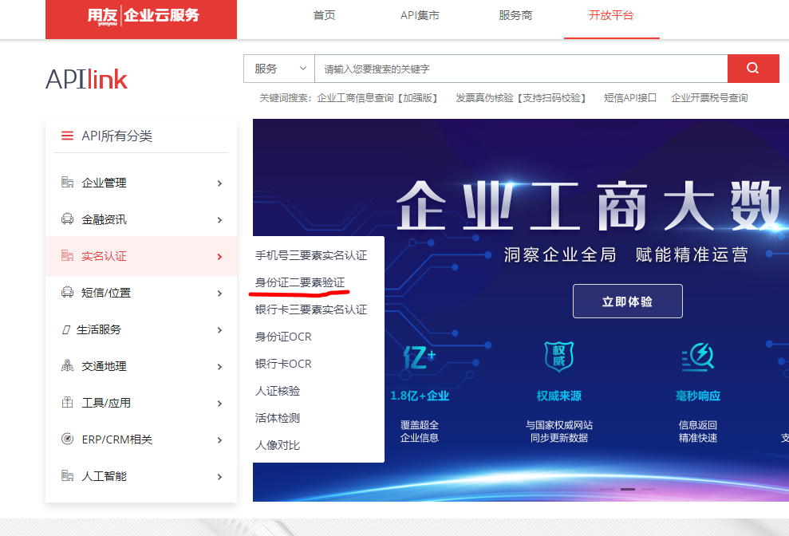
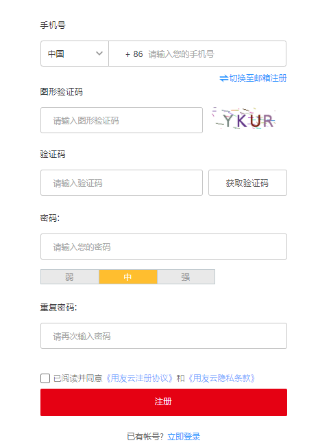
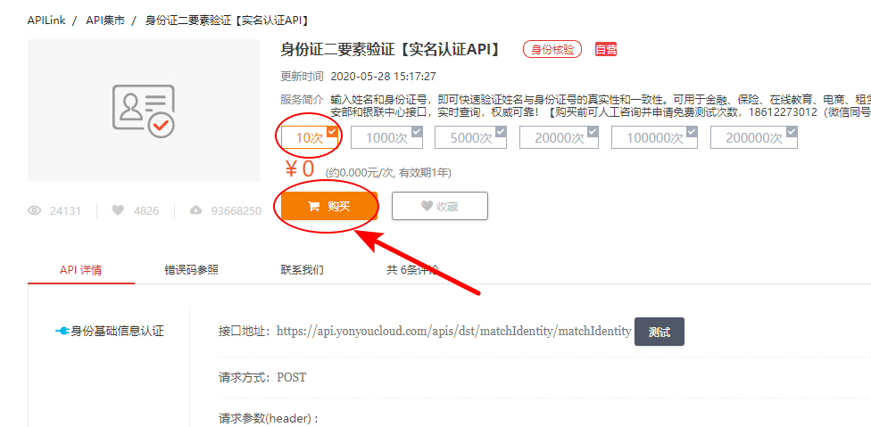
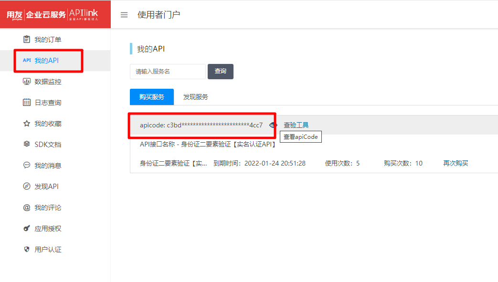
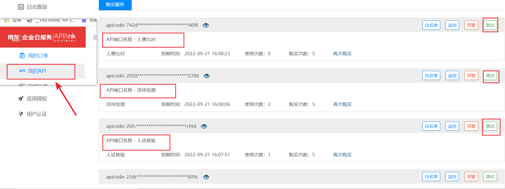
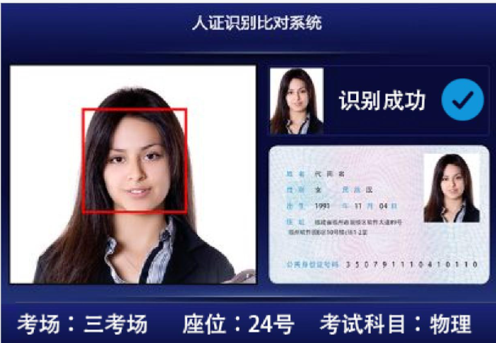

### 用户身份审核

- 平台运营端查看用户认证信息，进行审核，其中审核包括了用户身份审核，需要对接公安系统校验身份证信息， 而公安系统校验身份的接口不对外提供调用，只有专门的合作机构才可以进行调用。  这里我们使用**用友云**提供的实名认证服务来进行实名认证。

**人脸识别技术,手机app活体检测产品简介**

人脸识别技术技术主要分为两部分：

**第一部为前端**人脸手机app活体检测，主要支持android、ios平台，在前端通过**眨眼、张嘴、摇头、点头**等组合动作，确保操作的为真实活体人脸。


**第二部为后台人脸识别技术**，该环节通过在手机app活体检测环节取得整张人脸图像后，再通过扫描识别身份证，取到身份证头像后，将现场人脸与身份证上的人脸进行比对识别，判断是否为同一张人脸。


手机app活体检测技术可在移动端平台进行运算，提供android、ios平台SDK；由于人脸比对算法的运算量非常大，所以需部署在服务器端，目前支持windows、linux等主流平台。

通过人脸识别技术与手机app活体检测技术，非常好的解决了实名认证环节存在的风险与漏洞。


**相关云服务提供商**


**阿里云人工智能服务**

https://www.aliyun.com/product/cloudauth?spm=5176.19720258.J_8058803260.282.78ef2c4aFul7mU


**百度大脑实名认证**

https://ai.baidu.com/solution/faceprint


##### 用友实名认证介绍

**用友云:** https://api.yonyoucloud.com/apilink/#/



认证方式选择: 用友实名认证提供了多种认证方案，如 活体认证，身份证识别扫描等等

我们这里选择 **身份证二要素验证**,   用户输入  姓名  、身份证号 后调用公安系统身份信息是否正确


##### **API密钥申请:**

1.注册用友账号并登陆



2.购买使用次数 (可试用10次)



3. 查看密钥apicode



4.下载调用demo , demo我已经修改 拷贝下面内容即可 

  将第三部的apicode 添加到下面工具类中


**演示用身份证**

https://hmtt122.oss-cn-shanghai.aliyuncs.com/demo_idcard.png   正面身份证照

https://hmtt122.oss-cn-shanghai.aliyuncs.com/111.png   身份证剪裁图片

https://hmtt122.oss-cn-shanghai.aliyuncs.com/222.png   活体照片

```java
基于restTemplate调用接口

@Test
    public void idcardTest(){
        RestTemplate restTemplate = new RestTemplate();
        HttpHeaders httpHeaders = new HttpHeaders();
        httpHeaders.add("apicode","38b26747fe1d4d2f9d80a66580186b7e");
        httpHeaders.setContentType(MediaType.APPLICATION_JSON); // json
        Map<String,String> map = new HashMap<>();
        map.put("idNumber","210103195103222113");
        map.put("userName","王东镇");
        HttpEntity<String> formEntry = new HttpEntity<>(JSON.toJSONString(map), httpHeaders); // 封装请求参数
        ResponseEntity<String> response = restTemplate.postForEntity("https://api.yonyoucloud.com/apis/dst/matchIdentity/matchIdentity", formEntry, String.class);// 发送一个post请求
        System.out.println(response);

    }

    @Test
    public void orcTest(){
        RestTemplate restTemplate = new RestTemplate();
        HttpHeaders httpHeaders = new HttpHeaders();
        httpHeaders.add("apicode","16dcb92cc5c2403d9142b01445c61b21");
        httpHeaders.setContentType(MediaType.APPLICATION_JSON); // json
        Map<String,String> map = new HashMap<>();
        map.put("image","https://hmtt122.oss-cn-shanghai.aliyuncs.com/demo_idcard.png");
        map.put("imageType","URL");
        map.put("ocrType","0");
        HttpEntity<String> formEntry = new HttpEntity<>(JSON.toJSONString(map), httpHeaders); // 封装请求参数
        ResponseEntity<String> response = restTemplate.postForEntity("https://api.yonyoucloud.com/apis/dst/IdcardOCR/IdcardOCR", formEntry, String.class);// 发送一个post请求
        System.out.println(response);

    }
```


**自动实名审核流程:**

```
1. 在app端用户发起实名认证，需要上传( 姓名  身份证号  身份证正面照  活体检测图片)   在ap_user_realname中添加一条信息
		
	活体检测图片采集: app端调用摄像头进行人脸采集，保留完整活体照片

2. 实名认证的状态:  0 待提交   1 待审核   2 失败    9 通过

3. 在admin端可以查询待审核的实名认证信息，对该信息进行人工审核
	 后台提供了  实名认证详情查看    审核通过    和    审核失败接口
	 
4. 自动审核流程：      
     4.1  通过用友云调用公安部接口 校验信息的真实性
     		识别:  基于身份证OCR扫描接口  识别身份证 正面照 和 背面照
     				  识别出用户  姓名  身份证号   身份有效期(判断是否过期)
     				
     		调用 身份证二要素接口   校验身份证和姓名是否真实
     			（手机三要素  银行卡三要素）
     			
     		校验 活体检测接口，判断前端采集的用户活体图片是否为真实活人  >= 85 分
     		
     		对比 人证核验接口，用户活体照片和身份证正面照片 , 如果相似度 >= 85分以上判断为同一个人
     			
     
     4.2  如果失败将状态改为2 审核结束 
     
     
```

通过其它的实名认证接口  **分别实现:  身份证OCR接口、 活体检测接口、 人证核验接口**




**身份证OCR**

根据身份证照片  (正面或背面) ， 扫描上面的所有文本内容


**人证核验**



**活体检测**

