#  第三章 完善实名认证&素材管理

## 学习目标

- 能够说出项目中遇到的分布式事务问题
- 能够说出seata解决分布式事务的方案
- 能够完成seata集成到项目中使用
- 能够介绍实名认证模块功能
- 能够掌握阿里云存储OSS的使用
- 能够完成素材管理功能

## 1 完善实名认证功能

### 1.1 实名认证分布式事务问题

#### 1.1.1  问题分析

在昨天的实名认证代码中，审核完毕后添加 id==5的演示异常，重新使用postman进行测试, 会发现 出现异常后 本地方法因为有

@Transactional注解  对ap_user  ap_user_realname的操作会回滚  

而 基于Feign远程调用 article服务   wemedia服务 确没有回滚

这时我们的代码 存在**分布式事务问题，传统的数据库事务无法解决**

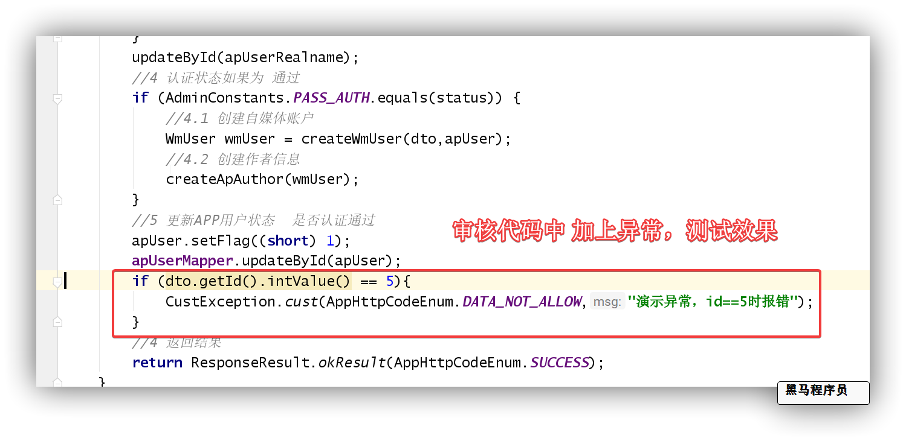

#### 1.1.2 seata快速回顾

Seata是 2019 年 1 月份蚂蚁金服和阿里巴巴共同开源的分布式事务解决方案。致力于提供高性能和简单易用的分布式事务服务，为用户打造一站式的分布式解决方案。

官网地址：http://seata.io/，其中的文档、播客中提供了大量的使用说明、源码分析。

Seata事务管理中有三个重要的角色：

- **TC (Transaction Coordinator) -** **事务协调者：**维护全局和分支事务的状态，协调全局事务提交或回滚。

- **TM (Transaction Manager) -** **事务管理器：**定义全局事务的范围、开始全局事务、提交或回滚全局事务。

- **RM (Resource Manager) -** **资源管理器：**管理分支事务处理的资源，与TC交谈以注册分支事务和报告分支事务的状态，并驱动分支事务提交或回滚。


整体的架构如图：

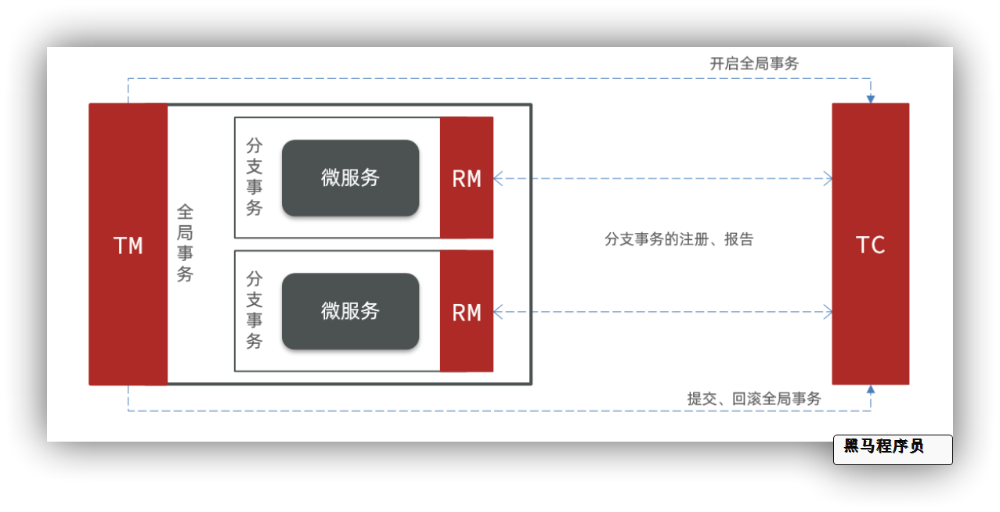

Seata基于上述架构提供了四种不同的分布式事务解决方案：

- **XA模式**：强一致性分阶段事务模式，牺牲了一定的可用性，无业务侵入
- **TCC模式**：最终一致的分阶段事务模式，有业务侵入
- **AT模式**：最终一致的分阶段事务模式，无业务侵入，也是Seata的默认模式
- **SAGA模式**：长事务模式，有业务侵入

无论哪种方案，都离不开TC，也就是事务的协调者。


**Seata AT模式**

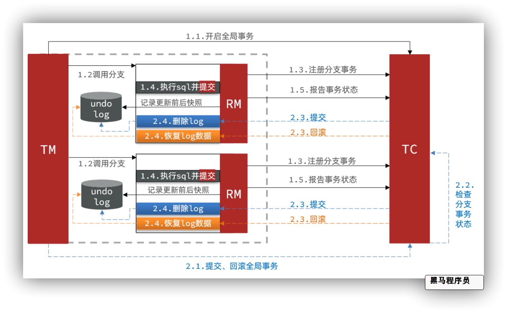

```
阶段一RM的工作：
- 注册分支事务
- 记录undo-log（数据快照）
- 执行业务sql并提交
- 报告事务状态

阶段二提交时RM的工作：
- 删除undo-log即可

阶段二回滚时RM的工作：
- 根据undo-log恢复数据到更新前
```


#### 1.1.3  项目集成seata

##### 准备seata数据库  

导入资料中的seata.sql 

##### docker部署seata TC

如果使用docker安装    **registry** 默认使用  **file 模式**  存储事务数据 ：

```sh
docker run --name seata --restart=always -p 8091:8091 -e SEATA_IP=192.168.200.130 -e SEATA_PORT=8091 -v seata-config:/seata-server/resources -id seataio/seata-server:1.4.2
```

我们使用nacos作为seata的配置和注册中心，方便以后的高可用 及 统一的配置管理

在**seata**命名空间 创建配置`seataServer.properties` 分组为: `SEATA_GROUP`

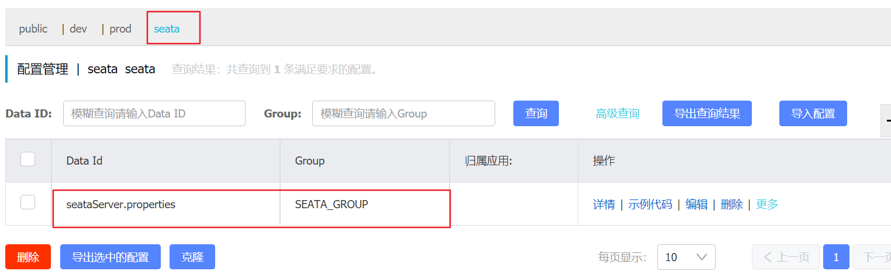

```properties
# 数据存储方式，db代表数据库
store.mode=db
store.db.datasource=druid
store.db.dbType=mysql
store.db.driverClassName=com.mysql.jdbc.Driver
store.db.url=jdbc:mysql://192.168.200.130:3306/seata?useUnicode=true&rewriteBatchedStatements=true
store.db.user=root
store.db.password=root
store.db.minConn=5
store.db.maxConn=30
store.db.globalTable=global_table
store.db.branchTable=branch_table
store.db.queryLimit=100
store.db.lockTable=lock_table
store.db.maxWait=5000
# 事务、日志等配置
server.recovery.committingRetryPeriod=1000
server.recovery.asynCommittingRetryPeriod=1000
server.recovery.rollbackingRetryPeriod=1000
server.recovery.timeoutRetryPeriod=1000
server.maxCommitRetryTimeout=-1
server.maxRollbackRetryTimeout=-1
server.rollbackRetryTimeoutUnlockEnable=false
server.undo.logSaveDays=7
server.undo.logDeletePeriod=86400000

# 客户端与服务端传输方式
transport.serialization=seata
transport.compressor=none
# 关闭metrics功能，提高性能
metrics.enabled=false
metrics.registryType=compact
metrics.exporterList=prometheus
metrics.exporterPrometheusPort=9898
```

##### 修改seataTC配置

准备好nacos配置中心后，修改seata TC端 使用nacos作为配置中心

```shell
# 进入到挂载目录
cd /var/lib/docker/volumes/seata-config/_data
# 修改注册中心配置
vi registry.conf
```

配置中内容: 

```json
registry {
  # tc服务的注册中心类，这里选择nacos，也可以是eureka、zookeeper等
  type = "nacos"
  nacos {
    # seata tc 服务注册到 nacos的服务名称，可以自定义 spring.application.name
    application = "seata-tc-server"
    serverAddr = "192.168.200.130:8848"
    group = "SEATA_GROUP"
    namespace = "seata"
    cluster = "SH"
    username = "nacos"
    password = "nacos"
  }
}
config {
  # 读取tc服务端的配置文件的方式，这里是从nacos配置中心读取，这样如果tc是集群，可以共享配置
  type = "nacos"
  # 配置nacos地址等信息
  nacos {
    serverAddr = "192.168.200.130:8848"
    namespace = "seata"
    group = "SEATA_GROUP"
    username = "nacos"
    password = "nacos"
    dataId = "seataServer.properties"
  }
}
```

修改后 记得重启seata   

注意检查 mysql中是否准备了seata库哦~~


##### 微服务配置seata

配置步骤参考[官网](https://hub.fastgit.org/seata/seata-samples/blob/master/doc/quick-integration-with-spring-cloud.md)

**创建日志表undo_log  (已创建)**

分别在leadnews_user、leadnews_article、leadnews_wemedia三个库中都创建undo_log表

**创建seata共享配置**

在配置中心nacos 的 `dev` 环境中 创建`share-seata.yml`

```properties
seata:
  registry: # TC服务注册中心的配置，微服务根据这些信息去注册中心获取tc服务地址
    # 参考tc服务自己的registry.conf中的配置
    type: nacos
    nacos: # tc
      server-addr: ${spring.profiles.ip}:8848
      namespace: "seata"
      group: SEATA_GROUP
      application: seata-tc-server # tc服务在nacos中的服务名称
  tx-service-group: seata-demo # 事务组，根据这个获取tc服务的cluster名称
  service:
    vgroup-mapping: # 事务组与TC服务cluster的映射关系
      seata-demo: SH
```


**修改微服务**

参与分布式事务的微服务  ( leadnews-user、leadnews-wemedia、leadnews-article)，引入依赖  

```xml
<dependencies>
        <!--seata-->
        <dependency>
            <groupId>com.alibaba.cloud</groupId>
            <artifactId>spring-cloud-starter-alibaba-seata</artifactId>
            <exclusions>
                <!--版本较低，1.3.0，因此排除-->
                <exclusion>
                    <artifactId>seata-spring-boot-starter</artifactId>
                    <groupId>io.seata</groupId>
                </exclusion>
            </exclusions>
        </dependency>
        <dependency>
            <groupId>io.seata</groupId>
            <artifactId>seata-spring-boot-starter</artifactId>
            <!--seata starter 采用1.4.2版本-->
            <version>${seata.version}</version>
        </dependency>
    </dependencies>
```

修改`bootstrap.yml`配置

以 leadnews-user服务为例  其它一样

```yml
spring:
  application:
    name: leadnews-user # 服务名称
  profiles:
    active: dev # 开发环境配置
    ip: 192.168.200.130  # 环境ip地址
  cloud:
    nacos:
      discovery: # 注册中心地址配置
        server-addr: ${spring.profiles.ip}:8848
        namespace: ${spring.profiles.active}
      config: # 配置中心地址配置
        server-addr: ${spring.profiles.ip}:8848
        namespace: ${spring.profiles.active}
        file-extension: yml # data-id 后缀
        name: ${spring.application.name} # data-id名称
        shared-configs: # 共享配置
          - data-id: share-feign.yml # 配置文件名-Data Id
            group: DEFAULT_GROUP   # 默认为DEFAULT_GROUP
            refresh: false   # 是否动态刷新，默认为false
          - data-id: share-seata.yml # 配置文件名-Data Id
            group: DEFAULT_GROUP   # 默认为DEFAULT_GROUP
            refresh: false   # 是否动态刷新，默认为fals
```

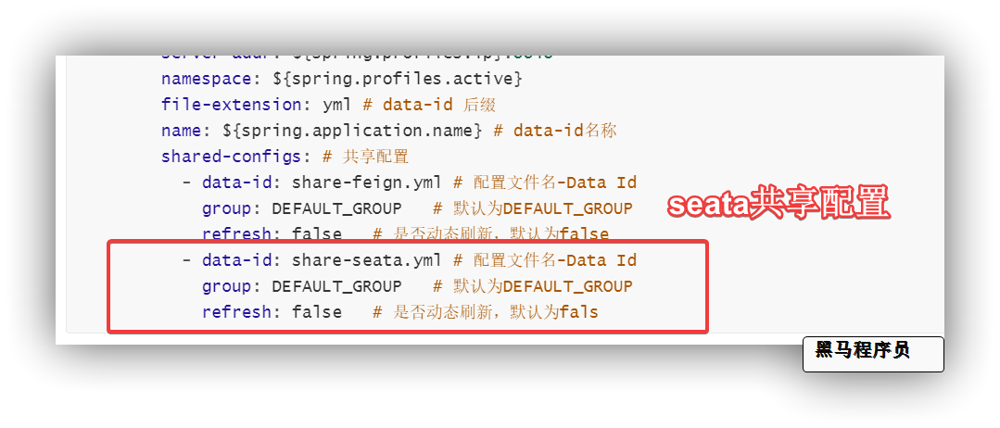

##### 管理事务加全局事务注解

在实名认证审核的方法上，加上seata提供的全局事务管理注解 `@GlobalTransactional` 注解， 开启全局事务

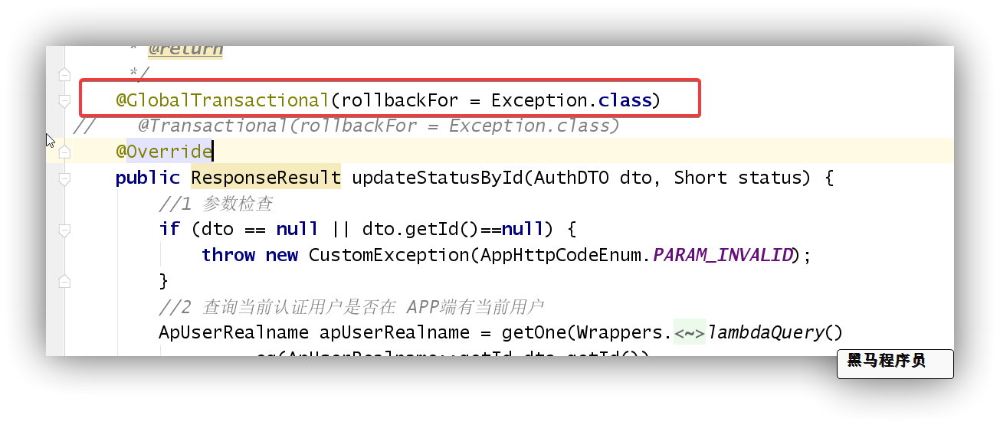

##### 测试分布式事务

再次通过postman测试使用认证审核接口，查看出现异常时    事务是否回滚

### 1.2  扩展 - 网关+knife4j实现聚合文档

见扩展资料

### 1.3  扩展 - AI实名认证方案

见扩展资料

## 2 云存储解决方案-阿里云OSS 

### 2.1 阿里云OSS简介

阿里云对象存储服务（Object Storage Service，简称OSS）为您提供基于网络的数据存取服务。使用OSS，您可以通过网络随时存储和调用包括文本、图片、音频和视频等在内的各种非结构化数据文件。
阿里云OSS将数据文件以对象（object）的形式上传到存储空间（bucket）中。

​	您可以进行以下操作：

- 创建一个或者多个存储空间，向每个存储空间中添加一个或多个文件。
- 通过获取已上传文件的地址进行文件的分享和下载。
- 通过修改存储空间或文件的属性或元信息来设置相应的访问权限。
- 在阿里云管理控制台执行基本和高级OSS任务。
- 使用阿里云开发工具包或直接在应用程序中进行RESTful API调用执行基本和高级OSS任务

### 2.2 OSS开通 

（1）打开https://www.aliyun.com/ ，申请阿里云账号并完成实名认证。

（2）充值

（3）开通OSS:  登录阿里云官网。将鼠标移至产品找到并单击对象存储OSS打开OSS产品详情页面。在OSS产品详情页中的单击立即开通。开通服务后，在OSS产品详情页面单击管理控制台直接进入OSS管理控制台界面。您也可以单击位于官网首页右上方菜单栏的控制台，进入阿里云管理控制台首页，然后单击左侧的对象存储OSS菜单进入[OSS管理控制台界面](https://oss.console.aliyun.com/overview)。

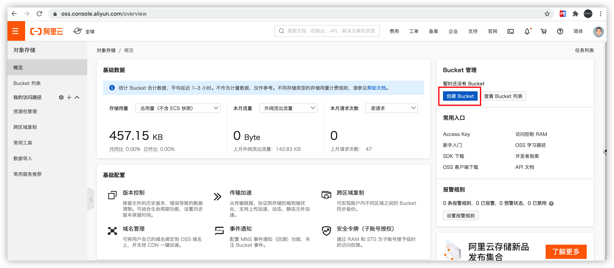

（4）创建存储空间

新建Bucket，命名为 hmleadnews ，读写权限为**公共读**

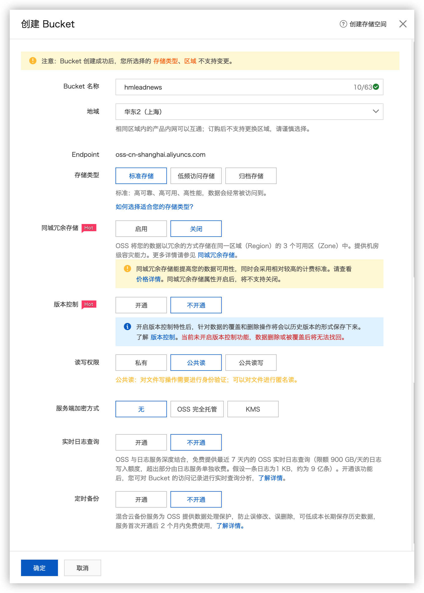

创建文件目录：

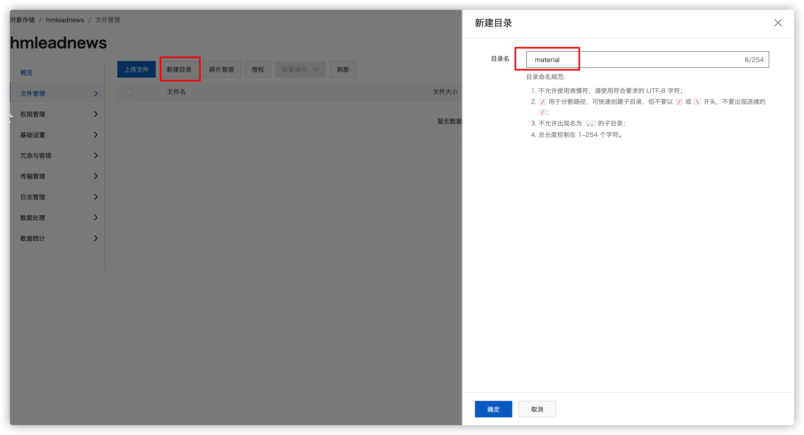

### 2.3 OSS快速入门 

[参考文档官方](https://help.aliyun.com/document_detail/32009.html?spm=a2c4g.11186623.6.919.7c264562C2Fjfs)

（1）创建测试工程，引入依赖

```xml
<dependency>
  <groupId>com.aliyun.oss</groupId>
  <artifactId>aliyun-sdk-oss</artifactId>
  <version>3.10.2</version>
</dependency>
<dependency>
  <groupId>commons-logging</groupId>
  <artifactId>commons-logging</artifactId>
  <version>1.2</version>
</dependency>
```

（2）新建类和main方法

```java
public static void main(String[] args) throws Exception{
        // Endpoint以杭州为例，其它Region请按实际情况填写。
        String endpoint = "http://oss-cn-shanghai.aliyuncs.com";
        // 阿里云主账号AccessKey拥有所有API的访问权限，风险很高。
        String accessKeyId = "LTAI4G25HSmUJART11TivJaa";
        String accessKeySecret = "PTLWOlfEJNaaGnqBrZa0irPDaaKmGE";

        // 创建OSSClient实例。
        OSS ossClient = new OSSClientBuilder().build(endpoint, accessKeyId, accessKeySecret);

        // 上传Byte数组。
        FileInputStream inputStream = new FileInputStream("/Users/Ares/Desktop/1.png");
        PutObjectResult result = ossClient.putObject("hmleadnews", "material/a.jpg", inputStream);

        // 关闭OSSClient。
        ossClient.shutdown();
 }
```

### 2.4 OSS starter工具封装

（1）`heima-leadnews-basic` 模块，在当前模块下创建 `heima-file-spring-boot-starter`子模块，

添加依赖

```xml
<dependencies>
  <dependency>
    <groupId>org.springframework.boot</groupId>
    <artifactId>spring-boot-autoconfigure</artifactId>
  </dependency>
  <!--OSS-->
  <dependency>
    <groupId>com.aliyun.oss</groupId>
    <artifactId>aliyun-sdk-oss</artifactId>
    <version>3.10.2</version>
  </dependency>
  <dependency>
    <groupId>com.google.guava</groupId>
    <artifactId>guava</artifactId>
         <version>21.0</version>
  </dependency>
  <dependency>
    <groupId>org.springframework.boot</groupId>
    <artifactId>spring-boot-starter</artifactId>
  </dependency>
  <dependency>
    <groupId>org.springframework.boot</groupId>
    <artifactId>spring-boot-configuration-processor</artifactId>
    <optional>true</optional>
  </dependency>
  <dependency>
    <groupId>org.springframework.boot</groupId>
    <artifactId>spring-boot-starter-actuator</artifactId>
  </dependency>
</dependencies>
```

（2）创建包`com.heima.file`     

​          资料文件夹下导入 `service `和 `config `包下的内容:

​		  结构如下: 

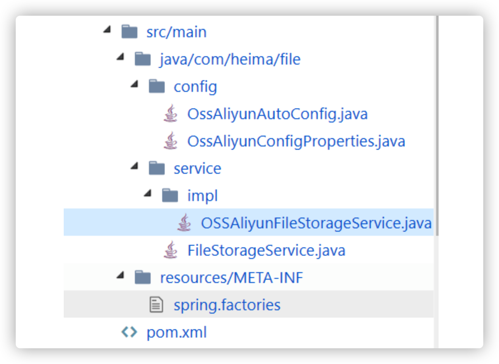

（3）在`resources`目录下新建 `META-INF/spring.factories` 配置文件

```properties
org.springframework.boot.autoconfigure.EnableAutoConfiguration=\
  com.heima.file.service.impl.OSSAliyunFileStorageService
```

（4）`wemedia-service`  添加OSS配置


`wemedia-service ` **添加依赖**

```xml
        <dependency>
            <artifactId>heima-file-spring-boot-starter</artifactId>
            <groupId>com.heima</groupId>
            <version>1.0-SNAPSHOT</version>
        </dependency>
```

配置中心nacos添加 `share-file.yml` 共享配置

```yml
#OSS配置
file:
  oss:
    bucket-name: <替换成自己的>
    access-key-id: <替换成自己的> 
    access-key-secret: <替换成自己的>
    endpoint: oss-cn-shanghai.aliyuncs.com
    web-site: <替换成自己的>
    proxy-username: aliyun-sdk-java
    socket-timeout: 10000
    idle-connection-time: 10000
    connection-request-timeout: 4000
    max-connections: 2048
    max-error-retry: 5
    white-list: 127.0.0.1
    connection-timeout: 10000
    prefix: material
```

bucket就是我们刚刚申请的，在它的概览页面 有对应的外网访问地址前缀，贴到配置中  记得加上http://开头 和 斜杠结尾哦

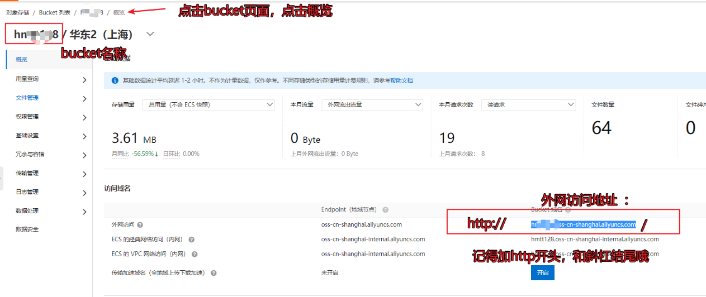

个人阿里云密钥，点击头像accesskey管理，然后创建accessKey: 

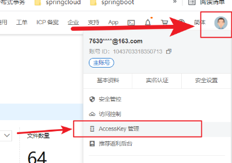

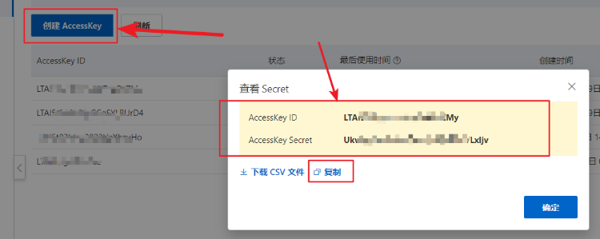


`bootstrap.yml` **新增共享配置**

```yaml
spring:
  cloud:
    nacos:
      config: # 配置中心地址配置
        shared-configs: # 共享配置
          - data-id: share-file.yml # 配置文件名-Data Id
            group: DEFAULT_GROUP   # 默认为DEFAULT_GROUP
            refresh: false   # 是否动态刷新，默认为false
```

（5）在 `wemedia-service` 中新建测试类测试OSS工具类

```java
package com.heima.wemedia;

import com.heima.file.service.FileStorageService;
import org.junit.Test;
import org.junit.runner.RunWith;
import org.springframework.beans.factory.annotation.Autowired;
import org.springframework.beans.factory.annotation.Value;
import org.springframework.boot.test.context.SpringBootTest;
import org.springframework.test.context.junit4.SpringRunner;

/**
 * @Description:
 * @Version: V1.0
 */
@SpringBootTest(classes = WemediaApplication.class)
@RunWith(SpringRunner.class)
public class OssTest {

    @Autowired
    FileStorageService fileStorageService;
    
    @Value("${file.oss.web-site}")
    String webSite;

    @Test
    public void testFileUpload() throws Exception {

//        FileInputStream inputStream = new FileInputStream(new File("/Users/Ares/Desktop/temp/banner1.jpg"));

//        String wemedia = fileStorageService.store("upload", "aaa1.jpg", inputStream);
//        System.out.println(webSite+wemedia);

        // 删除文件
        fileStorageService.delete("wemedia/2020/12/20201227/aaa1.jpg");
    }
}

```

## 3 自媒体管理

### 3.1 自媒体用户登录

自媒体登录操作与admin端登录思路是一样的， wemedia前端输入 用户名和密码

后台判断用户是否存在，密码是否正确，状态是否可用      登录成功颁发token 


  返回结果一定要有   token: 凭证信息   user: 登录用户信息

（1）自媒体登录接口定义

**接口地址**:`/login/in`


**请求方式**:`POST`


**请求数据类型**:`application/json`


**响应数据类型**:`*/*`


**接口描述**:


**请求示例**:


```javascript
{
	"name": "",
	"password": ""
}
```


**请求参数**:


| 参数名称             | 参数说明 | in   | 是否必须 | 数据类型  | schema    |
| -------------------- | -------- | ---- | -------- | --------- | --------- |
| dto                  | dto      | body | true     | WmUserDto | WmUserDto |
| &emsp;&emsp;name     |          |      | false    | string    |           |
| &emsp;&emsp;password |          |      | false    | string    |           |


WmUserDto

```java
@Data
public class WmUserDTO {
    /**
     * 用户名
     */
    private String name;
    /**
     * 密码
     */
    private String password;
}
```

WmUserVO

```java
@Data
public class WmUserVO {
    private Integer id;
    private String name;
    private String nickname;
    private String image;
    private String email;
    private Date loginTime;
    private Date createdTime;
}
```


（1）业务层service

新增业务层接口

```java
package com.heima.wemedia.service;
import com.baomidou.mybatisplus.extension.service.IService;
import com.heima.model.common.dtos.ResponseResult;
import com.heima.model.wemedia.dtos.WmUserDTO;
import com.heima.model.wemedia.pojos.WmUser;
public interface WmUserService extends IService<WmUser> {
    /**
     * 登录
     * @param dto
     * @return
     */
    public ResponseResult login(WmUserDTO dto);
}
```

实现类 自己写   


（2）控制器controller

新增控制器

```java
package com.heima.wemedia.controller.v1;
import com.heima.model.common.dtos.ResponseResult;
import com.heima.model.wemedia.dtos.WmUserDTO;
import com.heima.wemedia.service.WmUserService;
import org.springframework.beans.factory.annotation.Autowired;
import org.springframework.web.bind.annotation.PostMapping;
import org.springframework.web.bind.annotation.RequestBody;
import org.springframework.web.bind.annotation.RequestMapping;
import org.springframework.web.bind.annotation.RestController;
@RestController
@RequestMapping("/login")
public class LoginController {
    @Autowired
    private WmUserService wmUserService;
    @PostMapping("/in")
    public ResponseResult login(@RequestBody WmUserDTO dto){
        return wmUserService.login(dto);
    }
}
```

（3）小刀无网关测试


### 3.2 自媒体网关和获取登录用户

（1）自媒体网关

上一次创建的admin平台管理的网关，自媒体端也有自己的网关，后边还需要创建app端的网关

自媒体网关与admin端网关几乎是一样的，可以参考admin端网关

- 创建`wemedia-gateway`网关工程：pom文件如下


- 从admin网关中把必要的类拷贝过来


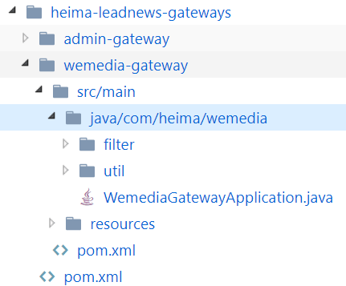

- 新增`bootstrap.yml`

```yml
spring:
  application:
    name: wemedia-gateway # 服务名称
  profiles:
    active: dev # 开发环境配置
    ip: 192.168.200.130  # 环境ip地址
  cloud:
    nacos:
      discovery: # 注册中心地址配置
        server-addr: ${spring.profiles.ip}:8848
        namespace: ${spring.profiles.active}
      config: # 配置中心地址配置
        server-addr: ${spring.profiles.ip}:8848
        namespace: ${spring.profiles.active}
        file-extension: yml # data-id 后缀
        name: ${spring.application.name} # data-id名称
```

配置中心dev环境新增 `wemedia-gateway.yml`

```yaml
server:
  port: 6002
spring:
  cloud:
    gateway:
      globalcors:
        cors-configurations:
          '[/**]': # 匹配所有请求
            allowedOrigins: "*" #跨域处理 允许所有的域
            allowedMethods: # 支持的方法
            - GET
            - POST
            - PUT
            - DELETE
      routes:
      # 平台管理
      - id: wemedia
        uri: lb://leadnews-wemedia
        predicates:
        - Path=/wemedia/**
        filters:
        - StripPrefix= 1
```

（2）获取登录用户思路分析

在去保存图片之前，需要先知道是哪一位自媒体人登录了当前系统，也就是需要确定哪个自媒体人上传了图片

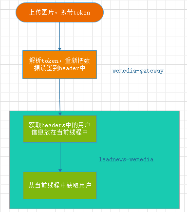

**操作步骤：**

1. 上传图片需要携带token

2. 首先请求到网关服务，解析token是否有效，如果有效，解析后把用户数据设置到下一级请求的header中

3. 在自媒体微服务中使用过滤器解析header中的数据，拿到用户数据，使用threadlocal设置到当前线程中

4. 在具体业务代码中可以从当前线程threadlocal中获取用户


（3）获取登录用户

前面两步都已经实现，主要是在代码中实现后两步即可

1)添加工具类

在使用过滤器解析后的用户需要放在当前线程中，可以使用工具类来实现,

在`heima-leadnews-model`中`com.heima.model.threadlocal`添加如下类,用于存储自媒体的用户登录信息

```java
package com.heima.model.threadlocal;
import com.heima.model.wemedia.pojos.WmUser;
public class WmThreadLocalUtils {
    private final static ThreadLocal<WmUser> userThreadLocal = new ThreadLocal<>();
    /**
     * 设置当前线程中的用户
     * @param user
     */
    public static void setUser(WmUser user){
        userThreadLocal.set(user);
    }
    /**
     * 获取线程中的用户
     * @return
     */
    public static WmUser getUser( ){
        return userThreadLocal.get();
    }
    /**
     * 清空线程中的用户信息
     */
    public static void clear(){
        userThreadLocal.remove();
    }
}
```

2)在`wemedia-service`自媒体微服务中使用过滤器解析header数据并设置到当前线程中

```java
package com.heima.wemedia.filter;
import com.heima.model.threadlocal.WmThreadLocalUtils;
import com.heima.model.wemedia.pojos.WmUser;
import lombok.extern.slf4j.Slf4j;
import org.springframework.core.annotation.Order;
import org.springframework.stereotype.Component;
import org.springframework.web.filter.GenericFilterBean;
import javax.servlet.FilterChain;
import javax.servlet.ServletException;
import javax.servlet.ServletRequest;
import javax.servlet.ServletResponse;
import javax.servlet.annotation.WebFilter;
import javax.servlet.http.HttpServletRequest;
import javax.servlet.http.HttpServletResponse;
import java.io.IOException;
@Order(1)
@WebFilter(filterName = "wmTokenFilter",urlPatterns = "/*") // 过滤器配置  拦截全部路径
@Slf4j
@Component  // 扫描包 
public class WmTokenFilter extends GenericFilterBean {
    @Override
    public void doFilter(ServletRequest servletRequest, ServletResponse servletResponse, FilterChain filterChain) throws IOException, ServletException {
        // 1. 获取请求头中userId
        
        // 2. 如果userId不为空  封装WmUser设置到ThreadLocal变量中
        
        // 3. 放行请求
        
        // 4. 请求完毕后置处理: 清空threadlocal
    }
}
```


### 3.3 素材管理

**效果演示:** http://heima-wemedia-java.itheima.net/#/material/list

#### 3.3.1 图片上传

##### 3.3.1.1 文件上传需求

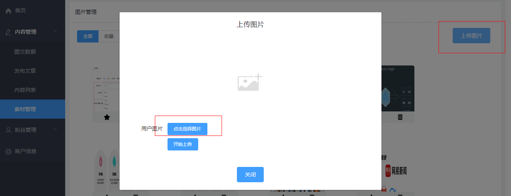

上传图片到OSS，同时要保存一份数据到表中，方便后期管理

媒体图文素材信息表**wm_material**

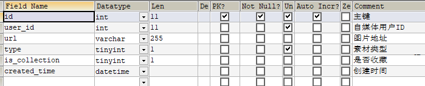

对应实体类：

```java
package com.heima.model.wemedia.pojos;

import com.baomidou.mybatisplus.annotation.IdType;
import com.baomidou.mybatisplus.annotation.TableField;
import com.baomidou.mybatisplus.annotation.TableId;
import com.baomidou.mybatisplus.annotation.TableName;
import lombok.Data;

import java.io.Serializable;
import java.util.Date;

/**
 * <p>
 * 自媒体图文素材信息表
 * </p>
 *
 * @author itheima
 */
@Data
@TableName("wm_material")
public class WmMaterial implements Serializable {

    private static final long serialVersionUID = 1L;

    /**
     * 主键
     */
    @TableId(value = "id", type = IdType.AUTO)
    private Integer id;

    /**
     * 自媒体用户ID
     */
    @TableField("user_id")
    private Integer userId;

    /**
     * 图片地址
     */
    @TableField("url")
    private String url;

    /**
     * 素材类型
            0 图片
            1 视频
     */
    @TableField("type")
    private Short type;

    /**
     * 是否收藏
     */
    @TableField("is_collection")
    private Short isCollection;

    /**
     * 创建时间
     */
    @TableField("created_time")
    private Date createdTime;

}
```

##### 3.3.1.2 接口定义

**接口地址**:`/api/v1/material/upload_picture`

**请求方式**:`POST`

**请求数据类型**:`multipart/form-data`


**响应数据类型**:`*/*`

**接口描述**: 文件上传    后台校验文件是否为空， 检查文件的格式  是否数据 png  jpg  jpeg gif   , 检查用户是否登录

将文件上传到阿里云OSS中 ，将OSS中的图片路径  设置到  wm_materil素材表中     


```
返回值需要将实体类对象返回到前端，并且 将url改成完整路径
```

**请求参数**:


| 参数名称      | 参数说明      | in       | 是否必须 | 数据类型 | schema |
| ------------- | ------------- | -------- | -------- | -------- | ------ |
| multipartFile | multipartFile | formData | false    | file     |        |


##### 3.3.1.3 定义mapper

新建接口：`com.heima.wemedia.mapper.WmMaterialMapper`

```java
package com.heima.wemedia.mapper;

import com.baomidou.mybatisplus.core.mapper.BaseMapper;
import com.heima.model.wemedia.pojos.WmMaterial;
import org.apache.ibatis.annotations.Mapper;
public interface WmMaterialMapper extends BaseMapper<WmMaterial> {
}
```

##### 3.3.1.4 定义service

新建接口：`com.heima.wemedia.service.MaterialService`

```java
package com.heima.wemedia.service;
import com.baomidou.mybatisplus.extension.service.IService;
import com.heima.model.common.dtos.ResponseResult;
import com.heima.model.wemedia.pojos.WmMaterial;
import org.springframework.web.multipart.MultipartFile;
public interface WmMaterialService extends IService<WmMaterial> {
    /**
     * 上传图片接口
     * @param multipartFile
     * @return
     */
    ResponseResult uploadPicture(MultipartFile multipartFile);
}
```

实现类  **自己写**  

##### 3.3.1.5 控制层

```java
package com.heima.wemedia.controller.v1;
import com.heima.model.common.dtos.ResponseResult;
import com.heima.wemedia.service.WmMaterialService;
import io.swagger.annotations.Api;
import io.swagger.annotations.ApiOperation;
import org.springframework.beans.factory.annotation.Autowired;
import org.springframework.web.bind.annotation.PostMapping;
import org.springframework.web.bind.annotation.RequestMapping;
import org.springframework.web.bind.annotation.RestController;
import org.springframework.web.multipart.MultipartFile;
@Api(value = "素材管理API",tags = "素材管理API")
@RestController
@RequestMapping("/api/v1/material")
public class WmMaterialController {
    @Autowired
    private WmMaterialService materialService;
    @ApiOperation("上传素材")
    @PostMapping("/upload_picture")
    public ResponseResult uploadPicture(MultipartFile multipartFile) {
        return materialService.uploadPicture(multipartFile);
    }
}
```

##### 3.3.1.6 测试

启动清单：

1. naocs
2. WemediaGatewayApplication 网关
3. WemediaApplication 自媒体服务


使用postman 或 小刀文档测试，需要先登录设置token后再操作

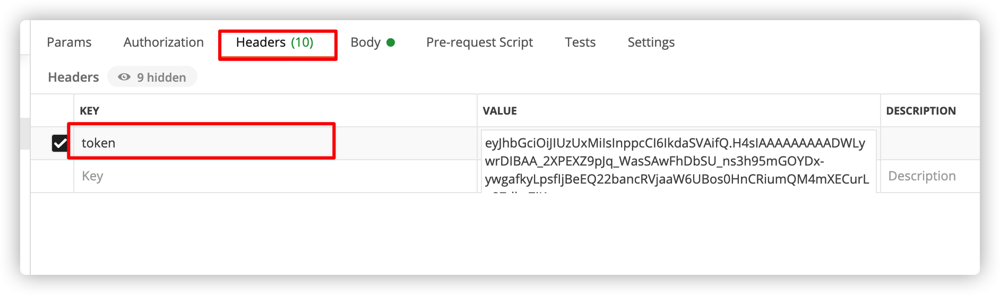

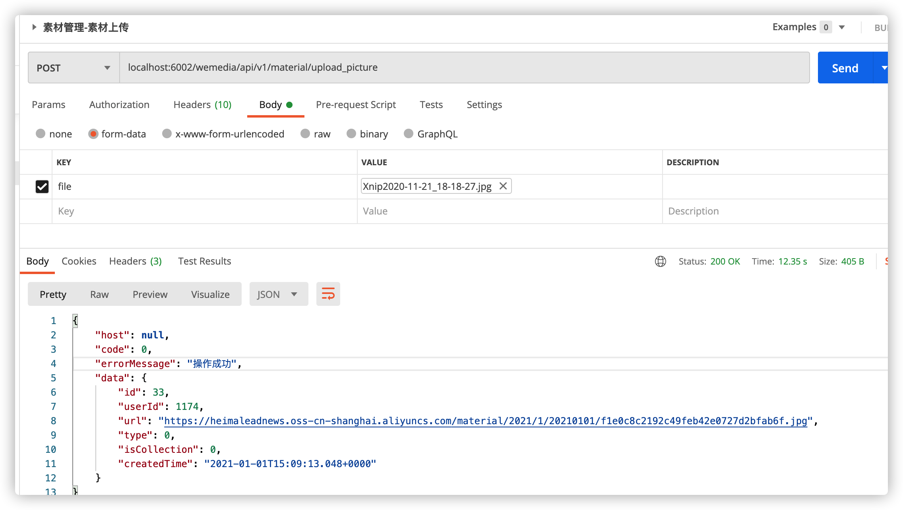

#### 3.3.2 素材列表加载

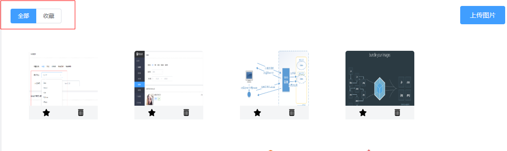

1. 素材列表查询，前台有可能给传一个条件 是否收藏  0 不收藏  1 收藏
2. 只能查询当前登录用户上传的素材
3. 按照发布时间 降序排序
4. 返回的结果 ， 图片需要加上前缀访问路径

##### 3.3.2.1 接口定义

**接口地址**:`/api/v1/material/list`


**请求方式**:`POST`


**请求数据类型**:`application/json`


**响应数据类型**:`*/*`

**接口描述**: 查询素材列表


**请求示例**:


```javascript
{
	"isCollected": 0,
	"page": 0,
	"size": 0
}
```


**请求参数**:


| 参数名称                | 参数说明     | in   | 是否必须 | 数据类型       | schema        |
| ----------------------- | ------------ | ---- | -------- | -------------- | ------------- |
| dto                     | dto          | body | true     | WmMaterialDto  | WmMaterialDto |
| &emsp;&emsp;isCollected |              |      | false    | integer(int32) |               |
| &emsp;&emsp;page        | 当前第几页   |      | false    | integer(int32) |               |
| &emsp;&emsp;size        | 每页显示条数 |      | false    | integer(int32) |               |


WmMaterialDTO

```java
package com.heima.model.wemedia.dtos;
import com.heima.model.common.dtos.PageRequestDTO;
import lombok.Data;

@Data
public class WmMaterialDTO extends PageRequestDTO {
        Short isCollection; //1 查询收藏的   0: 未收藏
}
```

##### 3.3.2.2 定义service

在`com.heima.wemedia.service.WmMaterialService`类中新增方法

```java
/**
     * 素材列表查询
     * @param dto
     * @return
     */
ResponseResult findList(WmMaterialDTO dto);
```

实现类 自己写

##### 3.3.2.3 控制层

在`com.heima.wemedia.controller.v1.WmMaterialController`新增方法

```java
    @ApiOperation("查询素材列表")
    @PostMapping("/list")
    public ResponseResult findList(@RequestBody WmMaterialDTO dto) {
        return materialService.findList(dto);
    }
```

##### 3.3.2.4 测试

使用postman测试，需要先登录设置token后再操作

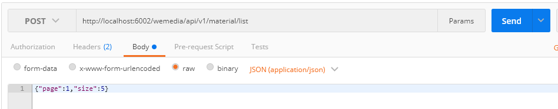

也可打开前端工程进行测试

#### 3.3.3 图片删除 （实战练习）

##### 3.3.3.1 接口定义

> 1 根据素材id删除图片
>
> 2 校验id 校验id是否为当前登录用户上传的
>
> 3 如果当前图片被引用，则不能删除
>
> 4 删除素材  删除oss中存储的对应的素材
>
> 

一旦该图片被引用会在这个表中插入数据，用作素材与文章的关联

wm_news_material （自媒体图文引用素材信息表）

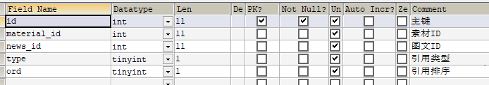

对应实体类：

```java
package com.heima.model.wemedia.pojos;

import com.baomidou.mybatisplus.annotation.IdType;
import com.baomidou.mybatisplus.annotation.TableField;
import com.baomidou.mybatisplus.annotation.TableId;
import com.baomidou.mybatisplus.annotation.TableName;
import lombok.Data;

import java.io.Serializable;

/**
 * <p>
 * 自媒体图文引用素材信息表
 * </p>
 *
 * @author itheima
 */
@Data
@TableName("wm_news_material")
public class WmNewsMaterial implements Serializable {

    private static final long serialVersionUID = 1L;

    /**
     * 主键
     */
    @TableId(value = "id", type = IdType.AUTO)
    private Integer id;

    /**
     * 素材ID
     */
    @TableField("material_id")
    private Integer materialId;

    /**
     * 图文ID
     */
    @TableField("news_id")
    private Integer newsId;

    /**
     * 引用类型
            0 内容引用
            1 主图引用
     */
    @TableField("type")
    private Short type;

    /**
     * 引用排序
     */
    @TableField("ord")
    private Short ord;

}
```


**接口地址**:`/api/v1/material/del_picture/{id}`

**请求方式**:`GET`


**请求数据类型**:`*`


**响应数据类型**:`*/*`

**接口描述**: 删除素材


**请求参数**:


| 参数名称 | 参数说明 | in   | 是否必须 | 数据类型       | schema |
| -------- | -------- | ---- | -------- | -------------- | ------ |
| id       | id       | path | true     | integer(int32) |        |


##### 3.3.3.2 持久层mapper

新建mapper接口：`com.heima.wemedia.mapper.WmNewsMaterialMapper`

```java
package com.heima.wemedia.mapper;
import com.baomidou.mybatisplus.core.mapper.BaseMapper;
import com.heima.model.wemedia.pojos.WmNewsMaterial;
import org.apache.ibatis.annotations.Mapper;
public interface WmNewsMaterialMapper extends BaseMapper<WmNewsMaterial> {
}
```

##### 3.3.3.3 业务层代码

在`com.heima.wemedia.service.WmMaterialService`类中新增方法

```java
/**
     * 删除图片
     * @param id
     * @return
     */
ResponseResult delPicture(Integer id);
```

**实现类  自己写**

##### 3.3.3.4 控制层

在`com.heima.wemedia.controller.v1.WmMaterialController`中新增方法

```java
@ApiOperation(value = "删除素材",notes = "根据ID删除素材,有关联的素材不可以删除")
@GetMapping("/del_picture/{id}")
public ResponseResult delPicture(@PathVariable("id") Integer id) {
    return materialService.delPicture(id);
}
```

##### 3.3.3.5 测试

使用postman测试，需要先登录设置token后再操作

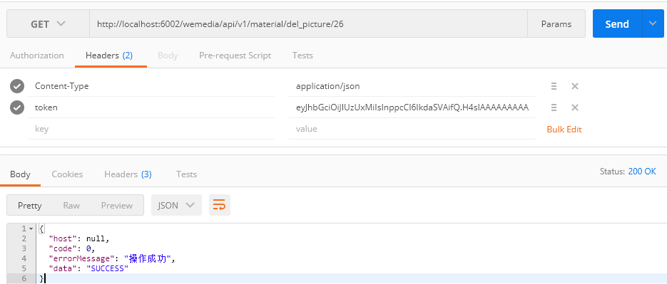

删除成功后打开阿里云OSS查看是否删除文件

#### 3.3.4 收藏与取消图片（实战练习）

##### 3.3.4.1 接口定义

**接口地址**:`/api/v1/material/collect/{id}`

**接口地址**:`/api/v1/material/cancel_collect/{id}`


**请求方式**:`GET`


**请求数据类型**:`*`


**响应数据类型**:`*/*`

**接口描述**: 根据当前用户 和 素材id 设置素材的is_collection字段的值       0 为不收藏  1为收藏


**请求参数**:


| 参数名称 | 参数说明 | in   | 是否必须 | 数据类型       | schema |
| -------- | -------- | ---- | -------- | -------------- | ------ |
| id       | id       | path | true     | integer(int32) |        |


##### 3.3.4.2 业务层代码

在`com.heima.wemedia.service.WmMaterialService`新增方法

```java
/**
     * 收藏与取消收藏
     * @param id
     * @param type
     * @return
     */
ResponseResult updateStatus(Integer id, Short type);
```

实现类  自己写

##### 3.3.4.3 控制层

在`WmMaterialController`类中新增方法

```java
    @ApiOperation("取消收藏素材")
    @GetMapping("/cancel_collect/{id}")
    public ResponseResult cancelCollectionMaterial(@PathVariable("id") Integer id) {
        return materialService.updateStatus(id, WemediaConstants.CANCEL_COLLECT_MATERIAL);
    }
    @ApiOperation("收藏素材")
    @GetMapping("/collect/{id}")
    public ResponseResult collectionMaterial(@PathVariable("id") Integer id) {
        return materialService.updateStatus(id, WemediaConstants.COLLECT_MATERIAL);
    }
```

需要在`heima-leadnews-common`中定义常量:`com.heima.model.common.constants.wemedia.WemediaConstants`

```java
package com.heima.common.constants.wemedia;
/**
 * @Description: 素材常量
 * @Version: V1.0
 */
public class WemediaConstants {
    public static final Short COLLECT_MATERIAL = 1;//收藏
    public static final Short CANCEL_COLLECT_MATERIAL = 0;//取消收藏
}
```

##### 3.3.4.4 测试

使用postman测试，需要先登录设置token后再操作

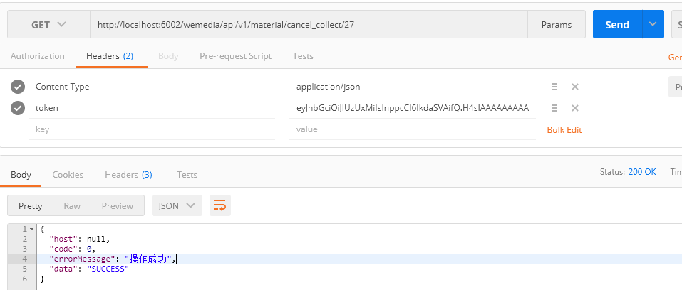

打开前端工程，测试效果

#### **面试热点**

**什么是分布式事务**

**什么是CAP定理**

**什么是BASE理论**

**常见的分布式事务解决方案**

**SeataAT模式基本流程介绍**

**项目中分布式事务场景及解决介绍**

**阿里云对象存储OSS介绍**

**素材上传流程**

**自动AI实名认证流程**

