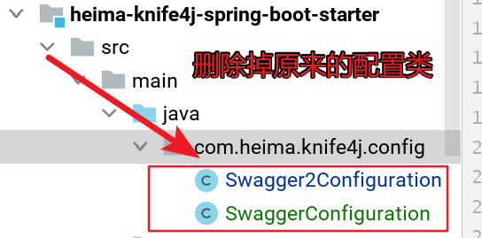

**配置参考knife4j官网**

https://doc.xiaominfo.com/knife4j/action/aggregation-cloud.html


#### 网关工程配置修改

`heima-leadnews-gateways`  添加knife4j文档依赖

```xml
<dependency>
  <groupId>com.github.xiaoymin</groupId>
  <artifactId>knife4j-spring-boot-starter</artifactId>
</dependency>
```

`heima-leadnews-gateways` 工程添加 配置文件 与 controller


**网关创建配置类:**  `com.heima.gateway.config.SwaggerResourceConfig`

```java
package com.heima.gateway.config;
import lombok.AllArgsConstructor;
import lombok.extern.slf4j.Slf4j;
import org.springframework.cloud.gateway.config.GatewayProperties;
import org.springframework.cloud.gateway.route.RouteLocator;
import org.springframework.cloud.gateway.support.NameUtils;
import org.springframework.context.annotation.Primary;
import org.springframework.stereotype.Component;
import springfox.documentation.swagger.web.SwaggerResource;
import springfox.documentation.swagger.web.SwaggerResourcesProvider;
import java.util.ArrayList;
import java.util.List;
@Slf4j
@Component
@Primary
@AllArgsConstructor
public class SwaggerResourceConfig implements SwaggerResourcesProvider {
    private final RouteLocator routeLocator;
    private final GatewayProperties gatewayProperties;
    @Override
    public List<SwaggerResource> get() {
        List<SwaggerResource> resources = new ArrayList<>();
        List<String> routes = new ArrayList<>();
        routeLocator.getRoutes().subscribe(route -> routes.add(route.getId()));
        gatewayProperties.getRoutes().stream().filter(routeDefinition -> routes.contains(routeDefinition.getId())).forEach(route -> {
            route.getPredicates().stream()
                    .filter(predicateDefinition -> ("Path").equalsIgnoreCase(predicateDefinition.getName()))
                    .forEach(predicateDefinition -> resources.add(swaggerResource(route.getId(),
                            predicateDefinition.getArgs().get(NameUtils.GENERATED_NAME_PREFIX + "0")
                                    .replace("**", "v2/api-docs"))));
        });
        return resources;
    }
    private SwaggerResource swaggerResource(String name, String location) {
        log.info("name:{},location:{}",name,location);
        SwaggerResource swaggerResource = new SwaggerResource();
        swaggerResource.setName(name);
        swaggerResource.setLocation(location);
        swaggerResource.setSwaggerVersion("2.0");
        return swaggerResource;
    }
}
```

**网关创建文档Controller:**  `com.heima.gateway.controller.SwaggerHandler`

```java
package com.heima.gateway.controller;
import org.springframework.beans.factory.annotation.Autowired;
import org.springframework.http.HttpStatus;
import org.springframework.http.ResponseEntity;
import org.springframework.web.bind.annotation.GetMapping;
import org.springframework.web.bind.annotation.RestController;
import reactor.core.publisher.Mono;
import springfox.documentation.swagger.web.*;
import java.util.Optional;
/**
 * 获取api接口信息
 */
@RestController
public class SwaggerHandler {
    @Autowired(required = false)
    private SecurityConfiguration securityConfiguration;
    @Autowired(required = false)
    private UiConfiguration uiConfiguration;
    private final SwaggerResourcesProvider swaggerResources;
    @Autowired
    public SwaggerHandler(SwaggerResourcesProvider swaggerResources) {
        this.swaggerResources = swaggerResources;
    }
    @GetMapping("/swagger-resources/configuration/security")
    public Mono<ResponseEntity<SecurityConfiguration>> securityConfiguration() {
        return Mono.just(new ResponseEntity<>(
                Optional.ofNullable(securityConfiguration).orElse(SecurityConfigurationBuilder.builder().build()), HttpStatus.OK));
    }
    @GetMapping("/swagger-resources/configuration/ui")
    public Mono<ResponseEntity<UiConfiguration>> uiConfiguration() {
        return Mono.just(new ResponseEntity<>(
                Optional.ofNullable(uiConfiguration).orElse(UiConfigurationBuilder.builder().build()), HttpStatus.OK));
    }
    @GetMapping("/swagger-resources")
    public Mono<ResponseEntity> swaggerResources() {
        return Mono.just((new ResponseEntity<>(swaggerResources.get(), HttpStatus.OK)));
    }
}
```

**更改网关过滤器:**`AuthorizeFilter`

```java
@Component
@Slf4j
public class AuthorizeFilter implements GlobalFilter {
  private static List<String> urlList = new ArrayList<>();
  // 初始化白名单 url路径
  static {
    urlList.add("/login/in");
    urlList.add("/v2/api-docs");
  }
  
    @Override
    public Mono<Void> filter(ServerWebExchange exchange, GatewayFilterChain chain) {
        // 1. 获取请求对象 响应对象
        ServerHttpRequest request = exchange.getRequest();
        ServerHttpResponse response = exchange.getResponse();
        //**** 2. 判断当前请求路径是否放行
        String reqUrl = request.getURI().getPath();
        for (String url : urlList){
            if (reqUrl.contains(url)) {
                return chain.filter(exchange);
            }
        }
        // 3. 获取请求头中的token值
        String token = request.getHeaders().getFirst("token");
        if(StringUtils.isBlank(token)){
            response.setStatusCode(HttpStatus.UNAUTHORIZED);
            return response.setComplete();
        }
        // 4. 检查token是否有效
        try {
            Claims claims = AppJwtUtil.getClaimsBody(token);
            // 校验有效
            if(AppJwtUtil.verifyToken(claims)<1){
                // 5. 获取token中存储的用户ID
                Integer id = claims.get("id", Integer.class);
                // 6. 获取到的id值，重写到请求头中，传递到要调用的微服务中
                request.mutate().header("userId", String.valueOf(id)).build();
                exchange.mutate().request(request).build();
                return chain.filter(exchange);
            }
        } catch (Exception e) {
            e.printStackTrace();
        }
        response.setStatusCode(HttpStatus.UNAUTHORIZED);
        return response.setComplete();
    }
}
```


####  自动配置工程配置修改

`heima-knife4j-spring-boot-starter` 添加依赖

```xml
<dependency>
  <groupId>com.github.xiaoymin</groupId>
  <artifactId>swagger-bootstrap-ui</artifactId>
  <version>1.9.6</version>
</dependency>
```

**添加文档配置类(原来的删除掉)**



```java
package com.heima.knife4j.config;
import com.github.xiaoymin.swaggerbootstrapui.annotations.EnableSwaggerBootstrapUI;
import org.springframework.beans.factory.annotation.Value;
import org.springframework.context.annotation.Bean;
import org.springframework.context.annotation.Configuration;
import org.springframework.context.annotation.Import;
import org.springframework.core.annotation.Order;
import springfox.bean.validators.configuration.BeanValidatorPluginsConfiguration;
import springfox.documentation.builders.ApiInfoBuilder;
import springfox.documentation.builders.PathSelectors;
import springfox.documentation.builders.RequestHandlerSelectors;
import springfox.documentation.service.ApiInfo;
import springfox.documentation.spi.DocumentationType;
import springfox.documentation.spring.web.plugins.Docket;
import springfox.documentation.swagger2.annotations.EnableSwagger2;
@Configuration
@EnableSwagger2
@EnableSwaggerBootstrapUI
@Import(BeanValidatorPluginsConfiguration.class)
public class Swagger2Configuration {
    @Value("${spring.application.name}")
    private String group;
    @Bean(value = "defaultApi2")
    @Order(value = 1)
    public Docket defaultApi2() {
//        System.out.println(group);
        Docket docket=new Docket(DocumentationType.SWAGGER_2)
                .apiInfo(apiInfo())
                //分组名称
                .groupName(group)
                .select()
                //这里指定Controller扫描包路径
                .apis(RequestHandlerSelectors.basePackage("com.heima"))
                .paths(PathSelectors.any())
                .build();
        return docket;
    }
    private ApiInfo apiInfo() {
        return new ApiInfoBuilder()
                .title("黑马头条API文档")
                .description("黑马头条API文档")
                .version("1.0")
                .build();
    }
}
```

```java
package com.heima.common.knife4j;
import org.springframework.context.annotation.Bean;
import org.springframework.context.annotation.Configuration;
import springfox.documentation.builders.ApiInfoBuilder;
import springfox.documentation.builders.PathSelectors;
import springfox.documentation.builders.RequestHandlerSelectors;
import springfox.documentation.service.ApiInfo;
import springfox.documentation.service.Contact;
import springfox.documentation.spi.DocumentationType;
import springfox.documentation.spring.web.plugins.Docket;
import springfox.documentation.swagger2.annotations.EnableSwagger2;
@Configuration
@EnableSwagger2
public class SwaggerConfiguration {
   @Bean
   public Docket buildDocket() {
      return new Docket(DocumentationType.SWAGGER_2)
              .apiInfo(buildApiInfo())
              .select()
              // 要扫描的API(Controller)基础包
              .apis(RequestHandlerSelectors.basePackage("com.heima"))
              .paths(PathSelectors.any())
              .build();
   }
   private ApiInfo buildApiInfo() {
      Contact contact = new Contact("黑马程序员","","");
      return new ApiInfoBuilder()
              .title("黑马头条-平台管理API文档")
              .description("平台管理服务api")
              .contact(contact)
              .version("1.0.0").build();
   }
}
```

**修改** 	`META-INF/spring.factories`

```properties
org.springframework.boot.autoconfigure.EnableAutoConfiguration=\
  com.heima.knife4j.config.Swagger2Configuration,com.heima.knife4j.config.SwaggerConfiguration
```

