# 第四章 自媒体文章发布

## 学习目标

- 完成自媒体文章列表查询功能
- 完成自媒体文章的发布功能 
- 完成自媒体文章的查询
- 完成自媒体文章的删除功能
- 完成自媒体文章的上下架功能

## 1 自媒体文章列表查询

### 1.1 需求分析

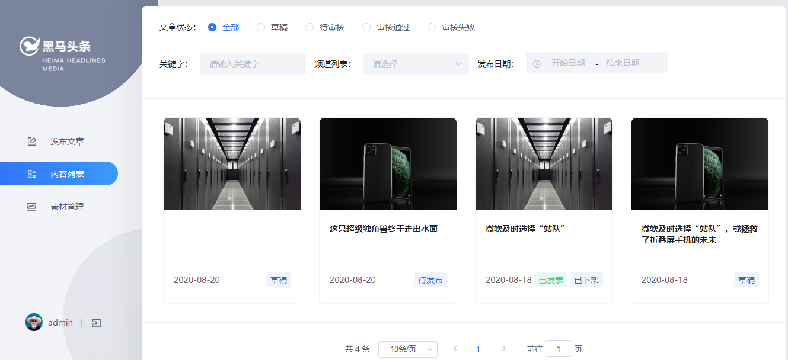

### 1.2 表结构和实体类

**wm_news  自媒体文章表**


**需求:** 

1. 如果有文章标题，按照文章标题模糊查询
2. 如果有频道信息，按照频道ID查询
3. 如果有文章状态，按照状态信息进行查询
4. 如果开始时间，结束时间不为空按照时间区间查询
5. 按照登录用户ID去查询
6. 按照创建时间降序
7. 分页查询，返回结果设置host  地址 为图片访问前缀

**自媒体文章实体类**

```java
package com.heima.model.wemedia.pojos;

import com.baomidou.mybatisplus.annotation.IdType;
import com.baomidou.mybatisplus.annotation.TableField;
import com.baomidou.mybatisplus.annotation.TableId;
import com.baomidou.mybatisplus.annotation.TableName;
import lombok.Data;
import org.apache.ibatis.type.Alias;

import java.io.Serializable;
import java.util.Date;

/**
 * <p>
 * 自媒体图文内容信息表
 * </p>
 *
 * @author itheima
 */
@Data
@TableName("wm_news")
public class WmNews implements Serializable {

    private static final long serialVersionUID = 1L;

    /**
     * 主键
     */
    @TableId(value = "id", type = IdType.AUTO)
    private Integer id;

    /**
     * 自媒体用户ID
     */
    @TableField("user_id")
    private Integer userId;

    /**
     * 标题
     */
    @TableField("title")
    private String title;

    /**
     * 图文内容
     */
    @TableField("content")
    private String content;

    /**
     * 文章布局
            0 无图文章
            1 单图文章
            3 多图文章
     */
    @TableField("type")
    private Short type;

    /**
     * 图文频道ID
     */
    @TableField("channel_id")
    private Integer channelId;

    @TableField("labels")
    private String labels;

    /**
     * 创建时间
     */
    @TableField("created_time")
    private Date createdTime;

    /**
     * 提交时间
     */
    @TableField("submited_time")
    private Date submitedTime;

    /**
     * 当前状态
            0 草稿
            1 提交（待审核）
            2 审核失败
            3 人工审核
            4 人工审核通过
            8 审核通过（待发布）
            9 已发布
     */
    @TableField("status")
    private Short status;

    /**
     * 定时发布时间，不定时则为空
     */
    @TableField("publish_time")
    private Date publishTime;

    /**
     * 拒绝理由
     */
    @TableField("reason")
    private String reason;

    /**
     * 发布库文章ID
     */
    @TableField("article_id")
    private Long articleId;

    /**
     * //图片用逗号分隔
     */
    @TableField("images")
    private String images;

    @TableField("enable")
    private Short enable;
    
     //状态枚举类***
    @Alias("WmNewsStatus")
    public enum Status{
        NORMAL((short)0),SUBMIT((short)1),FAIL((short)2),ADMIN_AUTH((short)3),ADMIN_SUCCESS((short)4),SUCCESS((short)8),PUBLISHED((short)9);
        short code;
        Status(short code){
            this.code = code;
        }
        public short getCode(){
            return this.code;
        }
    }

}
```

### 1.3 接口定义

**接口描述**:<font color="red"> 分页带条件查询自媒体文章列表</font> 

**接口地址**:`/api/v1/news/list`


**请求方式**:`POST`

**请求数据类型**:`application/json`

**响应数据类型**:`application/json`


**请求示例**:


```javascript
{
	"beginPubDate": "",
  "endPubDate": "",
	"channelId": 0,
	"keyword": "",
	"page": 0,
	"size": 0,
	"status": 0
}
```


**请求参数**:


| 参数名称                 | 参数说明     | in   | 是否必须 | 数据类型          | schema           |
| ------------------------ | ------------ | ---- | -------- | ----------------- | ---------------- |
| dto                      | dto          | body | true     | WmNewsPageReqDto  | WmNewsPageReqDto |
| &emsp;&emsp;beginPubDate | 开始时间     |      | false    | string(date-time) |                  |
| &emsp;&emsp;endPubDate   | 结束时间     |      | false    | string(date-time) |                  |
| &emsp;&emsp;channelId    | 频道id       |      | false    | integer(int32)    |                  |
| &emsp;&emsp;keyword      | 文章名称     |      | false    | string            |                  |
| &emsp;&emsp;page         | 当前第几页   |      | false    | integer(int32)    |                  |
| &emsp;&emsp;size         | 每页显示条数 |      | false    | integer(int32)    |                  |
| &emsp;&emsp;status       | 文章状态     |      | false    | integer(int32)    |                  |


**WmNewsPageReqDto**

```java
package com.heima.model.wemedia.dtos;
import com.heima.model.common.dtos.PageRequestDTO;
import lombok.Data;
import java.util.Date;
@Data
public class WmNewsPageReqDTO extends PageRequestDTO {
    private Short status;//状态
    private Date beginPubDate;//开始时间
    private Date endPubDate;//结束时间
    private Integer channelId;//所属频道ID
    private String keyword;//关键字
}
```

### 1.4 mapper实现

创建com.heima.wemedia.mapper.WmNewsMapper

```java
package com.heima.wemedia.mapper;

import com.baomidou.mybatisplus.core.mapper.BaseMapper;
import com.heima.model.wemedia.pojos.WmNews;

public interface WmNewsMapper extends BaseMapper<WmNews> {
}
```

### 1.5 service代码实现

定义WmNewsService接口：com.heima.wemedia.service.WmNewsService

```java
package com.heima.wemedia.service;
import com.baomidou.mybatisplus.extension.service.IService;
import com.heima.model.common.dtos.ResponseResult;
import com.heima.model.wemedia.dtos.WmNewsPageReqDTO;
import com.heima.model.wemedia.pojos.WmNews;
public interface WmNewsService extends IService<WmNews> {
    /**
     * 查询所有自媒体文章
     * @return
     */
    public ResponseResult findList(WmNewsPageReqDTO dto);
}
```

定义实现类 com.heima.wemedia.service.impl.WmNewsServiceImpl 

**实现自己写**

> 提示：图片处理设置的host为webSite前缀，原因是前端代码已处理图片前缀。


### 1.6 controller代码实现

在自媒体微服务中定义controller：com.heima.wemedia.controller.WmNewsController

```java
package com.heima.wemedia.controller.v1;
import com.heima.model.common.dtos.ResponseResult;
import com.heima.model.wemedia.dtos.WmNewsPageReqDTO;
import com.heima.wemedia.service.WmNewsService;
import io.swagger.annotations.Api;
import io.swagger.annotations.ApiOperation;
import org.springframework.beans.factory.annotation.Autowired;
import org.springframework.web.bind.annotation.PostMapping;
import org.springframework.web.bind.annotation.RequestBody;
import org.springframework.web.bind.annotation.RequestMapping;
import org.springframework.web.bind.annotation.RestController;
@Api(value = "自媒体文章管理API",tags = "自媒体文章管理API")
@RestController
@RequestMapping("/api/v1/news")
public class WmNewsController {
    @Autowired
    private WmNewsService wmNewsService;
    @ApiOperation("根据条件查询文章列表")
    @PostMapping("/list")
    public ResponseResult findAll(@RequestBody WmNewsPageReqDTO wmNewsPageReqDto){
        return wmNewsService.findList(wmNewsPageReqDto);
    }
}
```

### 1.7 测试

使用postman测试需要先登录，获取token后访问

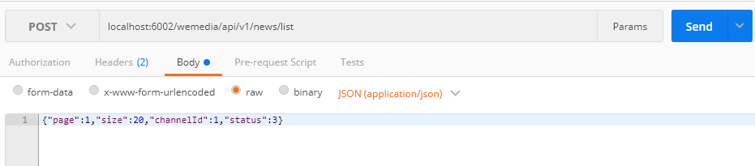

或打开页面进行测试

其中页面联调，需要修改状态传入后台的值，修改前端以下文件

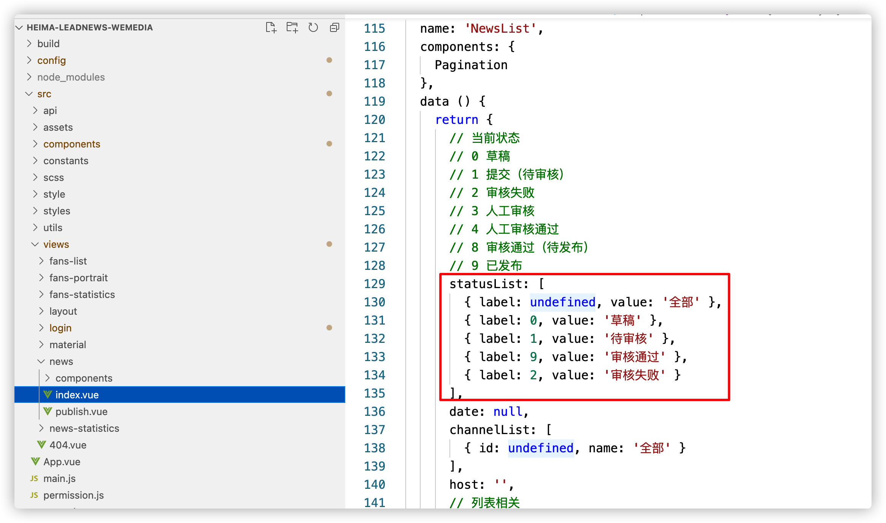


## 2 频道列表展示

### 2.1需求分析

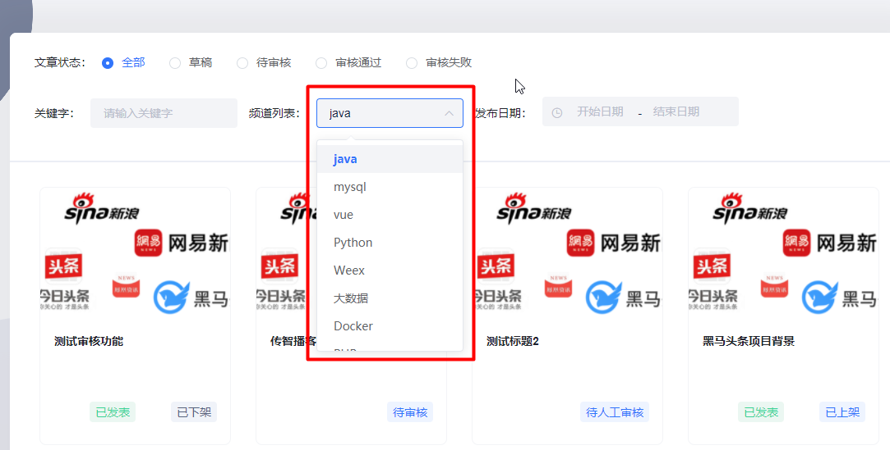

文章展示列表页面打开的时候，默认自动加载频道列表数据进行展示，就是查询所有频道数据

### 2.2 接口定义

**接口描述**: <font color="red">查询所有频道的数据</font> 

**接口地址**:`/api/v1/channel/channels`

**请求方式**:`GET`

**请求数据类型**:`*`

**响应数据类型**:`application/json`

**请求参数**: 暂无

### 2.3 功能实现

在<font color="red">admin-service</font> 端，修改AdChannelController类，添加如下方法，mapper和service在之前已经定义

```java
	@ApiOperation("查询全部频道")
    @GetMapping("/channels")
    public ResponseResult findAll() {
        List<AdChannel> list = channelService.list();
        return ResponseResult.okResult(list);
    }
```

### 2.4 修改自媒体网关

在**配置中心** 修改 <font color="red">wemedia-gateway</font> 自媒体网关的yml配置文件中添加如下配置

```yaml
- id: admin
  uri: lb://leadnews-admin
  predicates:
  - Path=/admin/**
  filters:
  - StripPrefix= 1
```

### 2.5 测试

重启` admin-service `和`wemedia-gateway` 微服务

使用postman测试或者直接打开页面测试即可

## 3 自媒体文章-发布、修改、保存草稿

### 3.1 需求分析

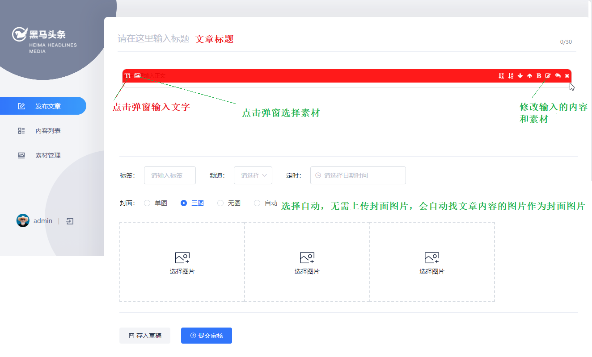

保存文章，除了需要wm_news表以外，还需要另外两张表

​                                                  **wm_material  素材表**

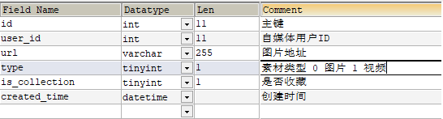

​                                               **wm_news_material  文章素材关系表**

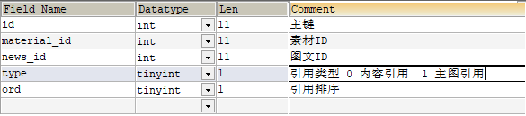


### 3.2 思路分析

1. 参数校验
2. 保存或修改文章
   * 该功能为保存、修改（是否有id）、保存草稿的共用方法
   * 如果有id修改文章，先删除所有素材关联关系
   * 如果没有id，保存文章

3. 关联文章和素材关系表

   * 关联**内容**中的图片与素材的关系

   * 关联**封面**中的图片与素材的关系

     > 封面图片如果选择是自动需要从内容中截图图片做为封面图片
     >
     > 截取规则为：
     >
     > * 内容图片的个数小于等于2  则为单图截图一张图
     > * 内容图片大于2，则为多图，截图三张图
     > * 内容中没有图片，则为无图

4. 封装返回成功结果

<font color="red">前端给后端传递的参数格式：</font> 

```json
{
    "title":"传智教育于2021年1月12日在深交所上市",
    "type":"1",  # 0：无图 1：单图  3：多图 -1：自动
    "labels":"黑马头条",
    "publishTime":"2021-01-14T11:35:49.000Z",
    "channelId":1,
    "images":[  # 文章封面 集合
        "https://heimaleadnewsoss.oss-cn-shanghai.aliyuncs.com/material/2021/1/20210113/20214312094300211.jpg"
    ],
    "status":1,
    # 文章内容 字符串
    "content":"[  
        {
            "type":"text",
            "value":"传智教育于2021年1月12日在深交所上市"
        },
        {
            "type":"image",
            "value":"https://heimaleadnewsoss.oss-cn-shanghai.aliyuncs.com/material/2021/1/20210113/20210112100045327.jpg"
        }
    ]"
}
```

### 3.3 接口定义

**接口描述**: <font color="red">自媒体文章-发布、修改、保存草稿</font> 

**接口地址**:`/api/v1/news/submit`


**请求方式**:`POST`


**请求数据类型**:`application/json`

**响应数据类型**:`application/json`

**请求示例**:


```javascript
{
	"channelId": 0,
	"content": "",
	"enable": 0,
	"id": 0,
	"images": [],
	"labels": "",
	"publishTime": "",
	"reason": "",
	"status": 0,
	"submitedTime": "",
	"title": "",
	"type": 0
}
```


**请求参数**:


| 参数名称                 | 参数说明     | in   | 是否必须 | 数据类型          | schema                       |
| ------------------------ | ------------ | ---- | -------- | ----------------- | ---------------------------- |
| wmNews                   | wmNews       | body | true     | WmNewsDto         | WmNewsDto                    |
| &emsp;&emsp;channelId    | 频道id       |      | true     | integer(int32)    |                              |
| &emsp;&emsp;content      | 文章内容     |      | true     | string            |                              |
| &emsp;&emsp;enable       | 是否上架     |      | false    | integer(int32)    |                              |
| &emsp;&emsp;id           | 文章id       |      | true     | integer(int32)    | 修改存在                     |
| &emsp;&emsp;images       | 图片列表     |      | false    | array             | string                       |
| &emsp;&emsp;labels       | 标签         |      | true     | string            |                              |
| &emsp;&emsp;publishTime  | 定时发布时间 |      | true     | string(date-time) |                              |
| &emsp;&emsp;reason       | 原因         |      | false    | string            |                              |
| &emsp;&emsp;status       | 文章状态     |      | true     | integer(int32)    | 提交为1  草稿为0             |
| &emsp;&emsp;submitedTime | 提交时间     |      | false    | string(date-time) |                              |
| &emsp;&emsp;title        | 文章标题     |      | true     | string            |                              |
| &emsp;&emsp;type         | 文章类型     |      | false    | integer(int32)    | 0 无图 1 单图 3 多图 -1 自动 |


WmNewsDto用于接收前端传递参数

```java
package com.heima.model.media.dtos;

import lombok.Data;

import java.util.Date;
import java.util.List;

@Data
public class WmNewsDTO {
    // 文章ID
    private Integer id;
     /**
     * 标题
     */
    private String title;
     /**
     * 频道id
     */
    private Integer channelId;
     /**
     * 标签
     */
    private String labels;
     /**
     * 发布时间
     */
    private Date publishTime;
     /**
     * 文章内容
     */
    private String content;
     /**
     * 文章封面类型  0 无图 1 单图 3 多图 -1 自动
     */
    private Short type;
     /**
     * 是否上架  0 下架  1 上架
     */
    private Short enable;
     /**
     * 提交时间
     */
    private Date submitedTime; 
     /**
     * 状态 提交为1  草稿为0
     */
    private Short status;
     /**
     * 拒绝理由
     */
    private String reason; 
     /**
     * 封面图片列表
     */
    private List<String> images;
}
```

### 3.4 mapper定义

修改WmNewsMaterialMapper，添加一个方法，用来批量添加数据，用于素材与文章关系做关联

```java
public interface WmNewsMaterialMapper extends BaseMapper<WmNewsMaterial> {
    /**
     * 保存文章和素材的关联关系
     * @param wmMaterialIds 素材id集合
     * @param newsId        文章ID
     * @param type          文章封面类型  0 内容引用  1 封面引用
     */
    public void saveRelations(@Param("wmMaterialIds") List<Integer> wmMaterialIds,
                              @Param("newsId") Integer newsId,
                              @Param("type") Short type);
}
```

新建resources\mapper\WmNewsMaterialMapper.xml文件

```xml
<?xml version="1.0" encoding="UTF-8" ?>
<!DOCTYPE mapper PUBLIC "-//mybatis.org//DTD Mapper 3.0//EN" "http://mybatis.org/dtd/mybatis-3-mapper.dtd" >
<mapper namespace="com.heima.wemedia.mapper.WmNewsMaterialMapper">
    <!-- 通过foreach标签实现批量插入 -->
</mapper>
```

素材mapper 新增 根据素材列表查询 相关素材id方法

```java
public interface WmMaterialMapper extends BaseMapper<WmMaterial> {
    /**
     * 根据素材资源路径，查询相关素材id
     * @param urls 素材路径
     * @param userId
     * @return
     */
    public List<Integer> selectRelationsIds(@Param("urls") List<String> urls,
                                            @Param("userId") Integer userId);
}
```

定义`mapper.WmMaterialMapper.xml`实现查询方法

```xml
<?xml version="1.0" encoding="UTF-8" ?>
<!DOCTYPE mapper PUBLIC "-//mybatis.org//DTD Mapper 3.0//EN" "http://mybatis.org/dtd/mybatis-3-mapper.dtd" >
<mapper namespace="com.heima.wemedia.mapper.WmMaterialMapper">
    <select id="selectRelationsIds" resultType="Integer">
		<!-- 通过foreach标签实现 in 条件 查询 -->
    </select>
</mapper>
```


### 3.5 业务层代码

常量类准备：com.heima.common.constants.wemedia.WmMediaConstans

```java
package com.heima.common.constants.wemedia;
/**
 * @Description: 素材常量
 * @Version: V1.0
 */
public class WemediaConstants {
    // 是否收藏
    public static final Short COLLECT_MATERIAL = 1;//收藏
    public static final Short CANCEL_COLLECT_MATERIAL = 0;//取消收藏
    // 文章类型
    public static final String WM_NEWS_TYPE_IMAGE = "image";
    // 文章状态
    public static final Short WM_NEWS_DRAFT_STATUS = 0; //草稿
    public static final Short WM_NEWS_SUMMIT_STATUS = 1; //提交
    public static final Short WM_NEWS_AUTHED_STATUS = 8; //审核通过
    public static final Short WM_NEWS_PUBLISH_STATUS = 9; //已发布
    // 文章封面选图
    public static final Short WM_NEWS_NONE_IMAGE = 0; //无图
    public static final Short WM_NEWS_SINGLE_IMAGE = 1; //单图
    public static final Short WM_NEWS_MANY_IMAGE = 3; //多图
    public static final Short WM_NEWS_TYPE_AUTO = -1; //图文类型自动
    // 文章图片引用
    public static final Short WM_CONTENT_REFERENCE = 0;
    public static final Short WM_IMAGE_REFERENCE = 1;
    // 文章上下架状态
    public static final Short WM_NEWS_UP = 1; // 上架
    public static final Short WM_NEWS_DOWN = 0; // 下架
}
```


在WmNewsService类中新增方法

```java
    /**
     * 自媒体文章发布
     * @param wmNewsDto
     * @return
     */
    ResponseResult submitNews(WmNewsDTO dto);
```

#### 3.5.1 保存或修改文章

* 该功能为保存、修改（是否有id）、保存草稿的共用方法
* 如果有id修改文章，先删除所有素材关联关系
* 如果没有id，保存文章

```java
    /**
     * 自媒体文章发布
     * @param dto
     * @return
     */
    @Override
    public ResponseResult submitNews(WmNewsDTO dto) {
        // 1 参数校验
        if (StringUtils.isBlank(dto.getContent())) {
            CustException.cust(AppHttpCodeEnum.PARAM_INVALID);
        }
        // 2 保存或修改文章
        WmNews wmNews = new WmNews();
        // 将dto参数里面的值设置到wmNews
        BeanUtils.copyProperties(dto, wmNews);
        //如果文章布局是自动，需要设置为null
        if (dto.getType().equals(WemediaConstants.WM_NEWS_TYPE_AUTO)) {
            wmNews.setType(null);
        }
        // 处理dto参数 images封面集合 转换成 字符串
        String images = imageListToStr(dto.getImages(), webSite);
        wmNews.setImages(images);
        saveWmNews(wmNews);
        // TODO 3.1 抽取文章中关联的图片路径
        // TODO 3.2 关联文章内容中的图片和素材关系
        // TODO 3.3 关联文章封面中的图片和素材关系  封面可能是选择自动或者是无图
        return ResponseResult.okResult();
    }
```

**图片集合转字符串**

```java
/**
 * 图片列表转字符串，并去除图片前缀
 * @param images 图片列表
 * @param webSite 图片前缀
 */
private String imageListToStr(List<String> images, String webSite) {
    return images.stream()  // 获取流
                    .map((url) -> url.replace(webSite, ""))  // 对流数据的中间操作
                    .collect(Collectors.joining(","));
}
```

**保存文章**

```java
	@Autowired
    WmNewsMaterialMapper wmNewsMaterialMapper;
    /**
     * 保存或修改文章
     * @param wmNews 文章对象（前端传递）
     */
    private void saveWmNews(WmNews wmNews) {
        wmNews.setCreatedTime(new Date());
        wmNews.setUserId(WmThreadLocalUtils.getUser().getId());
        wmNews.setSubmitedTime(new Date());
        wmNews.setEnable(WemediaConstants.WM_NEWS_UP); // 上架
        if (wmNews.getId()==null) { // 保存操作
            save(wmNews);
        }else {  // 修改
            // 当前文章 和 素材关系表数据删除
            wmNewsMaterialMapper.delete(Wrappers.<WmNewsMaterial>lambdaQuery()
                    .eq(WmNewsMaterial::getNewsId, wmNews.getId()));
            updateById(wmNews);
        }
    }
```

**小知识点：**

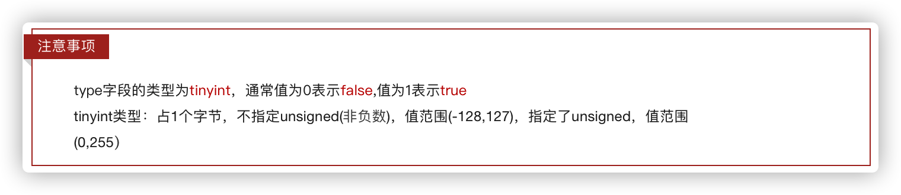

#### 3.5.2 解析内容中图片列表

```java
/**
     * 自媒体文章发布
     * @param wmNewsDto
     * @param isSubmit 是否为提交 1 为提交 0为草稿
     * @return
     */
@Override
public ResponseResult saveNews(WmNewsDto wmNewsDto, Short isSubmit) {

  // 上面代码略 ..........................
  //3.1 抽取文章中关联的图片路径
   List<Map> contents = JSON.parseArray(dto.getContent(), Map.class);
   List<String> materials = parseContentImages(contents);
  // 下面代码略 ..........................
}	

    /**
     * 抽取文章内容中 所引用的所有图片
     * @param contents 文章内容
     * @return
     */
    private List<String> parseContentImages(List<Map> contents) {
        // 遍历文章内容   将所有 type为image的 value获取出来  去除前缀路径
        return contents.stream()
                // 过滤type=image所有的集合
                .filter( map -> map.get("type").equals(WemediaConstants.WM_NEWS_TYPE_IMAGE))
                // 获取到image下的value  图片url
                .map(x -> (String)x.get("value"))
                // 图片url去除前缀
                .map(url-> url.replace(webSite,"").replace(" ",""))
                // 去除重复的路径
                .distinct()
                // sretam 转成list集合
                .collect(Collectors.toList());
    }
```

> 参考前端传递参数数据格式解析即可

#### 3.5.3 关联文章内容中的图片和素材关系

```java
/**
     * 自媒体文章发布
     * @param wmNewsDto
     * @param isSubmit 是否为提交 1 为提交 0为草稿
     * @return
     */
@Override
public ResponseResult saveNews(WmNewsDto wmNewsDto, Short isSubmit) {
  // 上面代码略 ..........................

  // 3.2 关联文章内容中的图片和素材关系
  Short status = dto.getStatus();
  if (status == WmNews.Status.SUBMIT.getCode() && materials.size() > 0) {
     saveRelativeInfo(materials, wmNews.getId(),WemediaConstants.WM_CONTENT_REFERENCE);
  }
  // 下面代码略 ..........................
}
	@Autowired
    WmMaterialMapper wmMaterialMapper;
    /**
     * 保存素材和文章关系
     * @param urls  素材列表
     * @param newsId     文章ID
     * @param type       类型 0：内容素材  1：封面素材
     */
    private void saveRelativeInfo(List<String> urls, Integer newsId, Short type) {
        //1 查询文章内容中的图片对应的素材ID
        List<Integer> ids = wmMaterialMapper.selectRelationsIds(urls,
                WmThreadLocalUtils.getUser().getId());
        //2 判断素材是否缺失
        if(CollectionUtils.isEmpty(ids) || ids.size() < urls.size()){
            CustException.cust(AppHttpCodeEnum.DATA_NOT_EXIST,"相关素材缺失,保存文章失败");
        }
        //3 保存素材关系
        wmNewsMaterialMapper.saveRelations(ids,newsId,type);
    }
```

启动服务测试

* `admin-service`
* `wemedia-service`
* `wemedia-gateway`
* 前端自媒体服务

> 注意当前登录人下需要上传几张图片

#### 3.5.4 关联文章封面中的图片和素材关系

```java
/**
     * 自媒体文章发布
     * @param wmNewsDto
     * @param isSubmit 是否为提交 1 为提交 0为草稿
     * @return
     */
@Override
public ResponseResult submitNews(WmNewsDto wmNewsDto) {
  // 上面代码略 ..........................
  // 3.3 关联文章封面中的图片和素材关系  封面可能是选择自动或者是无图
        if (status == WmNews.Status.SUBMIT.getCode()) {
            saveRelativeInfoForCover(dto,materials, wmNews);
        }
  return ResponseResult.okResult();
}

    /**
     * 【3.3】 关联文章封面中的图片和素材关系
     * @param dto  前端用户选择封面信息数据
     * @param materials  从内容中解析的图片列表
     * @param wmNews     文章ID    
     */
    private void saveRelativeInfoForCover(WmNewsDTO dto, List<String> materials, WmNews wmNews) {
        // 前端用户选择的图
        List<String> images = dto.getImages();

        // 自动获取封面 ****
        if (WemediaConstants.WM_NEWS_TYPE_AUTO.equals(dto.getType())) {
            int materialSize = materials.size();
            if (materialSize > 0 && materialSize <= 2) {  // 单图
                images =  materials.stream().limit(1).collect(Collectors.toList());
                wmNews.setType(WemediaConstants.WM_NEWS_SINGLE_IMAGE);
            } else if (materialSize > 2) { // 多图
                images =  materials.stream().limit(3).collect(Collectors.toList());
                wmNews.setType(WemediaConstants.WM_NEWS_MANY_IMAGE);
            } else {  // 无图
                wmNews.setType(WemediaConstants.WM_NEWS_NONE_IMAGE);
            }

            if (images != null && images.size() > 0) {
                // 将图片集合 转为字符串  url1,url2,url3
                wmNews.setImages(imageListToStr(images,webSite));
            }
            updateById(wmNews);
        }
        // 保存图片列表和素材的关系
        if (images != null && images.size() > 0) {
            images = images.stream().map(x->x.replace(webSite,"")
                    .replace(" ","")).collect(Collectors.toList());
            saveRelativeInfo(images, wmNews.getId(), WemediaConstants.WM_IMAGE_REFERENCE);
        }
    }
```

### 3.6 控制层

在WmNewsController类中新增方法

```java
    @ApiOperation(value = "发表文章",notes = "发表文章，保存草稿，修改文章 共用的方法")
    @PostMapping("/submit")
    public ResponseResult submitNews(@RequestBody WmNewsDTO dto) {
        return wmNewsService.submitNews(dto);
    }
```

### 3.7 测试

postman工具测试

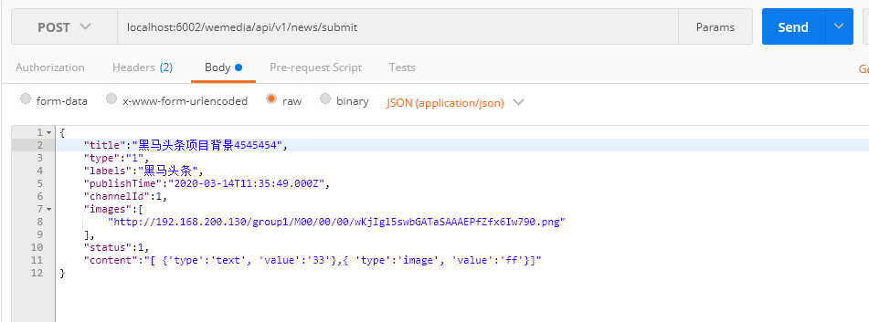

**打开前端工程联调**

* 保存草稿
* 提交文章待审核
  * 封面单图、多图、无图
  * 封面图自动测试

## 4 自媒体文章-根据id查询 

### 4.1 需求分析


点击修改的时候，就是根据文章id查询，跳转至编辑页面进行展示

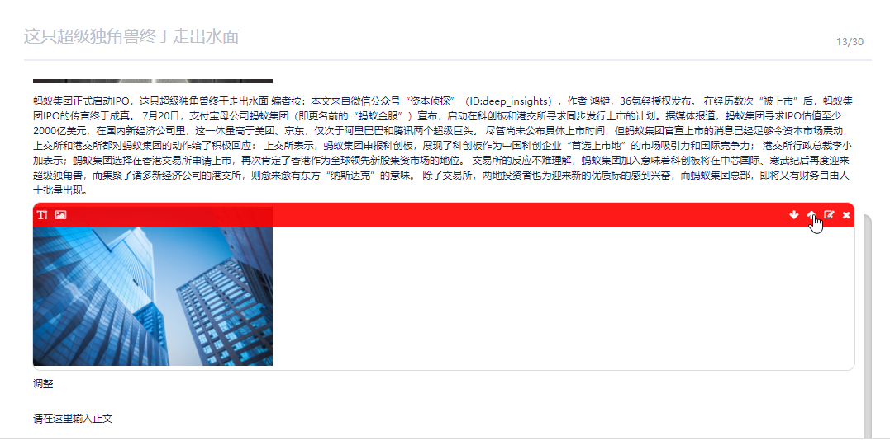

### 4.2 接口定义

**接口描述**:  <font color="red">根据id查询文章</font> 

**接口地址**:`/api/v1/news/one/{id}`


**请求方式**:`GET`


**请求数据类型**:`*`

**响应数据类型**:`application/json`


**请求参数**:


| 参数名称 | 参数说明   | in   | 是否必须 | 数据类型       | schema |
| -------- | ---------- | ---- | -------- | -------------- | ------ |
| id       | 文章主键id | path | true     | integer(int32) |        |


### 4.3 业务层代码编写

在WmNewsService接口中新增方法 根据id查询文章的方法

```java
/**
     * 根据文章id查询文章
     * @return
     */
ResponseResult findWmNewsById(Integer id);
```

**实现类 自己写**

### 4.4 控制层

在WmNewsController新增方法 查询文章

```java
	@ApiOperation(value = "根据id查询自媒体文章")
    @GetMapping("/one/{id}")
    public ResponseResult findWmNewsById(@PathVariable("id") Integer id) {
        return wmNewsService.findWmNewsById(id);
    }
```

### 4.5 测试

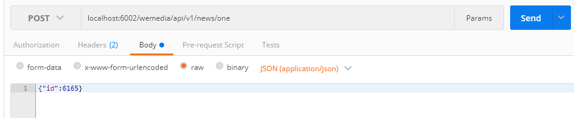

打开页面进行测试

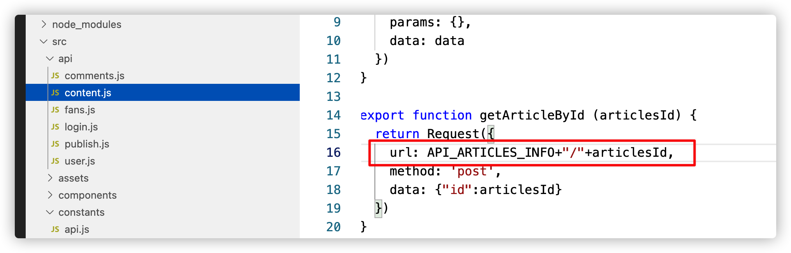

## 5 自媒体文章-删除 (实战练习)

### 5.1 需求分析

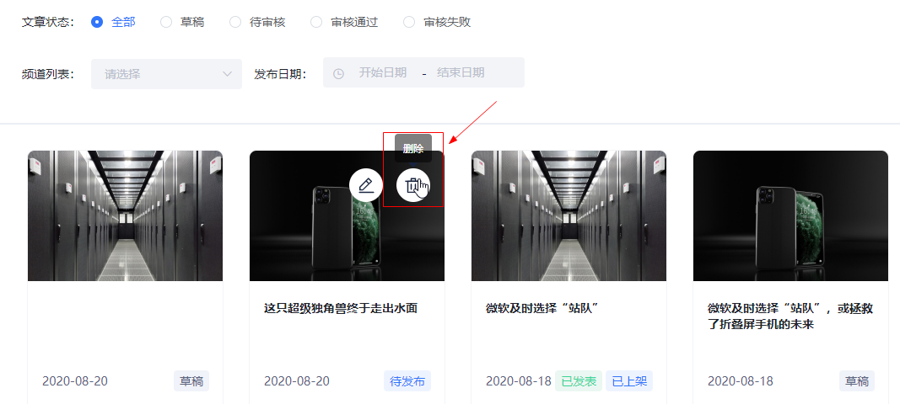

- 当文章状态为9(已发布)且已上架则不能删除文章，下架状态可以删除，如果是其他状态可以删除
- 删除文章之前需要先把素材与文章的关系删除掉

### 5.2 接口定义

**接口描述**: <font color="red">根据文章ID删除文章</font> 

**接口地址**:`/api/v1/news/del_news/{id}`

**请求方式**:`GET`

**请求数据类型**:`*`

**响应数据类型**:`application/json`


**请求参数**:


| 参数名称 | 参数说明 | in   | 是否必须 | 数据类型       | schema |
| -------- | -------- | ---- | -------- | -------------- | ------ |
| id       | id       | path | true     | integer(int32) |        |


### 5.3 业务层

WmNewsService添加删除方法

```java
/**
     * 删除文章
     * @return
     */
	ResponseResult delNews(Integer id);
```

实现类：

```java
	@Override
    public ResponseResult delNews(Integer id) {
        //1.检查参数
        if(id == null){
            CustException.cust(AppHttpCodeEnum.PARAM_INVALID,"文章Id不可缺少");
        }
        //2.获取数据
        WmNews wmNews = getById(id);
        if(wmNews == null){
            CustException.cust(AppHttpCodeEnum.DATA_NOT_EXIST,"文章不存在");
        }
        //3.判断当前文章的状态  status==9  enable == 1
        if(wmNews.getStatus().equals(WmNews.Status.PUBLISHED.getCode())
                && wmNews.getEnable().equals(WemediaConstants.WM_NEWS_UP)){
            CustException.cust(AppHttpCodeEnum.DATA_NOT_EXIST,"文章已发布，不能删除");
        }
        //4.去除素材与文章的关系
        wmNewsMaterialMapper.delete(Wrappers.<WmNewsMaterial>lambdaQuery().eq(WmNewsMaterial::getNewsId,wmNews.getId()));
        //5.删除文章
        removeById(wmNews.getId());
        return ResponseResult.okResult();
    }
```

### 5.4 控制层

在WmNewsController中添加删除方法

```java
	@ApiOperation(value = "根据id删除自媒体文章")
    @GetMapping("/del_news/{id}")
    public ResponseResult delNews(@PathVariable("id") Integer id) {
        return wmNewsService.delNews(id);
    }
```

## 6 自媒体文章-上架、下架 (实战练习)

### 6.1 需求分析

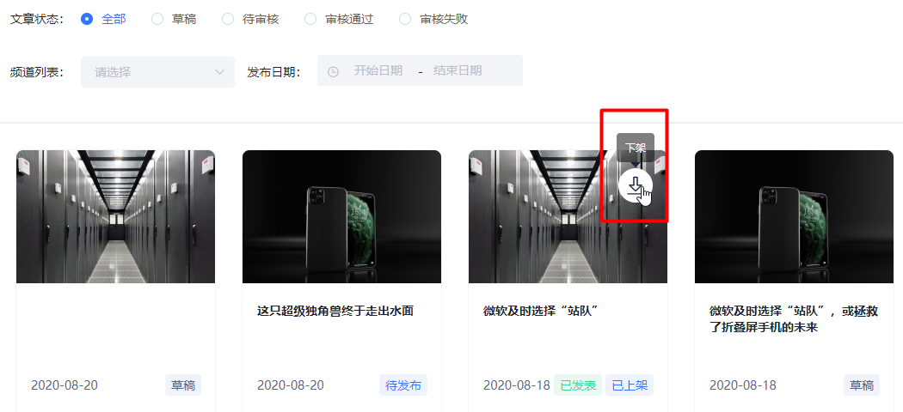

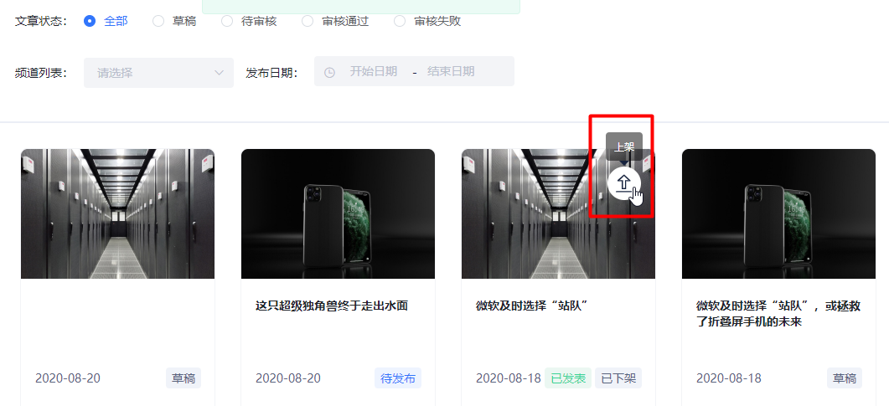

- 当前已经发布（状态为9）的文章可以上架（enable = 1），也可以下架（enable = 0）

- 在上架和下架操作的同时，需要同步app端的文章配置信息，暂时不做，后期讲到审核文章的时候再优化

### 6.2 接口定义

**接口描述**: <font color="red">文章上下架操作</font> 

**接口地址**:`/api/v1/news/down_or_up`


**请求方式**:`POST`

**请求数据类型**:`application/json`

**响应数据类型**:`application/json`

**请求示例**:


```javascript
{
	
	"enable": 0,
	"id": 0
	
}
```


**请求参数**:


| 参数名称           | 参数说明 | in   | 是否必须 | 数据类型       | schema    |
| ------------------ | -------- | ---- | -------- | -------------- | --------- |
| dto                | dto      | body | true     | WmNewsDto      | WmNewsDto |
| &emsp;&emsp;enable |          |      | true     | integer(int32) |           |
| &emsp;id           |          |      | true     | integer(int32) |           |


### 6.3 业务层

在WmNewsService新增方法

```java
    /**
     * 上下架
     * @param dto
     * @return
     */
    ResponseResult downOrUp(WmNewsDTO dto);
```

实现类：

```java
    @Override
    public ResponseResult downOrUp(WmNewsDTO dto) {
        //1.检查参数
        if(dto == null || dto.getId() == null){
            CustException.cust(AppHttpCodeEnum.PARAM_INVALID);
        }
        Short enable = dto.getEnable();
        if(enable == null ||
                (!WemediaConstants.WM_NEWS_UP.equals(enable)&&!WemediaConstants.WM_NEWS_DOWN.equals(enable))){
            CustException.cust(AppHttpCodeEnum.PARAM_INVALID,"上下架状态错误");
        }
        //2.查询文章
        WmNews wmNews = getById(dto.getId());
        if(wmNews == null){
            CustException.cust(AppHttpCodeEnum.DATA_NOT_EXIST,"文章不存在");
        }
        //3.判断文章是否发布
        if(!wmNews.getStatus().equals(WmNews.Status.PUBLISHED.getCode())){ 
            CustException.cust(AppHttpCodeEnum.DATA_NOT_EXIST,"当前文章不是发布状态，不能上下架");
        }
        //4.修改文章状态，同步到app端（后期做）TODO
        update(Wrappers.<WmNews>lambdaUpdate().eq(WmNews::getId,dto.getId())
            .set(WmNews::getEnable,dto.getEnable()));
        return ResponseResult.okResult(AppHttpCodeEnum.SUCCESS);
    }
```

### 6.4 控制层

```java
    @ApiOperation(value = "自媒体文章上架或下架",notes = "enable 上架: 1 下架: 0")
    @PostMapping("/down_or_up")
    public ResponseResult downOrUp(@RequestBody WmNewsDTO dto) {
        return wmNewsService.downOrUp(dto);
    }
```

### 6.5 测试

前端页面测试


**面试热点**

**JDK Stream流的使用方式**

**发布文章的流程**(业务流程，涉及表，具体实现)

