# 第5章 自媒体文章审核

## 今日目标

- 能够完成阿里云安全第三方接口文档的使用
- 能够把阿里云安全对接到项目中
- 能够理解敏感词过滤算法dfa
- 能够完成自媒体文章自动审核

## 1 自动审核流程介绍

做为内容类产品，内容安全非常重要，所以需要进行对自媒体用户发布的文章进行审核以后才能到app端展示给用户。2

WmNews 中**status** 代表自媒体文章的状态

<span style="color:red;font-size: 30px">status字段：0 草稿   1 待审核   2 审核失败   3 人工审核   4 人工审核通过   8 审核通过（待发布）  9 已发布</span>


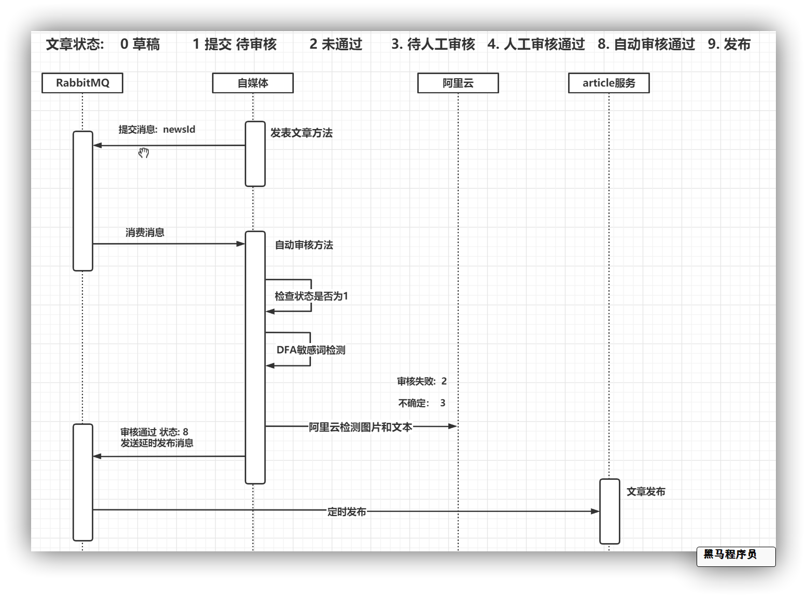

- **当自媒体用户提交发布文章之后，会发消息给RabbitMQ提交审核**
- **自媒体微服务提供消息监听，处理自动审核** 
- ​      	**查询文章数据**
- ​      	**判断文章id是否为1 （只有1需要自动审核）**
- ​      	**文章内容中是否有自管理的敏感词，如果有则审核不通过，修改自媒体文章状态为2**
- ​      	**调用阿里云文本反垃圾服务，进行文本审核    审核不通过 2     人工审核  3** 
- ​	  	**调用阿里云图片审核服务，进行图片审核        审核不通过 2     人工审核  3** 
- **如果审核通过 判断发布时间 是否小于等于当前时间   如果小于等于  直接发消息通知  文章微服务   发布文章**
- **如果未到发布时间，将消息发送到RabbitMQ的死信队列  并设置消息失效时间**

​      

## 2 内容安全第三方接口对接

### 2.1）内容安全接口选型

内容安全是识别服务，支持对图片、视频、文本、语音等对象进行多样化场景检测，有效降低内容违规风险。

黑马头条发布文章中有内容可能违规，如何有效避免风险，可以使用第三方接口进行内容检测。

目前很多平台都支持内容检测，如阿里云、腾讯云、百度AI、网易云等国内大型互联网公司都对外提供了API。

按照性能和收费来看，黑马头条项目使用的就是阿里云的内容安全接口，使用到了图片和文本的审核。

阿里云收费标准：https://www.aliyun.com/price/product/?spm=a2c4g.11186623.2.10.4146401eg5oeu8#/lvwang/detail

### 2.2）阿里云服务介绍

#### 2.2.1 准备工作

您在使用内容检测API之前，需要先注册阿里云账号，添加Access Key并签约云盾内容安全。

**操作步骤**

1. 前往[阿里云官网](https://www.aliyun.com/)注册账号。如果已有注册账号，请跳过此步骤。

   进入阿里云首页后，如果没有阿里云的账户需要先进行注册，才可以进行登录。由于注册较为简单，课程和讲义不在进行体现（注册可以使用多种方式，如淘宝账号、支付宝账号、微博账号等...）。

   需要实名认证和活体认证。

2. 打开[云盾内容安全产品试用页面](https://promotion.aliyun.com/ntms/act/lvwangdemo.html)，单击**立即开通**，正式开通服务。

   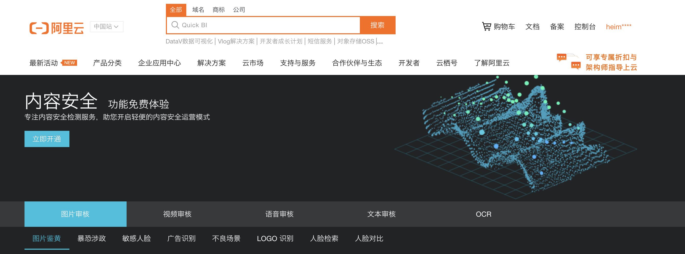

   内容安全控制台

   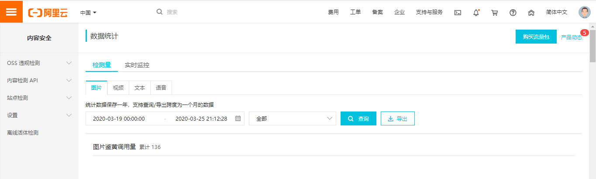

3. 在[AccessKey管理页面](https://ak-console.aliyun.com/#/accesskey)管理您的AccessKeyID和AccessKeySecret。

   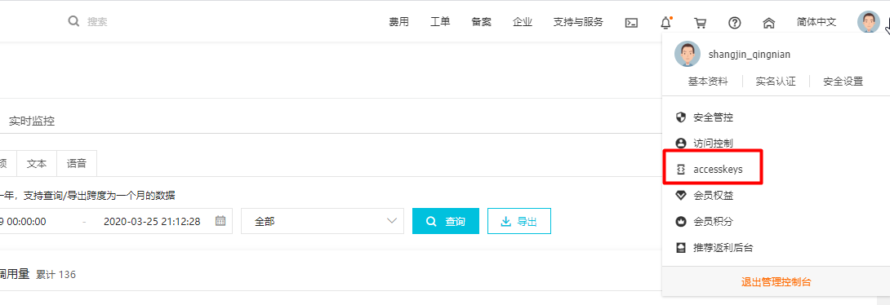

   管理自己的AccessKey,可以新建和删除AccessKey

   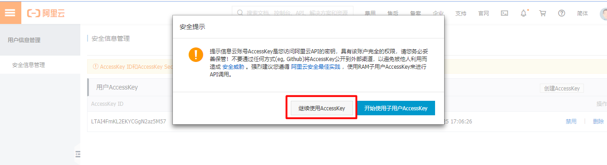

   查看自己的AccessKey，

   AccessKey默认是隐藏的，第一次申请的时候可以保存AccessKey，点击显示，通过验证手机号后也可以查看

   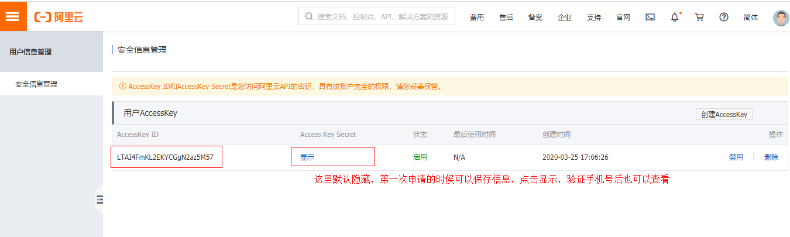

#### 2.2.2 阿里云安全-文本内容垃圾检测

[文本垃圾内容检测接口说明](https://help.aliyun.com/document_detail/70439.html?spm=a2c4g.11186623.6.659.35ac3db3l0wV5k)

示例代码地址：https://help.aliyun.com/document_detail/53427.html?spm=a2c4g.11186623.6.717.466d7544QbU8Lr

创建项目aliyun-test

安装sdk

```xml
<dependencies>
    <!-- 阿里云内容安全sdk -->
  <dependency>
      <groupId>com.aliyun</groupId>
      <artifactId>aliyun-java-sdk-core</artifactId>
      <version>4.1.1</version>
  </dependency>
  <dependency>
      <groupId>com.aliyun</groupId>
      <artifactId>aliyun-java-sdk-green</artifactId>
      <version>3.6.2</version>
  </dependency>
  <dependency>
      <groupId>com.alibaba</groupId>
      <artifactId>fastjson</artifactId>
      <version>1.2.51</version>
  </dependency>
  <dependency>
      <groupId>com.aliyun.oss</groupId>
      <artifactId>aliyun-sdk-oss</artifactId>
      <version>2.8.3</version>
  </dependency>

    <dependency>
        <groupId>commons-io</groupId>
        <artifactId>commons-io</artifactId>
        <version>2.4</version>
    </dependency>

    <dependency>
        <groupId>commons-codec</groupId>
        <artifactId>commons-codec</artifactId>
        <version>1.10</version>
    </dependency>
  	<dependency>
   	 <groupId>commons-logging</groupId>
   	 <artifactId>commons-logging</artifactId>
  	 <version>1.2</version>
 		</dependency>
</dependencies>
```

示例代码

```java
package com.itheima.aliyun.util;

import com.alibaba.fastjson.JSON;
import com.alibaba.fastjson.JSONArray;
import com.alibaba.fastjson.JSONObject;
import com.aliyun.oss.ClientException;
import com.aliyuncs.DefaultAcsClient;
import com.aliyuncs.IAcsClient;
import com.aliyuncs.exceptions.ServerException;
import com.aliyuncs.green.model.v20180509.TextScanRequest;
import com.aliyuncs.http.FormatType;
import com.aliyuncs.http.HttpResponse;
import com.aliyuncs.profile.DefaultProfile;
import com.aliyuncs.profile.IClientProfile;

import java.util.*;

public class Main {

    public static void main(String[] args) throws Exception {
        IClientProfile profile = DefaultProfile
            .getProfile("cn-shanghai", "LTAI4F1mKL2EKYCGgN2az5M57", "XjgvRoAGzM3rWQxKWDJx198VWOmO0Hz");
        DefaultProfile
            .addEndpoint("cn-shanghai", "cn-shanghai", "Green", "green.cn-shanghai.aliyuncs.com");        
        IAcsClient client = new DefaultAcsClient(profile);
        TextScanRequest textScanRequest = new TextScanRequest();
        textScanRequest.setAcceptFormat(FormatType.JSON); // 指定API返回格式。
        textScanRequest.setHttpContentType(FormatType.JSON);
        textScanRequest.setMethod(com.aliyuncs.http.MethodType.POST); // 指定请求方法。
        textScanRequest.setEncoding("UTF-8");
        textScanRequest.setRegionId("cn-shanghai");
        List<Map<String, Object>> tasks = new ArrayList<Map<String, Object>>();
        Map<String, Object> task1 = new LinkedHashMap<String, Object>();
        task1.put("dataId", UUID.randomUUID().toString());
        /**
         * 待检测的文本，长度不超过10000个字符。
         */
        task1.put("content", "我是一个文本,买卖冰毒是违法的");
        tasks.add(task1);
        JSONObject data = new JSONObject();

        /**
         * 检测场景。文本垃圾检测请传递antispam。
         **/
        data.put("scenes", Arrays.asList("antispam"));
        data.put("tasks", tasks);
        System.out.println("参数："+JSON.toJSONString(data, true));
        textScanRequest.setHttpContent(data.toJSONString().getBytes("UTF-8"), "UTF-8", FormatType.JSON);
        // 请务必设置超时时间。
        textScanRequest.setConnectTimeout(3000);
        textScanRequest.setReadTimeout(6000);
        try {
            HttpResponse httpResponse = client.doAction(textScanRequest);
            if(httpResponse.isSuccess()){
                JSONObject scrResponse = JSON.parseObject(new String(httpResponse.getHttpContent(), "UTF-8"));
                System.out.println("结果："+JSON.toJSONString(scrResponse, true));
                if (200 == scrResponse.getInteger("code")) {
                    JSONArray taskResults = scrResponse.getJSONArray("data");
                    for (Object taskResult : taskResults) {
                        if(200 == ((JSONObject)taskResult).getInteger("code")){
                            JSONArray sceneResults = ((JSONObject)taskResult).getJSONArray("results");
                            for (Object sceneResult : sceneResults) {
                                String scene = ((JSONObject)sceneResult).getString("scene");
                                String suggestion = ((JSONObject)sceneResult).getString("suggestion");
                                //根据scene和suggetion做相关处理。
                                //suggestion == pass表示未命中垃圾。suggestion == block表示命中了垃圾，可以通过label字段查看命中的垃圾分类。
                                System.out.println("args = [" + scene + "]");
                                System.out.println("args = [" + suggestion + "]");
                            }
                        }else{
                            System.out.println("task process fail:" + ((JSONObject)taskResult).getInteger("code"));
                        }
                    }
                } else {
                    System.out.println("detect not success. code:" + scrResponse.getInteger("code"));
                }
            }else{
                System.out.println("response not success. status:" + httpResponse.getStatus());
            }
        } catch (ServerException e) {
            e.printStackTrace();
        } catch (ClientException e) {
            e.printStackTrace();
        } catch (Exception e) {
            e.printStackTrace();
        }
    }

}
```

测试一：输入以上的内容，检测通过

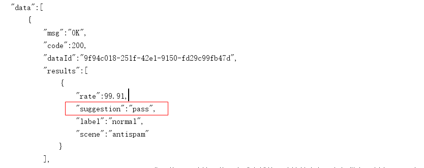


测试二：如果在上述文本内容中添加“冰毒买卖”，就会未通过

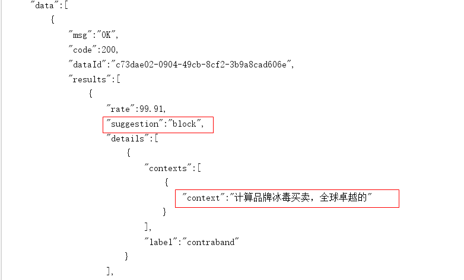


#### 2.2.3 阿里云安全-图片审核

参考阿里云提供的接口文档说明[文档地址](https://help.aliyun.com/document_detail/70292.html?spm=a2c4g.11186623.6.616.5d7d1e7f9vDRz4)

[示例代码地址](https://help.aliyun.com/document_detail/53424.html?spm=a2c4g.11186623.6.715.c8f69b12ey35j4)

注意事项：如果使用本地文件或者二进制文件检测，请下载并在项目工程中引入[Extension.Uploader工具类](https://aligreen-shanghai-share.oss-cn-shanghai.aliyuncs.com/com.aliyuncs.green.extension.uploader.zip)。

修改后的示例代码

```java
import com.alibaba.fastjson.JSON;
import com.alibaba.fastjson.JSONArray;
import com.alibaba.fastjson.JSONObject;
import com.aliyuncs.DefaultAcsClient;
import com.aliyuncs.IAcsClient;
import com.aliyuncs.green.model.v20180509.ImageSyncScanRequest;
import com.aliyuncs.http.FormatType;
import com.aliyuncs.http.HttpResponse;
import com.aliyuncs.http.MethodType;
import com.aliyuncs.http.ProtocolType;
import com.aliyuncs.profile.DefaultProfile;
import com.aliyuncs.profile.IClientProfile;

import java.util.*;

public class ImgMain {

    public static void main(String[] args) throws Exception {
        IClientProfile profile = DefaultProfile
                .getProfile("cn-shanghai", "LTAI4FzL1ddwcgSNDv3GTfJZ1", "13ygpLlW8MUervH5U2it420vGG1AcbF");
        DefaultProfile
                .addEndpoint("cn-shanghai", "cn-shanghai", "Green", "green.cn-shanghai.aliyuncs.com");
        IAcsClient client = new DefaultAcsClient(profile);

        ImageSyncScanRequest imageSyncScanRequest = new ImageSyncScanRequest();
        // 指定API返回格式。
        imageSyncScanRequest.setAcceptFormat(FormatType.JSON);
        // 指定请求方法。
        imageSyncScanRequest.setMethod(MethodType.POST);
        imageSyncScanRequest.setEncoding("utf-8");
        // 支持HTTP和HTTPS。
        imageSyncScanRequest.setProtocol(ProtocolType.HTTP);


        JSONObject httpBody = new JSONObject();
        /**
         * 设置要检测的风险场景。计费依据此处传递的场景计算。
         * 一次请求中可以同时检测多张图片，每张图片可以同时检测多个风险场景，计费按照场景计算。
         * 例如，检测2张图片，场景传递porn和terrorism，计费会按照2张图片鉴黄，2张图片暴恐检测计算。
         * porn：表示鉴黄场景。
         */
        httpBody.put("scenes", Arrays.asList("terrorism"));

        /**
         * 设置待检测图片。一张图片对应一个task。
         * 多张图片同时检测时，处理的时间由最后一个处理完的图片决定。
         * 通常情况下批量检测的平均响应时间比单张检测的要长。一次批量提交的图片数越多，响应时间被拉长的概率越高。
         * 这里以单张图片检测作为示例, 如果是批量图片检测，请自行构建多个task。
         */
        JSONObject task = new JSONObject();
        task.put("dataId", UUID.randomUUID().toString());

        // 设置图片链接。
        task.put("url", "https://heimaleadnewsoss.oss-cn-shanghai.aliyuncs.com/material/2021/1/20210112/205cd5d3346a48b59352c92808709da1.jpg");
        task.put("time", new Date());
        httpBody.put("tasks", Arrays.asList(task));

        imageSyncScanRequest.setHttpContent(org.apache.commons.codec.binary.StringUtils.getBytesUtf8(httpBody.toJSONString()),
            "UTF-8", FormatType.JSON);

        /**
         * 请设置超时时间。服务端全链路处理超时时间为10秒，请做相应设置。
         * 如果您设置的ReadTimeout小于服务端处理的时间，程序中会获得一个read timeout异常。
         */
        imageSyncScanRequest.setConnectTimeout(3000);
        imageSyncScanRequest.setReadTimeout(10000);
        HttpResponse httpResponse = null;
        try {
            httpResponse = client.doAction(imageSyncScanRequest);
        } catch (Exception e) {
            e.printStackTrace();
        }

        // 服务端接收到请求，完成处理后返回的结果。
        if (httpResponse != null && httpResponse.isSuccess()) {
            JSONObject scrResponse = JSON.parseObject(org.apache.commons.codec.binary.StringUtils.newStringUtf8(httpResponse.getHttpContent()));
            System.out.println(JSON.toJSONString(scrResponse, true));
            int requestCode = scrResponse.getIntValue("code");
            // 每一张图片的检测结果。
            JSONArray taskResults = scrResponse.getJSONArray("data");
            if (200 == requestCode) {
                for (Object taskResult : taskResults) {
                    // 单张图片的处理结果。
                    int taskCode = ((JSONObject) taskResult).getIntValue("code");
                    // 图片对应检测场景的处理结果。如果是多个场景，则会有每个场景的结果。
                    JSONArray sceneResults = ((JSONObject) taskResult).getJSONArray("results");
                    if (200 == taskCode) {
                        for (Object sceneResult : sceneResults) {
                            String scene = ((JSONObject) sceneResult).getString("scene");
                            String suggestion = ((JSONObject) sceneResult).getString("suggestion");
                            // 根据scene和suggestion做相关处理。
                            // 根据不同的suggestion结果做业务上的不同处理。例如，将违规数据删除等。
                            System.out.println("scene = [" + scene + "]");
                            System.out.println("suggestion = [" + suggestion + "]");
                        }
                    } else {
                        // 单张图片处理失败, 原因视具体的情况详细分析。
                        System.out.println("task process fail. task response:" + JSON.toJSONString(taskResult));
                    }
                }
            } else {
                /**
                 * 表明请求整体处理失败，原因视具体的情况详细分析。
                 */
                System.out.println("the whole image scan request failed. response:" + JSON.toJSONString(scrResponse));
            }
        }
    }

}
```

测试：

测试结果，ak47.jpg涉及兵器，审核不通过，itheima.jpg审核通过，如果文章中有任何一张图片审核不通过，则文章审核就不通过。

image1测试结果：不通过

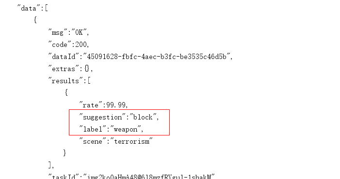

image2测试结果：通过

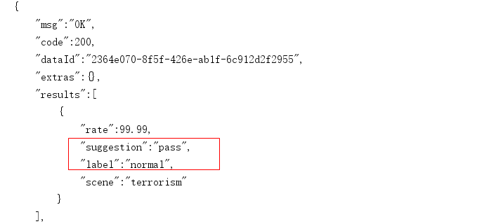


## 	3 阿里云安全集成到项目

### 3.1）依赖引入

创建 `heima-aliyunsecurity-spring-boot-starter` 模块引入阿里云sdk依赖

```xml
<dependencies>
  <dependency>
    <groupId>com.aliyun</groupId>
    <artifactId>aliyun-java-sdk-core</artifactId>
  </dependency>
  <dependency>
    <groupId>com.aliyun</groupId>
    <artifactId>aliyun-java-sdk-green</artifactId>
  </dependency>
  <!--OSS-->
  <dependency>
    <groupId>com.aliyun.oss</groupId>
    <artifactId>aliyun-sdk-oss</artifactId>
    <version>3.10.2</version>
  </dependency>
  <dependency>
    <groupId>com.alibaba</groupId>
    <artifactId>fastjson</artifactId>
  </dependency>
  <dependency>
    <groupId>org.springframework.boot</groupId>
    <artifactId>spring-boot-autoconfigure</artifactId>
  </dependency>
  <dependency>
    <groupId>org.springframework.boot</groupId>
    <artifactId>spring-boot-starter</artifactId>
  </dependency>
  <dependency>
    <groupId>org.springframework.boot</groupId>
    <artifactId>spring-boot-configuration-processor</artifactId>
    <optional>true</optional>
  </dependency>
  <dependency>
    <groupId>org.springframework.boot</groupId>
    <artifactId>spring-boot-starter-actuator</artifactId>
  </dependency>
</dependencies>
```

### 3.2）引入图片上传工具类

从之前测试阿里云服务的工程拷贝到`heima-aliyunsecurity-spring-boot-starter`中，结构如下：

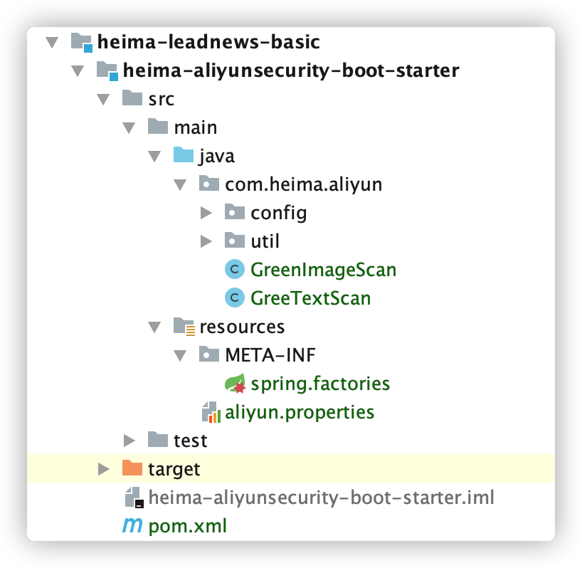

引入 资料文件夹下：**文本内容审核和图片审核** 对应的工具类


### 3.3）新建配置文件


在resources中新建aliyun.properties

```properties
aliyun.accessKeyId=LTAI5tGgp5yrk8H3V9booXVx
aliyun.secret=zETVAB7LUYqjcXl2jrKeSitZ2SfYgb
#aliyun.scenes=porn,terrorism,ad,qrcode,live,logo
aliyun.scenes=porn
```

参数说明：[scenes](https://help.aliyun.com/document_detail/70292.html?spm=a2c4g.11186623.6.621.8b4abb0aodKTCS)，当前的这个场景设置，只有在图片审核的时候会用到，可以根据实际情况自由组合

- porn：图片智能鉴黄
- terrorism：图片暴恐涉政
- ad：图文违规
- qrcode：图片二维码
- live：图片不良场景
- logo：图片logo

创建 `META-INF/spring.factories` 文件：

```properties
org.springframework.boot.autoconfigure.EnableAutoConfiguration=\
com.heima.aliyun.config.AliyunConfig
```

### 3.4）测试

后期需要在admin微服务中使用，可以在admin微服中引用

在`wemedia-service`微服务中添加依赖，支持阿里云接口服务

wemedia的pom添加依赖：

```xml
    <dependency>
        <groupId>com.heima</groupId>
        <artifactId>heima-aliyunsecurity-spring-boot-starter</artifactId>
        <version>1.0-SNAPSHOT</version>
    </dependency>

```

创建测试类：

分别测试文本垃圾检测接口和图片审核接口

```java
@SpringBootTest
@RunWith(SpringRunner.class)
public class AliyunTest {
    @Autowired
    private GreenTextScan greenTextScan;
    @Autowired
    private GreenImageScan greenImageScan;
    @Test
    public void testText() throws Exception{
        Map map = greenTextScan.greenTextScan("我是一个文本,冰毒买卖是违法的");
        System.out.println(map);
    }
    @Test
    public void testImage() throws Exception {
        List<String> images = new ArrayList<>();
        images.add("https://heimaleadnewsoss.oss-cn-shanghai.aliyuncs.com/material/2021/1/20210112/205cd5d3346a48b59352c92808709da1.jpg");
        Map map = greenImageScan.imageUrlScan(images);
        System.out.println(map);
    }
}
```

## 4 敏感词过滤算法DFA

**（1）文章审核需求**

文章审核功能已经交付了，文章也能正常发布审核。突然，产品经理过来说要开会。

会议的内容核心有以下内容：

- 文章审核不能过滤一些敏感词：

  私人侦探、针孔摄象、信用卡提现、广告代理、代开发票、刻章办、出售答案、小额贷款…

需要完成的功能：

需要自己维护一套敏感词，在文章审核的时候，需要验证文章是否包含这些敏感词

**（2）敏感词-过滤**

技术选型

| **方案**               | **说明**                     |
| ---------------------- | ---------------------------- |
| 数据库模糊查询         | 效率太低                     |
| String.indexOf("")查找 | 数据库量大的话也是比较慢     |
| 全文检索               | 分词再匹配                   |
| DFA算法                | 确定有穷自动机(一种数据结构) |

### 4.1）DFA实现原理

DFA全称为：Deterministic Finite Automaton,即确定有穷自动机。

存储：一次性的把所有的敏感词存储到了多个map中，就是下图表示这种结构

敏感词：冰毒、大麻、大坏蛋


检索的过程


### 4.2）代码实现

工具类：

```java
package com.heima.utils.common;
import java.util.*;
public class SensitiveWordUtil {
    public static Map<String, Object> dictionaryMap = new HashMap<>();
    /**
     * 生成关键词字典库
     * @param words
     * @return
     */
    public static void initMap(Collection<String> words) {
        if (words == null) {
            System.out.println("敏感词列表不能为空");
            return ;
        }
        // map初始长度words.size()，整个字典库的入口字数(小于words.size()，因为不同的词可能会有相同的首字)
        Map<String, Object> map = new HashMap<>(words.size());
        // 遍历过程中当前层次的数据
        Map<String, Object> curMap = null;
        Iterator<String> iterator = words.iterator();

        while (iterator.hasNext()) {
            String word = iterator.next();
            curMap = map;
            int len = word.length();
            for (int i =0; i < len; i++) {
                // 遍历每个词的字
                String key = String.valueOf(word.charAt(i));
                // 当前字在当前层是否存在, 不存在则新建, 当前层数据指向下一个节点, 继续判断是否存在数据
                Map<String, Object> wordMap = (Map<String, Object>) curMap.get(key);
                if (wordMap == null) {
                    // 每个节点存在两个数据: 下一个节点和isEnd(是否结束标志)
                    wordMap = new HashMap<>(2);
                    wordMap.put("isEnd", "0");
                    curMap.put(key, wordMap);
                }
                curMap = wordMap;
                // 如果当前字是词的最后一个字，则将isEnd标志置1
                if (i == len -1) {
                    curMap.put("isEnd", "1");
                }
            }
        }

        dictionaryMap = map;
    }

    /**
     * 搜索文本中某个文字是否匹配关键词
     * @param text
     * @param beginIndex
     * @return
     */
    private static int checkWord(String text, int beginIndex) {
        if (dictionaryMap == null) {
            throw new RuntimeException("字典不能为空");
        }
        boolean isEnd = false;
        int wordLength = 0;
        Map<String, Object> curMap = dictionaryMap;
        int len = text.length();
        // 从文本的第beginIndex开始匹配
        for (int i = beginIndex; i < len; i++) {
            String key = String.valueOf(text.charAt(i));
            // 获取当前key的下一个节点
            curMap = (Map<String, Object>) curMap.get(key);
            if (curMap == null) {
                break;
            } else {
                wordLength ++;
                if ("1".equals(curMap.get("isEnd"))) {
                    isEnd = true;
                }
            }
        }
        if (!isEnd) {
            wordLength = 0;
        }
        return wordLength;
    }

    /**
     * 获取匹配的关键词和命中次数
     * @param text
     * @return
     */
    public static Map<String, Integer> matchWords(String text) {
        Map<String, Integer> wordMap = new HashMap<>();
        int len = text.length();
        for (int i = 0; i < len; i++) {
            int wordLength = checkWord(text, i);
            if (wordLength > 0) {
                String word = text.substring(i, i + wordLength);
                // 添加关键词匹配次数
                if (wordMap.containsKey(word)) {
                    wordMap.put(word, wordMap.get(word) + 1);
                } else {
                    wordMap.put(word, 1);
                }
                i += wordLength - 1;
            }
        }
        return wordMap;
    }
}
```

新建测试类：

```java
package com.heima.admin;
import com.heima.utils.common.SensitiveWordUtil;
import java.util.ArrayList;
import java.util.List;
import java.util.Map;
public class SensitiveWordUtilTest {
    public static void main(String[] args) {
        // 初始化 敏感词 列表
        List<String> list = new ArrayList<>();
        list.add("冰毒");
        list.add("特朗普");
        SensitiveWordUtil.initMap(list);
        // 待查询文本
        String content="我是一个好人，买卖冰毒是违法的特朗普";
        // 匹配文本
        Map<String, Integer> map = SensitiveWordUtil.matchWords(content);
        System.out.println(map);
    }
}
```


## 5 自媒体文章审核

### 5.1）表结构说明

wm_news 自媒体文章表

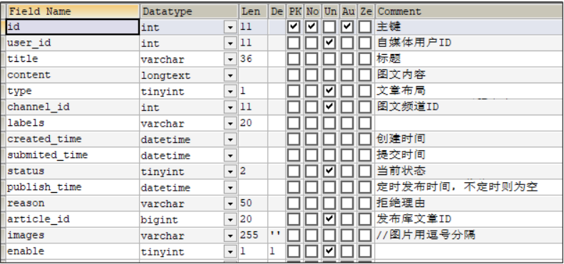

status字段：0 草稿  1 待审核  2 审核失败  3 人工审核  4 人工审核通过  8 审核通过（待发布） 9 已发布


### 5.2）准备远程调用接口

审核时需要进行自管理的DFA敏感词审核，而敏感词信息是在admin微服务中维护，需要使用feign进行调用

`admin-service`   中 `AdSensitiveMapper` 新增方法

```java
public interface AdSensitiveMapper extends BaseMapper<AdSensitive> {
    @Select("select sensitives from ad_sensitive")
    List<String> findAllSensitives();
}
```

`admin-serivice` 中 `AdSensitiveService` 新增方法 

```java
	/**
     * 查询敏感词内容列表
     * @return
     */
    public ResponseResult<List<String>> selectAllSensitives();
```

`admin-serivice` 中 `AdSensitiveServiceImpl` 实现方法 

```java
    @Override
    public ResponseResult selectAllSensitives() {
        return ResponseResult.okResult(adSensitiveMapper.findAllSensitives());
    }
```

`admin-service` 中 `AdSensitiveController`新增方法

```java
	@ApiOperation(value = "查询敏感词内容list")
    @PostMapping("/sensitives")
    public ResponseResult sensitives() {
        return sensitiveService.selectAllSensitives();
    }
```


`heima-leadnews-feign` 服务中新增feign接口`AdminFeign`

```java
package com.heima.feigns;
import com.heima.config.HeimaFeignAutoConfiguration;
import com.heima.feigns.fallback.AdminFeignFallback;
import com.heima.model.common.dtos.ResponseResult;
import org.springframework.cloud.openfeign.FeignClient;
import org.springframework.web.bind.annotation.PostMapping;
import java.util.List;
@FeignClient(value = "leadnews-admin",
        fallbackFactory = AdminFeignFallback.class,
        configuration = HeimaFeignAutoConfiguration.class
)
public interface AdminFeign {
    // 查询敏感词内容列表
    @PostMapping("/api/v1/sensitive/sensitives")
    public ResponseResult<List<String>> selectAllChannel();
}
```

`heima-leadnews-feign` 服务中新增AdminFeign服务降级实现类`AdminFeignFallback`

```java
package com.heima.feigns.fallback;
import com.heima.feigns.AdminFeign;
import com.heima.model.common.dtos.ResponseResult;
import com.heima.model.common.enums.AppHttpCodeEnum;
import feign.hystrix.FallbackFactory;
import lombok.extern.slf4j.Slf4j;
import org.springframework.stereotype.Component;
import java.util.List;
@Slf4j
@Component
public class AdminFeignFallback implements FallbackFactory<AdminFeign> {
    @Override
    public AdminFeign create(Throwable throwable) {
        throwable.printStackTrace();
        return new AdminFeign() {
            @Override
            public ResponseResult<List<String>> sensitives() {
                log.error("AdminFeign sensitives 远程调用出错啦 ~~~ !!!! {} ",throwable.getMessage());
                return ResponseResult.errorResult(AppHttpCodeEnum.SERVER_ERROR);
            }
        };
    }
}
```


### 5.3）审核接口实现

在`wemedia-service` 中的service新增接口

```java
package com.heima.wemedia.service;
public interface WmNewsAutoScanService {
    /**
     * 自媒体文章审核
     * @param id  自媒体文章id
     */
    public void autoScanWmNews(Integer id);
}
```

**实现类：**


自己实现


### 5.3）单元测试

```java
package com.heima.wemedia.service;

import com.heima.wemedia.WemediaApplication;
import org.junit.Test;
import org.junit.runner.RunWith;
import org.springframework.beans.factory.annotation.Autowired;
import org.springframework.boot.test.context.SpringBootTest;
import org.springframework.test.context.junit4.SpringRunner;

import static org.junit.Assert.*;


@SpringBootTest(classes = WemediaApplication.class)
@RunWith(SpringRunner.class)
public class WmNewsAutoScanServiceTest {

    @Autowired
    private WmNewsAutoScanService wmNewsAutoScanService;

    @Test
    public void autoScanWmNews() {

        wmNewsAutoScanService.autoScanWmNews(6238);
    }
}
```

## 6  集成RabbitMQ实现自动审核

### 6.1） 同步调用与异步调用

同步：就是在发出一个调用时，在没有得到结果之前， 该调用就不返回（实时处理）

异步：调用在发出之后，这个调用就直接返回了，没有返回结果（分时处理）

对于发表文章 及 自动审核，这是属于两个不同业务功能,  如果放到一起写耦合严重。

需要采用**异步**的方式，当发表文章完成后，向消息队列发送一条消息   

而自动审核会监听指定的队列   完成文章的审核操作

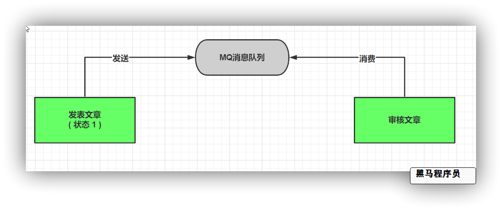


### 6.2）安装RabbitMQ

**docker脚本**

```
docker run \
 --restart always \
 -e RABBITMQ_DEFAULT_USER=itcast \
 -e RABBITMQ_DEFAULT_PASS=123321 \
 -v mq-plugins:/plugins \
 --name mq \
 --hostname mq \
 -p 15672:15672 \
 -p 5672:5672 \
 -d \
 rabbitmq:3.8-management
```


运行后登录后台管理页面:   http://192.168.200.130:15672      用户名: itcast密码: 123321

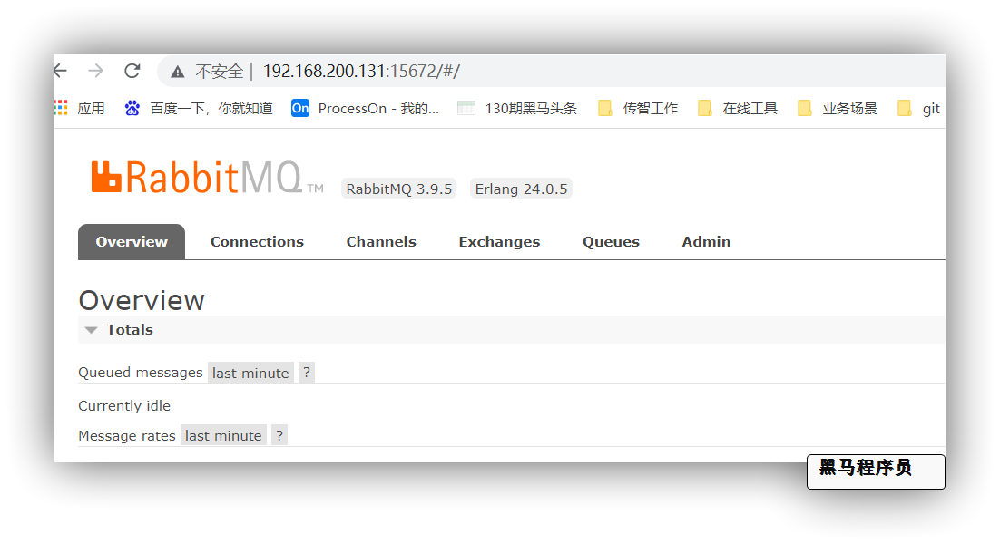


### 6.3）集成RabbitMQ

`wemedia-service`引入mq依赖

```xml
        <dependency>
            <groupId>org.springframework.boot</groupId>
            <artifactId>spring-boot-starter-amqp</artifactId>
        </dependency>
```

`nacos`配置中心修改`leadnews-wemeda.yml`配置

`share-rabbit.yml`

```yaml
spring:
  rabbitmq:
    host: ${spring.profiles.ip}
    port: 5672
    username: itcast
    password: 123321
    publisher-confirm-type: correlated  # 开启确认机制回调 必须配置这个才会确认回调
    publisher-returns: true # 开启return机制回调
    listener:
      simple:
        # acknowledge-mode: manual #手动确认
        acknowledge-mode: auto #自动确认    manual #手动确认
        # 重试策略相关配置
        retry:
          enabled: true # 是否开启重试功能
          max-attempts: 5 # 最大重试次数
          # 时间策略乘数因子   0  1  2  4  8
          multiplier: 2.0
          initial-interval: 1000ms # 第一次调用后的等待时间
          max-interval: 20000ms # 最大等待的时间值
```

**添加共享配置**

```yaml
spring:
  application:
    name: leadnews-wemedia # 服务名称
  profiles:
    active: dev # 开发环境配置
    ip: 192.168.200.130  # 环境ip地址
  cloud:
    nacos:
      server-addr: ${spring.profiles.ip}:8848
      discovery: # 注册中心地址配置
        namespace: ${spring.profiles.active}
      config: # 配置中心地址配置
        namespace: ${spring.profiles.active}
        file-extension: yml # data-id 后缀
        name: ${spring.application.name} # data-id名称
        shared-configs: # 共享配置
          - data-id: share-feign.yml # 配置文件名-Data Id
            group: DEFAULT_GROUP   # 默认为DEFAULT_GROUP
            refresh: false   # 是否动态刷新，默认为false
          - data-id: share-seata.yml # 配置文件名-Data Id
            group: DEFAULT_GROUP   # 默认为DEFAULT_GROUP
            refresh: false   # 是否动态刷新，默认为fals
          - data-id: share-file.yml # 配置文件名-Data Id
            group: DEFAULT_GROUP   # 默认为DEFAULT_GROUP
            refresh: false   # 是否动态刷新，默认为fals
          - data-id: share-rabbit.yml # 配置文件名-Data Id
            group: DEFAULT_GROUP   # 默认为DEFAULT_GROUP
            refresh: false   # 是否动态刷新，默认为fals
  servlet:
    multipart:
      max-file-size: 5MB
mybatis-plus:
  configuration:
    log-impl: org.apache.ibatis.logging.stdout.StdOutImpl
```


`wemedia-service`创建`com.heima.wemedia.config.RabbitConfig`配置类

```java
package com.heima.wemedia.config;

import lombok.extern.slf4j.Slf4j;
import org.springframework.amqp.core.Message;
import org.springframework.amqp.rabbit.connection.CorrelationData;
import org.springframework.amqp.rabbit.core.RabbitTemplate;
import org.springframework.amqp.support.converter.Jackson2JsonMessageConverter;
import org.springframework.beans.factory.InitializingBean;
import org.springframework.beans.factory.annotation.Autowired;
import org.springframework.context.annotation.Configuration;
import org.springframework.stereotype.Component;
/**
 * InitializingBean: springbean生命周期接口  代表完成bean装配后 执行的初始化方法
 * 这个类的目的：
 *     设置rabbitmq消息序列化机制  （默认jdk效率差）
 *     设置rabbitmq消息发送确认 回调
 *     设置rabbitmq消息返还 回调
 */
@Component
@Slf4j
public class RabbitConfig implements InitializingBean {
    @Autowired
    RabbitTemplate rabbitTemplate;
    @Override
    public void afterPropertiesSet()  {
        log.info("初始化rabbitMQ配置 ");
        // 设置消息转换器
        rabbitTemplate.setMessageConverter(new Jackson2JsonMessageConverter());
        // 设置发送确认 回调方法
        rabbitTemplate.setConfirmCallback(new RabbitTemplate.ConfirmCallback() {
            /**
             * @param correlationData 对比数据
             * @param ack  是否成功发送到mq exchange
             * @param cause  原因
             */
            @Override
            public void confirm(CorrelationData correlationData, boolean ack, String cause) {
                if (!ack){
                    // TODO 可扩展自动重试

                    log.error("发送消息到mq失败  ，原因: {}",cause);
                }
            }
        });
        // 设置消息返还 回调方法
        rabbitTemplate.setReturnCallback(new RabbitTemplate.ReturnCallback() {
            /**
             * @param message  消息内容
             * @param replyCode  回复状态
             * @param replyText  回复文本提示
             * @param exchange   交换机
             * @param routingKey   路由
             */
            @Override
            public void returnedMessage(Message message, int replyCode, String replyText, String exchange, String routingKey) {
                // TODO 可扩展自动重试

                log.error("消息返还回调触发  ，交换机: {} , 路由: {} , 消息内容: {} , 原因: {}  ",exchange,routingKey,message,replyText);
            }
        });
    }
}
```

`heima-leadnews-common`中定义常量类`NewsAutoScanConstants`

可以将所有消息队列常量存入`com.heima.common.constants.message`包中

```java
public class NewsAutoScanConstants {
    public static final String WM_NEWS_AUTO_SCAN_QUEUE="wm.news.auto.scan.queue";
}
```

### 6.4）发送及消费消息

**发送消息**

`wemedia-service` 服务 `WmNewsServiceImpl.submitNews`

```java
	/**
     * 自媒体文章发布
     * @param dto
     * @return
     */
    @Override
    public ResponseResult submitNews(WmNewsDTO dto) {
        // 1 参数校验
 		......略.....
        // 2 保存或修改文章
        ......略.....
        // 3.3 保存关联关系
            ......略.....
        // 3.4 发送待审核消息
			
            
        // TODO  发消息~！！！！！！！！！！！    
            
            
        return ResponseResult.okResult();
    }
```

**消费消息**

收消息~！！！

```java
package com.heima.wemedia.listen;
import com.heima.common.constants.message.NewsAutoScanConstants;
import com.heima.wemedia.service.WmNewsAutoScanService;
import com.heima.wemedia.service.WmNewsService;
import lombok.extern.slf4j.Slf4j;
import org.springframework.amqp.rabbit.annotation.Queue;
import org.springframework.amqp.rabbit.annotation.RabbitListener;
import org.springframework.beans.factory.annotation.Autowired;
import org.springframework.stereotype.Component;
import java.io.IOException;
@Component
@Slf4j
public class WemediaNewsAutoListener {
    
    // TODO 接收指定队列消息
    
}
```

### 6.5）文章自动审核功能-综合测试

服务启动列表：

1. wemedia微服务
2. admin微服务
3. wemedia网关微服务
4. 启动前端系统wemedia

测试动作：在自媒体前端进行发布文章

结果：

1. 查看控制台日志是否触发自动审核，审核的具体结果

## 7 admin端-人工审核文章 （实战模块）

### 7.1）需求分析

自媒体文章如果没有自动审核成功，而是到了人工审核（自媒体文章状态为1），需要在admin端人工处理文章的审核

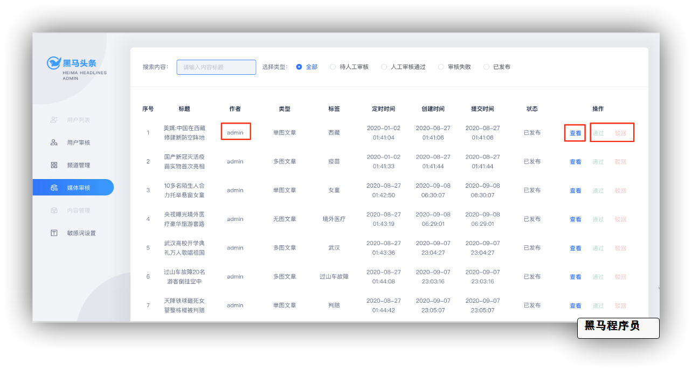

平台管理员可以查看待人工审核的文章信息，可以**通过（状态改为4）**或**驳回（状态改为2）**

也可以通过点击**查看**按钮，查看文章详细信息，查看详情后可以根据内容判断是否需要通过审核

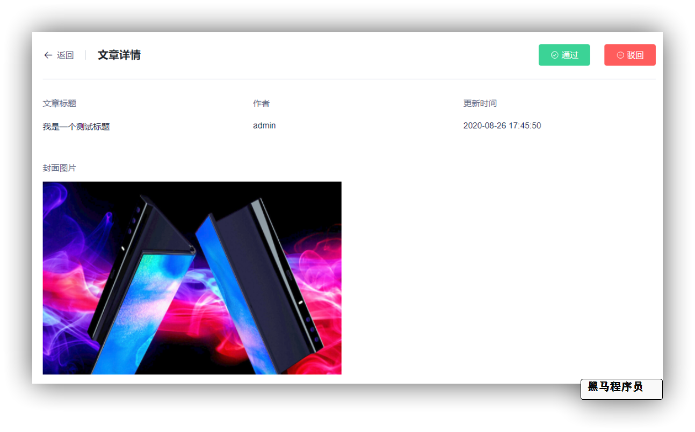

### 7.2）媒体审核功能实现

#### 7.2.1 查询文章列表

查询文章列表时候，不仅仅要返回文章数据，也要返回作者名称，这个时候返回的数据，需要包含作者名称

1. 需要使用wm_news表与wm_user表做关联查询

2. 在返回的结果的时候，单独再封装一个类，用于包装用户名称和文章数据 WmNewsVo

> **vo:view object 视图对象  是一个表现层对象，主要对应页面显示（web页面）的数据对象**

3. 由于需要做关联查询，mybatis-plus暂时不支持关联查询，需要自定义mapper实现
4. 查询全部时，要**排除草稿**状态文章


**WmNewsVo**

```java
package com.heima.model.wemedia.vos;
import com.heima.model.wemedia.pojos.WmNews;
import lombok.Data;
@Data
public class WmNewsVO  extends WmNews {
    /**
     * 作者名称
     */
    private String authorName;
}
```


（1）WmNewsController新增方法

```java
/**
     * 查询文章列表
     * @param dto
     * @return
     */
@PostMapping("/list_vo")
public ResponseResult findList(@RequestBody NewsAuthDto dto) {
    
}
```


NewsAuthDto

```java
package com.heima.model.wemedia.dtos;
import com.heima.model.common.dtos.PageRequestDTO;
import lombok.Data;
@Data
public class NewsAuthDTO extends PageRequestDTO {
    /**
     * 文章标题
     */
    private String title;
    /**
     * 状态
     */
    private Short status;
}
```


(2) mapper

在WmNewsMapper中定义两个方法

```java
package com.heima.wemedia.mapper;
import com.baomidou.mybatisplus.core.mapper.BaseMapper;
import com.heima.model.wemedia.dtos.NewsAuthDTO;
import com.heima.model.wemedia.pojos.WmNews;
import com.heima.model.wemedia.vos.WmNewsVO;
import feign.Param;
import java.util.List;
public interface WmNewsMapper extends BaseMapper<WmNews> {
    List<WmNewsVO> findListAndPage(@Param("dto") NewsAuthDTO dto);
    long findListCount(@Param("dto") NewsAuthDTO dto);
}
```

对应的映射文件

```java
<?xml version="1.0" encoding="UTF-8"?>
<!DOCTYPE mapper PUBLIC "-//mybatis.org//DTD Mapper 3.0//EN" "http://mybatis.org/dtd/mybatis-3-mapper.dtd">
<mapper namespace="com.heima.wemedia.mapper.WmNewsMapper">
  	
</mapper>
```

(3) 业务层

在WmNewsService中新增方法

```java
    /**
     * 查询文章列表
     * @param dto
     * @return
     */
    public ResponseResult findList(NewsAuthDTO dto);
```

实现方法

```java
自己写
```

（4）控制层

在WmNewsController中新增方法

```java
    /**
     * 查询文章列表
     * @param dto
     * @return
     * 1、按照创建时间降序
     * 2、后端查询的文章不应该包含草稿
     */
    @ApiOperation(value = "查询自媒体文章列表",notes = "返回值PageResponseResult 带作者信息，主要运营管理端调用")
    @PostMapping("/list_vo")
    public ResponseResult findList(@RequestBody NewsAuthDTO dto) {
        return wmNewsService.findList(dto);
    }
```

(5)在**admin**网关中添加自媒体的路由

```yaml
# 自媒体
- id: wemedia
  uri: lb://leadnews-wemedia
  predicates:
  - Path=/wemedia/**
  filters:
  - StripPrefix= 1
```

(6) 访问前端测试

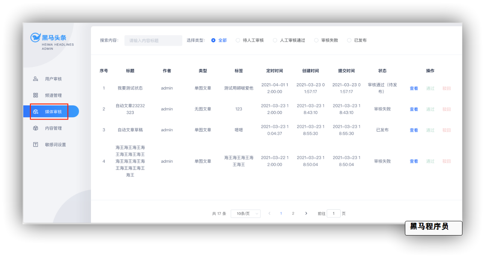

#### 7.2.2 查询文章详情

查询文章详情，是根据文章id查询，返回的vo对象

(1)在WmNewsController中新增方法

```java
/**
     * 查询文章详情
     * @param id
     * @return
     */
@GetMapping("/one_vo/{id}")
public ResponseResult findWmNewsVo(@PathVariable("id") Integer id) {
   
}
```

(2)mapper

使用mybatis-plus自带

(3) 业务层

在WmNewsService中新增方法

```java
 /**
     * 查询文章详情
     * @param id
     * @return
     */
public ResponseResult findWmNewsVo(Integer id) ;
```

实现类：

```java
自己写
```

（4）控制层

```java
    /**
     * 查询文章详情
     * @param id
     * @return
     */
    @ApiOperation(value = "查询自媒体文章详情",notes = "返回值带作者信息，主要运营管理端调用")
    @GetMapping("/one_vo/{id}")
    public ResponseResult findWmNewsVo(@PathVariable("id") Integer id) {
        return wmNewsService.findWmNewsVo(id);
    }
```

(5)打开页面测试

#### 7.2.3 修改文章

>当文章是人工审核的时候，可以进行审核
>
>审核成功，把文章状态改为4 
>
>审核失败，把文章状态改为2 给出失败原因

(1)在WmNewsController定义两个方法

```java
	/**
     * 文章审核成功
     * @param dto
     * @return
     */
    @ApiOperation("人工审核通过 状态:4")
    @PostMapping("/auth_pass")
    public ResponseResult authPass(@RequestBody NewsAuthDto dto) {

    }

    /**
     * 文章审核失败
     * @param dto
     * @return
     */
    @ApiOperation("人工审核失败 状态:2")
    @PostMapping("/auth_fail")
    public ResponseResult authFail(@RequestBody NewsAuthDto dto) {
    }
```

在NewsAuthDto新增两个参数，完整如下：

```java
package com.heima.model.wemedia.dtos;

import com.heima.model.common.dtos.PageRequestDTO;
import lombok.Data;

@Data
public class NewsAuthDTO extends PageRequestDTO {

    /**
     * 文章标题
     */
    private String title;
    /**
     * 状态
     */
    private Short status;
    /**
     * 文章id
     */
    private Integer id;

    /**
     * 失败原因
     */
    private String msg;
}
```

(2)mapper

无须定义

(3)业务层

在WmNewsService新增方法

```java
/**
     *  自媒体文章人工审核
     * @param status  2  审核失败  4 审核成功
     * @param dto
     * @return
     */
public ResponseResult updateStatus(Short status, NewsAuthDTO dto);
```

实现类

```java
自己写
```

（4）控制器

先在WemediaContants类中新增两个常量

```java
public static final Short WM_NEWS_AUTH_PASS = 4;
public static final Short WM_NEWS_AUTH_FAIL = 2;
```

在WmNewsController类中新增方法

```java
	/**
     * 文章审核成功
     * @param dto
     * @return
     */
    @ApiOperation("人工审核通过 状态:4")
    @PostMapping("/auth_pass")
    public ResponseResult authPass(@RequestBody NewsAuthDTO dto) {
        return wmNewsService.updateStatus(WemediaConstants.WM_NEWS_AUTH_PASS,dto);
    }
    /**
     * 文章审核失败
     * @param dto
     * @return
     */
    @ApiOperation("人工审核失败 状态:2")
    @PostMapping("/auth_fail")
    public ResponseResult authFail(@RequestBody NewsAuthDTO dto) {
        return wmNewsService.updateStatus(WemediaConstants.WM_NEWS_AUTH_FAIL,dto);
    }
```


**面试热点**:

**文章自动审核流程(业务说明，具体实现)**

**文章人工审核流程(业务说明)**

**阿里云内容安全服务介绍及使用**

**DFA算法介绍及使用**

**MQ介绍及常见应用场景**

**AMQP消息协议核心概念介绍** 

**RabbitMQ支持的消息模式**

**RabbitMQ如何保证高可用**

**RabbitMQ如何保证消息的可靠性(或 消息不丢失)**

- ​		**发送确认机制**  
- ​		**消息返还机制**
- ​		**持久化机制**
- ​        **消息确认机制**
- ​        **消息重试机制**

**如何保证消息避免重复消费(保证幂等性)**

**积压上百万消息如何快速消费**

