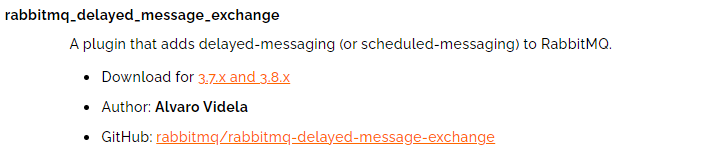
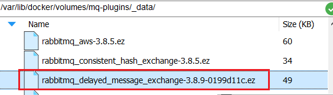

# RabbitMQ部署指南


# 1.单机部署

我们在Centos7虚拟机中使用Docker来安装。

## 1.1.下载镜像

方式一：在线拉取

``` sh
docker pull rabbitmq:3.8-management
```


方式二：从本地加载

在课前资料已经提供了镜像包：

 

上传到虚拟机中后，使用命令加载镜像即可：

```sh
docker load -i mq.tar
```


## 1.2.安装MQ

执行下面的命令来运行MQ容器：

```sh
docker run \
 -e RABBITMQ_DEFAULT_USER=itcast \
 -e RABBITMQ_DEFAULT_PASS=123321 \
 -v mq-plugins:/plugins \
 --name mq \
 --hostname mq \
 -p 15672:15672 \
 -p 5672:5672 \
 -d \
 rabbitmq:3.8-management
 
 docker run \
 -e RABBITMQ_DEFAULT_USER=itcast \
 -e RABBITMQ_DEFAULT_PASS=123321 \
 -v mq-plugins:/plugins \
 --name mq \
 --hostname mq \
 -p 15672:15672 \
 -p 5672:5672 \
 -d \
 rabbitmq:3.8-management
```

# 2.安装DelayExchange插件

官方的安装指南地址为：https://blog.rabbitmq.com/posts/2015/04/scheduling-messages-with-rabbitmq

上述文档是基于linux原生安装RabbitMQ，然后安装插件。


因为我们之前是基于Docker安装RabbitMQ，所以下面我们会讲解基于Docker来安装RabbitMQ插件。

## 2.1.下载插件

RabbitMQ有一个官方的插件社区，地址为：https://www.rabbitmq.com/community-plugins.html

其中包含各种各样的插件，包括我们要使用的DelayExchange插件：




大家可以去对应的GitHub页面下载3.8.9版本的插件，地址为https://github.com/rabbitmq/rabbitmq-delayed-message-exchange/releases/tag/3.8.9这个对应RabbitMQ的3.8.5以上版本。


课前资料也提供了下载好的插件：


## 2.2.上传插件

因为我们是基于Docker安装，所以需要先查看RabbitMQ的插件目录对应的数据卷。如果不是基于Docker的同学，请参考第一章部分，重新创建Docker容器。

我们之前设定的RabbitMQ的数据卷名称为`mq-plugins`，所以我们使用下面命令查看数据卷：

```sh
docker volume inspect mq-plugins
```

可以得到下面结果：


接下来，将插件上传到这个目录即可：




## 2.3.安装插件

最后就是安装了，需要进入MQ容器内部来执行安装。我的容器名为`mq`，所以执行下面命令：

```sh
docker exec -it mq bash
```

执行时，请将其中的 `-it` 后面的`mq`替换为你自己的容器名.

进入容器内部后，执行下面命令开启插件：

```sh
rabbitmq-plugins enable rabbitmq_delayed_message_exchange
```

结果如下：


