# 第6章 文章定时发布

## 今日目标

- 理解RabbitMQ死信队列原理
- 能够基于延时插件实现延时队列
- 能实现文章定时发布功能
- 能够完成文章上下架同步

## 1 文章发布功能

### 1.1 需求分析

现在我们的文章会通过两种审核途径被审核， 一种是自动审核 将状态改为 8通过  ， 一种是人工审核 将状态改为 4通过， 审核通过的文章需要发布，审核通过后还是会通过mq异步通知文章发布方法来发布文章。

而文章发布的本质：  **是基于wemedia库中的 wm_news表信息，  在article库中 保存 ap_article, ap_article_config,ap_article_content三张表的信息， 在将wm_news中的文章状态改为9** 即：文章发布成功

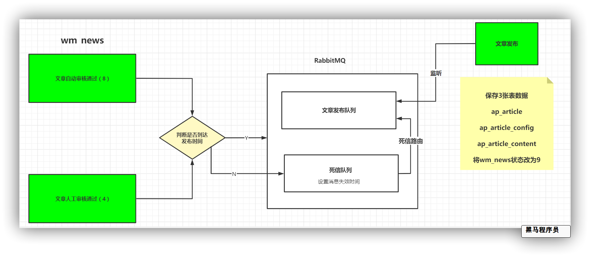


### 1.2 表结构介绍

发布功能一共涉及6张表 

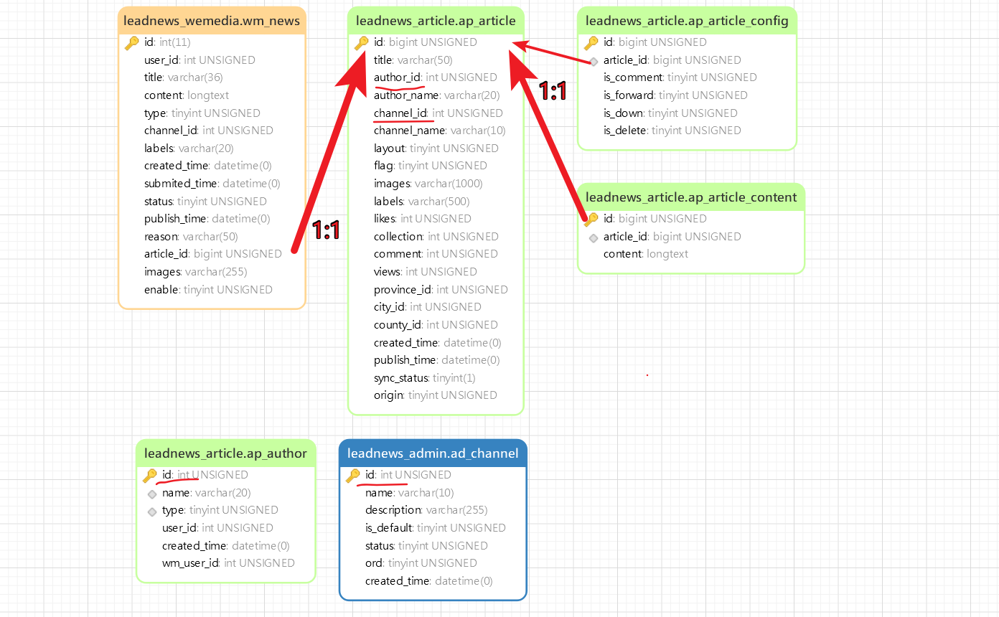

<font color="red">文章审核通过之后发布APP文章实质：把wm_news 数据保存到article数据库的三张表中。</font> 

（1）wm_news  自媒体文章表  在自媒体库


<font color='red'>status字段：0 草稿   1 待审核   2 审核失败   3 人工审核   4 人工审核通过   8 审核通过（待发布）  9 已发布</font>

（2）ap_author  文章作者表   在article库

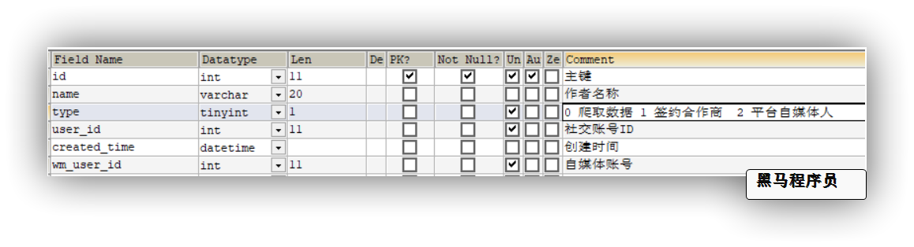

（3）ap_article_config   文章配置表  在article库


对应实体：

```java
package com.heima.model.article.pojos;

import com.baomidou.mybatisplus.annotation.IdType;
import com.baomidou.mybatisplus.annotation.TableField;
import com.baomidou.mybatisplus.annotation.TableId;
import com.baomidou.mybatisplus.annotation.TableName;
import lombok.Data;
/**
 * <p>
 * APP已发布文章配置表
 * </p>
 * @author itheima
 */

@Data
@TableName("ap_article_config")
public class ApArticleConfig {

    @TableId(value = "id",type = IdType.ID_WORKER)
    private Long id;

    /**
     * 文章id
     */
    @TableField("article_id")
    private Long articleId;

    /**
     * 是否可评论
     * true: 可以评论   1
     * false: 不可评论  0
     */
    @TableField("is_comment")
    private Boolean isComment;

    /**
     * 是否转发
     * true: 可以转发   1
     * false: 不可转发  0
     */
    @TableField("is_forward")
    private Boolean isForward;

    /**
     * 是否下架
     * true: 下架   1
     * false: 没有下架  0
     */
    @TableField("is_down")
    private Boolean isDown;

    /**
     * 是否已删除
     * true: 删除   1
     * false: 没有删除  0
     */
    @TableField("is_delete")
    private Boolean isDelete;
}
```

（4）ap_article  文章信息表   在article库

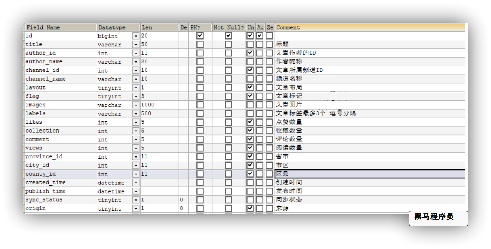

- layout 文章布局  0 无图文章   1 单图文章    2或3 多图文章

- flag  文章标记  0 普通文章   1 热点文章   2 置顶文章   3 精品文章   4 大V 文章

- images 文章图片  多张逗号分隔

对应实体

```java
package com.heima.model.article.pojos;

import com.baomidou.mybatisplus.annotation.IdType;
import com.baomidou.mybatisplus.annotation.TableField;
import com.baomidou.mybatisplus.annotation.TableId;
import com.baomidou.mybatisplus.annotation.TableName;
import com.fasterxml.jackson.databind.annotation.JsonSerialize;
import com.fasterxml.jackson.databind.ser.std.StringSerializer;
import com.fasterxml.jackson.databind.ser.std.ToStringSerializer;
import lombok.Data;

import java.util.Date;

/**
 * <p>
 * 文章信息表，存储已发布的文章
 * </p>
 *
 * @author itheima
 */

@Data
@TableName("ap_article")
public class ApArticle {

    @TableId(value = "id",type = IdType.ID_WORKER)
    @JsonSerialize(using = ToStringSerializer.class)
    private Long id;

    /**
     * 标题
     */
    private String title;

    /**
     * 作者id
     */
    @TableField("author_id")
    private Long authorId;

    /**
     * 作者名称
     */
    @TableField("author_name")
    private String authorName;

    /**
     * 频道id
     */
    @TableField("channel_id")
    private Integer channelId;

    /**
     * 频道名称
     */
    @TableField("channel_name")
    private String channelName;

    /**
     * 文章布局  0 无图文章   1 单图文章    2 多图文章
     */
    private Short layout;

    /**
     * 文章标记  0 普通文章   1 热点文章   2 置顶文章   3 精品文章   4 大V 文章
     */
    private Byte flag;

    /**
     * 文章封面图片 多张逗号分隔
     */
    private String images;

    /**
     * 标签
     */
    private String labels;

    /**
     * 点赞数量
     */
    private Integer likes;

    /**
     * 收藏数量
     */
    private Integer collection;

    /**
     * 评论数量
     */
    private Integer comment;

    /**
     * 阅读数量
     */
    private Integer views;

    /**
     * 省市
     */
    @TableField("province_id")
    private Integer provinceId;

    /**
     * 市区
     */
    @TableField("city_id")
    private Integer cityId;

    /**
     * 区县
     */
    @TableField("county_id")
    private Integer countyId;

    /**
     * 创建时间
     */
    @TableField("created_time")
    private Date createdTime;

    /**
     * 发布时间
     */
    @TableField("publish_time")
    private Date publishTime;

    /**
     * 同步状态
     */
    @TableField("sync_status")
    private Boolean syncStatus;

    /**
     * 来源
     */
    private Boolean origin;

	
	// 文章静态页 路径
    @TableField("static_url")
    private String staticUrl;
}
```

（5）ap_article_content  文章内容表 在article库

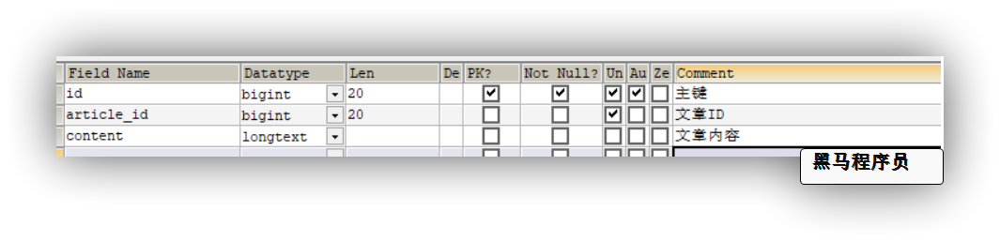

对应实体：

```java
package com.heima.model.article.pojos;

import com.baomidou.mybatisplus.annotation.IdType;
import com.baomidou.mybatisplus.annotation.TableField;
import com.baomidou.mybatisplus.annotation.TableId;
import com.baomidou.mybatisplus.annotation.TableName;
import lombok.Data;

@Data
@TableName("ap_article_content")
public class ApArticleContent {
    
    @TableId(value = "id",type = IdType.ID_WORKER)
    private Long id;

    /**
     * 文章id
     */
    @TableField("article_id")
    private Long articleId;

    /**
     * 文章内容
     */
    private String content;
}
```


**准备mapper 及 service**

需要把资料文件夹中的类拷贝到文章微服务下：

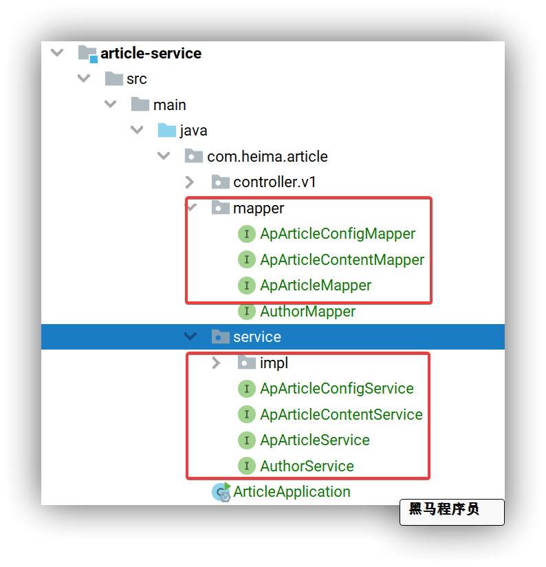


### 1.3  准备Feign接口

根据下面思路步骤:

需要提前准备feign接口

`wemedia服务:` 根据id查询自媒体文章     修改自媒体文章

`admin服务:`  根据频道id查询频道信息

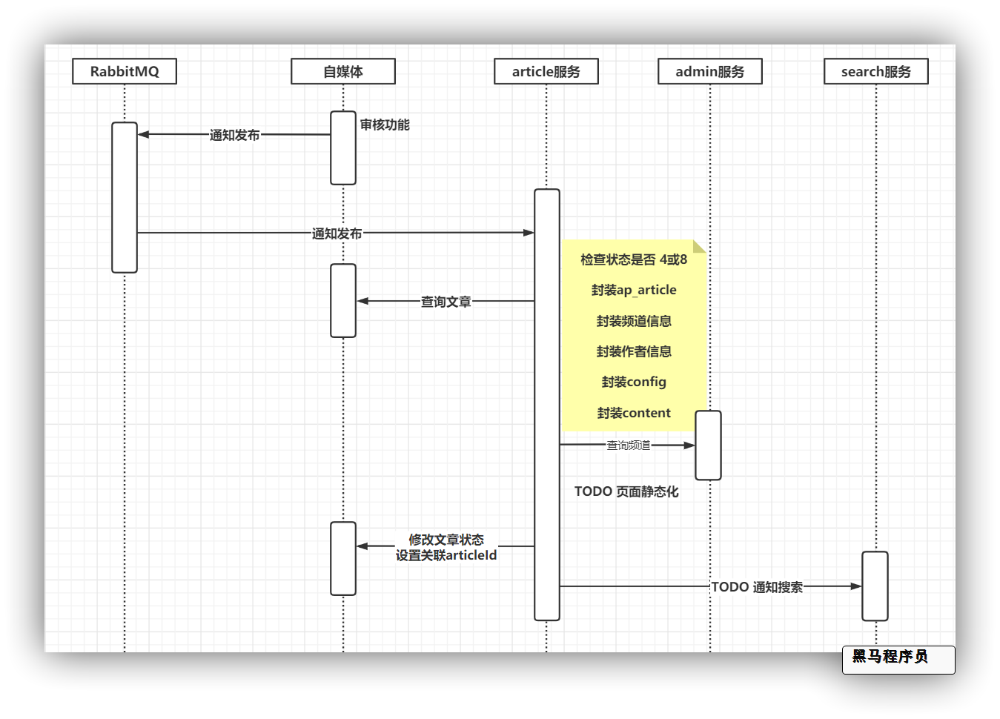

**wemedia服务接口准备**

`wemedia服务`  `WmNewsController` 新增web接口

```java
	/**
     * 修改文章
     * @param wmNews
     * @return
     */
    @ApiOperation("根据id修改自媒体文章")
    @PutMapping("/update")
    public ResponseResult updateWmNews(@RequestBody WmNews wmNews) {
        wmNewsService.updateById(wmNews);
        return ResponseResult.okResult();
    }
```


`WemediaFeign`新增接口

```java
@FeignClient(
        value = "leadnews-wemedia",
        fallbackFactory = WemediaFeignFallback.class,
        configuration = HeimaFeignAutoConfiguration.class
)
public interface WemediaFeign {
    @PostMapping("/api/v1/user/save")
    public ResponseResult<WmUser> save(@RequestBody WmUser wmUser);
    @GetMapping("/api/v1/user/findByName/{name}")
    public ResponseResult<WmUser> findByName(@PathVariable("name") String name);

    //===================== 新增接口  start ====================
    @GetMapping("/api/v1/news/one/{id}")
    public ResponseResult<WmNews> findWmNewsById(@PathVariable("id") Integer id);
    @PutMapping("/api/v1/news/update")
    ResponseResult updateWmNews(@RequestBody WmNews wmNews);
    //===================== 新增接口 end ====================
}
```

`WemediaFeign`服务降级增加降级方法

```java
@Component
@Slf4j
public class WemediaFeignFallback implements FallbackFactory<WemediaFeign> {
    @Override
    public WemediaFeign create(Throwable throwable) {
        return new WemediaFeign() {
            @Override
            public ResponseResult<WmUser> save(WmUser wmUser) {
                log.error("参数: {}",wmUser);
                log.error("自媒体 save 远程调用出错啦 ~~~ !!!! {} ",throwable.getMessage());
                return ResponseResult.errorResult(AppHttpCodeEnum.SERVER_ERROR);
            }
            @Override
            public ResponseResult<WmUser> findByName(String name) {
                log.error("参数: {}",name);
                log.error("自媒体 findByName 远程调用出错啦 ~~~ !!!! {} ",throwable.getMessage());
                return ResponseResult.errorResult(AppHttpCodeEnum.REMOTE_SERVER_ERROR);
            }

            @Override
            public ResponseResult<WmNews> findWmNewsById(Integer id) {
                log.error("参数: {}",id);
                log.error("自媒体 findWmNewsById 远程调用出错啦 ~~~ !!!! {} ",throwable.getMessage());
                return ResponseResult.errorResult(AppHttpCodeEnum.REMOTE_SERVER_ERROR);
            }

            @Override
            public ResponseResult updateWmNews(WmNews wmNews) {
                log.error("参数: {}",wmNews);
                log.error("自媒体 updateWmNews 远程调用出错啦 ~~~ !!!! {} ",throwable.getMessage());
                return ResponseResult.errorResult(AppHttpCodeEnum.REMOTE_SERVER_ERROR);
            }
        };
    }
}
```

**Admin服务接口准备**

`admin服务` `AdChannelController` 新增接口

```java
    @ApiOperation("根据id查询频道")
    @GetMapping("/one/{id}")
    public ResponseResult findOne(@PathVariable Integer id) {
        return ResponseResult.okResult(channelService.getById(id));
    }
```

`AdminFeign` 新增方法

```java
@FeignClient(value = "leadnews-admin",
        fallbackFactory = AdminFeignFallback.class,
        configuration = HeimaFeignAutoConfiguration.class
)
public interface AdminFeign {
    // 查询敏感词内容列表
    @PostMapping("/api/v1/sensitive/sensitives")
    public ResponseResult<List<String>> selectAllChannel();

    // ================新增接口方法  start ================
    @GetMapping("/api/v1/channel/one/{id}")
    public ResponseResult<AdChannel> findOne(@PathVariable Integer id);
    // ================新增接口方法  end ================
}
```

`AdminFeign` 新增服务降级方法

```java
@Slf4j
@Component
public class AdminFeignFallback implements FallbackFactory<AdminFeign> {
    @Override
    public AdminFeign create(Throwable throwable) {
        throwable.printStackTrace();
        return new AdminFeign() {
            @Override
            public ResponseResult<List<String>> sensitives() {
                log.error("AdminFeign sensitives 远程调用出错啦 ~~~ !!!! {} ",throwable.getMessage());
                return ResponseResult.errorResult(AppHttpCodeEnum.REMOTE_SERVER_ERROR);
            }

            @Override
            public ResponseResult findOne(Integer id) {
                log.info("参数: {}",id);
                log.error("AdminFeign findOne 远程调用出错啦 ~~~ !!!! {} ",throwable.getMessage());
                return ResponseResult.errorResult(AppHttpCodeEnum.REMOTE_SERVER_ERROR);
            }
        };
    }
}
```

### 1.4 文章发布功能实现

`ApArticleService` 接口新增发布文章方法

```java
public interface ApArticleService extends IService<ApArticle> {
    /**
     * 保存或修改文章
     * @param newsId 文章id
     * @return
     */
    public void publishArticle(Integer newsId);
}
```

`ApAricleServiceImpl` 新增实现

```java
@Service
@Slf4j
public class ApArticleServiceImpl extends ServiceImpl<ApArticleMapper, ApArticle> implements ApArticleService {
    @Autowired
    private WemediaFeign wemediaFeign;
    @Autowired
    private AdminFeign adminFeign;
    @Autowired
    private AuthorMapper authorMapper;
    @Autowired
    private ApArticleConfigMapper apArticleConfigMapper;
    @Autowired
    private ApArticleContentMapper apArticleContentMapper;
    
    @GlobalTransactional(rollbackFor = Exception.class,timeoutMills = 100000)
    @Override
    public void publishArticle(Integer newsId) {
        // 1. 查询并检查自媒体文章  wmNews
        WmNews wmNews = getWmNews(newsId);
        // 2. 封装 ApArticle
        ApArticle apArticle = getApArticle(wmNews);
        // 3. 保存或修改 article信息
        saveOrUpdateArticle(apArticle);
        // 4. 保存关联配置和内容信息
        saveConfigAndContent(wmNews, apArticle);
        // 5. TODO 文章页面静态化
        // 6. 更新 wmNews状态  改为9  并设置articleId
        updateWmNews(newsId, wmNews, apArticle);
        // 7. TODO 通知es索引库添加文章索引
    }

    /**
     * 查询自媒体文章
     * @param newsId
     * @return
     */
    private WmNews getWmNews(Integer newsId) {
        ResponseResult<WmNews> newsResult = wemediaFeign.findWmNewsById(newsId);
        if (!newsResult.checkCode()) {
            log.error("文章发布失败 远程调用自媒体文章接口失败  文章id: {}",newsId);
            CustException.cust(AppHttpCodeEnum.REMOTE_SERVER_ERROR,"远程调用自媒体文章接口失败");
        }
        WmNews wmNews = newsResult.getData();
        if(wmNews == null){
            log.error("文章发布失败 未获取到自媒体文章信息  文章id: {}",newsId);
            CustException.cust(AppHttpCodeEnum.DATA_NOT_EXIST,"未查询到自媒体文章");
        }
        // 判断状态是否为 4 或 8， 如果不是  不处理
        short status = wmNews.getStatus().shortValue();
        if(status!=WmNews.Status.ADMIN_SUCCESS.getCode() && status!=WmNews.Status.SUCCESS.getCode()){
            log.error("文章发布失败 文章状态不为 4 或 8， 不予发布 , 文章id : {}",newsId);
            CustException.cust(AppHttpCodeEnum.DATA_NOT_ALLOW,"自媒体文章状态错误");
        }
        return wmNews;
    }

    /**
     * 修改自媒体文章
     * @param newsId
     * @param wmNews
     * @param apArticle
     */
    private void updateWmNews(Integer newsId, WmNews wmNews, ApArticle apArticle) {
        wmNews.setStatus(WmNews.Status.PUBLISHED.getCode());
        wmNews.setArticleId(apArticle.getId());
        ResponseResult updateResult = wemediaFeign.updateWmNews(wmNews);
        if (!updateResult.checkCode()) {
            log.error("文章发布失败 远程调用修改文章接口失败， 不予发布 , 文章id : {} ",newsId);
            CustException.cust(AppHttpCodeEnum.REMOTE_SERVER_ERROR,"远程调用修改文章接口失败");
        }
    }

    /**
     * 保存 配置 和 内容信息
     * @param wmNews
     * @param apArticle
     */
    private void saveConfigAndContent(WmNews wmNews, ApArticle apArticle) {
        // 添加配置信息
        ApArticleConfig apArticleConfig = new ApArticleConfig();
        apArticleConfig.setArticleId(apArticle.getId());
        apArticleConfig.setIsComment(true);
        apArticleConfig.setIsForward(true);
        apArticleConfig.setIsDown(false);
        apArticleConfig.setIsDelete(false);
        apArticleConfigMapper.insert(apArticleConfig);
        // 添加文章详情
        ApArticleContent apArticleContent = new ApArticleContent();
        apArticleContent.setArticleId(apArticle.getId());
        apArticleContent.setContent(wmNews.getContent());
        apArticleContentMapper.insert(apArticleContent);
    }

    /**
     * 保存或修改文章信息
     * @param apArticle
     */
    private void saveOrUpdateArticle(ApArticle apArticle) {
        // 判断wmNews之前是否关联 articleId
        if(apArticle.getId() == null){
            // 无关联  新增 article
            // 保存文章
            apArticle.setCollection(0); // 收藏数
            apArticle.setLikes(0);// 点赞数
            apArticle.setComment(0);// 评论数
            apArticle.setViews(0); // 阅读数
            save(apArticle);
        }else {
            // 有关联  修改 article
            // 修改文章  删除之前关联的配置信息   内容信息
            ApArticle article = getById(apArticle.getId());
            if(article == null){
                CustException.cust(AppHttpCodeEnum.DATA_NOT_EXIST,"关联的文章不存在");
            }
            updateById(apArticle);
            apArticleConfigMapper.delete(Wrappers.<ApArticleConfig>lambdaQuery().eq(ApArticleConfig::getArticleId,apArticle.getId()));
            apArticleContentMapper.delete(Wrappers.<ApArticleContent>lambdaQuery().eq(ApArticleContent::getArticleId,apArticle.getId()));
        }
    }
    /**
     * 封装apArticle
     * @param wmNews
     * @return
     */
    private ApArticle getApArticle(WmNews wmNews) {
        ApArticle apArticle = new ApArticle();
        // 拷贝属性
        BeanUtils.copyProperties(wmNews,apArticle);
        apArticle.setId(wmNews.getArticleId());
        apArticle.setFlag((byte)0); // 普通文章
        apArticle.setLayout(wmNews.getType());// 布局
        // 远程查询频道信息
        ResponseResult<AdChannel> channelResult = adminFeign.findOne(wmNews.getChannelId());
        if (!channelResult.checkCode()) {
            log.error("文章发布失败 远程调用查询频道出现异常， 不予发布 , 文章id : {}  频道id : {}",wmNews.getId(),wmNews.getChannelId());
            CustException.cust(AppHttpCodeEnum.REMOTE_SERVER_ERROR,"远程调用查询频道出现异常");
        }
        AdChannel channel = channelResult.getData();
        if(channel == null){
            log.error("文章发布失败 未查询到相关频道信息， 不予发布 , 文章id : {}  频道id : {}",wmNews.getId(),wmNews.getChannelId());
            CustException.cust(AppHttpCodeEnum.DATA_NOT_EXIST,"未查询到相关频道信息");
        }
        apArticle.setChannelName(channel.getName());
        // 设置作者信息
        ApAuthor author = authorMapper.selectOne(Wrappers.<ApAuthor>lambdaQuery().eq(ApAuthor::getWmUserId, wmNews.getUserId()));
        if(author == null){
            log.error("文章发布失败 未查询到相关作者信息， 不予发布 , 文章id : {}  自媒体用户id : {}",wmNews.getId(),wmNews.getUserId());
            CustException.cust(AppHttpCodeEnum.DATA_NOT_EXIST,"根据自媒体用户，查询关联作者信息失败");
        }
        apArticle.setAuthorId(Long.valueOf(author.getId()));
        apArticle.setAuthorName(author.getName());
        return apArticle;
    }
}
```

### 1.5 测试发布

在article服务中，创建单元测试: 

测试审核通过的自媒体文章

查看三张表能否保存成功

```java
@SpringBootTest
@RunWith(SpringRunner.class)
public class ArticleTest {
    @Autowired
    ApArticleService apArticleService;
    @Test
    public void publishArticle(){
        apArticleService.publishArticle(6234);
    }
}
```


## 2 延时任务方案

### 2.1 需求分析

现在我们已经实现并测试了文章发布接口，发布功能需要在自动审核通过 或 人工审核通过后触发， 可以采用MQ异步通知发布接口

但是，文章不仅仅可以立即发布，还可以选择将来某一时刻。 

如： 当前时间 `2021-9-11 21:00:00`  , 文章发布时间: `2021-9-22 08:00:00`

那么审核通过的文章还不能立刻发布，得在11个小时后触发该任务


这种类型的场景在开发中也会经常遇到，这类的场景在开发叫做 `延时任务` 

- 订餐通知:下单成功后60s之后给用户发送短信通知。
- 当订单一直处于未支付状态时，如何及时的关闭订单，并退还库存？
- 如何定期检查处于退款状态的订单是否已经退款成功？
- 新创建店铺，N天内没有上传商品，系统如何知道该信息，并发送激活短信？

而解决这一类**延时任务**问题，一般都会通过**延迟队列**来解决

```
延时任务 和 定时任务
定时任务有明确的触发时间，延时任务没有
定时任务有执行周期，而延时任务在某事件触发后一段时间内执行，没有执行周期
定时任务一般执行的是批处理操作是多个任务，而延时任务一般是单个任务
```


### 2.2 延时任务解决方案

目前比较常见的方案包括：

- **定期轮询数据库**（延迟任务）

```
- 优点：实现简单，定时任务所在服务可以集群，保证了可靠性，高可用性。 
- 缺点：
  - 定时扫描频率过高数据库压力比较大，频率过低则实时性不能保证。
  - 高可用集群时需要保证多个扫描任务的线程安全，避免重复执行任务，可以利用分布式锁、乐观锁、保证接口幂等等各种方式来解决。
```

- **DelayQueue**

```
优点: 
- 不引入其他服务依赖，wait-notify机制，不做polling，不会浪费cpu。
- 时效性好
 缺点: 
- 数据保存在JVM内存中，当应用重启会造成数据丢失，或者数据量大时造成DelayQueue过大
- 当前JVM内有效，应用与单进程场景
```

- **定时任务（Quartz、xxljob）**

```
优点：
- 实现简单
- 实时性好，时差在可以接受的范围内
缺点：
- 需要开启较多的定时任务，当业务并发量大时会带来CPU的额外负担
```

- **Redis键过期通知**

```
优点：
- 高可用，redis集群具备高并发、高可用的特性
- 实时性，监听事件通知几乎是顺时的
- 支持消息删除
缺点：
- 大量键同一时间过期，对redis来说负载大
- 消息只会发送一次，没有确认机制，不能保证可靠性
- 持久性受限于Redis
- 需要注意消息广播后的并发安全问题
```

- **RabbitMQ 延时队列**

```
优点：
- 实现简单
- 可持久化
- 高可用集群
- 性能强
- 实时性好
缺点：
- 无法删除消息
- 如果是时间跨度非常大并且频率高的任务，不太适合
```


头条项目中，从性能、高可用、可靠性的角度来讲，我们选择RabbitMQ的解决方案


### 2.3 死信队列介绍

RabbitMQ本身并不支持延迟队列，不过我们可以利用其中的`Dead Letter Exchange`功能来实现延迟队列。

Dead Letter Exchanges 通常被人们叫做**死信队列**，我更喜欢称为**死信交换机**。那么问题来了，什么是死信？

参考官方网站：https://www.rabbitmq.com/dlx.html

首先来看死信的概念。

**死信**的英文是（Dead Letter），满足下列条件的消息被称为死信：

- 消费者使用basic.reject或 basic.nack声明消费失败，并且消息的requeue参数设置为false。意思就是这个消息没有消费者需要了。
- 消息是一个过期消息（TTL到期），到期可以是**消息本身超时或者队列的TTL超时**。
- 消息的长度超过了其被投递的队列最大限制

要实现延迟队列，我们肯定需要人为控制一个消息变为死信，因此我们一般采用上述的第二种方式：**让一个消息在一段时间后过期**，这种过期可以通过两种策略实现：

- 队列TTL：通过`x-message-ttl`属性给消息所在队列设置TTL（Time To Live），当队列中的消息存在时间超过TTL后就自动成为死信
- 消息TTL：消息的发送者在发送消息时，设置消息TTL属性。消息到达队列，TTL到期后成为死信、
- 如果一个消息具有TTL，同时所在队列也具备TTL，时间长度较小的会生效

由上面的概念可以知道，一个消息是不是死信，最终是由**消息所在的队列**来判断和处理的。当一个消息被判定为死信，它所在的队列会做怎样的处理呢？

队列会把**死信**交给提前指定的**死信交换机（Dead Letter Exchange）**。

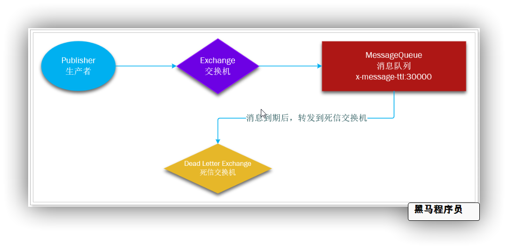

### 2.4 RabbitMQ延时插件

因为延迟队列的需求非常多，所以RabbitMQ的官方也推出了一个插件，原生支持延迟队列效果。

这个插件就是DelayExchange插件。参考RabbitMQ的插件列表页面：https://www.rabbitmq.com/community-plugins.html


使用方式可以参考官网地址：https://blog.rabbitmq.com/posts/2015/04/scheduling-messages-with-rabbitmq

相比 死信队列，延时对应可以更简单更高效的实现延时队列，因此黑马头条中的延时发布文章选用的是基于插件方式实现延时队列


**具体实现思路:**

1. 声明延时交换机`delay.direct`
2. 声明用于介绍发布文章消息的队列`publish.article.queue`
3. 绑定延时交换机 和 发布文章队列   路由key: `delay.publish.article`
4. 在自动审核通过 和 人工审核通过的方法中 加入发消息代码。
5. 根据当前时间计算出延时时间

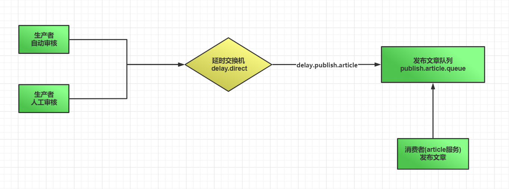


## 3 实现延时发布文章

### 3.1 声明交换机及队列

`com.heima.common.constants.message`包创建常量类`PublishArticleConstants` 

```java
/**
 * 发布文章相关常量
 **/
public class PublishArticleConstants {
    // 发布文章队列
    public static final String PUBLISH_ARTICLE_QUEUE = "publish.article.queue";
    // 通往发布文章队列的路由key
    public static final String PUBLISH_ARTICLE_ROUTE_KEY = "delay.publish.article";
    // 延时队列交换机
    public static final String DELAY_DIRECT_EXCHANGE = "delay.direct";
}
```

`wemedia服务` 添加声明交换机队列配置  `com.heima.wemedia.config.DeclarePubArticleRabbitConfig`

引入依赖

```xml
        <dependency>
            <groupId>org.springframework.boot</groupId>
            <artifactId>spring-boot-starter-amqp</artifactId>
        </dependency>
```


```java
package com.heima.wemedia.config;
import com.heima.common.constants.message.PublishArticleConstants;
import org.springframework.amqp.core.*;
import org.springframework.context.annotation.Bean;
import org.springframework.context.annotation.Configuration;
/**
 * 声明定时发布文章
 * 所需的 所有交换机  队列 及 绑定关系
 **/
@Configuration
public class DeclarePubArticleRabbitConfig {
    /**
     * 延时交换机
     * RabbitMQ需要安装延迟插件
     */
    @Bean
    public DirectExchange delayExchange(){
        return ExchangeBuilder.directExchange(PublishArticleConstants.DELAY_DIRECT_EXCHANGE)
                .delayed()
                .durable(true)
                .build();
    }
    /**
     * 声明发布文章队列
     * @return
     */
    @Bean
    public Queue publishArticleQueue(){
        return new Queue(PublishArticleConstants.PUBLISH_ARTICLE_QUEUE, true);
    }
    /**
     * 绑定 延迟交换机 + 发布文章队列
     * @return
     */
    @Bean
    public Binding bindingDeadQueue(){
        return BindingBuilder.bind(publishArticleQueue()).to(delayExchange()).with(PublishArticleConstants.PUBLISH_ARTICLE_ROUTE_KEY);
    }
}
```

### 3.2 改造wemedia审核业务

#### 3.2.1 改造思路

自动审核或人工审核成功后， 判断当前文章是否到达发布时间

如果到达直接将消息发送到  发布文章队列

如果未到达，计算距离文章发布时间的毫秒值

将消息发送到死信队列，并设置失效时间


#### 3.2.2 自动审核方法改造

`WmNewsAutoScanServiceImpl`类 注入`RabbitTemplate`

`WmNewsAutoScanServiceImpl` 类中`autoScanWmNews`添加通知代码

```java
			//5. 通知定时发布文章
            // 发布时间
            long publishTime = wmNews.getPublishTime().getTime();
            // 当前时间
            long nowTime = new Date().getTime();
            long remainTime = publishTime - nowTime;
            // 发布文章
            rabbitTemplate.convertAndSend(PublishArticleConstants.DELAY_DIRECT_EXCHANGE
                    , PublishArticleConstants.PUBLISH_ARTICLE_ROUTE_KEY
                    , wmNews.getId()
                    , (message)->{                              // 延时消息 必设置
                        message.getMessageProperties().setHeader("x-delay",remainTime<=0?0:remainTime);
                        return message;
                    }
            );
            log.info("立即发布文章通知成功发送，文章id : {}", wmNews.getId());
```

#### 3.2.3 人工审核方法改造

`WmNewsServiceImpl`中`updateStatus`添加方法

```java
			//5. 通知定时发布文章
            // 发布时间
            long publishTime = wmNews.getPublishTime().getTime();
            // 当前时间
            long nowTime = new Date().getTime();
            long remainTime = publishTime - nowTime;
            // 发布文章
            rabbitTemplate.convertAndSend(PublishArticleConstants.DELAY_DIRECT_EXCHANGE
                    , PublishArticleConstants.PUBLISH_ARTICLE_ROUTE_KEY
                    , wmNews.getId()
                    , (message)->{                              // 延时消息 必设置
                        message.getMessageProperties().setHeader("x-delay",remainTime<=0?0:remainTime);
                        return message;
                    }
            );
            log.info("立即发布文章通知成功发送，文章id : {}", wmNews.getId());
```


### 3.3 改造article发布文章业务

#### 3.3.1 思路分析

发布文章功能在article微服务中已经实现， 只需要整合RabbitMQ的消费者，监听发布文章队列，监听到消息后调用发布文章方法

#### 3.3.2 article整合Rabbit

引入rabbitmq依赖

```xml
		<!--AMQP依赖，包含RabbitMQ-->
        <dependency>
            <groupId>org.springframework.boot</groupId>
            <artifactId>spring-boot-starter-amqp</artifactId>
        </dependency>
```

引入rabbitConfig配置`config.RabbitConfig`

```java
/**
 * InitializingBean: springbean生命周期接口  代表完成bean装配后 执行的初始化方法
 * 这个类的目的：
 *     设置rabbitmq消息序列化机制  （默认jdk效率差）
 *     设置rabbitmq消息发送确认 回调
 *     设置rabbitmq消息返还 回调
 */
@Configuration
@Slf4j
public class RabbitConfig implements InitializingBean {
    @Autowired
    RabbitTemplate rabbitTemplate;
    @Override
    public void afterPropertiesSet()  {
        log.info("初始化rabbitMQ配置 ");
        // 设置消息转换器
        rabbitTemplate.setMessageConverter(new Jackson2JsonMessageConverter());
        // 设置发送确认 回调方法
        rabbitTemplate.setConfirmCallback(new RabbitTemplate.ConfirmCallback() {
            /**
             * @param correlationData 对比数据
             * @param ack  是否成功发送到mq exchange
             * @param cause  原因
             */
            @Override
            public void confirm(CorrelationData correlationData, boolean ack, String cause) {
                if (!ack){
                    // TODO 可扩展自动重试
                    log.error("发送消息到mq失败  ，原因: {}",cause);
                }
            }
        });
        // 设置消息返还 回调方法
        rabbitTemplate.setReturnCallback(new RabbitTemplate.ReturnCallback() {
            /**
             * @param message  消息内容
             * @param replyCode  回复状态
             * @param replyText  回复文本提示
             * @param exchange   交换机
             * @param routingKey   路由
             */
            @Override
            public void returnedMessage(Message message, int replyCode, String replyText, String exchange, String routingKey) {
                // TODO 可扩展自动重试
                log.error("消息返还回调触发  ，交换机: {} , 路由: {} , 消息内容: {} , 原因: {}  ",exchange,routingKey,message,replyText);
            }
        });
    }
}
```

在**nacos**配置中心，创建`share-rabbit.yml` 共享配置

```yml
spring:
  rabbitmq:
    host: ${spring.profiles.ip}
    port: 5672
    username: itcast
    password: 123321
    publisher-confirm-type: correlated  # 开启确认机制回调 必须配置这个才会确认回调
    publisher-returns: true # 开启return机制回调
    listener:
      simple:
        # acknowledge-mode: manual #手动确认
        acknowledge-mode: auto #自动确认    manual #手动确认
        # 重试策略相关配置
        retry:
          enabled: true # 是否开启重试功能
          max-attempts: 5 # 最大重试次数
          # 时间策略乘数因子   0  1  2  4  8
          # 时间策略乘数因子
          multiplier: 2.0
          initial-interval: 1000ms # 第一次调用后的等待时间
          max-interval: 20000ms # 最大等待的时间值
```

`article服务`及`wemedia服务`的`bootstrap.yml`添加共享配置

```yml
spring:
  application:
    name: leadnews-article # 服务名称
  profiles:
    active: dev # 开发环境配置
    ip: 192.168.200.130  # 环境ip地址
  cloud:
    nacos:
      discovery: # 注册中心地址配置
        server-addr: ${spring.profiles.ip}:8848
        namespace: ${spring.profiles.active}
      config: # 配置中心地址配置
        server-addr: ${spring.profiles.ip}:8848
        namespace: ${spring.profiles.active}
        file-extension: yml # data-id 后缀
        name: ${spring.application.name} # data-id名称
        shared-configs: # 共享配置
          - data-id: share-feign.yml # 配置文件名-Data Id
            group: DEFAULT_GROUP   # 默认为DEFAULT_GROUP
            refresh: false   # 是否动态刷新，默认为false
          - data-id: share-seata.yml # 配置文件名-Data Id
            group: DEFAULT_GROUP   # 默认为DEFAULT_GROUP
            refresh: false   # 是否动态刷新，默认为fals
          - data-id: share-rabbit.yml # 配置文件名-Data Id
            group: DEFAULT_GROUP   # 默认为DEFAULT_GROUP
            refresh: false   # 是否动态刷新，默认为false
```

#### 3.3.3 发布文章消息监听

`article服务`新增监听`listen.PublishArticleListener`

```java
@Component
@Slf4j
public class PublishArticleListener {
    @Autowired
    ApArticleService apArticleService;
    @RabbitListener(queuesToDeclare = {@Queue(value = PublishArticleConstants.PUBLISH_ARTICLE_QUEUE)})
    public void publishArticle(String newsId){
        log.info("接收到发布文章通知， 待发布文章id: {} , 当前时间: {}",newsId, LocalDateTime.now().toString());
        try {
            apArticleService.publishArticle(Integer.valueOf(newsId));
            log.info("发布文章通知处理完毕  文章发布成功");
        } catch (Exception e) {
            e.printStackTrace();
            log.error("发布文章通知处理失败， 文章未能成功发布 文章id: {} , 失败原因:{}",newsId,e.getMessage());
        }
    }
}
```

### 3.4 综合测试

启动: 运营管理前端、自媒体前端、及当前所有微服务

登录自媒体端，发表文章并设置发布时间此刻发布   等待自动审核  注意观察自动审核通过后是否发送 发布消息

登录自媒体端，发表文章并设置发布时间大于当前时间    等待自动审核  注意观察自动审核通过后是否发送 发布消息

登录运营管理端，通过人工审核方式审核文章    注意观察自动审核通过后是否发送 发布消息


**注意:**  **ap_author** 的演示数据未关联 **wm_user**

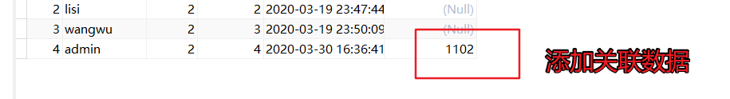


## 4 完善自媒体文章上下架

### 4.1 思路分析

在自媒体文章管理中有文章上下架的操作，上下架是文章已经审核通过发布之后的文章，目前自动审核文章和人工审核文章都已完成，可以把之前代码补充，使用异步的方式，修改app端文章的**配置信息**即可。

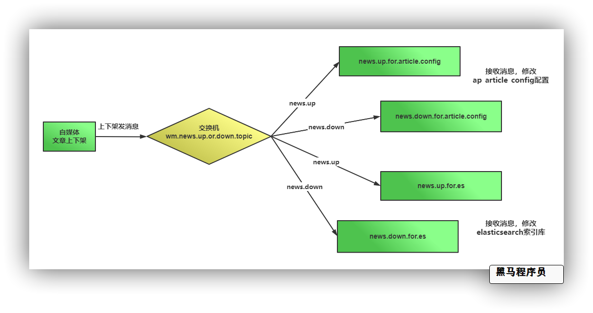

### 4.2 声明交换机及队列

创建常量类`NewsUpOrDownConstants`

```java
package com.heima.common.constants.message;
public class NewsUpOrDownConstants {
    public static final String NEWS_UP_OR_DOWN_EXCHANGE = "wm.news.up.or.down.topic";

    public static final String NEWS_UP_FOR_ARTICLE_CONFIG_QUEUE = "news.up.for.article.config.queue";
    public static final String NEWS_UP_FOR_ES_QUEUE = "news.up.for.es.queue";

    public static final String NEWS_DOWN_FOR_ES_QUEUE = "news.down.for.es.queue";
    public static final String NEWS_DOWN_FOR_ARTICLE_CONFIG_QUEUE = "news.down.for.article.config.queue";

    public static final String NEWS_UP_ROUTE_KEY = "news.up";
    public static final String NEWS_DOWN_ROUTE_KEY = "news.down";
}
```

`wemedia服务`中添加声明交换机队列配置 `com.heima.wemedia.config.DeclareUpOrDownRabbitConfig`

```JAVA
package com.heima.wemedia.config;
import com.heima.common.constants.message.NewsUpOrDownConstants;
import org.springframework.amqp.core.Binding;
import org.springframework.amqp.core.BindingBuilder;
import org.springframework.amqp.core.Queue;
import org.springframework.amqp.core.TopicExchange;
import org.springframework.context.annotation.Bean;
import org.springframework.context.annotation.Configuration;
/**
 * 文章上下架  相关交换机 及 队列
 **/
@Configuration
public class DeclareUpOrDownRabbitConfig {
    // ======================= 文章上下架 相关交换机及队列  START =========================
    @Bean
    public TopicExchange newsUpOrDownTopicExchange(){
        return new TopicExchange(NewsUpOrDownConstants.NEWS_UP_OR_DOWN_EXCHANGE, true, false);
    }
    @Bean
    public Queue newsUpForArticleConfig(){
        return new Queue(NewsUpOrDownConstants.NEWS_UP_FOR_ARTICLE_CONFIG_QUEUE, true);
    }
    @Bean
    public Queue newsUpForES(){
        return new Queue(NewsUpOrDownConstants.NEWS_UP_FOR_ES_QUEUE, true);
    }
    @Bean
    public Queue newsDownForArticleConfig(){
        return new Queue(NewsUpOrDownConstants.NEWS_DOWN_FOR_ARTICLE_CONFIG_QUEUE, true);
    }
    @Bean
    public Queue newsDownForES(){
        return new Queue(NewsUpOrDownConstants.NEWS_DOWN_FOR_ES_QUEUE, true);
    }
    @Bean
    public Binding bindingNewsUpForES(){
        return BindingBuilder.bind(newsUpForES()).to(newsUpOrDownTopicExchange()).with(NewsUpOrDownConstants.NEWS_UP_ROUTE_KEY);
    }
    @Bean
    public Binding bindingNewsUpForArticleConfig(){
        return BindingBuilder.bind(newsUpForArticleConfig()).to(newsUpOrDownTopicExchange()).with(NewsUpOrDownConstants.NEWS_UP_ROUTE_KEY);
    }
    @Bean
    public Binding bindingNewsDownForES(){
        return BindingBuilder.bind(newsDownForES()).to(newsUpOrDownTopicExchange()).with(NewsUpOrDownConstants.NEWS_DOWN_ROUTE_KEY);
    }
    @Bean
    public Binding bindingNewsDownForArticleConfig(){
        return BindingBuilder.bind(newsDownForArticleConfig()).to(newsUpOrDownTopicExchange()).with(NewsUpOrDownConstants.NEWS_DOWN_ROUTE_KEY);
    }
    // =======================  文章上下架 相关交换机及队列   END  =========================
}

```


### 4.3 wemedia服务-消息生产方

发消息通知下架文章

修改`WmNewsServiceImpl`中的`downOrUp`方法，发送消息

```java
	@Override
    public ResponseResult downOrUp(WmNewsDTO dto) {
        //1.检查参数
        //2.查询文章
        //3.判断文章是否发布
        //4.修改文章状态，同步到app端（后期做）TODO
        //5. 上下架发送消息通知  用于同步article 及 elasticsearch
        //5. 上下架发送消息通知  用于同步article 及 elasticsearch
        if (wmNews.getArticleId()!=null) {
            if(enable.equals(WemediaConstants.WM_NEWS_UP)){
                // 上架消息
                rabbitTemplate.convertAndSend(NewsUpOrDownConstants.NEWS_UP_OR_DOWN_EXCHANGE,
                        NewsUpOrDownConstants.NEWS_UP_ROUTE_KEY,wmNews.getArticleId());
            }else {
                // 下架消息
                rabbitTemplate.convertAndSend(NewsUpOrDownConstants.NEWS_UP_OR_DOWN_EXCHANGE,
                        NewsUpOrDownConstants.NEWS_DOWN_ROUTE_KEY,wmNews.getArticleId());
            }
        }
        return ResponseResult.okResult(AppHttpCodeEnum.SUCCESS);
    }
```

### 4.4 article服务-消息消费方

`article服务`创建监听`ArticleUpOrDownListener`

```java
@Component
@Slf4j
public class ArticleUpOrDownListener {
    @Autowired
    private ApArticleConfigService apArticleConfigService;
    @RabbitListener(queuesToDeclare = {
            @Queue(value = NewsUpOrDownConstants.NEWS_UP_FOR_ARTICLE_CONFIG_QUEUE)
    })
    public void newsUpHandler(String articleId) {
        log.info("接收到自媒体文章上架消息, 文章id: {}",articleId);
        // 当前消息路由
        try {
            apArticleConfigService.update(Wrappers.<ApArticleConfig>lambdaUpdate()
                    .set(ApArticleConfig::getIsDown,false)
                    .eq(ApArticleConfig::getArticleId,Long.valueOf(articleId)));
            // 手动确认
        } catch (Exception e) {
            e.printStackTrace();
            log.error("article处理 自媒体文章上架消息 失败, 文章id: {}   原因: {}",articleId,e.getMessage());
        }
    }
    @RabbitListener(queuesToDeclare = {
            @Queue(value = NewsUpOrDownConstants.NEWS_DOWN_FOR_ARTICLE_CONFIG_QUEUE)
    })
    public void newsDownHandler(String articleId) {
        log.info("接收到自媒体文章下架消息, 文章id: {}");
        // 当前消息路由
        try {
            apArticleConfigService.update(Wrappers.<ApArticleConfig>lambdaUpdate()
                    .set(ApArticleConfig::getIsDown,true)
                    .eq(ApArticleConfig::getArticleId,Long.valueOf(articleId)));
        } catch (Exception e) {
            e.printStackTrace();
            log.error("article处理 自媒体文章下架消息 失败, 文章id: {}   原因: {}",articleId,e.getMessage());
        }
    }
}
```

### 4.4 综合测试

启动相关服务，及自媒体前端


在前端对文章进行上下架处理

​		观察消息是否发送成功

​		观察对应ap_article_config表上下架字段是否对应产生变化


**面试热点**

**文章定时发布流程**

**RabbitMQ实现延时队列方案**

**项目中RabbitMQ的使用场景说明**

**自媒体文章上下架功能**


