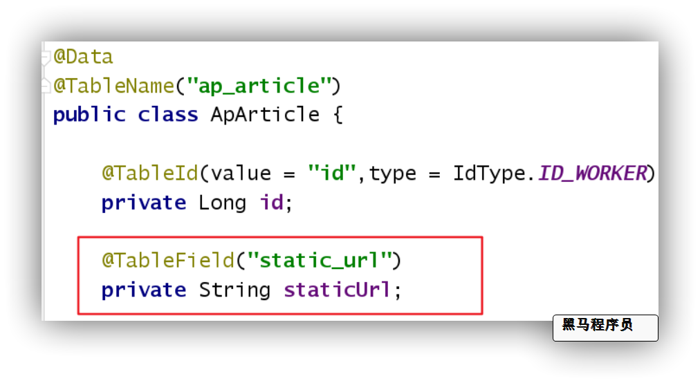
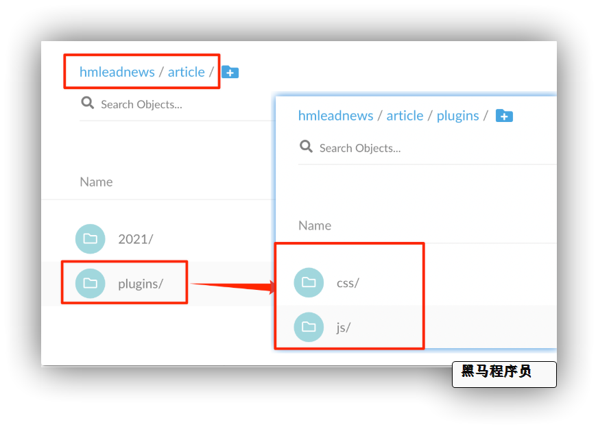
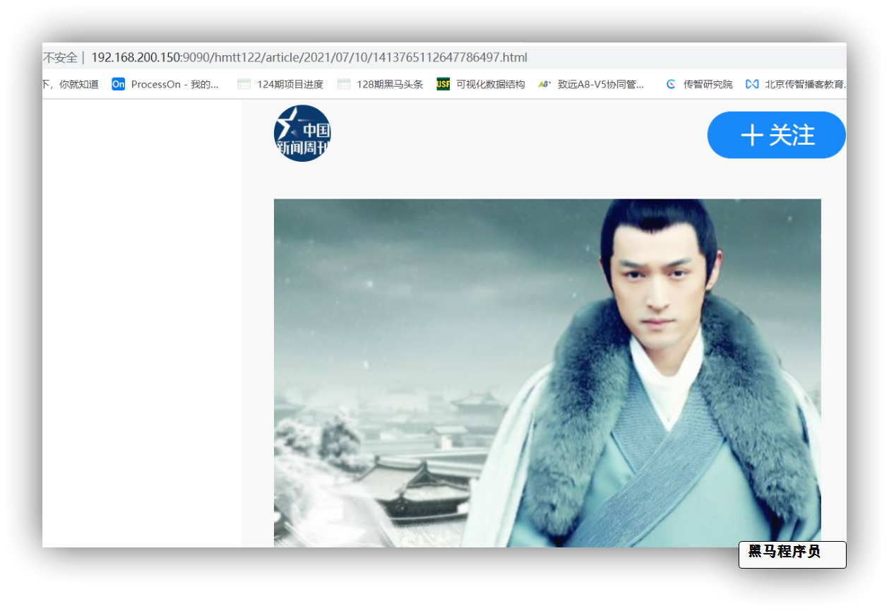

## 5 文章详情页面静态化

### 5.1 需求分析

当在文章列表页面上点击文章，会进入文章详情页面

### 5.2 实现方案

#### 5.2.1 基于数据库查询方案

用户某一条文章，根据文章的id去查询文章内容表，返回渲染页面


优点：

* 实现简单
* 保证数据强一致性

缺点：

* 无法支撑高并发


#### 5.2.2 页面静态化方案


优点：

* 支撑高并发，高可用
* 页面响应快，用户体验好

缺点：

* 强一致性较弱，但能够保证最终一致性


### 5.3 前置知识点

#### 5.3.1 模板引擎 freemarker

资料中 freemarker资料学习

#### 5.3.2 分布式文件存储 minIO

资料中 minIO 资料学习

### 5.3 静态页面生成

#### 5.3.1 修改apArticle实体类及表

**添加用于存储静态页url字段**


**修改实体类**



```java
@TableField("static_url")
private String staticUrl;
```


#### 5.3.2 article微服务集成文件存储

修改pom依赖

```xml
<dependencies>
    	<!-- 文件存储 starter 依赖 -->
        <dependency>
            <groupId>com.heima</groupId>
            <artifactId>heima-file-spring-boot-starter</artifactId>
            <version>1.0-SNAPSHOT</version>
        </dependency>
    	<!-- 模板引擎 starter 依赖 -->
        <dependency>
            <groupId>org.springframework.boot</groupId>
            <artifactId>spring-boot-starter-freemarker</artifactId>
        </dependency>
        <!--AMQP依赖，包含RabbitMQ-->
        <dependency>
            <groupId>org.springframework.boot</groupId>
            <artifactId>spring-boot-starter-amqp</artifactId>
        </dependency>
        <!--seata-->
        <dependency>
            <groupId>com.alibaba.cloud</groupId>
            <artifactId>spring-cloud-starter-alibaba-seata</artifactId>
            <exclusions>
                <!--版本较低，1.3.0，因此排除-->
                <exclusion>
                    <artifactId>seata-spring-boot-starter</artifactId>
                    <groupId>io.seata</groupId>
                </exclusion>
            </exclusions>
        </dependency>
        <dependency>
            <groupId>io.seata</groupId>
            <artifactId>seata-spring-boot-starter</artifactId>
            <!--seata starter 采用1.4.2版本-->
            <version>${seata.version}</version>
        </dependency>
    </dependencies>
```

**修改bootstrap.yml  新增文件存储共享配置**

```yml
          - data-id: share-file.yml
            group: DEFAULT_GROUP
            refresh: false
```

**修改nacos配置中心` leadnews-article.yml`配置**

```yml
server:
  port: 9003
spring:
  datasource:
    driver-class-name: com.mysql.jdbc.Driver
    url: jdbc:mysql://${spring.profiles.ip}:3306/leadnews_article?useUnicode=true&useSSL=false&characterEncoding=UTF-8&serverTimezone=UTC
    username: root
    password: root
  freemarker:
    cache: false  #关闭模板缓存，方便测试
    settings:
      template_update_delay: 0 #检查模板更新延迟时间，设置为0表示立即检查，如果时间大于0会有缓存不方便进行模板测试
    suffix: .ftl               #指定Freemarker模板文件的后缀名
    template-loader-path: classpath:/templates/
    #  ===============新增依赖 end ===================
# 设置Mapper接口所对应的XML文件位置，如果你在Mapper接口中有自定义方法，需要进行该配置
mybatis-plus:
  mapper-locations: classpath*:mapper/*.xml
  # 设置别名包扫描路径，通过该属性可以给包中的类注册别名
  type-aliases-package: com.heima.model.admin.pojos
```

**导入资料中 文章freemarker模板**


**模板上需要的内容:**   

​		文章作者对应的apUserId

​		文章apArticle信息

​		文章内容ApArticleContent信息


#### **5.3.3 基于freemarker生成静态页**

**静态页service**

```java
package com.heima.article.service;
import com.heima.model.article.pojos.ApArticle;
public interface GeneratePageService {
    /**
     * 生成文章静态页
     */
    void generateArticlePage(String content, ApArticle apArticle);
}
```


```java
package com.heima.article.service.impl;
import com.alibaba.fastjson.JSONArray;
import com.heima.article.mapper.ApArticleMapper;
import com.heima.article.mapper.AuthorMapper;
import com.heima.article.service.GeneratePageService;
import com.heima.file.service.FileStorageService;
import com.heima.model.article.pojos.ApArticle;
import com.heima.model.article.pojos.ApAuthor;
import freemarker.template.Configuration;
import freemarker.template.Template;
import lombok.extern.slf4j.Slf4j;
import org.springframework.beans.factory.annotation.Autowired;
import org.springframework.beans.factory.annotation.Value;
import org.springframework.stereotype.Service;
import javax.annotation.Resource;
import java.io.ByteArrayInputStream;
import java.io.InputStream;
import java.io.StringWriter;
import java.util.HashMap;
import java.util.Map;
@Service
@Slf4j
public class GeneratePageServiceImpl implements GeneratePageService {
    @Autowired
    private Configuration configuration;
    @Resource(name = "minIOFileStorageService")
    private FileStorageService fileStorageService;
    @Value("${file.minio.prefix}")
    private String prefix;
    @Autowired
    ApArticleMapper apArticleMapper;
    @Autowired
    AuthorMapper authorMapper;
    /**
     * 生成文章静态页面
     */
    @Override
    public void generateArticlePage(String content, ApArticle apArticle) {
        //1.获取文章内容
        try {
            //2. 模板
            Template template = configuration.getTemplate("article.ftl");
            //3. 数据
            Map<String, Object> params = new HashMap<>();
            params.put("content", JSONArray.parseArray(content));// 文章详情
            params.put("article", apArticle); // 文章信息
            ApAuthor author = authorMapper.selectById(apArticle.getAuthorId());
            params.put("authorApUserId", author.getUserId());// 作者 对应的 apUserId
            StringWriter out = new StringWriter();
            template.process(params, out);
            InputStream is = new ByteArrayInputStream(out.toString().getBytes());
            //4.生成页面把html文件上传到minio中
            String path = fileStorageService.store(prefix, apArticle.getId() + ".html", "text/html", is);
            //5.修改ap_article表，保存static_url字段
            apArticle.setStaticUrl(path);
            apArticleMapper.updateById(apArticle);
            log.info("文章详情静态页生成成功 staticUrl=====> {}", path);
        } catch (Exception e) {
            e.printStackTrace();
            log.error("文章详情静态页生成失败=====>articleId : {}    ========> {}", apArticle.getId(), e.getCause());
        }
    }
}
```

**新增文章时生成静态页方法**

```java
package com.heima.article.service.impl;
@Slf4j
@Service
public class ApArticleServiceImpl extends ServiceImpl<ApArticleMapper, ApArticle> implements ApArticleService {
// -----------------前面代码省略------------------------------------
    @Autowired
    GeneratePageService generatePageService;
    /**
     * 保存app文章
     * @param articleDto
     * @return
     */
    @Override
    public ResponseResult saveArticle(ArticleDto articleDto) {
		// -----------------前面代码省略------------------------------------
        //返回文章ID
        generatePageService.generateArticlePage(wmNews.getContent(),apArticle);
        return ResponseResult.okResult(apArticle.getId());
    }
}
```

加载文章列表时 添加静态资源访问前缀路径

```java
	@Value("${file.minio.readPath}")
    String readPath;
    /**
     * 根据参数加载文章列表
     * @param loadtype 1为加载更多  2为加载最新
     * @param dto
     * @return
     */
    @Override
    public ResponseResult load(Short loadtype, ArticleHomeDTO dto) {
        //1 参数检查
        //2 执行查询
        List<ApArticle> articleList = apArticleMapper.loadArticleList(dto, loadtype);
        // 添加静态页面访问前缀  ===============新增代码=================
        for (ApArticle apArticle : articleList) {
            apArticle.setStaticUrl(readPath + apArticle.getStaticUrl());
        }
        //3 返回结果
        ResponseResult result = ResponseResult.okResult(articleList);
        return result;
    }
```

#### 5.3.4 前后端集成测试

**测试动作：在自媒体前端进行发布文章**

**结果：**

1. 审核成功后，app端的article相关数据是否可以正常插入
2. 审核成功或失败后，wm_news表中的状态是否改变，成功和失败原因正常插入
3. 如果文章审核成功是否可以正常生成静态页面并上传到MinIO

**访问生成后的静态文件：**

资料中找到**plugins**文件夹 手动上传到**MinIO article**文件夹下




**测试静态页能否访问**



