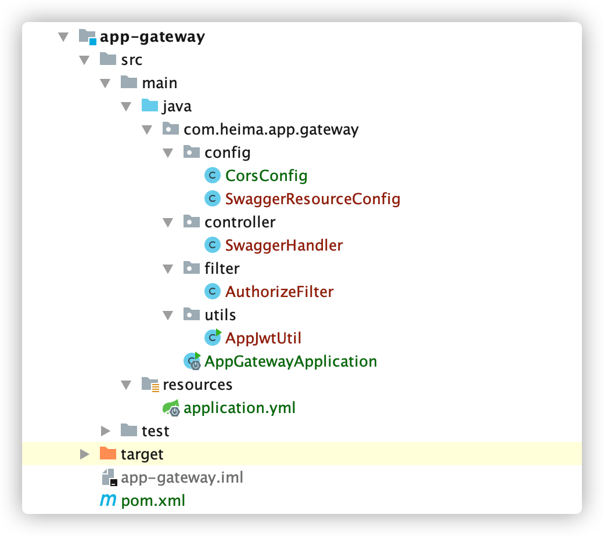
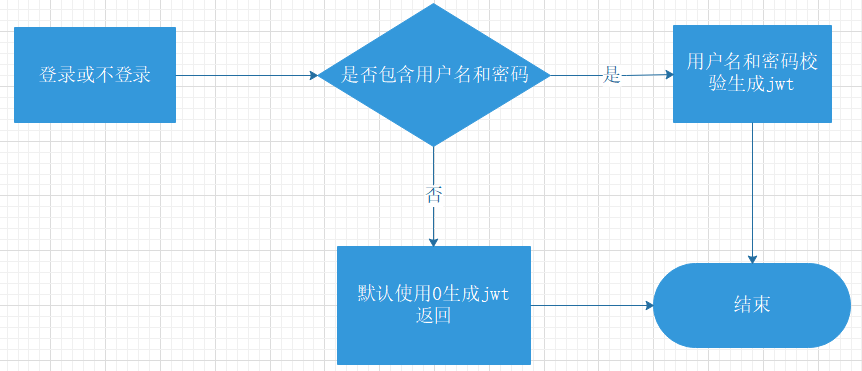
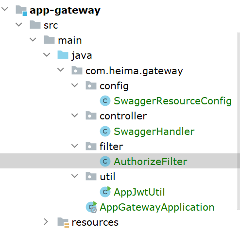
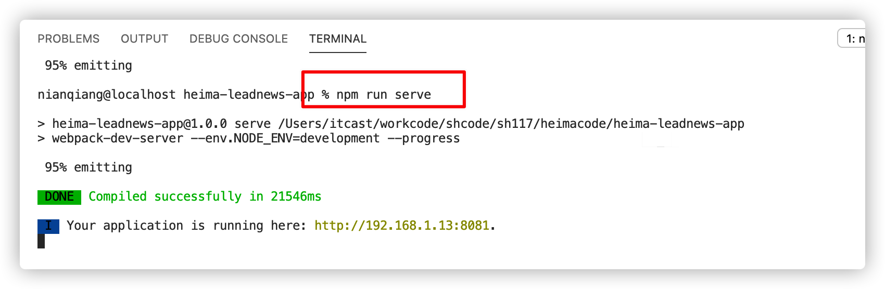
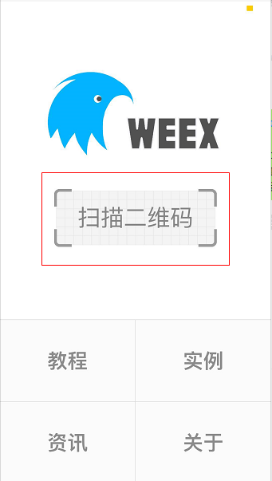
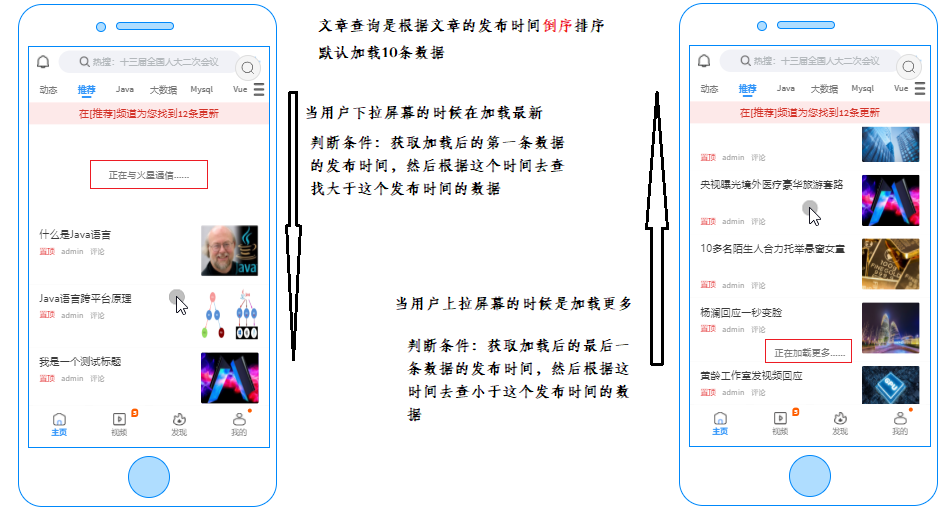
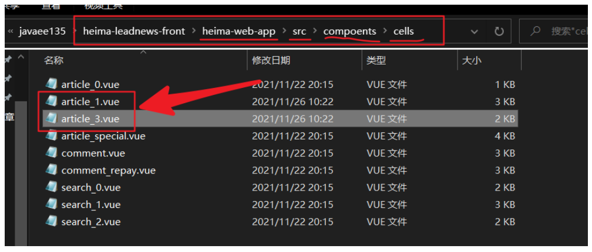
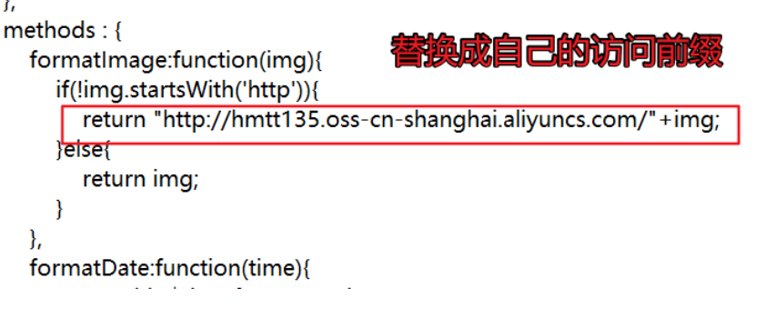
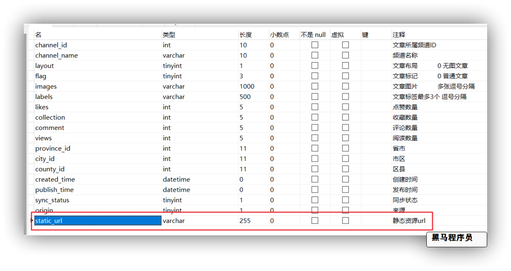

# 第7章 app端基本功能展示

## 今日目标

- 能够完成app端登录的功能
- 能够完成app端文章列表展示功能开发
- 能够理解文章静态化方案
- 能够完成文章页面静态化
- 能够完成关注作者功能

## 1 app端网关搭建

可以直接参考自媒体网关复制修改即可。

（1）`heima-leadnews-gateways`新建模块，名称：`app-gateway`

（2）创建配置`bootstrap.yml`

```yaml
spring:
  application:
    name: app-gateway # 服务名称
  profiles:
    active: dev # 开发环境配置
    ip: 192.168.200.130  # 环境ip地址
  cloud:
    nacos:
      discovery: # 注册中心地址配置
        server-addr: ${spring.profiles.ip}:8848
        namespace: ${spring.profiles.active}
      config: # 配置中心地址配置
        server-addr: ${spring.profiles.ip}:8848
        namespace: ${spring.profiles.active}
        file-extension: yml # data-id 后缀
        name: ${spring.application.name} # data-id名称
```

（3）nacos配置中心创建 `app-gateway.yml`

```yml
server:
  port: 5001
spring:
  cloud:
    gateway:
      globalcors:
        cors-configurations:
          '[/**]': # 匹配所有请求
            allowCredentials: true
            allowedOrigins: "*"
            allowedMethods: "*"
            allowedHeaders: "*"
        add-to-simple-url-handler-mapping: true
      routes:
        #文章微服务
        - id: leadnews-article
          uri: lb://leadnews-article
          predicates:
            - Path=/article/**
          filters:
            - StripPrefix= 1
        - id: leadnews-user
          uri: lb://leadnews-user
          predicates:
            - Path=/user/**
          filters:
            - StripPrefix= 1
        - id: leadnews-admin
          uri: lb://leadnews-admin
          predicates:
            - Path=/admin/**
          filters:
            - StripPrefix= 1
```

（4）引导类：

```java
package com.heima.app.gateway;

import org.springframework.boot.SpringApplication;
import org.springframework.boot.autoconfigure.SpringBootApplication;
import org.springframework.cloud.client.discovery.EnableDiscoveryClient;

@SpringBootApplication
@EnableDiscoveryClient
public class AppGatewayApplication {
    public static void main(String[] args) {
        SpringApplication.run(AppGatewayApplication.class,args);
    }
}
```

完整代码结构：



## 2 app端登录功能

### 2.1 app端登录-需求分析

- 点击**登录**可以根据app端的手机号和密码进行登录
- 点击**不登录，先看看**可以在无登录状态下进入app

### 2.2 app端登录-思路分析

概念介绍：**用户设备**，即当前用户所使用的终端设备。

1. 用户点击**登录**

* 用户输入**手机号和密码**到后端进行校验，校验成功生成token返给前端

- 其他请求需要带着token到app网关去校验jwt,校验成功，放行

2. 用户点击**不登录，先看看**

- 获取用户的设备id到后端根据设备id生成token,设置jwt存储的**id为0**
- 其他请求需要带着token到app网关去校验jwt,校验成功，放行



### 2.3 app端登录-功能实现

此功能在`user-service`模块中实现

#### 2.3.1 接口定义

```java
@Api(value = "app端用户登录api",tags = "app端用户登录api")
@RestController
@RequestMapping("/api/v1/login")
public class ApUserLoginController {
    @ApiOperation("登录")
    @PostMapping("/login_auth")
    public ResponseResult login(@RequestBody LoginDTO dto) {
       // TODO 业务实现
        return null;
    }
}
```

LoginDto

```java
package com.heima.model.user.dtos;

import lombok.Data;

@Data
public class LoginDTO  {

    /**
     * 设备id
     */
    private Integer equipmentId;

    /**
     * 手机号
     */
    private String phone;

    /**
     * 密码
     */
    private String password;
}
```

#### 2.3.2 mapper

校验用户登录的时候需要查询appUser表，此mapper之前课程已经定义完成

#### 2.3.3 业务层

新建接口：

```java
public interface ApUserLoginService {
    /**
     * app端登录
     * @param dto
     * @return
     */
    public ResponseResult login(LoginDTO dto);
}
```

实现类：

```java
package com.heima.user.service.impl;
import com.baomidou.mybatisplus.core.toolkit.Wrappers;
import com.heima.model.common.dtos.ResponseResult;
import com.heima.model.common.enums.AppHttpCodeEnum;
import com.heima.model.user.dtos.LoginDTO;
import com.heima.model.user.pojos.ApUser;
import com.heima.user.mapper.ApUserMapper;
import com.heima.user.service.ApUserLoginService;
import com.heima.utils.common.AppJwtUtil;
import org.apache.commons.lang3.StringUtils;
import org.springframework.beans.factory.annotation.Autowired;
import org.springframework.stereotype.Service;
import org.springframework.util.DigestUtils;
import java.util.HashMap;
import java.util.Map;
@Service
public class ApUserLoginServiceImpl implements ApUserLoginService {
    @Autowired
    ApUserMapper apUserMapper;
    /**
     * app端登录
     * @param dto
     * @return
     */
    @Override
    public ResponseResult login(LoginDTO dto) {
        //1.校验参数
        if (StringUtils.isNotBlank(dto.getPhone()) && StringUtils.isNotBlank(dto.getPassword())) {
            ApUser apUser = apUserMapper.selectOne(Wrappers.<ApUser>lambdaQuery()
                    .eq(ApUser::getPhone, dto.getPhone()));
            if (apUser == null) {
                return ResponseResult.errorResult(AppHttpCodeEnum.DATA_NOT_EXIST, "请检查手机号");
            }
            // 数据库密码
            String dbpassword = apUser.getPassword();
            String newPassword = DigestUtils.md5DigestAsHex((dto.getPassword() + apUser.getSalt()).getBytes());
            if (!dbpassword.equals(newPassword)) {
                return ResponseResult.errorResult(AppHttpCodeEnum.DATA_NOT_EXIST, "手机号或密码错误");
            }
            Map<String, Object> map = new HashMap<>();
            apUser.setPassword("");
            apUser.setSalt("");
            map.put("token", AppJwtUtil.getToken(apUser.getId().longValue()));
            map.put("user", apUser);
            return ResponseResult.okResult(map);
        }else {
            if(dto.getEquipmentId() == null){
                return ResponseResult.errorResult(AppHttpCodeEnum.PARAM_INVALID);
            }
            Map<String,Object> map = new HashMap<>();
            // 通过设备ID登录的 userId存0
            map.put("token",AppJwtUtil.getToken(0L));
            return ResponseResult.okResult(map);
        }
    }
}
```

#### 2.3.4 控制器

新建app用户登录控制器

```java
@Api(value = "app端用户登录api",tags = "app端用户登录api")
@RestController
@RequestMapping("/api/v1/login")
public class ApUserLoginController {
    @Autowired
    ApUserLoginService apUserLoginService;
    @ApiOperation("登录")
    @PostMapping("/login_auth")
    public ResponseResult login(@RequestBody LoginDTO dto) {
        return apUserLoginService.login(dto);
    }
}
```

#### 2.3.5 网关校验

网关校验流程：

参考其他网关设置，在 `app-gateway` 模块中新建过滤器，如下：

- 需要修改登录拦截uri的设置，需要把之前jwt的工具类拷贝过来
- 参考其他网关把全局过滤器拷贝过来



#### 2.3.6 网关路由配置

修改全局过滤器，根据user的实际登录地址修改网关中登录放行的uri

**注意: app登录路径uri和另外两个网关不一样**


#### 2.3.7 获取登录用户

在`heima-leadnews-model`模块中添加存储App登录用户的`ThreadLocal`工具类

```java
package com.heima.model.threadlocal;
import com.heima.model.user.pojos.ApUser;
public class AppThreadLocalUtils {
    private final  static ThreadLocal<ApUser> userThreadLocal = new ThreadLocal<>();
    /**
     * 设置当前线程中的用户
     * @param user
     */
    public static void setUser(ApUser user){
        userThreadLocal.set(user);
    }
    /**
     * 获取线程中的用户
     * @return
     */
    public static ApUser getUser( ){
        return userThreadLocal.get();
    }
    /**
     * 清空线程中的用户信息
     */
    public static void clear(){
        userThreadLocal.remove();
    }
}
```

在user模块 filter中新增 AppTokenFilter 过滤器

```java
package com.heima.user.filter;
import com.heima.model.threadlocal.AppThreadLocalUtils;
import com.heima.model.user.pojos.ApUser;
import lombok.extern.slf4j.Slf4j;
import org.apache.commons.lang3.StringUtils;
import org.springframework.core.annotation.Order;
import org.springframework.stereotype.Component;
import org.springframework.web.filter.GenericFilterBean;
import javax.servlet.FilterChain;
import javax.servlet.ServletException;
import javax.servlet.ServletRequest;
import javax.servlet.ServletResponse;
import javax.servlet.annotation.WebFilter;
import javax.servlet.http.HttpServletRequest;
import java.io.IOException;
@Slf4j
@Order(1)
@WebFilter(filterName = "appTokenFilter",urlPatterns = "/*")
@Component
public class AppTokenFilter extends GenericFilterBean {
    @Override
    public void doFilter(ServletRequest servletRequest, ServletResponse servletResponse, FilterChain filterChain) throws IOException, ServletException {
        // 1. 获取请求对象
        HttpServletRequest request = (HttpServletRequest) servletRequest;
        // 2. 查看请求header中是否有userId属性
        String userId = request.getHeader("userId");// 如果是设备登录 存的userId是0
        // 3. 如果userId有值存入到ThreadLocal中
        if(StringUtils.isNotBlank(userId) && Integer.valueOf(userId)!=0){
            ApUser apUser = new ApUser();
            apUser.setId(Integer.valueOf(userId));
            AppThreadLocalUtils.setUser(apUser);
        }
        // 4. 放行
        filterChain.doFilter(servletRequest,servletResponse);

        // 5. 清空登录信息
        AppThreadLocalUtils.clear();
    }
}
```


## 3 app端-环境搭建

### 3.1 weex

app端的前端项目使用的阿里的前端框架weex开发的。

Weex 致力于使开发者能基于通用跨平台的 Web 开发语言和开发经验，来构建 Android、iOS 和 Web 应用。简单来说，在集成了 WeexSDK 之后，你可以使用 JavaScript 语言和前端开发经验来开发移动应用。

官网：https://weex.apache.org/zh/

### 3.2 前后端文章列表联调测试

使用Vscode打开已下载的文件

**下载最新app前端:** https://gitee.com/xiaoT_CJ/heima-leadnews-front.git


#### 3.2.1 环境准备

（1）安装依赖

在项目的根目录使用命令`cnpm install`命令安装项目所依赖的js文件


#### 3.2.2 启动项目

打开 VsCode terminal 控制台运行：`npm run serve` 启动前端项目



启动项目后：


如果当前电脑和手机在一个局域网下下载weex的app，就可以扫码在手机端查看效果

app下载地址：https://weex.apache.org/guide/playground.html

效果如下：

扫描二维码查看效果




## 4 app端-文章列表

### 4.1 app端文章列表-需求分析

在手机端可以查看文章信息


> 1. 在默认频道展示10条文章信息
>
> 2. 可以切换频道查看不同种类文章
>
> 3. 当用户上拉可以加载更多的文章信息（按照发布时间）
>
>    * 分页
>
>    * 本页文章列表中发布时间为最小的时间为依据
>
> 4. 当用户下拉可以加载最新的文章
>    * 本页文章列表中发布时间最大的时间为依据



如果加载首页数据，前端会默认给传递一些参数


### 4.2 app端文章列表-功能实现

#### 4.2.1 定义接口

在article模块中新增ArticleHomeController接口

```java
@Api(tags = "app端首页文章列表接口",value = "app端首页文章列表接口")
@RestController
@RequestMapping("/api/v1/article")
public class ArticleHomeController {
    @Autowired
    private ApArticleService articleService;
    @ApiOperation(value = "查询热点文章列表",notes = "第一次点击各类频道时，调用此接口 查询该频道对应热点文章")
    @PostMapping("/load")
    public ResponseResult load(@RequestBody ArticleHomeDTO dto) {
        return articleService.load(ArticleConstants.LOADTYPE_LOAD_MORE,dto );
    }
    @ApiOperation(value = "查询更多文章",notes = "app文章列表下拉时 根据页面文章最小时间 实现滚动查询")
    @PostMapping("/loadmore")
    public ResponseResult loadMore(@RequestBody ArticleHomeDTO dto) {
        return articleService.load(ArticleConstants.LOADTYPE_LOAD_MORE,dto);
    }
    @ApiOperation(value = "查询最新文章",notes = "app文章列表上拉时 根据页面文章最大时间 查询最新文章")
    @PostMapping("/loadnew")
    public ResponseResult loadNew(@RequestBody ArticleHomeDTO dto) {
        return articleService.load(ArticleConstants.LOADTYPE_LOAD_NEW,dto);
    }
}
```

定义常量类

```java
package com.heima.common.constants;

public class ArticleConstants {
    public static final Short LOADTYPE_LOAD_MORE = 0;  // 加载更多
    public static final Short LOADTYPE_LOAD_NEW = 1; // 加载最新
    public static final String DEFAULT_TAG = "__all__";
}
```


**ArticleHomeDTO**

```java
@Data
public class ArticleHomeDTO {
    // 最大时间
    Date maxBehotTime;
    // 最小时间
    Date minBehotTime;
    // 分页size
    Integer size;
    // 频道ID
    String tag;
}
```

#### 4.2.2 mapper

文章展示并不是直接查询ap_article文章表数据，需要关联查询文章的配置表信息，如果是已下架或者标明已删除的文章则不被查询出来

在之前定义好的ApArticleMapper接口中新增方法

```java
public interface ApArticleMapper extends BaseMapper<ApArticle> {
    /**
     * 查询文章列表
     * @param dto
     * @param type 0：加载更多   1：加载最新
     * @return
     */
    public List<ApArticle> loadArticleList(@Param("dto") ArticleHomeDTO dto, @Param("type") Short type);
}
```

在resources\mapper目录下新建ApArticleMapper.xml文件

```xml
<?xml version="1.0" encoding="UTF-8"?>
<!DOCTYPE mapper PUBLIC "-//mybatis.org//DTD Mapper 3.0//EN" "http://mybatis.org/dtd/mybatis-3-mapper.dtd">
<mapper namespace="com.heima.article.mapper.ApArticleMapper">
    <resultMap id="resultMap" type="com.heima.model.article.pojos.ApArticle">
        <id column="id" property="id"/>
        <result column="title" property="title"/>
        <result column="author_id" property="authorId"/>
        <result column="author_name" property="authorName"/>
        <result column="channel_id" property="channelId"/>
        <result column="channel_name" property="channelName"/>
        <result column="layout" property="layout"/>
        <result column="flag" property="flag"/>
        <result column="images" property="images"/>
        <result column="labels" property="labels"/>
        <result column="likes" property="likes"/>
        <result column="collection" property="collection"/>
        <result column="comment" property="comment"/>
        <result column="views" property="views"/>
        <result column="province_id" property="provinceId"/>
        <result column="city_id" property="cityId"/>
        <result column="county_id" property="countyId"/>
        <result column="created_time" property="createdTime"/>
        <result column="publish_time" property="publishTime"/>
        <result column="sync_status" property="syncStatus"/>
        <result column="static_url" property="staticUrl"/>
    </resultMap>
    <select id="loadArticleList" resultMap="resultMap">
        SELECT
        aa.*
        FROM
        `ap_article` aa
        LEFT JOIN ap_article_config aac ON aa.id = aac.article_id
        <where>
            and aac.is_delete != 1
            and aac.is_down != 1
            <!-- loadmore -->
            <if test="type != null and type == 0">
                and aa.publish_time <![CDATA[<]]> #{dto.minBehotTime}
            </if>
            <if test="type != null and type == 1">
                and aa.publish_time <![CDATA[>]]> #{dto.maxBehotTime}
            </if>
            <if test="dto.tag != '__all__'">
                and aa.channel_id = #{dto.tag}
            </if>
        </where>
        order by aa.publish_time desc
        limit #{dto.size}
    </select>
</mapper>
```

#### 4.2.3 业务层

在ApArticleService中新增一个方法

```java
/**
     * 根据参数加载文章列表
     * @param loadtype 0为加载更多  1为加载最新   
     * @param dto
     * @return
     */
ResponseResult load(Short loadtype, ArticleHomeDTO dto);
```

实现类方法

```java
	@Autowired
    private ApArticleMapper apArticleMapper;
    @Value("${file.oss.web-site}")
    private String webSite;
    /**
     * 根据参数加载文章列表
     * @param loadtype 0为加载更多  1为加载最新
     * @param dto
     * @return
     */
    @Override
    public ResponseResult load(Short loadtype, ArticleHomeDTO dto) {
        //1 参数检查
        // 页大小
        Integer size = dto.getSize();
        if (size == null || size <= 0) {
            size = 10;
        }
        dto.setSize(size);
        // 频道
        if (StringUtils.isBlank(dto.getTag())) {
            dto.setTag(ArticleConstants.DEFAULT_TAG);
        }
        // 时间
        if (dto.getMaxBehotTime() == null) {
            dto.setMaxBehotTime(new Date());
        }
        if (dto.getMinBehotTime() == null) {
            dto.setMinBehotTime(new Date());
        }
        // 类型判断
        if (!loadtype.equals(ArticleConstants.LOADTYPE_LOAD_MORE) && !loadtype.equals(ArticleConstants.LOADTYPE_LOAD_NEW)) {
            loadtype = ArticleConstants.LOADTYPE_LOAD_MORE;
        }
        //2 执行查询
        List<ApArticle> articleList = apArticleMapper.loadArticleList(dto, loadtype);
        for (ApArticle article : articleList) {
            // 获取文章封面字段
            String images = article.getImages();
            if (StringUtils.isNotBlank(images)) {
                // 将封面按照,号切割   生成流
                images = Arrays.stream(images.split(","))
                        // 每一个路径添加前缀
                        .map(url -> webSite + url)
                        // 将加了前缀的路径  拼接成字符串
                        .collect(Collectors.joining(","));
                article.setImages(images);
            }
        }
        //3 返回结果
        ResponseResult result = ResponseResult.okResult(articleList);
        return result;
    }
```


### 4.3 app端文章列表-测试


> **注意:**  展示文章列表时， 图片会不显示  因为在app页面前端的拼接路径是写死的

需要修改app前端页面






## 5 文章详情页面静态化

### 5.1 需求分析

当在文章列表页面上点击文章，会进入文章详情页面

### 5.2 实现方案

#### 5.2.1 基于数据库查询方案

用户某一条文章，根据文章的id去查询文章内容表，返回渲染页面


优点：

* 实现简单
* 保证数据强一致性

缺点：

* 无法支撑高并发


#### 5.2.2 页面静态化方案


优点：

* 支撑高并发，高可用
* 页面响应快，用户体验好

缺点：

* 强一致性较弱，但能够保证最终一致性


### 5.3 前置知识点

#### 5.3.1 模板引擎 freemarker

资料中 freemarker资料学习

#### 5.3.2 分布式文件存储 minIO

资料中 minIO 资料学习

### 5.3 静态页面生成

#### 5.3.1 修改apArticle实体类及表

**添加用于存储静态页url字段**



**修改实体类**


```java
@TableField("static_url")
private String staticUrl;
```


#### 5.3.2 article微服务集成文件存储

修改pom依赖

```xml
<dependencies>
    	<!-- 文件存储 starter 依赖 -->
        <dependency>
            <groupId>com.heima</groupId>
            <artifactId>heima-file-spring-boot-starter</artifactId>
            <version>1.0-SNAPSHOT</version>
        </dependency>
    	<!-- 模板引擎 starter 依赖 -->
        <dependency>
            <groupId>org.springframework.boot</groupId>
            <artifactId>spring-boot-starter-freemarker</artifactId>
        </dependency>
        <!--AMQP依赖，包含RabbitMQ-->
        <dependency>
            <groupId>org.springframework.boot</groupId>
            <artifactId>spring-boot-starter-amqp</artifactId>
        </dependency>
        <!--seata-->
        <dependency>
            <groupId>com.alibaba.cloud</groupId>
            <artifactId>spring-cloud-starter-alibaba-seata</artifactId>
            <exclusions>
                <!--版本较低，1.3.0，因此排除-->
                <exclusion>
                    <artifactId>seata-spring-boot-starter</artifactId>
                    <groupId>io.seata</groupId>
                </exclusion>
            </exclusions>
        </dependency>
        <dependency>
            <groupId>io.seata</groupId>
            <artifactId>seata-spring-boot-starter</artifactId>
            <!--seata starter 采用1.4.2版本-->
            <version>${seata.version}</version>
        </dependency>
    </dependencies>
```

**修改bootstrap.yml  新增文件存储共享配置**

```yml
          - data-id: share-file.yml
            group: DEFAULT_GROUP
            refresh: false
```

**修改nacos配置中心` leadnews-article.yml`配置**

```yml
server:
  port: 9003
spring:
  datasource:
    driver-class-name: com.mysql.jdbc.Driver
    url: jdbc:mysql://${spring.profiles.ip}:3306/leadnews_article?useUnicode=true&useSSL=false&characterEncoding=UTF-8&serverTimezone=UTC
    username: root
    password: root
  freemarker:
    cache: false  #关闭模板缓存，方便测试
    settings:
      template_update_delay: 0 #检查模板更新延迟时间，设置为0表示立即检查，如果时间大于0会有缓存不方便进行模板测试
    suffix: .ftl               #指定Freemarker模板文件的后缀名
    template-loader-path: classpath:/templates/
    #  ===============新增依赖 end ===================
# 设置Mapper接口所对应的XML文件位置，如果你在Mapper接口中有自定义方法，需要进行该配置
mybatis-plus:
  mapper-locations: classpath*:mapper/*.xml
  # 设置别名包扫描路径，通过该属性可以给包中的类注册别名
  type-aliases-package: com.heima.model.admin.pojos
```

**导入资料中 文章freemarker模板**


**模板上需要的内容:**   

​		文章作者对应的apUserId

​		文章apArticle信息

​		文章内容ApArticleContent信息


#### **5.3.3 基于freemarker生成静态页**

**静态页service**

```java
package com.heima.article.service;
import com.heima.model.article.pojos.ApArticle;
public interface GeneratePageService {
    /**
     * 生成文章静态页
     */
    void generateArticlePage(String content, ApArticle apArticle);
}
```


```java
package com.heima.article.service.impl;
import com.alibaba.fastjson.JSONArray;
import com.heima.article.mapper.ApArticleMapper;
import com.heima.article.mapper.AuthorMapper;
import com.heima.article.service.GeneratePageService;
import com.heima.common.exception.CustException;
import com.heima.file.service.FileStorageService;
import com.heima.model.article.pojos.ApArticle;
import com.heima.model.article.pojos.ApAuthor;
import com.heima.model.common.enums.AppHttpCodeEnum;
import freemarker.template.Configuration;
import freemarker.template.Template;
import lombok.extern.slf4j.Slf4j;
import org.springframework.beans.factory.annotation.Autowired;
import org.springframework.beans.factory.annotation.Value;
import org.springframework.stereotype.Service;
import javax.annotation.Resource;
import java.io.ByteArrayInputStream;
import java.io.InputStream;
import java.io.StringWriter;
import java.util.HashMap;
import java.util.Map;
@Service
@Slf4j
public class GeneratePageServiceImpl implements GeneratePageService {
    @Autowired
    private Configuration configuration;
    @Resource(name = "minIOFileStorageService")
    private FileStorageService fileStorageService;
    @Value("${file.minio.prefix}")
    private String prefix;
    @Autowired
    ApArticleMapper apArticleMapper;
    @Autowired
    AuthorMapper authorMapper;
    /**
     * 生成文章静态页面
     */
    @Override
    public void generateArticlePage(String content, ApArticle apArticle) {
        //1.获取文章内容
        try {
            //2. 模板
            Template template = configuration.getTemplate("article.ftl");

            //3. 数据
            Map<String, Object> params = new HashMap<>();
            params.put("content", JSONArray.parseArray(content));// 文章详情
            params.put("article", apArticle); // 文章信息
            ApAuthor author = authorMapper.selectById(apArticle.getAuthorId());
            params.put("authorApUserId", author.getUserId());// 作者 对应的 apUserId
            StringWriter out = new StringWriter();
            template.process(params, out);

            InputStream is = new ByteArrayInputStream(out.toString().getBytes());

            //4.生成页面把html文件上传到minio中
            String path = fileStorageService.store(prefix, apArticle.getId() + ".html", "text/html", is);

            //5.修改ap_article表，保存static_url字段
            apArticle.setStaticUrl(path);

            apArticleMapper.updateById(apArticle);
            log.info("文章详情静态页生成成功 staticUrl=====> {}", path);
        } catch (Exception e) {
            e.printStackTrace();
            log.error("文章详情静态页生成失败=====>articleId : {}    ========> {}", apArticle.getId(), e.getCause());
            CustException.cust(AppHttpCodeEnum.SERVER_ERROR,"文章详情静态页生成失败");
        }
    }
}
```

**新增文章时生成静态页方法**

```java
package com.heima.article.service.impl;
@Slf4j
@Service
public class ApArticleServiceImpl extends ServiceImpl<ApArticleMapper, ApArticle> implements ApArticleService {
// -----------------前面代码省略------------------------------------
    @Autowired
    GeneratePageService generatePageService;
    /**
     * 保存app文章
     * @param articleDto
     * @return
     */
    @Override
    public ResponseResult saveArticle(ArticleDto articleDto) {
		// -----------------前面代码省略------------------------------------
        //返回文章ID
        generatePageService.generateArticlePage(wmNews.getContent(),apArticle);
        return ResponseResult.okResult(apArticle.getId());
    }
}
```

加载文章列表时 添加静态资源访问前缀路径

```java
	@Value("${file.minio.readPath}")
    String readPath;
    /**
     * 根据参数加载文章列表
     * @param loadtype 1为加载更多  2为加载最新
     * @param dto
     * @return
     */
    @Override
    public ResponseResult load(Short loadtype, ArticleHomeDTO dto) {
        //1 参数检查
        //2 执行查询
        List<ApArticle> articleList = apArticleMapper.loadArticleList(dto, loadtype);
        // 添加静态页面访问前缀  ===============新增代码=================
        for (ApArticle apArticle : articleList) {
            apArticle.setStaticUrl(readPath + apArticle.getStaticUrl());
        }
        //3 返回结果
        ResponseResult result = ResponseResult.okResult(articleList);
        return result;
    }
```

#### 5.3.4 前后端集成测试

**测试动作：在自媒体前端进行发布文章**

**结果：**

1. 审核成功后，app端的article相关数据是否可以正常插入
2. 审核成功或失败后，wm_news表中的状态是否改变，成功和失败原因正常插入
3. 如果文章审核成功是否可以正常生成静态页面并上传到MinIO

**访问生成后的静态文件：**

资料中找到**plugins**文件夹 手动上传到**MinIO article**文件夹下


**测试静态页能否访问**


## 6 app端-关注作者或取消关注

### 6.1 需求分析


如上效果：

当前登录后的用户可以关注作者对应的APUser ID，也可以取消关注作者对应的APUser ID

### 6.2 解决方案

方案一：基于数据库保存对应的关注关系

**方案二：基于Redis保存。** 

项目中使用方案二。

一个用户关注了作者，作者是由用户实名认证以后开通的作者权限，才有了作者信息，作者肯定是app中的一个用户。

从用户的角度出发：一个用户可以关注其他多个作者 —— 我的关注

从作者的角度出发：一个用户（同是作者）也可以拥有很多个粉丝  —— 我的粉丝


如上图所示，在好友关注关系中，主要有以上三种状态，即：

- 我的粉丝（fans）
- 我的关注（follow）
- 互粉（mutual）

假设两个用户。用户ID分别为1和2。


考虑问题：

1、一对多    

2、关注时间有序

3、集合

4、不重复

**5、集合运算（交并补）**

**关注文章作者：**    1 登陆用户id        2  作者对应id                                            关注集合       粉丝集合

1. 将对方写入我的关注中。        follow:1          2 (score: 时间 )     

2. 将我写入对方的粉丝中。即：         fans:2         1 

示例：

```properties
ZADD follow:1 time(时间戳)  2
ZADD fans:2 time(时间戳)    1
```

**取消关注：** 1   2

1. 将对方从我的关注中移除
2. 将我从对方的粉丝中移除

示例：

```properties
ZREM follow:1 2
ZREM fans:2 1
```

**查看关注列表：**

```properties
ZRANGE follow:1 0 -1
```

**查看粉丝列表：**

```properties
ZRANGE fans:1 0 -1
```

**关注数量：**

```properties
ZCARD follow:1
```

**粉丝数量：**

```properties
ZCARD fans:1
```


**人物关系：**

1、我单向关注Ta。即我关注的Ta，但是Ta并没有关注我的

```properties
ZSCORE follow:1 2 #ture
ZSCORE fans:1 2 #false
# 第一条成立，第二条不成立，说明我单向关注了对方（1关注了2，而1的粉丝中没有2，说明2并没有关注1）
```


2、Ta单向关注我。即Ta关注我了，我并没有关注Ta

```properties
ZSCORE follow:1 2 #false
ZSCORE fans:1 2 #true
# 第一条不成立，第二条成立，说明对方单向关注了我（1没有关注2，而1的粉丝中有2，说明2关注了1）
```


3、互相关注。即我关注了Ta，Ta也关注了我

```properties
ZSCORE follow:1 2 #true
ZSCORE fans:1 2   #true
# 上面两条都成立，即说明互相关注了（1关注了2，并且1的粉丝中有2，说明2也关注1了）
```


### 6.3 功能实现

#### **6.3.0 准备redis起步依赖**

**准备redis**

```
# 设置redis密码 root  设置开启: AOF 持久化方式
docker run --name redis -p 6379:6379 -id --restart=always redis:6.2.5 redis-server --appendonly yes --requirepass root
```

#### 6.3.1 接口定义

`user-service` 微服务新增`UserRelationController`

```java
@Api(value = "用户关注API",tags = "用户关注API")
@RestController
@RequestMapping("/api/v1/user")
public class UserRelationController  {
    @Autowired
    ApUserRelationService apUserRelationService;
    @ApiOperation("关注 或 取关")
    @PostMapping("/user_follow")
    public ResponseResult follow(@RequestBody UserRelationDTO dto){
        return apUserRelationService.follow(dto);
    }
}
```

UserRelationDto

```java
package com.heima.model.user.dtos;
import lombok.Data;
@Data
public class UserRelationDTO {
    // 文章作者ID
    Integer authorId; // 未使用
    // 作者对应的apuserid
    Integer authorApUserId;
    // 文章id
    Long articleId;
    /**
     * 操作方式
     * 0  关注
     * 1  取消
     */
    Short operation;
}
```

#### 6.3.2 代码实现

1、在`user-service` 服务下引入Redis起步依赖

```xml
        <dependency>
            <groupId>org.springframework.boot</groupId>
            <artifactId>spring-boot-starter-data-redis</artifactId>
        </dependency>
```

在配置中心 `leadnews-user.yml`配置中 添加redis的连接参数

```yaml
server:
  port: 9002
spring:
  redis:
    database: 0   #Redis索引0~15，默认为0
    host: ${spring.profiles.ip}
    port: 6379
    password: root  #密码（默认为空）
    lettuce: # 这里标明使用lettuce配置
      pool:
        max-active: 8   #连接池最大连接数（使用负值表示没有限制）
        max-wait: -1ms  #连接池最大阻塞等待时间（使用负值表示没有限制）
        max-idle: 5     #连接池中的最大空闲连接
        min-idle: 0     #连接池中的最小空闲连接
    timeout: 20000ms    #连接超时时间（毫秒）
  datasource:
    driver-class-name: com.mysql.jdbc.Driver
    url: jdbc:mysql://${spring.profiles.ip}:3306/leadnews_user?useUnicode=true&useSSL=false&characterEncoding=UTF-8&serverTimezone=UTC
    username: root
    password: root
# 设置Mapper接口所对应的XML文件位置，如果你在Mapper接口中有自定义方法，需要进行该配置
mybatis-plus:
  mapper-locations: classpath*:mapper/*.xml
  # 设置别名包扫描路径，通过该属性可以给包中的类注册别名
  type-aliases-package: com.heima.model.user.pojos
```


2、创建ApUserRelationService接口

```java
package com.heima.user.service;
import com.heima.model.common.dtos.ResponseResult;
import com.heima.model.user.dtos.UserRelationDTO;
public interface ApUserRelationService {
    /**
     * 用户关注/取消关注
     * @param dto
     * @return
     */
    public ResponseResult follow(UserRelationDTO dto);
}
```

3、创建ApUserRelationService实现类

```java
package com.heima.user.service.impl;
import com.heima.common.constants.user.UserRelationConstants;
import com.heima.common.exception.CustException;
import com.heima.model.common.dtos.ResponseResult;
import com.heima.model.common.enums.AppHttpCodeEnum;
import com.heima.model.threadlocal.AppThreadLocalUtils;
import com.heima.model.user.dtos.UserRelationDTO;
import com.heima.model.user.pojos.ApUser;
import com.heima.user.service.ApUserRelationService;
import org.springframework.beans.factory.annotation.Autowired;
import org.springframework.data.redis.core.RedisTemplate;
import org.springframework.stereotype.Service;
@Service
public class ApUserRelationServiceImpl implements ApUserRelationService {
    @Autowired
    StringRedisTemplate redisTemplate;
    @Override
    public ResponseResult follow(UserRelationDTO dto) {
        // 1. 校验参数    authorApUserId   必须登录   operation 0  1
        if(dto.getAuthorApUserId() == null){
            CustException.cust(AppHttpCodeEnum.PARAM_INVALID,"作者对应的userId不存在");
        }
        Short operation = dto.getOperation();
        if(operation == null || (operation.intValue()!=0 && operation.intValue()!=1)){
            CustException.cust(AppHttpCodeEnum.PARAM_INVALID,"关注类型错误");
        }
        ApUser user = AppThreadLocalUtils.getUser();
        if(user == null){
            CustException.cust(AppHttpCodeEnum.NEED_LOGIN);
        }
        Integer loginId = user.getId();
        Integer followId = dto.getAuthorApUserId();
        // 判断 自己不可以关注自己
        if(loginId.equals(followId)){
            CustException.cust(AppHttpCodeEnum.DATA_NOT_ALLOW,"不可以自己关注自己哦~");
        }
        //    校验之前有没有关注过   zscore
        //    参数1： key   参数2: 要查询集合元素
        Double score = redisTemplate.opsForZSet()
                .score(UserRelationConstants.FOLLOW_LIST + loginId, String.valueOf(followId));
        if(operation.intValue() == 0&&score!=null){
            CustException.cust(AppHttpCodeEnum.DATA_EXIST,"您已关注，请勿重复关注");
        }
        try {
            // 2. 判断operation 是0  是1
            if(operation.intValue() == 0){
                //    没有关注过    zadd  follow:我的id   作者id
                //                             参数1: key  参数2 集合元素  参数3: score
                redisTemplate.opsForZSet().add(UserRelationConstants.FOLLOW_LIST + loginId,String.valueOf(followId),System.currentTimeMillis());
                //                zadd  fans:作者id    我的id
                redisTemplate.opsForZSet().add(UserRelationConstants.FANS_LIST + followId,String.valueOf(loginId),System.currentTimeMillis());
            }else {
                // 2.2  是1  取关
                //     zrem  follow:我的id   作者id
                redisTemplate.opsForZSet().remove(UserRelationConstants.FOLLOW_LIST + loginId,String.valueOf(followId));
                //     zrem  fans:作者id    我的id
                redisTemplate.opsForZSet().remove(UserRelationConstants.FANS_LIST + followId,String.valueOf(loginId));
            }
        }catch (Exception e){
            e.printStackTrace();
            CustException.cust(AppHttpCodeEnum.SERVER_ERROR);
        }
        return ResponseResult.okResult();
    }
}
```

涉及常量类：

```java
package com.heima.common.constants.user;

public class UserRelationConstants {

    // 用户关注key
    public static final String FOLLOW_LIST = "apuser:follow:";
    // 用户粉丝key
    public static final String FANS_LIST = "apuser:fans:";

}
```

5. 重新生成新的 静态页面，打开app端项目进行联调测试。


**面试热点：**

**文章详情页面静态化方案**

**freemarker介绍**

**基于redis实现用户关注和取关功能**

**redis常见数据结构**

**redis持久化机制**

**redis事务机制**

**redis项目中应用场景**

**redis的高可用架构**      主从         哨兵        集群

**redis中 key过期删除策略**

**redis中 内存淘汰策略**

