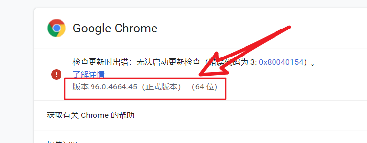
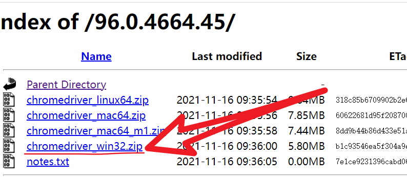

##### Windows下载及安装chromedriver.exe

1.首先下载chromedriver
下载地址：http://chromedriver.storage.googleapis.com/index.html

下载之前查看自己PC的chrome游览器的版本

查看chrome游览器版本的方法：

(1) 打开的Chrome浏览器主界面的地址栏输入网址: chrome://version/

(2) 点击打开谷歌浏览器以后，点击右上角的“主菜单”按钮;

在打开的下拉菜单中依次点击“帮助/关于Google Chrome”菜单项;

这时就会打开关于chrome的页面，在这里就可以看到google chrome浏览器的版本号了.

2.通过自己的版本下载相应的chromedriver.exe

对比步骤：

(1)打开下载链接： http://chromedriver.storage.googleapis.com/index.html

