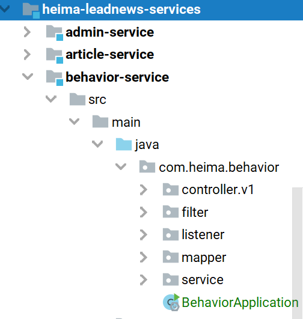
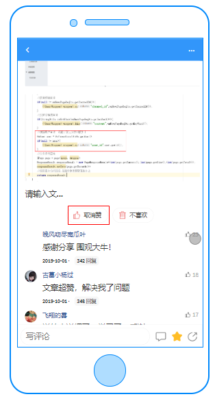
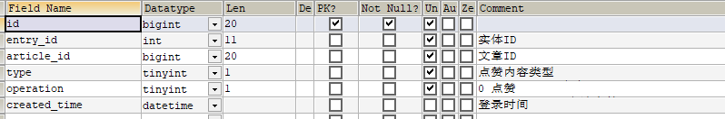
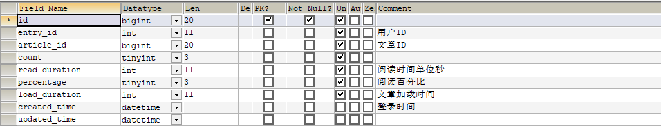
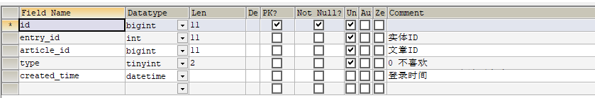
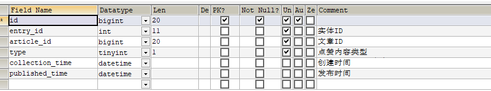
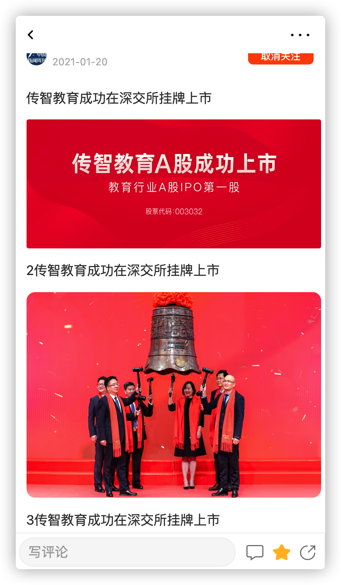

# 第 8 章 app端用户行为处理

## 今日目标

 

- 能够理解app端的行为记录
- 能够完成文章点赞行为的功能
- 能够完成文章阅读行为的功能
- 能够掌握不喜欢和收藏功能的实现思路
- 能够完成app文章关系展示功能

## 1 app-用户操作行为记录 

用户行为数据的记录包括了关注、点赞、不喜欢、收藏、阅读等行为

这些行为与当前app端的功能实现没有任何关系，即使没有行为数据，功能也不耽误实现，那为什么要做行为数据的保存呢？

黑马头条项目整个项目开发涉及web展示和大数据分析来给用户推荐文章，如何找出哪些文章是热点文章进行针对性的推荐呢？这个时候需要进行大数据分析的准备工作，埋点。

所谓“埋点”，是数据采集领域（尤其是用户行为数据采集领域）的术语，指的是针对特定用户行为或事件进行捕获、处理和发送的相关技术及其实施过程。比如用户某个icon点击次数、阅读文章的时长，观看视频的时长等等。

黑马头条课程里主要涉及到了关注行为，点赞行为，阅读行为的保存。其他类似于不喜欢、收藏功能可根据这些实现的功能自行实现。


### 1.1 行为微服务搭建

#### 1.1.1创建behavior-service

处理行为是一个量比较大的操作，所以专门创建一个微服务来处理行为相关操作

模块`behavior-service`



#### 1.1.2 依赖及配置

**引入依赖**

```xml
	<dependencies>
        <!--mongoDB-->
        <dependency>
            <groupId>org.springframework.boot</groupId>
            <artifactId>spring-boot-starter-data-mongodb</artifactId>
        </dependency>
        <dependency>
            <groupId>org.springframework.boot</groupId>
            <artifactId>spring-boot-starter-data-redis</artifactId>
        </dependency>
    </dependencies>
```

**配置文件bootstrap.yml**

```yml
spring:
  application:
    name: leadnews-behavior # 服务名称
  profiles:
    active: dev # 开发环境配置
    ip: 192.168.200.130  # 环境ip地址
  cloud:
    nacos:
      discovery: # 注册中心地址配置
        server-addr: ${spring.profiles.ip}:8848
        namespace: ${spring.profiles.active}
      config: # 配置中心地址配置
        server-addr: ${spring.profiles.ip}:8848
        namespace: ${spring.profiles.active}
        file-extension: yml # data-id 后缀
        name: ${spring.application.name} # data-id名称
        shared-configs: # 共享配置
          - data-id: share-feign.yml
            group: DEFAULT_GROUP   
            refresh: false
```

**nacos配置中心 leadnews-behavior.yml**

```yaml
server:
  port: 9005
spring:
  data:
    mongodb:
      host: ${spring.profiles.ip}
      port: 27017
      database: leadnews-behavior
  redis:
    host: ${spring.profiles.ip}
    port: 6379
    password: root
  autoconfigure:
    exclude: org.springframework.boot.autoconfigure.jdbc.DataSourceAutoConfiguration,org.springframework.boot.autoconfigure.jdbc.DataSourceTransactionManagerAutoConfiguration
```


### 1.2 准备行为实体查询

现在 `heima-leadnews-model`工程中引入mongo**（已引入）**

因为实体类用到了mongo的注解

```xml
        <dependency>
            <groupId>org.springframework.data</groupId>
            <artifactId>spring-data-mongodb</artifactId>
            <scope>provided</scope>
        </dependency>
```

**ap_behavior_entry** 行为实体

行为实体指的是使用的终端设备或者是登录的用户，统称为**行为实体**。

`type :0终端设备  1用户  `

行为实体与其它行为表都是一对多的关系


对应实体

```java
package com.heima.model.behavior.pojos;
import lombok.Data;
import lombok.Getter;
import org.springframework.data.mongodb.core.mapping.Document;
import java.io.Serializable;
import java.util.Date;
@Data
@Document("ap_behavior_entry")
public class ApBehaviorEntry implements Serializable {
    private static final long serialVersionUID = 1L;
    /**
     * 行为实体id 主键
     */
    private String id;
    /**
     * 实体类型
     0终端设备
     1用户
     */
    private Short type;
    /**
     * 关联id  type=0 设备id   type=1 用户id
     */
    private Integer refId;
    /**
     * 创建时间
     */
    private Date createdTime;
    public enum  Type{
        USER((short)1),EQUIPMENT((short)0);
        @Getter
        short code;
        Type(short code){
            this.code = code;
        }
    }
    public boolean isUser(){
        if(this.getType()!=null&&this.getType()== Type.USER.getCode()){
            return true;
        }
        return false;
    }
}
```

**行为实体业务层接口：**

根据用户id 或 设备id查询对应的行为实体 **(优先使用userId)**

```java
package com.heima.behavior.service;
import com.heima.model.behavior.pojos.ApBehaviorEntry;
public interface ApBehaviorEntryService {
     /**
      * 查询行为实体
      * @param userId  用户id
      * @param equipmentId  设备id
      * @return
      */
     ApBehaviorEntry findByUserIdOrEquipmentId(Integer userId, Integer equipmentId);
}
```

**行为实体业务实现类：**

> //1. 判断userId是否为空  
>
> ​	不为空 使用userId查询 行为实体 (refId = 用户id     type = 用户类型  )
>
> ​        如果不存在基于userId创建实体数据
>
> ​        返回行为实体
>
> //2. 判断设备id是否为空   
>
> ​        不为空 使用设备id查询  行为实体 (refId = 设备id   type = 设备类型)
>
> ​         如果不存在基于设备id创建实体数据
>
> ​        返回行为实体
>
> //3. 如果userId和设备id都不存在  返回null 调用者需要判断null 
>
>

### 1.3 点赞行为

#### 1.3.1 需求分析



当前登录的用户点击了”赞“,就要保存当前行为数据

#### 1.3.2 思路分析



**实体类：**

```java
package com.heima.model.behavior.pojos;
import lombok.Data;
import org.springframework.data.mongodb.core.mapping.Document;
import java.io.Serializable;
import java.util.Date;

@Data
@Document("ap_likes_behavior")
public class ApLikesBehavior implements Serializable {
    private static final long serialVersionUID = 1L;
    private String id;
    /**
     * 实体ID
     */
    private String entryId;
    // 文章id
    private Long articleId;
    /**
     * 点赞内容类型
     * 0文章
     * 1动态
     */
    private Short type;
    /**
     * 0 点赞
     * 1 取消点赞
     */
    private Short operation;
    /**
     * 创建时间
     */
    private Date createdTime;
}
```

当前用户点赞以后保存数据，取消点赞删除对应点赞行为

保存也是根据当前**行为实体和文章id**进行保存

#### 1.3.3 功能实现

（1）接口定义

新增ApLikesBehaviorController接口，添加保存的方法

**LikesBehaviorDTO**

```java
@Data
public class LikesBehaviorDTO {
    // 设备ID
    Integer equipmentId;
    // 文章、动态、评论等ID
    Long articleId;
    /**
     * 喜欢内容类型
     * 0文章
     * 1动态
     * 2评论
     */
    Short type;
    /**
     * 喜欢操作方式
     * 0 点赞
     * 1 取消点赞
     */
    Short operation;
}
```

（2）业务层

在功能实现的时候需要得到行为实体，所以需要得到当前登录的用户信息，参考文章微服务，添加filter，获取用户信息放到当前线程中

```java
package com.heima.behavior.filter;
import com.heima.model.threadlocal.AppThreadLocalUtils;
import com.heima.model.user.pojos.ApUser;
import org.springframework.core.annotation.Order;
import org.springframework.stereotype.Component;
import org.springframework.web.filter.GenericFilterBean;
import javax.servlet.FilterChain;
import javax.servlet.ServletException;
import javax.servlet.ServletRequest;
import javax.servlet.ServletResponse;
import javax.servlet.annotation.WebFilter;
import javax.servlet.http.HttpServletRequest;
import javax.servlet.http.HttpServletResponse;
import java.io.IOException;
@Order(1)
@WebFilter(filterName = "appTokenFilter", urlPatterns = "/*")
@Component
public class AppTokenFilter extends GenericFilterBean {
    @Override
    public void doFilter(ServletRequest req, ServletResponse res, FilterChain chain) throws IOException, ServletException {
        HttpServletRequest request = (HttpServletRequest) req;
        HttpServletResponse response = (HttpServletResponse) res;
        String userId = request.getHeader("userId");
        //如果userId为0，说明当前设备没有登录
        if(userId!=null && Integer.valueOf(userId).intValue()!=0){
            ApUser apUser = new ApUser();
            apUser.setId(Integer.valueOf(userId));
            AppThreadLocalUtils.setUser(apUser);
        }
        chain.doFilter(req,res);

        AppThreadLocalUtils.clear();
    }
}
```

点赞业务层接口

```java
package com.heima.behavior.service;
import com.heima.model.behavior.dtos.LikesBehaviorDTO;
import com.heima.model.common.dtos.ResponseResult;
public interface ApLikesBehaviorService {
    /**
     * 点赞或取消点赞
     * @param dto
     * @return
     */
	public ResponseResult like(LikesBehaviorDTO dto);
}
```

**实现类： 需要自己实现**

> // 1. 校验参数   
>
> ​       点赞需要登录 
>
> ​       校验文章id不能为空     使用注解校验
>
> ​        校验点赞方式 只能是0 或 1   使用注解校验
>
> // 2. 根据当前登录用户id查询行为实体对象
>
> // 3. 如果是点赞操作  判断是否已经点过赞
>
> // 4. 没有点过赞则 像mongo点赞集合中 添加点赞数据
>
> // 5. 如果是取消点赞操作  在mongo点赞集合中 删除对应点赞数据

   

**（4）补全控制层**


（5）在app网关中配置行为微服务的路由

```yaml
#行为微服务
- id: behavior
  uri: lb://leadnews-behavior
  predicates:
  - Path=/behavior/**
  filters:
  - StripPrefix= 1
```

（6）测试

启动项目，当用户点赞文章好，可以在ap_likes_behavior 中新增数据，文章取消赞，再次点赞后追加数据。

### 1.4 阅读行为

#### 1.4.1 需求分析

当用户查看了某一篇文章，需要记录当前用户**查看的次数**，阅读时长，阅读文章的比例，加载的时长（非必要）

#### 1.4.2 思路分析

ap_read_behavior APP阅读行为表



对应实体：

```java
package com.heima.model.behavior.pojos;
import lombok.Data;
import org.springframework.data.mongodb.core.mapping.Document;
import java.io.Serializable;
import java.util.Date;
@Data
@Document("ap_read_behavior")
public class ApReadBehavior implements Serializable {
    private static final long serialVersionUID = 1L;
    private String id;
    /**
     * 用户ID
     */
    private String entryId;
    /**
     * 文章ID
     */
    private Long articleId;
    /**
     * 阅读次数
     */
    private Short count;
    /**
     * 登录时间
     */
    private Date createdTime;
    /**
     * 更新时间
     */
    private Date updatedTime;
}
```

#### 1.4.3 功能实现

**ReadBehaviorDTO**

```java
package com.heima.model.behavior.dtos;
import lombok.Data;
@Data
public class ReadBehaviorDTO {
    // 设备ID
    Integer equipmentId;
    // 文章、动态、评论等ID
    Long articleId;
    /**
     * 阅读次数  
     */
    Short count;
}
```

(2) 业务层

新建阅读行为的业务层接口

```java
package com.heima.behavior.service;
import com.heima.model.behavior.dtos.ReadBehaviorDTO;
import com.heima.model.common.dtos.ResponseResult;
public interface ApReadBehaviorService{
    /**
     * 记录阅读行为
     * @param dto
     * @return
     */
    ResponseResult readBehavior(ReadBehaviorDTO dto);
}
```

**实现类：自己实现**

> 1. 校验参数 文章id必须传  
> 2. 根据登录用户id 或 设备id查询行为实体数据(阅读操作可不登录)
> 3. 判断阅读行为是否存在
> 4. 存在  将阅读行为的count字段加1 并修改
> 5. 不存在  创建阅读行为 并初始化count字段值为 1

**补全控制层**

(4)测试

当用户查看了一篇文章的详情，点击返回重新加入文章列表发送请求，记录当前用户阅读此文章的行为

### 1.5 不喜欢行为和收藏行为

目前的请求api已经设定好了，大家可以自行实现不喜欢和收藏行为。

#### 1.5.1 不喜欢行为记录实现思路

为什么会有不喜欢？

​	一旦用户点击了不喜欢，不再给当前用户推荐这一类型的文章信息

ap_unlikes_behavior APP不喜欢行为表



（1） 接口定义

```java
package com.heima.model.behavior.pojos;

import com.baomidou.mybatisplus.annotation.IdType;
import com.baomidou.mybatisplus.annotation.TableField;
import com.baomidou.mybatisplus.annotation.TableId;
import com.baomidou.mybatisplus.annotation.TableName;
import lombok.Data;
import org.apache.ibatis.type.Alias;
import org.springframework.data.mongodb.core.mapping.Document;

import java.io.Serializable;
import java.util.Date;

/**
 * <p>
 * APP不喜欢行为表
 * </p>
 *
 * @author itheima
 */
@Data
@Document("ap_unlikes_behavior")
public class ApUnlikesBehavior implements Serializable {
    private static final long serialVersionUID = 1L;
    private String id;
    /**
     * 实体ID
     */
    private String entryId;
    /**
     * 文章ID
     */
    private Long articleId;
    /**
     * 0 不喜欢
       1 取消不喜欢
     */
    private Short type;
    /**
     * 登录时间
     */
    private Date createdTime;
    // 定义不喜欢操作的类型
    public enum Type{
        UNLIKE((short)0),CANCEL((short)1);
        short code;
        Type(short code){
            this.code = code;
        }
        public short getCode(){
            return this.code;
        }
    }
}
```

```java
@Data
public class UnLikesBehaviorDTO {
    // 设备ID
    Integer equipmentId;
    // 文章ID
    Long articleId;
    /**
     * 不喜欢操作方式
     * 0 不喜欢
     * 1 取消不喜欢
     */
    Short type;

}
```


（2） 业务层

```java
package com.heima.behavior.service;
import com.heima.model.behavior.dtos.UnLikesBehaviorDTO;
import com.heima.model.common.dtos.ResponseResult;
public interface ApUnlikeBehaviorService {
    /**
     * 保存 或 取消 不喜欢
     * @param dto
     * @return
     */
    ResponseResult unlikeBehavior(UnLikesBehaviorDTO dto);
}

```

**业务实现  自己实现**

> 1. 校验参数 文章id不能为空  需要登录 不喜欢类型取值为 0 或 1
> 2. 查询行为实体数据
> 3. 如果是 不喜欢操作 查询不喜欢行为是否存在
> 4. 如果不存在   添加不喜欢行为
> 5. 如果是 取消不喜欢操作  删除对应的不喜欢数据

**补全控制层**


#### 1.5.2 收藏功能实现思路

用户在app上点击收藏，即可收藏该文章，再次点击则取消收藏

ap_collection APP收藏信息表



**（1） 定义实体类 DTO**

```java
package com.heima.model.behavior.pojos;
import com.baomidou.mybatisplus.annotation.IdType;
import com.baomidou.mybatisplus.annotation.TableField;
import com.baomidou.mybatisplus.annotation.TableId;
import com.baomidou.mybatisplus.annotation.TableName;
import lombok.Data;
import org.apache.ibatis.type.Alias;
import org.springframework.data.mongodb.core.mapping.Document;

import java.io.Serializable;
import java.util.Date;
/**
 * APP收藏信息表
 * @author itheima
 */
@Data
@Document("ap_collection")
public class ApCollection implements Serializable {
    private static final long serialVersionUID = 1L;
    private String id;
    /**
     * 实体ID
     */
    private String entryId;
    /**
     * 文章ID
     */
    private Long articleId;
    /**
     * 点赞内容类型
     0文章
     1动态
     */
    private Short type;
    /**
     * 创建时间
     */
    private Date collectionTime;
    public enum Type{
        ARTICLE((short)0),DYNAMIC((short)1);
        short code;
        Type(short code){
            this.code = code;
        }
        public short getCode(){
            return this.code;
        }
    }
    public boolean isCollectionArticle(){
        return (this.getType()!=null&&this.getType().equals(Type.ARTICLE));
    }
}
```

```java
@Data
public class CollectionBehaviorDTO {
    // 设备ID
    Integer equipmentId;
    // 文章、动态ID
    @JsonAlias("entryId") // 前端变量命名entryId 实际为articleId 因此起个别名
    Long articleId;
    /**
     * 收藏内容类型
     * 0文章
     * 1动态
     */
    Short type;
    /**
     * 操作类型
     * 0收藏
     * 1取消收藏
     */
    Short operation;
}
```


（2） 业务层

```java
package com.heima.behavior.service;

import com.heima.model.behavior.dtos.CollectionBehaviorDTO;
import com.heima.model.common.dtos.ResponseResult;

public interface ApCollectionBehaviorService {
    /**
     * 收藏 取消收藏
     * @param dto
     * @return
     */
    ResponseResult collectBehavior(CollectionBehaviorDTO dto);
}
```

**（3）业务层实现**


> 校验参数 需要登录 文章id不能null  操作类型 0 或 1
>
> 根据userId查询行为实体数据
>
> 如果是收藏操作 判断是否已经收藏
>
> 如果未收藏 新增收藏行为
>
> 如果是取消收藏操作  删除收藏行为

**（4） 补全控制层**

## 2 app文章关系展示功能

### 2.1 app文章关系-需求分析


主要是用来展示文章的关系，app端用户必须登录，判断当前用户**是否已经关注该文章的作者、是否收藏了此文章、是否点赞了文章、是否不喜欢该文章等**

例：如果当前用户点赞了该文章，点赞按钮进行高亮，其他功能类似。

### 2.2 app文章关系-思路分析

#### 2.2.1 实现思路

1 用户查看文章详情，展示文章信息（功能已实现），同时需要展示当前文章的行为（点赞，收藏等）

2 根据用户id(已登录)或设备id(未登录)去查询当前实体id

3 通过实体id和前端传递过来的文章id去查询是否收藏、是否点赞、是否不喜欢、是否关注；


需要返回的数据格式如下：

```json
{"isfollow":true,"islike":true,"isunlike":false,"iscollection":true}
```

#### 2.2.2 接口定义

**封装DTO**

```java
package com.heima.model.behavior.dtos;

import com.fasterxml.jackson.databind.annotation.JsonSerialize;
import com.fasterxml.jackson.databind.ser.std.ToStringSerializer;
import lombok.Data;

import javax.validation.constraints.NotNull;

@Data
public class ArticleBehaviorDTO {
    // 设备ID
    Integer equipmentId;
    // 文章ID 
    @JsonSerialize(using = ToStringSerializer.class)
    Long articleId;
    // 作者ID
    Integer authorId;
    // 作者对应的apuserid
    Integer authorApUserId;
}
```

#### 2.2.3 业务层

**定义service接口**

```java
package com.heima.behavior.service;
public interface ApArticleBehaviorService {

    /**
     * 加载文章详情 数据回显
     * @param dto
     * @return
     */
    public ResponseResult loadArticleBehavior(ArticleBehaviorDTO dto);
}
```

**实现service接口**

> 1. 判断用户是否登录
> 2. 未登录 直接将 4种行为 均返回false
> 3. 如果登录
> 4. 查询行为实体
> 5. 根据行为实体 文章ID查询 是否点赞
> 6. 根据行为实体 文章ID查询 是否不喜欢
> 7. 根据行为实体 文章ID查询 是否收藏
> 8. 更具登录用户id 去redis中查询是否关注该作者
> 9. 封装结果 返回

```java

```

#### 2.2.5 测试

启动后台项目： **行为微服务，用户微服务，文章微服务，admin服务**

启动前台项目： **heima-leadnews-app**

在登录之后打开文章详情页面，测试效果如下：当前作者被关注&&当前文章被收藏




**面试热点：**

**项目中使用mongoDB的场景**

**mongoDB、redis、mysql的选择**

**行为模块介绍**

**后台参数是如何校验的**

