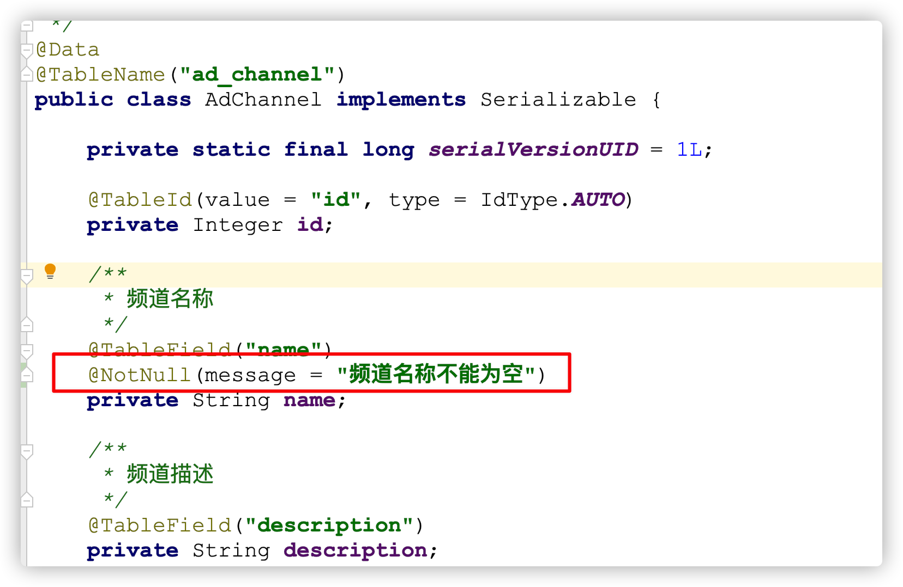
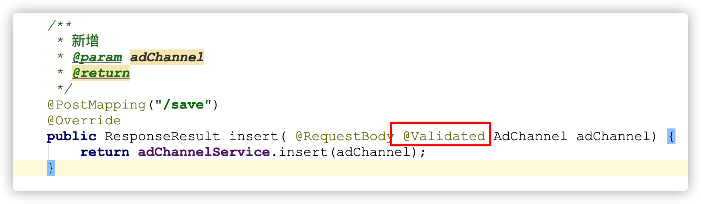

# 参数校验框架

## 1 项目业务分析

 在开发中经常需要写一些字段校验的代码，比如**字段非空**，**字段长度限制**，**邮箱格式验证**，**手机号验证**等等，写这些与业务逻辑关系不大的代码有以下问题：

- 验证代码繁琐，重复劳动
- 方法内代码显得冗长
- 每次要看哪些参数验证是否完整，需要去翻阅验证逻辑代码

使用 hibernate validator（[官方文档](http://hibernate.org/validator/documentation/)）提供了一套比较完善、便捷的验证实现方式。

## 2 hibernate validator 接入

### 2.1 Validator介绍

[Bean Validation](https://docs.jboss.org/hibernate/validator/4.2/reference/zh-CN/html_single/#validator-gettingstarted-createmodel)是Java定义的一套基于注解的数据校验规范，目前已经从JSR 303的1.0版本升级到JSR 349的1.1版本，再到JSR 380的2.0版本（2.0完成于2017.08），已经经历了三个版本 。`spring-boot-starter-web`包里面有`hibernate-validator`包，不需要引用hibernate validator依赖。

### 2.2 常用注解

| **注解**                      | **详细信息**                                             |
| ----------------------------- | -------------------------------------------------------- |
| `@Null`                       | 被注释的元素必须为 `null`                                |
| `@NotNull`                    | 被注释的元素必须不为 `null`                              |
| `@AssertTrue`                 | 被注释的元素必须为 `true`                                |
| `@AssertFalse`                | 被注释的元素必须为 `false`                               |
| `@Min(value)`                 | 被注释的元素必须是一个数字，其值必须大于等于指定的最小值 |
| `@Max(value)`                 | 被注释的元素必须是一个数字，其值必须小于等于指定的最大值 |
| `@DecimalMin(value)`          | 被注释的元素必须是一个数字，其值必须大于等于指定的最小值 |
| `@DecimalMax(value)`          | 被注释的元素必须是一个数字，其值必须小于等于指定的最大值 |
| `@Size(max, min)`             | 被注释的元素的大小必须在指定的范围内                     |
| `@Digits (integer, fraction)` | 被注释的元素必须是一个数字，其值必须在可接受的范围内     |
| `@Past`                       | 被注释的元素必须是一个过去的日期                         |
| `@Future`                     | 被注释的元素必须是一个将来的日期                         |
| `@Pattern(value)`             | 被注释的元素必须符合指定的正则表达式                     |

**Hibernate Validator 附加的 constraint**

| **注解**                                 | **详细信息**                           |
| ---------------------------------------- | -------------------------------------- |
| `@Email`                                 | 被注释的元素必须是电子邮箱地址         |
| `@Length(min=,max=)`                     | 被注释的字符串的大小必须在指定的范围内 |
| `@NotEmpty`                              | 被注释的字符串的必须非空               |
| `@Range(min=,max=)`    operation   0   1 | 被注释的元素必须在合适的范围内         |
| `@NotBlank`                              | 验证字符串非null，且长度必须大于0      |

**注意**：

- @NotNull 适用于任何类型被注解的元素必须不能与NULL
- @NotEmpty 适用于String Map或者数组不能为Null且长度必须大于0
- @NotBlank 只能用于String上面 不能为null,调用trim()后，长度必须大于0

### 2.3 接入项目

（1）在 heima-leadnews-model 中引入依赖**（已引）**

```xml
<!--参数校验-->
<dependency>
    <groupId>org.springframework.boot</groupId>
    <artifactId>spring-boot-starter-validation</artifactId>
</dependency>
```

（2）在需要的参数或实体类上添加相关注解



（3）在Controller类对应的方法 添加 `@Validated`   注解



（4）启动测试

（5）添加全局异常处理 ExceptionCatch

```java
/**
     * 参数校验
     * @return
     */
    @ExceptionHandler(MethodArgumentNotValidException.class)
    public ResponseResult handleValidationException(MethodArgumentNotValidException ex) {
        log.error("MethodArgumentNotValidException ex:{}", ex);
        ex.printStackTrace();
        return ResponseResult.errorResult(AppHttpCodeEnum.PARAM_INVALID, ex.getBindingResult().getFieldError().getDefaultMessage());
    }
```

测试运行查看结果

### 2.4 分组校验

当前存在问题描述：

* 执行新增：需要校验频道名称

* 执行修改：需要校验频道名称、频道ID

如果直接在实体类上添加对应的注解，无论执行上面请求只要有当前的注解都会执行校验操作。

validator的分组验证功能，就是解决这个问题的。

具体实现步骤如下：

（1）`heima-leadnews-model`工程定义两个分组接口

```java
package com.heima.model.common.validator;

/**
 * @Description: 自定义 新增校验 分组
 * @Version: V1.0
 */
public interface ValidatorAdd {
}
```

```java
package com.heima.model.common.validator;

/**
 * @Description: 自定义 修改校验 分组
 * @Version: V1.0
 */
public interface ValidatorUpdate {
}
```

（2）在实体类添加对应的分组

如果同时需要校验，则都添加对应的分组，否则添加对应分组即可

```java
@TableId(value = "id", type = IdType.AUTO)
@NotNull(message = "主键不能为空", groups = {HeimaValidatorUpdate.class})
private Integer id;  // 修改校验

@NotNull(message = "频道名称不能为空",groups = {HeimaValidatorAdd.class, HeimaValidatorUpdate.class})  // 添加和修改都校验
private String name;
```

（3）在 Controller类对应的方法上添加对应的分组

```java
public ResponseResult insert( @RequestBody @Validated({HeimaValidatorAdd.class}) AdChannel adChannel) {
    return adChannelService.insert(adChannel);
}

public ResponseResult update(@RequestBody @Validated({HeimaValidatorUpdate.class}) AdChannel adChannel) {
  return adChannelService.update(adChannel);
}
```

总结：**分组顺序校验时，按指定的分组先后顺序进行验证，前面的验证不通过，后面的分组就不行验证。**

