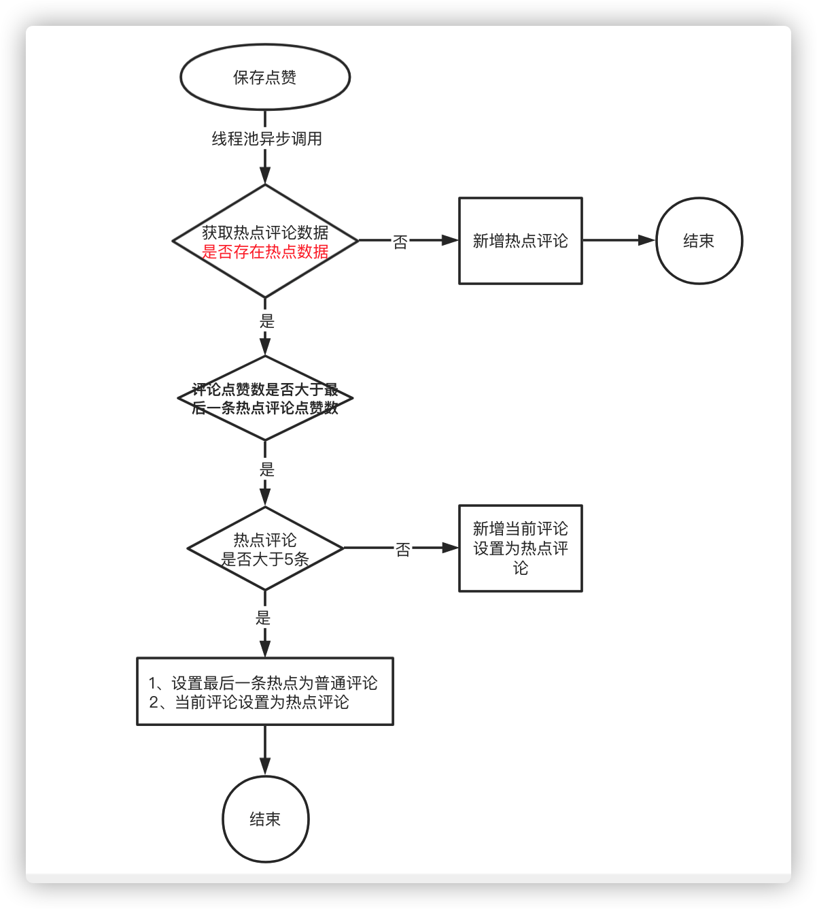
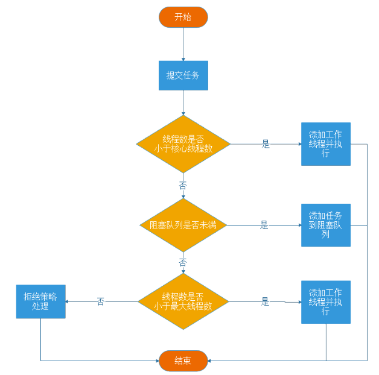
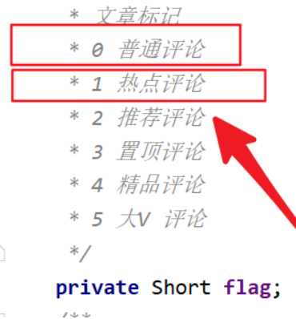

# 第十一章 app端评论系统开发

## 今日目标

- 能够完成app端评论的查询、发表、点赞等功能
- 能够完成app端评论回复的查询，发表、点赞功能
- 能够完成热点评论功能（异步处理 线程池）
- 能够使用jmeter工具进行接口并发测试
- 能够使用分布式锁(redis)

## 1 app端评论-发表评论

### 1.1 需求分析


- 文章详情页下方可以查看评论信息，按照**点赞数量倒序**排列，展示**评论内容、评论的作者、点赞数、回复数、时间**，默认查看10条评论，如果想查看更多，可以滚动鼠标滚轮进行分页
- 可以针对当前文章发布评论
- 可以针对于某一条评论进行点赞操作

### 1.2 思路分析

(1) mongodb的实体类需要使用@Document注解 

(2)数据映射

对应实体及注解配置

```java
package com.heima.model.comment.pojos;

import lombok.Data;
import org.springframework.data.mongodb.core.mapping.Document;

import java.math.BigDecimal;
import java.util.Date;

/**
 * APP评论信息
 */
@Data
@Document("ap_comment")
public class ApComment {
    /**
     * id
     */
    private String id;
    /**
     * 用户ID  评论的用户ID（当前登录人ID  apUserId）
     */
    private Integer authorId;
    /**
     * 用户昵称
     */
    private String authorName;

    /**
     * 文章id或动态id
     */
    private Long articleId;
      /**
     * 评论内容类型
     * 0 文章
     * 1 动态
     */
    private Short type;
    /**
     * 频道ID
     */
    private Integer channelId;
    /**
     * 评论内容 不能大于140个字
     */
    private String content;
    /**
     * 登录人头像
     */
    private String image;
    /**
     * 点赞数
     */
    private Integer likes;
    /**
     * 回复数
     */
    private Integer reply;
    /**
     * 文章标记
     * 0 普通评论
     * 1 热点评论
     * 2 推荐评论
     * 3 置顶评论
     * 4 精品评论
     * 5 大V 评论
     */
    private Short flag;
    /**
     * 经度
     */
    private BigDecimal longitude;

    /**
     * 维度
     */
    private BigDecimal latitude;

    /**
     * 地理位置
     */
    private String address;

    /**
     * 评论排列序号
     */
    private Integer ord;

    /**
     * 创建时间
     */
    private Date createdTime;

    /**
     * 更新时间
     */
    private Date updatedTime;

}
```

**APP评论信息点赞**

```java
package com.heima.model.comment.pojos;

import lombok.Data;
import org.springframework.data.mongodb.core.mapping.Document;

/**
 * APP评论信息点赞
 */
@Data
@Document("ap_comment_like")
public class ApCommentLike {

    /**
     * id
     */
    private String id;

    /**
     * 用户ID
     */
    private Integer authorId;

    /**
     * 评论id
     */
    private String commentId;

    /**
     * 0：点赞
     * 1：取消点赞
     */
    private Short operation;
}
```


评论与评论点赞表是一对多关系，一条评论可以让多个app用户点赞

（2）思路分析

根据文章id发表评论，输入内容发表评论，评论内容不能超过140字，**评论内容需要做文本垃圾检测**

### 1.3 功能实现

#### 1.3.1 创建评论微服务

（1）创建项目`comment-service`


（2）pom依赖

```xml
<dependencies>
    <!--mongoDB-->
    <dependency>
        <groupId>org.springframework.boot</groupId>
        <artifactId>spring-boot-starter-data-mongodb</artifactId>
    </dependency>
</dependencies>
```

（3）评论服务 `bootstrap.yml`

```yml
spring:
  application:
    name: leadnews-comment # 服务名称
  profiles:
    active: dev # 开发环境配置
    ip: 192.168.200.130  # 环境ip地址
  cloud:
    nacos:
      discovery: # 注册中心地址配置
        server-addr: ${spring.profiles.ip}:8848
        namespace: ${spring.profiles.active}
      config: # 配置中心地址配置
        server-addr: ${spring.profiles.ip}:8848
        namespace: ${spring.profiles.active}
        file-extension: yml # data-id 后缀
        name: ${spring.application.name} # data-id名称
        shared-configs: # 共享配置
          - data-id: share-feign.yml
            group: DEFAULT_GROUP
            refresh: false
```


（4）**配置中心** `leadnews-comment.yml`

其中自动配置项去除了关于数据源的配置，因为这个项目不需要查询数据库，查询的mongodb

```yaml
server:
  port: 9006
spring:
  autoconfigure:
    exclude: org.springframework.boot.autoconfigure.jdbc.DataSourceAutoConfiguration,org.springframework.boot.autoconfigure.jdbc.DataSourceTransactionManagerAutoConfiguration
  data:
    mongodb:
      host: ${spring.profiles.ip}
      port: 27017
      database: leadnews-comment
  redis:
    host: ${spring.profiles.ip}
    password: root
```

#### 1.3.2 其他配置准备

(1)获取当前登录用户信息

评论必须在登录的情况下才能发布，所以需要验证用户获取用户信息,添加过滤类：

```java
package com.heima.comment.filter;
import com.heima.model.threadlocal.AppThreadLocalUtils;
import com.heima.model.user.pojos.ApUser;
import org.slf4j.Logger;
import org.slf4j.LoggerFactory;
import org.springframework.core.annotation.Order;
import org.springframework.stereotype.Component;
import org.springframework.web.filter.GenericFilterBean;
import javax.servlet.FilterChain;
import javax.servlet.ServletException;
import javax.servlet.ServletRequest;
import javax.servlet.ServletResponse;
import javax.servlet.annotation.WebFilter;
import javax.servlet.http.HttpServletRequest;
import javax.servlet.http.HttpServletResponse;
import java.io.IOException;
@Component
@Order(1)
@WebFilter(filterName = "appTokenFilter", urlPatterns = "/*")
public class AppTokenFilter extends GenericFilterBean {
    Logger logger = LoggerFactory.getLogger(AppTokenFilter.class);
    @Override
    public void doFilter(ServletRequest req, ServletResponse res, FilterChain chain) throws IOException, ServletException {
        HttpServletRequest request = (HttpServletRequest) req;
        HttpServletResponse response = (HttpServletResponse) res;
        // 测试和开发环境不过滤
        String userId = request.getHeader("userId");
        //如果userId为0，说明当前设备没有登录
        if(userId!=null && Integer.valueOf(userId).intValue()!=0){
            ApUser apUser = new ApUser();
            apUser.setId(Integer.valueOf(userId));
            AppThreadLocalUtils.setUser(apUser);
        }
        chain.doFilter(req,res);
    }
}
```

#### 1.3.3 前端请求DTO

发表评论:CommentSaveDto

```java
package com.heima.model.comment.dtos;
import lombok.Data;
import org.hibernate.validator.constraints.Length;
import javax.validation.constraints.NotBlank;
import javax.validation.constraints.NotNull;
@Data
public class CommentSaveDTO {
    /**
     * 文章id
     */
    private Long articleId;
    /**
     * 评论内容
     */
    private String content;
}
```

#### 1.3.4 用户微服务远程接口准备

评论中需要查询登录的用户信息，所以需要定义远程feign接口根据用户id获取用户信息

在user的微服务中新增业务层层接口，mapper在之前已经定义完成

```java
package com.heima.user.service;

import com.baomidou.mybatisplus.extension.service.IService;
import com.heima.model.user.pojos.ApUser;
public interface ApUserService extends IService<ApUser>{
}
```

实现类：

```java
package com.heima.user.service.impl;
import com.baomidou.mybatisplus.extension.service.impl.ServiceImpl;
import com.heima.model.user.pojos.ApUser;
import com.heima.user.mapper.ApUserMapper;
import com.heima.user.service.ApUserService;
import org.springframework.stereotype.Service;
@Service
public class ApUserServiceImpl extends ServiceImpl<ApUserMapper, ApUser> implements ApUserService {
    
}
```

控制层：

```java
package com.heima.user.controller.v1;

import com.heima.model.common.dtos.ResponseResult;
import com.heima.model.user.pojos.ApUser;
import com.heima.user.service.ApUserService;
import io.swagger.annotations.Api;
import io.swagger.annotations.ApiOperation;
import org.springframework.beans.factory.annotation.Autowired;
import org.springframework.web.bind.annotation.*;

@Api(value = "app端用户管理api",tags = "app端用户管理api")
@RestController
@RequestMapping("/api/v1/user")
public class ApUserController {
    @Autowired
    private ApUserService apUserService;
    @ApiOperation("根据id查询apUser信息")
    @GetMapping("/{id}")
    public ResponseResult<ApUser> findUserById(@PathVariable("id") Integer id) {
        return ResponseResult.okResult(apUserService.getById(id));
    }
}
```

**增加feign远程接口**

```java
package com.heima.feigns;
import com.heima.config.HeimaFeignAutoConfiguration;
import com.heima.feigns.fallback.UserFeignFallback;
import com.heima.model.common.dtos.ResponseResult;
import com.heima.model.user.pojos.ApUser;
import org.springframework.cloud.openfeign.FeignClient;
import org.springframework.web.bind.annotation.GetMapping;
import org.springframework.web.bind.annotation.PathVariable;
@FeignClient(value = "leadnews-user", // 调用服务
        fallbackFactory = UserFeignFallback.class, // 服务降级
        configuration = HeimaFeignAutoConfiguration.class) // feign日志配置
public interface UserFeign {
    @GetMapping("/api/v1/user/{id}")
    ResponseResult<ApUser> findUserById(@PathVariable("id") Integer id);
}
```

**添加服务降级类**

```java
package com.heima.feigns.fallback;
import com.heima.feigns.UserFeign;
import com.heima.model.common.dtos.ResponseResult;
import com.heima.model.common.enums.AppHttpCodeEnum;
import com.heima.model.user.pojos.ApUser;
import feign.hystrix.FallbackFactory;
import lombok.extern.slf4j.Slf4j;
import org.springframework.stereotype.Component;
@Component
@Slf4j
public class UserFeignFallback implements FallbackFactory<UserFeign> {
    @Override
    public UserFeign create(Throwable throwable) {
        throwable.printStackTrace();
        return new UserFeign() {
            @Override
            public ResponseResult<ApUser> findUserById(Integer id) {
                log.error("Feign服务降级触发 远程调用:UserFeign  findUserById 失败,参数:{}",id);
                return ResponseResult.errorResult(AppHttpCodeEnum.SERVER_ERROR,"远程服务调用出现异常");
            }
        };
    }
}
```

#### 1.3.5 业务层

业务层接口：

```java
package com.heima.comment.service;
import com.heima.model.comment.dtos.CommentSaveDTO;
import com.heima.model.common.dtos.ResponseResult;
public interface CommentService {
    /**
     * 保存评论
     * @return
     */
    public ResponseResult saveComment(CommentSaveDTO dto);
}
```

**实现类：自己实现**

> 1. 校验参数  
>
>    校验是否登录   
>
>    校验文章id   校验内容不为空  校验内容长度不能大于140个字符 (validated校验)
>
> 2. 阿里云校验评论内容是否违规
>
>    ​    (简单:  此步不做      普通: 阿里云检测有问题提示      高级:  有问题不报异常，替换为**)
>
> 3. 远程查询当前登陆用户信息
>
> 4. 创建评论信息，并保存到mongo

#### 1.3.6 补全控制层

#### 1.3.7 配置网关

修改配置中心 `app-gateway` 网关配置，新增评论微服务路由配置

```yaml
#评论微服务
        - id: leadnews-comment
          uri: lb://leadnews-comment
          predicates:
          - Path=/comment/**
          filters:
          - StripPrefix= 1
```

#### 1.3.8 测试

使用前端或knif4j来测试web接口

## 2 app端评论-点赞评论

### 2.1 需求分析


用户点赞，可以增加点赞数量，点赞后不仅仅要增加点赞数，需要记录当前用户对于当前评论的数据记录

​	用户取消点赞，点赞减一，更新点赞数据


### 2.2 功能实现

#### 2.2.1 前端请求DTO

用户点赞:CommentLikeDto

```java
package com.heima.model.comment.dtos;
import lombok.Data;
@Data
public class CommentLikeDTO {

    /**
     * 评论id
     */
    private String commentId;

    /**
     * 0：点赞
     * 1：取消点赞
     */
    private Short operation;
}
```

#### 2.2.2 业务层

业务层接口：CommentService

```java
/**
     * 点赞评论
     * @param dto
     * @return
     */
public ResponseResult like(CommentLikeDTO dto);
```

**实现类：自己实现**

> 1. 参数校验   
>
>    评论id不能为空  operation必须为 0  或  1
>
> 2. 根据评论id查询评论数据， 为null返回错误信息
>
> 3. 如果是点赞操作 判断是否已经点赞
>
>    点过赞提示 请勿重复点赞
>
>    未点过赞   保存点赞信息到mongo
>
>    并修改评论信息的点赞数量( + 1)
>
> 4. 如果是取消点赞操作  
>
>     删除点赞信息
>
> ​       并修改评论信息的点赞数量( - 1) , 要判断下别减成负数
>
> 5. 返回结果时，需要返回点赞点赞数量  返回的key要求必须是:  likes     

#### 2.2.3 补全控制层

#### 2.2.4 测试

使用postman 或 小刀来测试


## 3 app端评论-评论列表

### 3.1 需求分析


查询评论列表，根据当前文章id进行检索，按照创建时间倒序，分页查询（默认10条数据）

### 3.2 功能实现

#### 3.2.1 前端请求DTO

查询评论列表:CommentDTO

```java
package com.heima.model.comment.dtos;
import lombok.Data;
import javax.validation.constraints.NotNull;
import java.util.Date;
@Data
public class CommentDTO {
    private Long articleId;
    // 最小时间
    private Date minDate;
    //是否是首页
    private Short index;
    // 每页条数
    private Integer size;
}
```

#### 3.2.2 业务层

业务层接口：修改CommentService业务层接口，添加方法

```java
/**
     * 根据文章id查询评论列表
     * @return
     */
public ResponseResult findByArticleId(CommentDTO dto);
```


**如果登录 需要返回的VO**

```java
package com.heima.model.comment.vo;
import com.heima.model.comment.pojos.ApComment;
import lombok.Data;
@Data
public class ApCommentVo extends ApComment {
    /**
     * 0：点赞
     */
    private Short operation;
}
```

**实现类： 自己实现**

> 1. 参数校验 
>
>     校验文章id   
>
>    校验size  
>
> 2. 根据条件查询评论列表 
>
>    (文章id  , 创建时间 小于最小时间 , 截取size条记录 , 创建时间降序)
>
> 3. 判断当前用户是否登录
>
> 4. 如果未登录直接返回评论列表
>
> 5. 如果登录了 需要检查在当前评论列表中 哪些评论登陆人点赞过
>
>    (将所有ApComment 转成 ApCommentVO , 点过赞的operation设置为0)
>
>    推荐实现:
>
>    5.1 根据当前列表中评论id  和  登录人id 查询评论点赞表，得到点赞数据
>
>    ​              commentId  in    评论id列表   authorId = 登录人id
>
>    5.2 遍历评论列表    
>
>    ​          将每一个评论  ApComment 转成 ApCommentVO
>
>    ​          其中  如果当前评论id在点赞记录中存在  设置operation字段为0  不存在不用做任何处理


#### 3.2.3 补全控制层


#### 3.2.4 测试

使用前端来测试

## 4 app端评论回复-发表回复、点赞回复、回复列表

### 4.1 需求分析


1. 当用户点击了评论中的**回复**就可以查看当前评论回复内容列表

2. 可以针对当前评论进行回复，需要更新评论的回复数量

3. 可以对当前评论回复列表进行点赞操作，同时记录当前回复评论点赞信息

### 4.2 思路分析

（1）数据实体

操作数据实体为mongodb中的集合，评论回复集合是ap_comment_repay，需要在studo3t中创建该集合

对应实体类为：

```java
package com.heima.model.comment.pojos;
import lombok.Data;
import org.springframework.data.annotation.Id;
import org.springframework.data.mongodb.core.mapping.Document;
import java.math.BigDecimal;
import java.util.Date;
/**
 * APP评论回复信息
 */
@Data
@Document("ap_comment_repay")
public class ApCommentRepay {
    /**
     * id
     */
    @Id
    private String id;
    /**
     * 用户ID
     */
    private Integer authorId;
    /**
     * 用户昵称
     */
    private String authorName;
    /**
     * 评论id
     */
    private String commentId;
    /**
     * 回复内容
     */
    private String content;
    /**
     * 点赞数
     */
    private Integer likes;
    /**
     * 经度
     */
    private BigDecimal longitude;
    /**
     * 维度
     */
    private BigDecimal latitude;
    /**
     * 地理位置
     */
    private String address;
    /**
     * 创建时间
     */
    private Date createdTime;

    /**
     * 更新时间
     */
    private Date updatedTime;

}
```

APP评论回复信息点赞信息

```java
package com.heima.model.comment.pojos;


import lombok.Data;
import org.springframework.data.mongodb.core.mapping.Document;

/**
 * APP评论回复信息点赞信息
 */
@Data
@Document("ap_comment_repay_like")
public class ApCommentRepayLike {

    /**
     * id
     */
    private String id;

    /**
     * 用户ID
     */
    private Integer authorId;

    /**
     * 评论id
     */
    private String commentRepayId;

    /**
     * 0：点赞
     * 1：取消点赞
     */
    private Short operation;
}
```


（2）思路分析：

1. 用户点击**回复**，根据当前评论id查询对应的所有回复进行展示
2. 用户针对于当前的评论进行了回复，需要保存数据，同时需要更新当前评论的回复数
3. 可以对回复列表进行点赞操作

### 4.3 功能实现  

功能和上面上个接口类型，一次性准备好**DTO** 和 **Service**


加载评论回复列表参数：CommentRepayDto

```java
package com.heima.model.comment.dtos;
import lombok.Data;
import java.util.Date;
@Data
public class CommentRepayDTO {
    /**
     * 评论id
     */
    private String commentId;
    private Integer size;
    // 最小时间
    private Date minDate;
}
```

保存回复内容参数：CommentRepaySaveDto

```java
package com.heima.model.comment.dtos;

import lombok.Data;

@Data
public class CommentRepaySaveDTO {
    /**
     * 评论id
     */
    private String commentId;
    /**
     * 回复内容
     */
    private String content;
}
```

点赞回复内容参数：CommentRepayLikeDto

```java
package com.heima.model.comment.dtos;

import lombok.Data;

@Data
public class CommentRepayLikeDTO {
    /**
     * 回复id
     */
    private String commentRepayId;
    /**
     * 0：点赞
     * 1：取消点赞
     */
    private Short operation;
}
```

(2) 业务层

评论回复业务层接口

```java
package com.heima.comment.service;
import com.heima.model.comment.dtos.CommentRepayDto;
import com.heima.model.comment.dtos.CommentRepayLikeDto;
import com.heima.model.comment.dtos.CommentRepaySaveDto;
import com.heima.model.common.dtos.ResponseResult;
/**
 * 评论回复
 */
public interface CommentRepayService {
    /**
     * 查看更多回复内容
     * @param dto
     * @return
     */
    public ResponseResult loadCommentRepay(CommentRepayDTO dto);
    /**
     * 保存回复
     * @return
     */
    public ResponseResult saveCommentRepay(CommentRepaySaveDTO dto);
    /**
     * 点赞回复的评论
     * @param dto
     * @return
     */
    public ResponseResult saveCommentRepayLike(CommentRepayLikeDTO dto);
}
```

加载评论回复列表数据封装类

```java
package com.heima.model.comment.vo;

import com.heima.model.comment.pojos.ApCommentRepay;
import lombok.Data;

@Data
public class ApCommentRepayVO extends ApCommentRepay {
    /**
     * 0：点赞
     * 1：取消点赞
     */
    private Short operation;
}
```


**实现类 自己实现**


加载评论回复列表

>1. 校验参数  
>
>    评论id不能为空  size为null 或 0 设置为10  最小日期为空 设置为当前
>
>2. 条件查询评论回复信息
>
>​	条件:  commentId = 评论id and createdTime 小于 minDate  创建时间 降序  limit size
>
>3. 检查是否登录
>
>​	3.1 如果未登录直接 返回评论回复列表
>
>​	3.2 如果登录，需要判断哪些回复点过赞
>
>​	思路: 
>
>​	     基于当前列表 回复id集合  及  登录人id 查询回复点赞列表
>
>​	     遍历 当前回复列表，将每一个回复信息 封装成 vo
>
>​	     判断当前回复id 在点赞信息中是否存在，如果存在 operation设置为0 不存在不做处理

保存评论回复

>1. 参数校验: 
>
>   是否登录  评论id是否为空  内容是否为空  内容是否大于140个字符
>
>   回复内容安全校验
>
>   ​     简单: 不校验      普通: 阿里云内容检查，有问题抛异常     困难：阿里云内容检查，有问题替换为**
>
>2. 根据评论id查询评论信息  检查是否存在
>
>3. 保存评论回复信息
>
>4. 修改评论信息中回复数量 + 1

保存评论回复点赞信息

>1. 校验参数  
>
>​       回复id不能为空   operation 必须 0 或 1
>
>​       校验登录  (必须登录)
>
>​       校验回复信息是否存在
>
>2. 如果是点赞  判断是否点过赞
>
>​      点过赞提示请勿重复点赞
>
>​      未点过赞， 保存点赞信息
>
>​       并将回复信息的点赞数量字段+1
>
>3. 如果是取消赞  
>
>​      删除点赞信息
>
>​     并将回复信息的点赞数量字段
>
>4. 返回当前回复的最新点赞数量      数据的key:  likes

**(3) 补全控制器**


## 5 热点评论

### 5.1 需求分析

- 如果某一条评论点赞数超过10就可以把它作为热点评论
- 一个文章最多有5条热点评论
- 热点评论需要按照点赞数倒序排序，非热点评论按照评论时间倒序

### 5.2 实现思路

第一：修改点赞方法，如果当前点赞数超过10，则需要计算是否是热点评论

1. 查询当前文章热点评论的所有数据，按照点赞数倒序
2. 如果当前没有热点数据，直接新增
3. 如果当前有热点数据，则判断当前评论的点赞数是否大于热点评论中的最小点赞数
4. 如果当前评论数据大于5条，则替换热点评论中的最后一条数据
5. 如果当前热点评论不满足5条，则直接新增





通过异步线程池的方式计算热点评论

第二：修改查询评论列表方法

- 如果首页
  - 查询热点评论
  - 查询普通评论
  - 合并返回
- 不是首页
  - 正常返回普通评论


### 5.3 线程池准备

使用线程池可以给我们带来很多好处，首先通过线程池中线程的重用，减少创建和销毁线程的性能开销。其次，能控制线程池中的并发数，否则会因为大量的线程争夺CPU资源造成阻塞。

下面是spring框架封装之后的线程池

```java
package com.heima.comment.config;
import lombok.Data;
import org.springframework.context.annotation.Bean;
import org.springframework.context.annotation.Configuration;
import org.springframework.scheduling.annotation.EnableAsync;
import org.springframework.scheduling.concurrent.ThreadPoolTaskExecutor;
import java.util.concurrent.ThreadPoolExecutor;
@Data
@Configuration
@EnableAsync //开启异步请求
public class ThreadPoolConfig {
  
    private static final int corePoolSize = 10;   // 核心线程数（默认线程数）
    private static final int maxPoolSize = 100;   // 最大线程数
    private static final int keepAliveTime = 10;  // 允许线程空闲时间（单位：默认为秒）
    private static final int queueCapacity = 500; // 缓冲队列数
    /**
     * 默认异步线程池
     * @return
     */
    @Bean("taskExecutor")
    public ThreadPoolTaskExecutor taskExecutor(){
        ThreadPoolTaskExecutor pool = new ThreadPoolTaskExecutor();
        pool.setThreadNamePrefix("--------------全局线程池-----------------");
        pool.setCorePoolSize(corePoolSize);
        pool.setMaxPoolSize(maxPoolSize);
        pool.setKeepAliveSeconds(keepAliveTime);
        pool.setQueueCapacity(queueCapacity);
        // 直接在execute方法的调用线程中运行
        pool.setRejectedExecutionHandler(new ThreadPoolExecutor.CallerRunsPolicy());
        // 初始化
        pool.initialize();
        return pool;
    }
}
```

Reject策略预定义有四种： 

- ThreadPoolExecutor.AbortPolicy策略，是默认的策略,处理程序遭到拒绝将抛出运行时 RejectedExecutionException。 
- ThreadPoolExecutor.CallerRunsPolicy策略 ,调用者的线程会执行该任务,如果执行器已关闭,则丢弃. 
- ThreadPoolExecutor.DiscardPolicy策略，不能执行的任务将被丢弃. 
- ThreadPoolExecutor.DiscardOldestPolicy策略，如果执行程序尚未关闭，则位于工作队列头部的任务将被删除，然后重试执行程序（如果再次失败，则重复此过程）

线程池工作流程：



### 5.4 修改点赞方法

**新增业务层方法，专门用来计算热点评论**

```java
package com.heima.comment.service;
import com.heima.model.comment.pojos.ApComment;
public interface CommentHotService {
    /**
     * 查找热点评论
     */
    public void hotCommentExecutor(ApComment apComment);
}
```

**点赞方法中 注入计算热点service**

并在**评论点赞**成功后，添加如下代码



> 判断 如果点赞数量大于等于10 ， 并且当前评论还是普通评论 (flag = 0)
>
> 调用计算热点评论方法


**实现类 自己实现**

```java
@Service
@Slf4j
public class CommentHotServiceImpl implements CommentHotService {
    @Autowired
    MongoTemplate mongoTemplate;
    /**
     * 处理热点评论
     * @param apComment 评论信息
     */
    // Async代表异步执行
    // taskExecutor是我们在配置中定义的线程池
    // Spring会使用线程池中的线程 异步执行此方法
    @Async("taskExecutor")
    public void hotCommentExecutor(ApComment apComment) {
        log.info("异步计算热点文章==================> 开始");
        // 1. 查询当前文章下的所有热点评论集合
        //     1.1 按照文章id   flag=1(热点文章)   点赞降序
        // 2. 如果 热评集合为空  或  热评数量小于5 直接将当前评论改为热评
        // 3. 如果热评数量大于等于 5  
        // 3.1  获取热评集合中 最后点赞数量最少的热评
        // 3.2 和当前评论点赞数量做对比  谁的点赞数量多 改为热评
        log.info("异步计算热点文章==================> 结束");
    }
}
```

### 5.5 修改查询方法

如果当前查询的是第一页的评论信息，需要先查询出热点评论，在查询普通评论

修改查询评论的方法

**伪代码如下：**

```java
    /**
     * 根据 文章id 查询评论列表
     * @param dto
     * @return
     */
    @Override
    public ResponseResult findByArticleId(CommentDto dto) {
        //1 校验参数
        //   ========================需要变更处 start =============================
        //2 查询Mongo文章所有评论列表
        List<ApComment> apCommentList = null;
        if(dto.getIndex().intValue() == 1){ // 判断当前是否是第一页评论
            // 先查询热点评论集合  （最多5条） (条件: flag=1, 文章id, 点赞降序)
            // 新size = size - 热评数量
            // 查询第一页剩余普通评论 (条件: 文章id, flag=0, 时间降序, limit:新size)
            // 合并 热点评论  普通评论   热点list.addAll(普通list)   
        }else {
            // 不是第一页直接查询普通评论
            // (条件: 文章id,flag=0,createdTime小于最小时间,时间降序,limit:size)
        }
        // ========================需要变更处 end =============================
        //3 封装查询结果
        //3.1 用户未登录 直接返回评论列表
        //3.2 用户登录，需要加载当前用户对评论点赞的列表
        return ResponseResult.okResult(apCommentList);
    }
```

### 5.6 测试

启动服务列表：

* user服务
* article服务
* comment服务
* app网关服务
* app前端服务

正常测试：手动修改MongoDB中的点赞数，看热点评论是否改变

异常测试：目的证明是否是异步执行的，在计算热点评论的方法中，手动编写异常，观察是否影响点赞方法执行。


**面试热点：**

**评论模块介绍**

**热点评论实现介绍**

**线程池核心参数介绍**

**项目中线程池的使用**

**如何对api接口进行并发测试**

**分布式锁概念**

**常见分布式锁场景**

**Redission实现分布式锁原理**