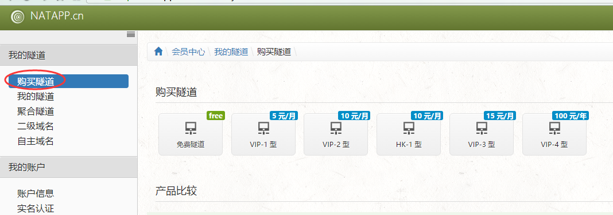
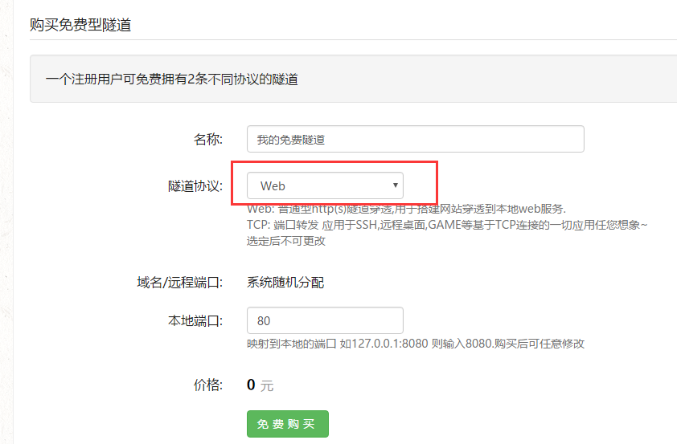
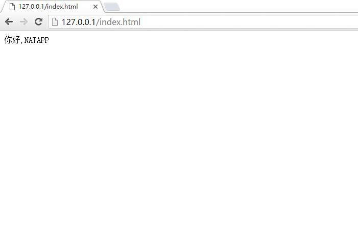
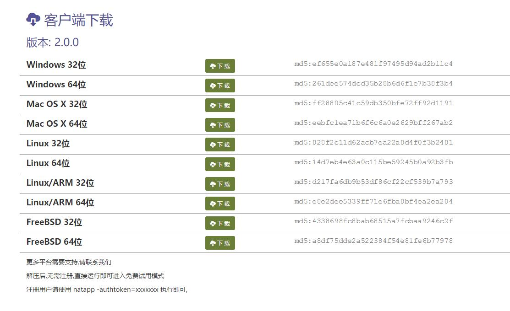
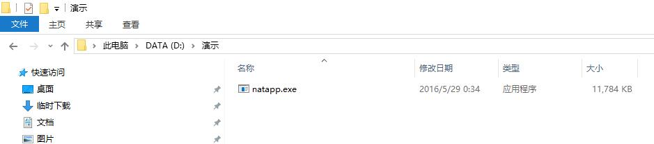
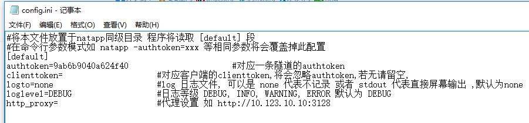
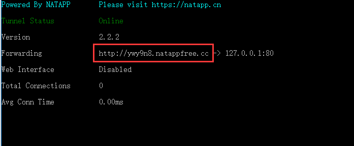
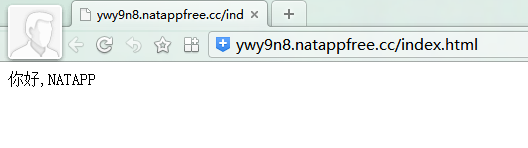

# NATAPP1分钟快速新手图文教程

[分享到：](https://natapp.cn/article/natapp_newbie#)[QQ空间](https://natapp.cn/article/natapp_newbie#)[新浪微博](https://natapp.cn/article/natapp_newbie#)[腾讯微博](https://natapp.cn/article/natapp_newbie#)[人人网](https://natapp.cn/article/natapp_newbie#)[微信](https://natapp.cn/article/natapp_newbie#)

1. 首先在本站注册账号 [点击注册](https://natapp.cn/register)
2. 登录后,点击左边 购买隧道,免费/付费均可
   
3. 根据需要选择隧道协议,这里以web演示,购买隧道
   
4. 本机建立web服务,如 nginx/apache/iis 等,默认80端口

确保 [http://127.0.0.1](http://127.0.0.1/) 可以访问,如



5.在 [natapp.cn](https://natapp.cn/#download) 根据您的本机下载对应的客户端,比如我的本机是win10,64位,则下载Windows 64位的客户端



6.下载之后,解压至任意目录,得到natapp.exe (linux下无需解压,直接 wget)



7.**取得authtoken** 在网站后台,我的隧道处,可以看到刚才购买的隧道


点击复制,即可得到 authtoken 这个authtoken便是您的隧道登录凭证.如这里得到的authtoken为9ab6b9040a624f40


8.**运行natapp**


natapp支持两种运行方式

​    **a) config.ini方式 (推荐)**      根据操作系统下载不同的config.ini文件到刚才下载的natapp.exe同级目录 [详见](https://natapp.cn/article/config_ini)
​    将第7步得到的authtoken填进去 (其他地方都不填),然后保存 
​           

​     windows下,直接双击natapp.exe 即可.


​     在Linux/Mac 下 需要先给执行权限

```
      chmod a+x natapp
```

​     然后再运行
   

```
     ./natapp
```

​     
​     **b) cmd -authtoken= 参数方式运行.**     windows ,点击开始->运行->命令行提示符 后进入 natapp.exe的目录
​    运行

```
          natapp -authtoken=9ab6b9040a624f40
```

​    linux ,同样给予可执行权限之后,运行

​    

```
        ./natapp -authtoken=9ab6b9040a624f40
```

 注意参数输入正确性,不要有多余的空格等!

 
**9.运行成功**,都可以得到如下界面:


Tunnel Status  Online 代表链接成功
Version      当前客户端版本,如果有新版本,会有提示
Forwarding    当前穿透 网址 或者端口
Web Interface  是本地Web管理界面,可在隧道配置打开或关闭,仅用于web开发测试
Total Connections 总连接数
**Avg Conn Time 0.00ms 这里不代表,不代表,不代表 延时,需要注意!**

10.将natapp分配的网址(上图Forwarding ),鼠标选定然后复制下来(选定之后单击鼠标右键),在浏览器中访问,可以看到内网穿透成功了!


该网址  http://ywy9n8.natappfree.cc  就是可以全球访问的网址,可以发给您的小伙伴试试 :)