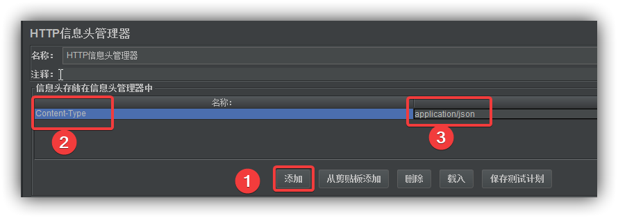
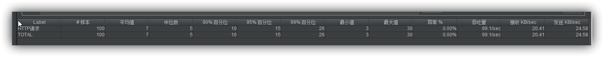
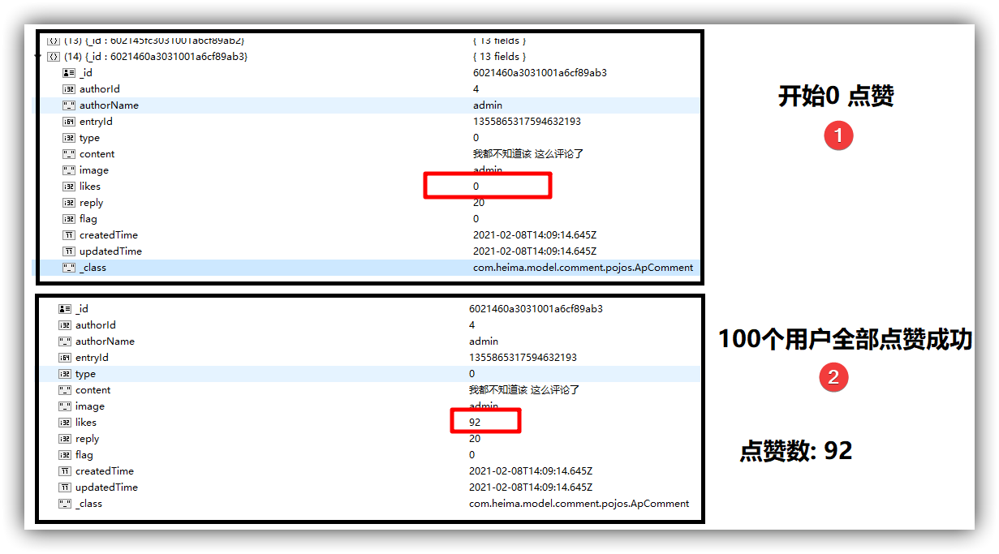

### 1 JMeter介绍

Apache JMeter是Apache组织开发的基于Java的压力测试工具。用于对软件做压力测试，它最初被设计用于Web应用测试，但后来扩展到其他测试领域。 它可以用于测试静态和动态资源，例如静态文件、Java [小服务程序](https://baike.baidu.com/item/%E5%B0%8F%E6%9C%8D%E5%8A%A1%E7%A8%8B%E5%BA%8F/4148836)、CGI 脚本、Java 对象、数据库、[FTP](https://baike.baidu.com/item/FTP/13839) 服务器， 等等。JMeter 可以用于对服务器、网络或对象模拟巨大的负载，来自不同压力类别下测试它们的强度和分析整体性能。另外，JMeter能够对应用程序做功能/[回归测试](https://baike.baidu.com/item/%E5%9B%9E%E5%BD%92%E6%B5%8B%E8%AF%95/1925732)，通过创建带有断言的脚本来验证你的程序返回了你期望的结果。为了最大限度的灵活性，JMeter允许[使用正则表达式](https://baike.baidu.com/item/%E4%BD%BF%E7%94%A8%E6%AD%A3%E5%88%99%E8%A1%A8%E8%BE%BE%E5%BC%8F/6555484)创建断言。

Apache jmeter 可以用于对静态的和动态的资源（文件，Servlet，Perl脚本，java 对象，数据库和查询，[FTP服务器](https://baike.baidu.com/item/FTP%E6%9C%8D%E5%8A%A1%E5%99%A8)等等）的性能进行测试。它可以用于对服务器、网络或对象模拟繁重的负载来测试它们的强度或分析不同压力类型下的整体性能。你可以使用它做性能的图形分析或在大并发[负载测试](https://baike.baidu.com/item/%E8%B4%9F%E8%BD%BD%E6%B5%8B%E8%AF%95/10921210)你的服务器/脚本/对象。


### 2 JMeter安装及配置

**安装**

拷贝资料中的jmeter压缩包，到你要安装的目录中 解压即可（不要有中文目录哦）

**配置**

配置jmeter环境变量  如：我的安装位置 D:\tools\apache-jmeter-5.1.1

配置 JMETER_HOME，变量值

```
// 改成自己的路径
D:\tools\apache-jmeter-5.1.1
```

配置CLASSPATH （没有就新增，有就在后面添加）

```
%JMETER_HOME%\lib\ext\ApacheJMeter_core.jar;
%JMETER_HOME%\lib\jorphan.jar;
%JMETER_HOME%\lib\logkit-2.0.jar;
```

 配置Path (没有就新增，有就在后面添加)

```
 %JMETER_HOME%/bin
```


### 3 运行JMeter

**启动jmeter**

到安装目录的bin目录下，双击`jmeter.bat`     (windows系统)

双击后等待一会，弹出如下图片代表启动成功


默认的语言设置是英文  可以通过：`options --> choose language --> chinese simple `设置中文简体


### 4 测试指定web接口demo

#### 4.1 模拟多线程同时访问

右键测试计划，依次选择`添加 --> 线程(用户) --> 线程组`


参数说明


```
1. 创建多少个线程同时请求
2. 这些线程在多长时间全部就绪
3. 这些线程的循环次数
```

#### 4.2 配置取样器

右键线程组 依次点击 `添加 --> 取样器 --> http请求` ，模拟http的方式对接口进行测试


参数设置


```
1 自定义请求名称
2 协议 http
3 服务器host或ip
4 端口号
5 请求方式
6 请求uri
7 请求体中的json参数
如:
{
	"commentId": "6021460a3031001a6cf89ab3",
	"operation": 0
}
```

#### 4.3 配置http请求头

右键线程组 依次点击 `添加 --> 配置元件 --> http请求头设置` ，设置http请求头信息


参数配置



```
1 点击添加
2 key输入:Content-Type
3 value输入: application/json;charset=utf8

1 模拟登录用户
2 key输入: userId
3 value输入: 4  
```


#### 4.4 配置结果分析

jmeter有多种对结果的分析统计方式，其中查看结果树可以查看每个线程的请求具体情况，聚合报告主要用于性能分析 根据所有请求线程的结果汇总生成一个综合性的报告


右键http请求 依次选择 

`添加 --> 监听器 --> 查看结果树`

右键http请求 依次选择 

`添加 --> 监听器 --> 聚合报告`


配置后效果


#### 4.5 测试及结果说明

点击绿色箭头开始测试


点击结果树查看每个请求测试结果


点击聚合报告，查看所有请求的平均响应结果



**通过测试可以看出** 

模拟100个用户调用点赞接口，但是mongo中的实际点赞数量为92,说明出现了并发安全问题




**JMeter的聚合结果分析（了解）**

```
Label----每个请求的名称，比如HTTP请求等

#Samples----发给服务器的请求数量

Average----单个请求的平均响应时间 毫秒ms

Median----50%请求的响应时间  毫秒ms

90%Line----90%请求响应时间 毫秒ms

95%Line----95%请求响应时间 毫秒ms

99%Line----99%请求的响应时间 毫秒ms

Min----最小的响应时间 毫秒ms

Max----最大的响应时间 毫秒ms

Error%----错误率=错误的请求的数量/请求的总数

Throughput----吞吐量，默认情况下表示每秒完成的请求数（Request per Second），当使用了 Transaction Controller 时，也可以表示类似 LoadRunner 的 Transaction per Second 数。

Received KB/sec----每秒从服务器端接收到的数据量

Sent KB/sec----每秒从客户端发送的请求的数量

```

### 5 文章点赞功能并发问题

#### 5.1 问题演示

为了方便演示，暂时注释掉 `CommentServiceImpl`中点赞`like`方法中的获取登陆用户部分，直接模拟一个用户

```java
@Override
    public ResponseResult like(CommentLikeDto dto) {
        //1 参数检查 (Validated校验)
        //2 判断用户登录
        ApUser user = AppThreadLocalUtils.getUser();
        if (user == null) {
            return ResponseResult.errorResult(AppHttpCodeEnum.NEED_LOGIN);
        }
        //3 查询评论
        ApComment apComment = mongoTemplate.findById(dto.getCommentId(), ApComment.class);
        if (apComment == null) {
            return ResponseResult.errorResult(AppHttpCodeEnum.DATA_NOT_EXIST);
        }
        // 用户不能重复点赞
        Short operation = dto.getOperation();

        ApCommentLike apCommentLike = mongoTemplate.findOne(
                Query.query(Criteria.where("authorId").is(user.getId())
                        .and("commentId").is(dto.getCommentId())
                ),
                ApCommentLike.class);
        // 注释掉不能多次点赞的代码
//        if (apCommentLike != null && operation.intValue() == 0) {
//            return ResponseResult.errorResult(AppHttpCodeEnum.DATA_EXIST, "已点赞");
//        }

        //..............  省略其它  ..............
        //4 数据返回
        Map<String, Object> resultMap = new HashMap<>();
        resultMap.put("likes",apComment.getLikes());
        return ResponseResult.okResult(resultMap);
    }
```

使用jmeter工具模拟多用户同时访问点赞接口

```
具体测试方法 参照jmeter使用介绍
```

发现当同时有多名用户点赞时，点赞的数据会发生错误， 实际上就是分布式环境下资源访问的并发问题。


#### 5.2 问题解决思路

##### 5.2.1 分布式锁介绍

在分布式系统中，常常 需要去协调他们的动作。如果不同的系统或是同一个系统的不同主机之间共享了一个或一组资源，那么访问这些资源的时候，往往需要互斥来防止彼此干扰来保证一致性，在这种情况下，便需要使用到分布式锁。

分布式锁是： 控制分布式系统之间同步访问共享资源的一种方式。

**实现分布式锁的几种方案**

- 基于数据库实现:

  基于数据库的悲观锁 for update（行锁）实现（写入的并发的太大）

- 基于zookeeper实现:  (CP)

  ​      	基于zookeeper的文件系统及通知机制

- 基于redis的实现（推荐）:

​                  

​      基于redis单线程模型+setnx

**方案对比**：

1：从**理解**的难易程度角度（从低到高）

数据库 >  redis   >  zookeeper

2：从实现的**复杂性**角度（ 从高到低 ）

zookeeper >  redis（Redisson）  > 数据库

3：从**性能**角度（从高到低）

redis   >   zookeeper   >   数据库

4：从**可靠性**角度（从高到低）

zookeeper  >  redis  > 数据库

- [x] 不管是那种分布式锁实现，没有在所有场合都是完美的，所以根据不同的应用场景选择最合适的实现方式。
- [x] 分布式环境中，对资源进行上锁有时候是很重要的，比如抢购某一资源，这时候使用分布式锁就可以很好的控制资源。

**我们选择Redis的方案**: 

1.Redis完全基于内存的 ,性能比Zookeeper高很多

2.另外基于Redission框架的实现已经相对非常高可用，而且api简单很容易整合到项目中。

3.而且redis也是大部分公司的选择，因为redis在其它的使用场景也很多，公司往往都会搭建redis集群。  

**存在的问题**: 在redis master实例宕机的时候，可能导致多个客户端同时完成加锁。


##### 5.2.2 zookeeper实现分布式锁思路(了解)

Zookeeper是一个分布式的，开源的分布式应用协调服务，是Hadoop和Hbase的组件。我们可以基于其

文件节点机制 和 watch监听机制 来实现强一致性的分布式锁功能

**创建zookeeper容器**

```
# 创建zookeeper容器
docker run --name zk --restart always -d -p 2181:2181  zookeeper:3.4.14

# 进入zookeeper容器
docker exec -it zk bash

# 使用命令行客户端 连接 zookeeper服务
bin/zkCli.sh

# 下面的命令都是通过命令行演示
```


**演示节点命令**


> ls /      查看
> create /test 1234             创建节点
> get /test                             获取节点内容
> delete /test                       删除节点
> set /test 3345                   修改节点内容
> create -s    /zk-test    123           创建zk-test顺序节点
>
> create -e /test2/linshi 45678 	 创建临时节点


**演示watch监听**

> ls /zk-test0000000002 watch    监听指定目录的变化
>
> get /test watch   监听指定节点的变化


##### 5.2.2 redis实现分布式锁思路

主要采用redis命令**setnx**（set if not exist）、**setex**（set expire value）实现


按上面图所示，实现分布式锁的思路很简单， 创建key成功代表持有锁，失败说明锁被占用，需要等待并尝试继续获取锁， 持有锁的客户端执行完毕业务代码后会释放锁就是删除key, 这样其它的客户端就可以获取到锁。

但实际上，要实现一个高可用的分布式锁需要满足很多条件：

- **互斥性**：和我们本地锁一样互斥性是最基本的，但是分布式锁需要保证在不同节点的不同线程互斥。
- **可重入性**：同一个节点上的同一个线程如果获取了锁之后，那么也可以再次获取这个锁。
- **锁超时**：和本地锁一样支持锁超时，防止死锁。(redis expiretime)
- **锁的续约**: 当程序响应时间过长时，能够续约锁的时间
- **高效：高可用**：加锁和解锁需要高效，同时也需要保证高可用防止分布式锁失效，可以增加降级。
- **支持阻塞和非阻塞**：和ReentrantLock一样支持Lock和tryLock以及tryLock(long timeout)。 
- **支持公平锁和非公平锁**：公平锁的意思是按照请求加锁的顺序获取锁，非公平锁就相反是无序的，这个一般来说实现的比较少。

那这样，分布式锁就是分布式架构中的比较复杂的问题了，好在有一些开源框架已经帮我们解决了这个问题。apache 的Redisson框架就提供了分布式可重入锁的实现，我们可以直接引入该框架来解决分布式锁问题。

#### 5.3 基于Redisson解决分布式并发问题    

评论微服务  引入redisson依赖   RLock   extends   Lock 

```xml
		<dependency>
            <groupId>org.redisson</groupId>
            <artifactId>redisson</artifactId>
            <version>3.9.1</version>
        </dependency>
```


demo测试分布式锁

```java
package com.heima.comment;
import org.redisson.Redisson;
import org.redisson.api.RLock;
import org.redisson.api.RedissonClient;
import org.redisson.config.Config;
import java.util.concurrent.TimeUnit;
public class RedissionLockTest {
    public static void main(String[] args) {
//        new RedissionLockTest().lockTest();
//        new RedissionLockTest().lockTest2();
//        new RedissionLockTest().lockTest3();
//        new RedissionLockTest().lockTest4();
        new RedissionLockTest().lockTest5();
    }
    public void lockTest(){
        RedissonClient redissonClient = redissonClient();
        RLock mylock = redissonClient.getLock("mylock");
        mylock.lock();
        try {
            System.out.println("执行加锁的同步代码块");
        } finally {
            mylock.unlock();
        }
    }
    public void lockTest2(){
        new Thread(()->{
            RedissonClient redissonClient = redissonClient();
            RLock mylock = redissonClient.getLock("mylock");
            System.out.println("线程1 尝试获取锁");
            mylock.lock();
            try {
                System.out.println("线程1 执行加锁的同步代码块");
                Thread.sleep(20000);
            } catch (InterruptedException e) {
                e.printStackTrace();
            } finally {
                mylock.unlock();
            }
        }).start();
        try {
            Thread.sleep(2000);
        } catch (InterruptedException e) {
            e.printStackTrace();
        }
        new Thread(()->{
            RedissonClient redissonClient = redissonClient();
            RLock mylock = redissonClient.getLock("mylock");
            System.out.println("线程2 尝试获取锁");
            mylock.lock();
            try {
                System.out.println("线程2 执行加锁的同步代码块");
            } finally {
                mylock.unlock();
            }
        }).start();
    }

    public RedissonClient redissonClient() {
        Config config = new Config();
        //指定使用单节点部署方式
        config.useSingleServer()
                .setAddress("redis://192.168.200.130:6379");
        config.useSingleServer().setConnectionPoolSize(500);//设置对于master节点的连接池中连接数最大为500
        config.useSingleServer().setIdleConnectionTimeout(10000);//如果当前连接池里的连接数量超过了最小空闲连接数，而同时有连接空闲时间超过了该数值，那么这些连接将会自动被关闭，并从连接池里去掉。时间单位是毫秒。
        config.useSingleServer().setConnectTimeout(30000);//同任何节点建立连接时的等待超时。时间单位是毫秒。
        config.useSingleServer().setTimeout(3000);//等待节点回复命令的时间。该时间从命令发送成功时开始计时。
        config.useSingleServer().setPingTimeout(30000);
        config.useSingleServer().setPassword("root");
        //获取RedissonClient对象
        RedissonClient redisson = Redisson.create(config);
        //获取锁对象
        return redisson;
    }

    public void lockTest3(){
        RedissonClient redissonClient = redissonClient();
        RLock mylock = redissonClient.getLock("mylock");
        System.out.println("准备获取锁");
        mylock.lock();
        System.out.println("第一次加锁成功 ");
        mylock.lock();
        System.out.println("第二次加锁成功 ");
        mylock.lock();
        System.out.println("第三次加锁成功 ");
        mylock.unlock();
        System.out.println("第一次解锁成功 ");
        mylock.unlock();
        System.out.println("第二次解锁成功 ");
        mylock.unlock();
        System.out.println("第三次解锁成功 ");
    }

    public void lockTest4(){
        RedissonClient redissonClient = redissonClient();
        RLock mylock = redissonClient.getLock("mylock");

        mylock.lock();
        System.out.println("加锁成功  要执行100秒");
        try {
            TimeUnit.SECONDS.sleep(100);
        } catch (InterruptedException e) {
            e.printStackTrace();
        }
        mylock.unlock();
        System.out.println("解锁成功");
    }

    public void lockTest5(){
        new Thread(()->{
            RedissonClient redissonClient = redissonClient();
            RLock mylock = redissonClient.getLock("mylock");
            System.out.println("线程1 尝试获取锁");
            mylock.lock();
            try {
                System.out.println("线程1 执行加锁的同步代码块");
                Thread.sleep(20000);
            } catch (InterruptedException e) {
                e.printStackTrace();
            } finally {
                mylock.unlock();
            }
        }).start();
        try {
            Thread.sleep(2000);
        } catch (InterruptedException e) {
            e.printStackTrace();
        }
        new Thread(()->{
            RedissonClient redissonClient = redissonClient();
            RLock mylock = redissonClient.getLock("mylock");
            System.out.println("线程2 尝试获取锁");
            boolean b = mylock.tryLock();
            if (b) {
                System.out.println("线程2 执行加锁的同步代码块");
                mylock.unlock();
            }else {
                System.out.println("抢锁失败 老子不等了");
            }
        }).start();
    }
}

```

添加配置类`com.heima.common.redisson.RedissionConfig`

```java
package com.heima.comment.config;
import lombok.Data;
import org.redisson.Redisson;
import org.redisson.api.RedissonClient;
import org.redisson.config.Config;
import org.springframework.beans.factory.annotation.Value;
import org.springframework.context.annotation.Bean;
import org.springframework.context.annotation.Configuration;
@Data
@Configuration
public class RedissionConfig {
    @Value("${spring.redis.host:localhost}")
    private String host; // redis地址
    @Value("${spring.redis.port:6379}")
    private String port; // redis端口
    @Value("${spring.redis.password}")
    private String password; // redis端口
    
    
    @Bean
    public RedissonClient likesLock() {
        Config config = new Config();
        //指定使用单节点部署方式
        config.useSingleServer()
                .setAddress("redis://"+host+":"+port+"");
        config.useSingleServer().setConnectionPoolSize(500);//设置对于master节点的连接池中连接数最大为500
        config.useSingleServer().setIdleConnectionTimeout(10000);//如果当前连接池里的连接数量超过了最小空闲连接数，而同时有连接空闲时间超过了该数值，那么这些连接将会自动被关闭，并从连接池里去掉。时间单位是毫秒。
        config.useSingleServer().setConnectTimeout(30000);//同任何节点建立连接时的等待超时。时间单位是毫秒。
        config.useSingleServer().setTimeout(3000);//等待节点回复命令的时间。该时间从命令发送成功时开始计时。
        config.useSingleServer().setPingTimeout(30000);
        config.useSingleServer().setPassword(password);
        //获取RedissonClient对象
        RedissonClient redisson = Redisson.create(config);
        //获取锁对象
        return redisson;
    }
}
```

代码中加锁:

```java
	@Autowired
    RedissonClient redisson;

	@Override
    public ResponseResult like(CommentLikeDto dto) {
        //1.检查参数
        if (dto.getCommentId() == null) {
            return ResponseResult.errorResult(AppHttpCodeEnum.PARAM_REQUIRE);
        }
        //2.判断是否登录
//        ApUser user = AppThreadLocalUtils.getUser();
//        if (user == null) {
//            return ResponseResult.errorResult(AppHttpCodeEnum.NEED_LOGIN);
//        }
        //3.点赞操作
        RLock lock = redisson.getLock("likes-lock");
        rLock.lock();
        ApComment apComment;
        try {
            apComment = mongoTemplate.findById(dto.getCommentId(), ApComment.class);
            if (apComment != null && dto.getOperation() == 0) {
                //更新评论的点赞数量
                apComment.setLikes(apComment.getLikes() + 1);
                mongoTemplate.save(apComment);

                //保存 APP评论信息点赞
                ApCommentLike apCommentLike = new ApCommentLike();
                apCommentLike.setAuthorId(user.getId());
                apCommentLike.setCommentId(apComment.getId());
                // apCommentLike.setOperation(dto.getOperation());
                mongoTemplate.save(apCommentLike);
            } else if (apComment != null && dto.getOperation() == 1) {
                //4.取消点赞
                //更新评论的点赞数量
                apComment.setLikes(apComment.getLikes() < 0 ? 0 : apComment.getLikes() - 1);
                mongoTemplate.save(apComment);
                //更新 APP评论信息点赞
                mongoTemplate.remove(Query.query(Criteria.where("authorId").is(user.getId()).and("commentId").is(apComment.getId())), ApCommentLike.class);

            }
        } finally {
            rLock.unlock();
        }
        //5.数据返回
        Map<String, Object> resultMap = new HashMap<>();
        resultMap.put("likes",apComment.getLikes());
        return ResponseResult.okResult(resultMap);
    }
```

说明:

```
2.  rLock.lock();代表加锁，加锁成功才会往下执行，否则阻塞
3.  rLock.unlock();代表释放锁
4.  释放锁必须在finally中，否则有产生死锁的可能
```

使用jmeter在模拟100个用户同时点赞，则点赞数量为100次不会在出现数量不一致的情况

测试完毕后，不要忘记将注释的代码还原哦


