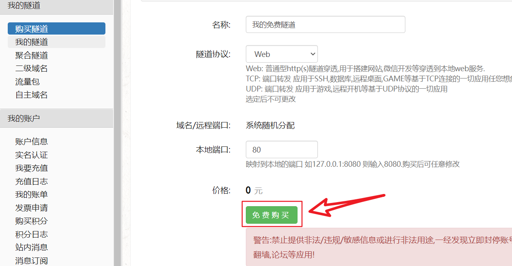
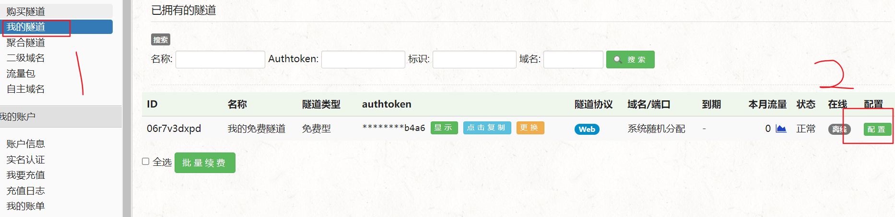
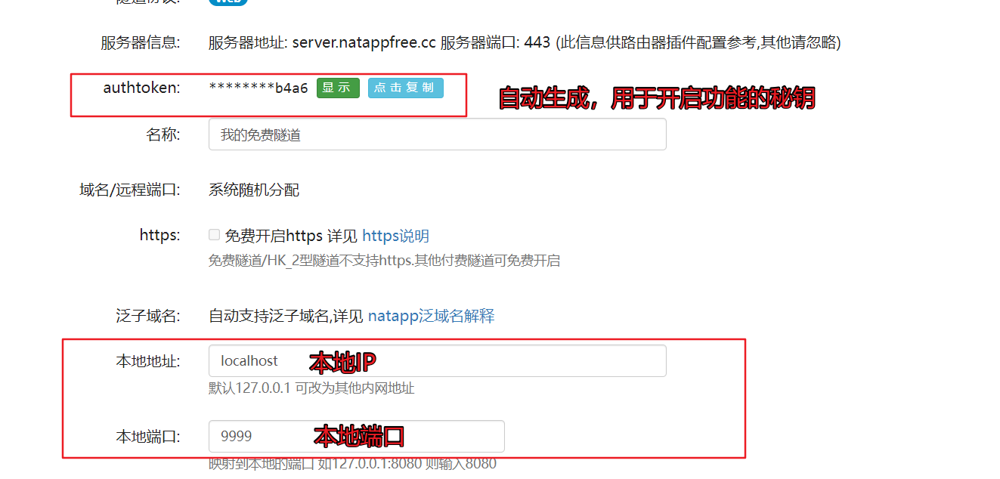
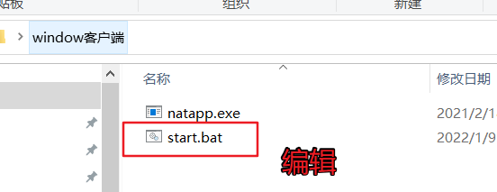
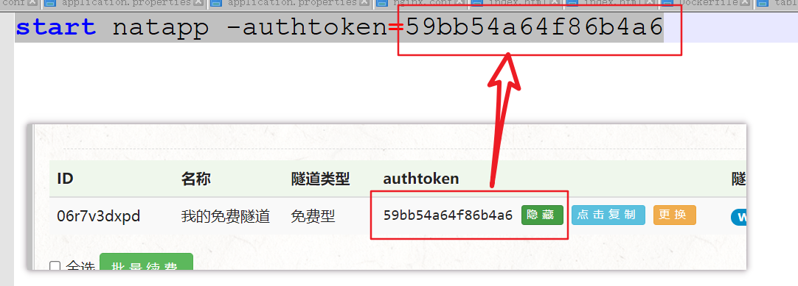
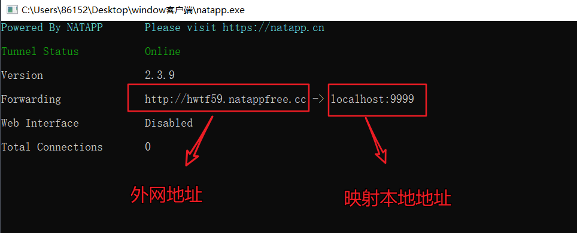
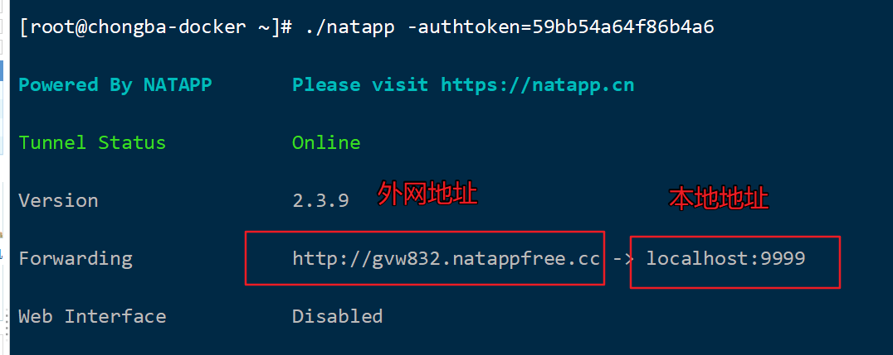

##### **注册 及 配置**

https://natapp.cn/


**购买隧道**


**点击免费购买**




**购买完成，在我的隧道中配置**







##### 启动内网穿透

**windows用户**

```
修改资料中的 start.bat文件

#                      将秘钥改成自己的
start natapp -authtoken=59bb54a64f86b4a6
```








**双击start.bat**

```
可以将外网地址  注册到调度中心中

当云服务器中的调度任务触发时


通知  ====> 外网地址 ====> 转发本地ip+port 
```



**linux用户及mac用户**

mac用户根据实际情况下载客户端    https://natapp.cn/#download

linux用户直接将linux文件夹中的natapp拷贝

 在Linux/Mac 下 需要先给执行权限

```
      chmod a+x natapp
```

​     然后再运行

```
     ./natapp
```

​    linux ,同样给予可执行权限之后,运行

```
./natapp -authtoken=59bb54a64f86b4a6
```

将上面 密钥改成自己的




##### xxljob配置参考

**引入xxljob依赖**

```xml
  <dependency>
    <groupId>com.xuxueli</groupId>
    <artifactId>xxl-job-core</artifactId> 
    <version>2.2.0</version>
  </dependency>
```

**准备xxljob配置**

```java
@Data
@ConfigurationProperties(prefix = "xxljob")
public class XxJobConfigProperties {
    // 调度中心地址 
    private String adminAddress = "http://localhost:8888/xxl-job-admin";
    // 注册 执行器名称
    private String executorName = "default";
    // 当前执行器端口
    private int executorPort;
    // 日志文件输出路径
    private String logPath;
    // 注册到调度中心的  执行器地址
    private String executorAddress;
}
```

**配置执行器**

```java
@Slf4j
@Configuration
@EnableConfigurationProperties(XxJobConfigProperties.class)
public class XxlJobConfig {
	@Autowired
    XxJobConfigProperties xxJobConfigProperties;
    @Bean
    public XxlJobSpringExecutor xxlJobExecutor() {
        log.info(">>>>>>>>>>> xxl-job config init.");
        XxlJobSpringExecutor xxlJobSpringExecutor = new XxlJobSpringExecutor();
        xxlJobSpringExecutor.setAdminAddresses(xxJobConfigProperties.getAdminAddress());
        xxlJobSpringExecutor.setAppname(xxJobConfigProperties.getExecutorName());
        xxlJobSpringExecutor.setPort(xxJobConfigProperties.getExecutorPort());
        xxlJobSpringExecutor.setLogRetentionDays(30);
        xxlJobSpringExecutor.setLogPath(xxJobConfigProperties.getLogPath());
        xxlJobSpringExecutor.setAddress(xxJobConfigProperties.getExecutorAddress());
        return xxlJobSpringExecutor;
    }
}
```

**application.yml中配置**

**如果用的虚拟机:**

```yml
xxljob:
  admin-address: http://192.168.200.130:8888/xxl-job-admin
  executor-name: leadnews-article-executor
  executor-port: 9999
  log-path: C:/xxljob/logs
```

**如果用的云服务器:** 

```yml
xxljob:
  admin-address: http://外网地址:8888/xxl-job-admin
  executor-name: leadnews-article-executor
  executor-port: 9999
  log-path: C:/xxljob/logs
  executor-address: http://uubyp8.natappfree.cc  # 内网穿透地址  
```


