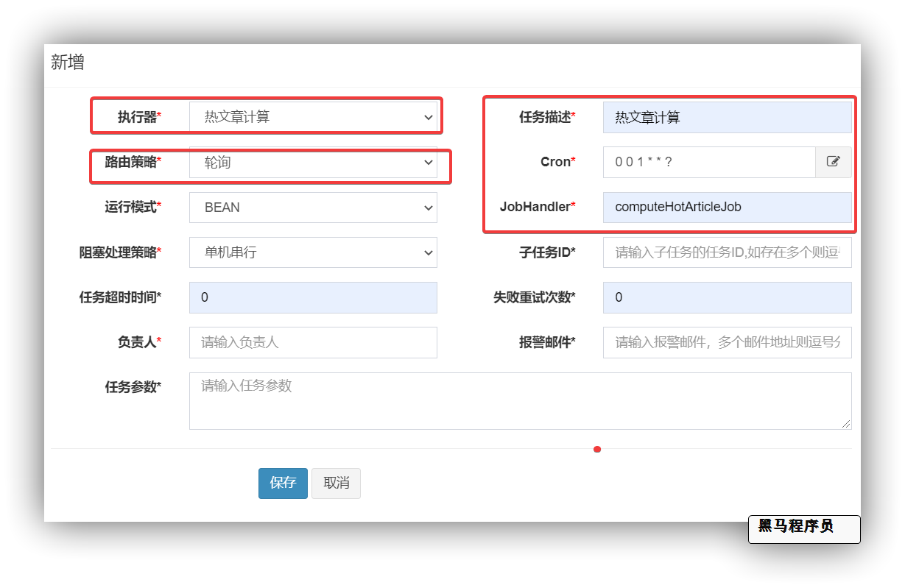
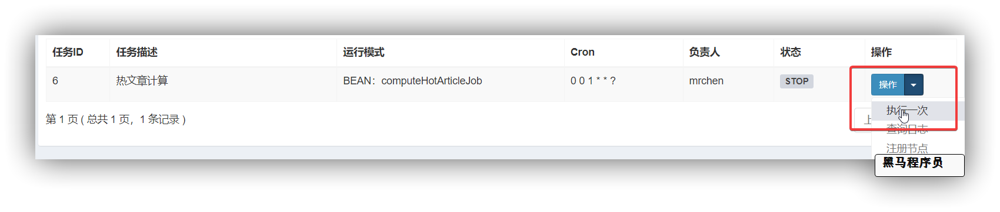
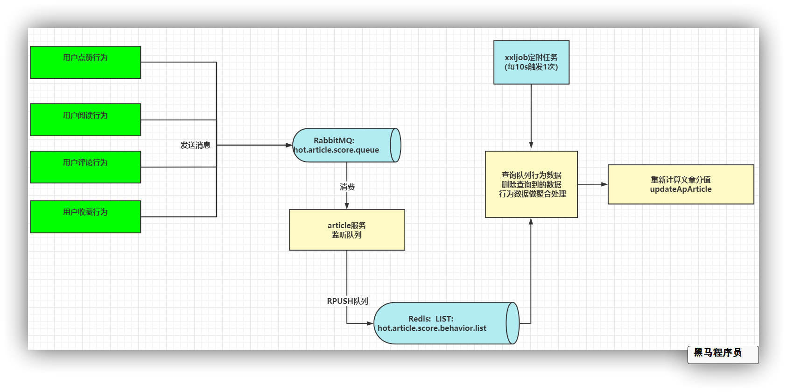
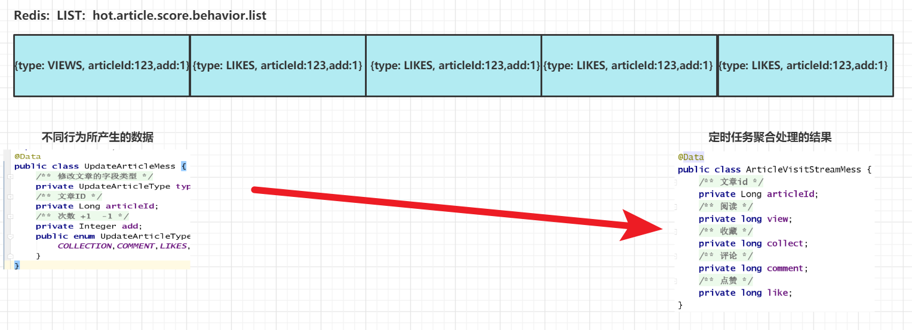
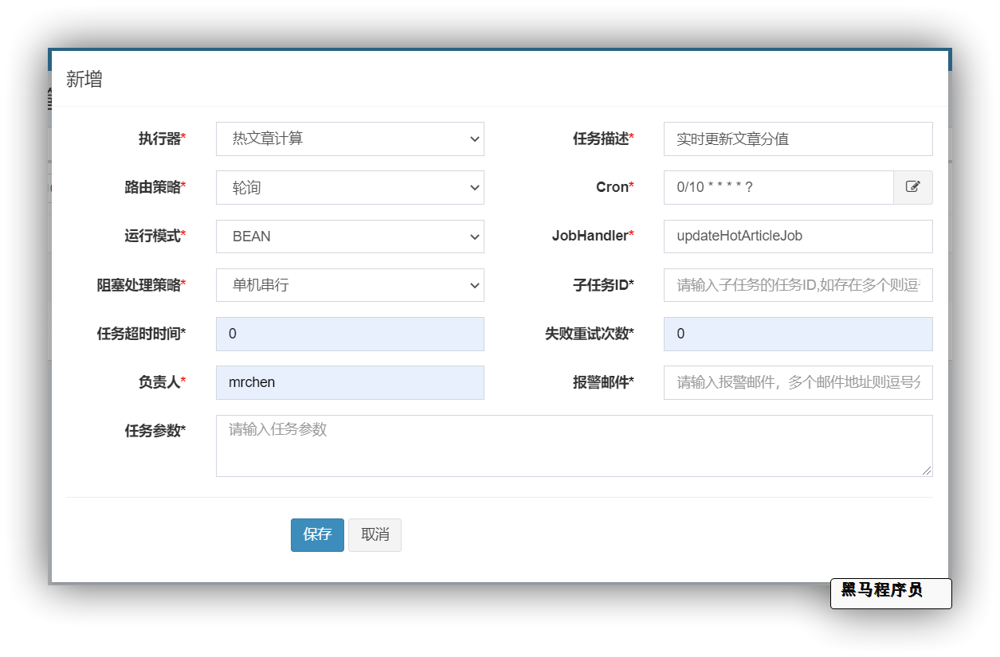

# 第 10章 热点文章缓存优化

## 今日目标

- 能够理解什么是分布式任务调度
- 能够使用xxljob实现定时任务
- 能够理解热点文章缓存优化的思路
- 能够实现热点文章缓存优化


## 1 分布式调度框架xxljob

详细查看资料文件夹中的xxl-job相关文档。

## 2 热点文章整体思路

### 2.1 需求分析

- 筛选出文章列表中最近5天热度较高的文章在每个频道的首页展示
- 根据用户的行为（阅读、点赞、评论、收藏）实时计算热点文章


### 2.2 思路分析

如下图：


整体实现思路共分为4步

**定时计算热点文章**

- 定时任务每天凌晨1点，查询前5天的文章

- 计算每个文章的分值，其中不同的行为设置不同的权重

  **（阅读：1，点赞：3，评论：5，收藏：8）**

- 按照分值排序，给每个频道找出分值较高的30条数据，存入缓存中

  为什么要按照频道缓存？

**实时采集文章行为**

- 行为微服务，用户阅读或点赞了某一篇文章（目前实现这两个功能），发送消息给rabbitMQ
- 文章微服务，接收行为消息，使用redis中list结构存储实时的行为数据

**定时更新热度值**

- ​	文章微服务，接收聚合之后的消息，计算文章分值（当日分值计算方式，在原有权重的基础上再*3）
- ​	根据当前文章的频道id查询缓存中的数据
- ​	当前文章分值与缓存中的数据比较，如果当前分值大于某一条缓存中的数据，则直接替换
- ​	新数据重新设置到缓存中	
- ​	更新数据库文章的行为数量

**查询热点文章列表**

- 判断是否是首页
- 是首页，选择是推荐，tag值为`__all__`，从所有缓存中筛选出分值最高的30条数据返回
- 是首页，选择是具体的频道，tag是具体的数字，从缓存中获取对应的频道中的数据返回
- 不是，则查询数据库中的数据

## 3 热点文章功能实现

### 3.1 文章分值定时计算

#### 3.1.1 思路分析

- 定时任务每天凌晨1点，查询前5天的文章

- 计算每个文章的分值，其中不同的行为设置不同的权重

  **（阅读：1，点赞：3，评论：5，收藏：8）**

- 按照分值排序，给每个频道找出分值较高的30条数据，存入 redis 缓存中


#### 3.1.2 定义定时任务

访问：http://192.168.200.130:8888/xxl-job-admin/

在`xxl-job-admin`中新建执行器和任务（原则上一个项目一个执行器，方便管理）

**新建执行器:**`leadnews-article-executor`


**新建任务：**`computeHotArticleJob`

**其它参数:**  

所属执行器

服务集群时的路由策略

Cron任务时间表达式 

多任务并发触发，执行器的阻塞策略



#### 3.1.3 封装xxljob起步依赖

（1）创建 `heima-schedule-spring-boot-starter` 并引入依赖

```xml
<dependencies>
  <dependency>
    <groupId>com.xuxueli</groupId>
    <artifactId>xxl-job-core</artifactId> 
      <!-- 版本: 2.2.0 -->
  </dependency>

  <dependency>
    <groupId>org.springframework.boot</groupId>
    <artifactId>spring-boot-autoconfigure</artifactId>
  </dependency>
  <dependency>
    <groupId>org.springframework.boot</groupId>
    <artifactId>spring-boot-starter</artifactId>
  </dependency>
  <dependency>
    <groupId>org.springframework.boot</groupId>
    <artifactId>spring-boot-configuration-processor</artifactId>
    <optional>true</optional>
  </dependency>
  <dependency>
    <groupId>org.springframework.boot</groupId>
    <artifactId>spring-boot-starter-actuator</artifactId>
  </dependency>
</dependencies>
```

（2）创建配置类

```java
package com.heima.jobs.config;
import lombok.Data;
import org.springframework.boot.context.properties.ConfigurationProperties;
@Data
@ConfigurationProperties(prefix = "xxljob")
public class XxJobConfigProperties {
    // 调度中心地址
    private String adminAddress = "http://localhost:8888/xxl-job-admin";
    // 注册 执行器名称
    private String executorName = "default";
    // 当前执行器端口
    private int executorPort;
    // 日志文件输出路径
    private String logPath;
    // 注册到调度中心的  执行器地址
    private String executorAddress;
}
```

```java
package com.heima.jobs.config;
import com.xxl.job.core.executor.impl.XxlJobSpringExecutor;
import lombok.extern.log4j.Log4j2;
import org.springframework.beans.factory.annotation.Autowired;
import org.springframework.boot.context.properties.EnableConfigurationProperties;
import org.springframework.context.annotation.Bean;
import org.springframework.context.annotation.Configuration;
@Log4j2
@Configuration
@EnableConfigurationProperties(XxJobConfigProperties.class)
public class XxlJobConfig {
	@Autowired
    XxJobConfigProperties xxJobConfigProperties;
    @Bean
    public XxlJobSpringExecutor xxlJobExecutor() {
        log.info(">>>>>>>>>>> xxl-job config init.");
        XxlJobSpringExecutor xxlJobSpringExecutor = new XxlJobSpringExecutor();
        xxlJobSpringExecutor.setAdminAddresses(xxJobConfigProperties.getAdminAddress());
        xxlJobSpringExecutor.setAppname(xxJobConfigProperties.getExecutorName());
        xxlJobSpringExecutor.setPort(xxJobConfigProperties.getExecutorPort());
        xxlJobSpringExecutor.setLogRetentionDays(30);
        xxlJobSpringExecutor.setLogPath(xxJobConfigProperties.getLogPath());
        xxlJobSpringExecutor.setAddress(xxJobConfigProperties.getExecutorAddress());
        return xxlJobSpringExecutor;
    }
}
```

（3）自动化配置类`META-INF/spring.factories`

```properties
org.springframework.boot.autoconfigure.EnableAutoConfiguration=\
  com.heima.jobs.config.XxlJobConfig
```

#### 3.1.4 xxljob集成到项目

`article服务`引入xxljob通用配置依赖

```xml
<dependency>
  <groupId>com.heima</groupId>
  <artifactId>heima-schedule-spring-boot-starter</artifactId>
  <version>1.0-SNAPSHOT</version>
</dependency>
```


修改配置中心中`leadnews-article.yml`配置，新增以下内容,其中**executor执行器** **地址** 和 **port**要与其他任务区分

```yaml
xxljob:
  admin-address: http://${spring.profiles.ip}:8888/xxl-job-admin
  executor-name: leadnews-article-executor
  executor-port: 9991
  log-path: C:/xxljob/logs
  # executor-address: http://192.168.200.1:9991
```

java程序新建定时任务实现

```java
package com.heima.article.job;

import com.xxl.job.core.biz.model.ReturnT;
import com.xxl.job.core.handler.annotation.XxlJob;
import lombok.extern.log4j.Log4j2;
import org.springframework.beans.factory.annotation.Autowired;
import org.springframework.stereotype.Component;

@Component
@Log4j2
public class ComputeHotArticleJob {
    @XxlJob("computeHotArticleJob")
    public ReturnT<String> handle(String param) throws Exception {
        log.info("热文章分值计算调度任务开始执行....");
        // TODO 待实现热点文章分值计算任务
        log.info("热文章分值计算调度任务完成....");
        return ReturnT.SUCCESS;
    }
}
```

重启article服务，在xxljob中点击执行任务，测试任务是否能够触发



#### 3.1.5 文章分值定时计算

**集成Redis和远程接口准备**

**分值计算不涉及到前端工程，也无需提供api接口，是一个纯后台的功能的开发。**

在`article-service`模块中 pom.xml 添加redis依赖，并引入redis 配置

```xml
		<dependency>
            <groupId>org.springframework.boot</groupId>
            <artifactId>spring-boot-starter-data-redis</artifactId>
        </dependency>
```

配置中心`leadnews-article.yml`配置，添加redis参数

```yaml
spring:
  redis:
    host: ${spring.profiles.ip}
    port: 6379
    password: root
```

**频道列表远程接口准备**

计算完成新热数据后，需要给每个频道缓存一份数据，所以需要查询所有频道信息

① 定义admin的远程接口

```java
@FeignClient(value = "leadnews-admin",
        fallbackFactory = AdminFeignFallback.class,
        configuration = HeimaFeignAutoConfiguration.class
)
public interface AdminFeign {
    @PostMapping("/api/v1/sensitive/sensitives")
    public ResponseResult<List<String>> selectSensitives();
    @GetMapping("/api/v1/channel/one/{id}")
    public ResponseResult<AdChannel> findOne(@PathVariable Integer id);
    // ================新增接口方法  start ================
    @GetMapping("/api/v1/channel/channels")
    ResponseResult<List<AdChannel>> selectChannels();
    // ================新增接口方法  end ================
}
```

服务降级

```java
@Slf4j
@Component
public class AdminFeignFallback implements FallbackFactory<AdminFeign> {
    @Override
    public AdminFeign create(Throwable throwable) {
        throwable.printStackTrace();
        return new AdminFeign() {
            @Override
            public ResponseResult<List<String>> selectSensitives() {
                log.error("AdminFeign selectSensitives 远程调用出错啦 ~~~ !!!! {} ",throwable.getMessage());
                return ResponseResult.errorResult(AppHttpCodeEnum.SERVER_ERROR);
            }
            @Override
            public ResponseResult findOne(Integer id) {
                log.info("参数: {}",id);
                log.error("AdminFeign findOne 远程调用出错啦 ~~~ !!!! {} ",throwable.getMessage());
                return ResponseResult.errorResult(AppHttpCodeEnum.SERVER_ERROR);
            }
             // ================新增降级方法  start ================
            @Override
            public ResponseResult<List<AdChannel>> selectChannels() {
                log.error("AdminFeign selectChannels 远程调用出错啦 ~~~ !!!! {} ",throwable.getMessage());
                return ResponseResult.errorResult(AppHttpCodeEnum.SERVER_ERROR);
            }
             // ================新增降级方法  end ================
        };
    }
}
```

② admin端提供接口

​	该功能之前已实现

**定时计算业务实现**

定义业务层接口

```java
package com.heima.article.service;
/**
 * <p>
 * 热文章表 服务类
 * </p>
 *
 * @author itheima
 */
public interface HotArticleService{
    /**
     * 计算热文章
     */
    public void computeHotArticle();
}
```

修改ArticleConstants，添加一个属性

```java
package com.heima.common.constants.article;

public class ArticleConstants {
    public static final Short LOADTYPE_LOAD_MORE = 0;  // 加载更多
    public static final Short LOADTYPE_LOAD_NEW = 1; // 加载最新
    public static final String DEFAULT_TAG = "__all__"; // 默认推荐

    // 文章行为分值
    public static final Integer HOT_ARTICLE_VIEW_WEIGHT = 1;
    public static final Integer HOT_ARTICLE_LIKE_WEIGHT = 3;
    public static final Integer HOT_ARTICLE_COMMENT_WEIGHT = 5;
    public static final Integer HOT_ARTICLE_COLLECTION_WEIGHT = 8;
    // 存到redis热文章前缀  
    public static final String HOT_ARTICLE_FIRST_PAGE = "hot_article_first_page_";
}
```

创建一个vo接收计算分值后的对象

```java
package com.heima.model.article.vos;

import com.heima.model.article.pojos.ApArticle;
import lombok.Data;
@Data
public class HotArticleVo extends ApArticle {
    /**
     * 分值
     */
    private Integer score;
}
```

**ApArticleMapper**提供按照时间查询方法   

```java
    @Select("select aa.* from ap_article aa left join ap_article_config aac on aa.id=aac.article_id " +
            "where aac.is_delete!=1 and aac.is_down != 1 " +
            "and aa.publish_time > #{beginDate}")
    public List<ApArticle> selectArticleByDate(@Param("beginDate") String beginDate);
```

业务层实现类

```java
package com.heima.article.service.impl;
import com.alibaba.fastjson.JSON;
import com.heima.article.mapper.ApArticleMapper;
import com.heima.article.service.HotArticleService;
import com.heima.feigns.AdminFeign;
import com.heima.model.admin.pojos.AdChannel;
import com.heima.model.article.pojos.ApArticle;
import com.heima.model.article.vos.HotArticleVo;
import com.heima.model.common.constants.article.ArticleConstants;
import com.heima.model.common.dtos.ResponseResult;
import org.springframework.beans.BeanUtils;
import org.springframework.beans.factory.annotation.Autowired;
import org.springframework.data.redis.core.StringRedisTemplate;
import org.springframework.stereotype.Service;
import org.springframework.transaction.annotation.Transactional;
import java.time.LocalDateTime;
import java.time.format.DateTimeFormatter;
import java.util.Comparator;
import java.util.List;
import java.util.stream.Collectors;
/**
 * @Description:
 * @Version: V1.0
 */
@Service
@Transactional
public class HotArticleServiceImpl implements HotArticleService {
    @Autowired
    private ApArticleMapper apArticleMapper;
    /**
     * 计算热文章
     */
    @Override
    public void computeHotArticle() {
        //1 查询前5天的 （已上架、未删除） 文章数据
        String date = LocalDateTime.now().minusDays(5)
                .format(DateTimeFormatter.ofPattern("yyyy-MM-dd 00:00:00"));

        List<ApArticle> articleList = apArticleMapper.selectArticleByDate(date);
        //2 计算热点文章分值
        List<HotArticleVo> hotArticleVoList = computeArticleScore(articleList);
        //3 为每一个频道缓存热点较高的30条文章
        cacheTagToRedis(hotArticleVoList);
    }
    @Autowired
    AdminFeign adminFeign;
    @Autowired
    private StringRedisTemplate redisTemplate;
    /**
     * 3 频道缓存热点较高的30条文章
     * @param hotArticleVoList
     */
   private void cacheTagToRedis(List<HotArticleVo> hotArticleVoList) {
        //1 查询所有的频道列表
        ResponseResult<List<AdChannel>> responseResult = adminFeign.selectChannels();
        if (responseResult.getCode() == 0) {
            List<AdChannel> list = responseResult.getData();
            //2 遍历频道列表，筛选当前频道下的文章
            for (AdChannel adChannel : list) {
                //3 给每个频道下的文章进行缓存
                List<HotArticleVo> hotArticleVos = hotArticleVoList.stream()
                        // 当前频道下的文章列表
                        .filter(hotArticle -> hotArticle.getChannelId().equals(adChannel.getId()))
                        .collect(Collectors.toList());
                sortAndCache(hotArticleVos, ArticleConstants.HOT_ARTICLE_FIRST_PAGE + adChannel.getId());
            }
        }
        //4 给推荐频道缓存30条数据  所有文章排序之后的前30条
        sortAndCache(hotArticleVoList, ArticleConstants.HOT_ARTICLE_FIRST_PAGE + ArticleConstants.DEFAULT_TAG);
    }
    /**
     * 缓存热点文章
     * @param hotArticleVos
     */
    private void sortAndCache(List<HotArticleVo> hotArticleVos, String cacheKey) {
        // 对文章进行排序
        hotArticleVos = hotArticleVos.stream()
                .sorted(Comparator.comparing(HotArticleVo::getScore).reversed())
                .limit(30)
                .collect(Collectors.toList());
        redisTemplate.opsForValue().set(cacheKey, JSON.toJSONString(hotArticleVos));
    }
    /**
     * 2 计算热点文章的分值
     * @param articleList
     * @return
     */
    private List<HotArticleVo> computeArticleScore(List<ApArticle> articleList) {
        // 定义返回集合
        return articleList.stream().map(apArticle -> {
            HotArticleVo hotArticleVo = new HotArticleVo();
            BeanUtils.copyProperties(apArticle,hotArticleVo);
            // 2.1计算文章分值算法
            Integer score = computeScore(apArticle);
            hotArticleVo.setScore(score);
            return hotArticleVo;
        }).collect(Collectors.toList());
    }
    /**
     * 2.1计算文章分值算法
     * @param apArticle
     * @return
     */
    private Integer computeScore(ApArticle apArticle) {
        int score = 0;
        // 阅读 1
        if (apArticle.getViews() != null) {
            score += apArticle.getViews() * ArticleConstants.HOT_ARTICLE_VIEW_WEIGHT;
        }
        // 点赞 3
        if (apArticle.getLikes() != null) {
            score += apArticle.getLikes() * ArticleConstants.HOT_ARTICLE_LIKE_WEIGHT;
        }
        // 评论 5
        if (apArticle.getComment() != null) {
            score += apArticle.getComment() * ArticleConstants.HOT_ARTICLE_COMMENT_WEIGHT;
        }
        // 收藏 8
        if (apArticle.getCollection() != null) {
            score += apArticle.getCollection() * ArticleConstants.HOT_ARTICLE_COLLECTION_WEIGHT;
        }
        return score;
    }
}
```

#### 3.1.6 功能测试

1. 需要首先启动article微服务
2. 启动admin服务
3. 启动Redis服务
4. 在数据库中准备点数据：把数据库的时间修改为前5天的

```sql
# 在原有时间基础上 + 指定天数
UPDATE ap_article SET publish_time = DATE_ADD(publish_time,INTERVAL 42 day)
# 改为指定时间
UPDATE ap_article SET publish_time = '2022-1-10 00:00:00'
```

3. 可以先使用单元测试调试代码

```java
package com.heima.article.test;
import com.heima.article.ArticleApplication;
import com.heima.article.service.HotArticleService;
import org.junit.Test;
import org.junit.runner.RunWith;
import org.springframework.beans.factory.annotation.Autowired;
import org.springframework.boot.test.context.SpringBootTest;
import org.springframework.test.context.junit4.SpringRunner;
@SpringBootTest(classes = ArticleApplication.class)
@RunWith(SpringRunner.class)
public class HotArticleServiceTest {
    @Autowired
    private HotArticleService hotArticleService;
    @Test
    public void testComputeHotArticle(){
        hotArticleService.computeHotArticle();
    }
}
```

4. 修改定时任务进行测试

```java
@Component
@Log4j2
public class ComputeHotArticleJob {
    @Autowired
    HotArticleService hotArticleService;
    @XxlJob("computeHotArticleJob")
    public ReturnT<String> handle(String param) throws Exception {
        log.info("热文章分值计算调度任务开始执行....");
        hotArticleService.computeHotArticle();
        log.info("热文章分值计算调度任务完成....");
        return ReturnT.SUCCESS;
    }
}
```


### 3.2 实时采集文章行为

#### 3.2.1 思路分析

凌晨1点的定时任务，生成了近5天的热点文章缓存，但对于**每一天比较热门的文章**也应该有一个**实时计算热度**，更新缓存的方案。



行为服务：文章产生相关行为时，向`hot.article.score.queue`队列发送消息

文章服务：创建消息队列监听，得到行为消息推送到Redis中 等待定时任务定时处理

定时任务：**每隔10s**钟获取Redis中数据进行聚合处理计算出聚合结果

根据计算出的结果 重新更新文章热度 

#### 3.2.2 采集行为数据

创建热点文章常量类

```java
package com.heima.common.constants.article;

public class HotArticleConstants {
    public static final String HOT_ARTICLE_SCORE_BEHAVIOR_QUEUE = "hot.article.score.behavior.queue";
    public static final String HOT_ARTICLE_SCORE_BEHAVIOR_LIST = "hot.article.score.behavior.list";
}
```

创建消息实体类

```java
package com.heima.model.mess.app;
import lombok.Data;
@Data
public class NewBehaviorDTO {
    /**
     * 修改文章的字段类型
      */
    private BehaviorType type;
    /**
     * 文章ID
     */
    private Long articleId;
  
    /**
     * 次数 +1  -1
     */
    private Integer add;
  
    public enum BehaviorType{ // 行为类型
        COLLECTION,COMMENT,LIKES,VIEWS;
    }
}
```

**行为微服务引入依赖**

```xml
<!--AMQP依赖，包含RabbitMQ-->
<dependency>
  <groupId>org.springframework.boot</groupId>
  <artifactId>spring-boot-starter-amqp</artifactId>
</dependency>
```

bootstrap.yml 配置添加：

```yaml
- data-id: share-rabbit.yml
  group: DEFAULT_GROUP
  refresh: false
```

**修改ApLikesBehaviorServiceImpl新增发送消息**

```java
@Service
@Slf4j
public class ApLikesBehaviorServiceImpl extends ServiceImpl<ApLikesBehaviorMapper, ApLikesBehavior> implements ApLikesBehaviorService {
    @Autowired
    private ApBehaviorEntryService apBehaviorEntryService;
    @Autowired
    RabbitTemplate rabbitTemplate;

    @Override
    public ResponseResult like(LikesBehaviorDTO dto) {
        //1.检查参数
        //2.查询行为实体
        //3.点赞或取消点赞

        //*****添加文章点赞-发送消息******
		// =======================新加代码==========================
        NewBehaviorDTO mess = new NewBehaviorDTO();
        mess.setType(NewBehaviorDTO.BehaviorType.LIKES);
        mess.setArticleId(dto.getArticleId());
        mess.setAdd(dto.getOperation()==0?1:-1);
        rabbitTemplate.convertAndSend(HotArticleConstants.HOT_ARTICLE_SCORE_BEHAVIOR_QUEUE, JSON.toJSONString(mess));
        log.info("点赞行为 发送消息 ==>{}",JSON.toJSONString(mess));
        // =======================新加代码==========================
        return ResponseResult.okResult();
    }
}
```

**修改阅读行为的类ApReadBehaviorServiceImpl发送消息**

完整代码：

```java

@Service
@Slf4j
public class ApReadBehaviorServiceImpl extends ServiceImpl<ApReadBehaviorMapper, ApReadBehavior> implements ApReadBehaviorService {
    @Autowired
    ApBehaviorEntryService apBehaviorEntryService;
    @Autowired
    RabbitTemplate rabbitTemplate;
    /**
     * 保存阅读行为
     * @param dto
     * @return
     */
    @Override
    public ResponseResult readBehavior(ReadBehaviorDto dto) {
        // 1 参数检查
        // 2 查询行为实体
        // 3.保存或更新阅读的行为
		// =======================新加代码==========================
        NewBehaviorDTO mess = new NewBehaviorDTO();
        mess.setType(NewBehaviorDTO.BehaviorType.VIEWS);
        mess.setArticleId(dto.getArticleId());
        mess.setAdd(1);
        rabbitTemplate.convertAndSend(HotArticleConstants.HOT_ARTICLE_SCORE_BEHAVIOR_QUEUE, JSON.toJSONString(mess));
        log.info("点赞行为 发送消息 ==>{}",JSON.toJSONString(mess));
        // =======================新加代码==========================
        return ResponseResult.okResult(AppHttpCodeEnum.SUCCESS);
    }
}

```

评论行为、收藏行为自行添加

#### 3.2.3  监听采集行为数据

`article服务` 创建 监听器 `HotArticleScoreListener` 

```java
package com.heima.article.listen;

import com.heima.model.common.constants.message.HotArticleConstants;
import lombok.extern.slf4j.Slf4j;
import org.springframework.amqp.rabbit.annotation.Queue;
import org.springframework.amqp.rabbit.annotation.RabbitListener;
import org.springframework.beans.factory.annotation.Autowired;
import org.springframework.data.redis.core.ListOperations;
import org.springframework.data.redis.core.StringRedisTemplate;
import org.springframework.stereotype.Component;

/**
 * 用于将监听到的行为数据
 * 存入到redis队列中 等待计算
 **/
@Component
@Slf4j
public class HotArticleScoreListener {
  @Autowired
  StringRedisTemplate redisTemplate;
  @RabbitListener(queuesToDeclare = {@Queue(value = HotArticleConstants.HOT_ARTICLE_SCORE_BEHAVIOR_QUEUE)})
  public void articleBehaviorHandler(String behaviorMess){
    log.info(" 文章实时更新队列: 接收到文章行为变化 消息内容: {}",behaviorMess);
    try {
      // 发布文章
      ListOperations<String, String> listOperations = redisTemplate.opsForList();
      listOperations.rightPush(HotArticleConstants.HOT_ARTICLE_SCORE_BEHAVIOR_LIST,behaviorMess);
      log.info(" 文章实时更新队列: 接收到文章行为变化 消息内容: {}",behaviorMess);
    } catch (Exception e) {
      e.printStackTrace();
      log.error("文章实时更新队列， 消息处理失败: {}   失败原因: {}",behaviorMess,e.getMessage());
    }
  }
}
```

#### 3.2.4  功能测试

调用文章阅读接口，查看redis队列是否有数据


### 3.3 近实时更新文章热度分值

#### 3.3.1 思路分析

目前所有文章行为相关数据 已经全部发送到了redis中的list, 对于行为数据他的发生频率非常高 可能1篇文章 最近10s被阅读了几万次，所以我们不可能每次都去修改数据库，需要把最近一段时间内该文章的所有行为先进行统计，然后再更新文章的相关热度信息




整体来讲在定时更新热点文章任务中，实现步骤：

1. 查询redis行为列表中的行为数据

2. 将行为数据按照文章分组，计算每个文章的所有行为数据

3. 根据分组聚合处理的结果更新文章分值  更新缓存

4. **今日**发布的文章整体热度 * 3


#### 3.3.2 定义定时任务

`xxl-job-admin`中添加定时任务 , 每隔10s触发一次任务

**任务名称:**  `updateHotArticleJob`

**其它参数:** 

所属执行器

服务集群时的路由策略

Cron任务时间表达式 :  `   0/10 * * * * ?  `

多任务并发触发，执行器的阻塞策略



**article服务创建任务实现类**

```java
package com.heima.article.job;
import com.xxl.job.core.biz.model.ReturnT;
import com.xxl.job.core.handler.annotation.XxlJob;
import lombok.extern.slf4j.Slf4j;
import org.springframework.stereotype.Component;
@Component
@Slf4j
public class UpdateHotArticleJob {
    @XxlJob("updateHotArticleJob")
    public ReturnT updateHotArticleHandler(String params){
        log.info("热文章分值更新 调度任务开始执行....");
        // TODO 定时更新文章热度
        log.info("热文章分值更新 调度任务完成....");
        return ReturnT.SUCCESS;
    }
}
```

#### 3.3.3 定时更新热点文章

**定义用于聚合统计分值变化的实体类**

```java
package com.heima.model.mess.app;

import lombok.Data;

/**
 * 行为聚合数据
 * @author mrchen
 */
@Data
public class AggBehaviorDTO {
    /**
     * 文章id
     */
    private Long articleId;
    /**
     * 阅读
     */
    private long view;
    /**
     * 收藏
     */
    private long collect;
    /**
     * 评论
     */
    private long comment;
    /**
     * 点赞
     */
    private long like;
}
```

**定时任务聚合处理文章数据**

```java
package com.heima.article.job;

import com.alibaba.fastjson.JSON;
import com.heima.article.service.HotArticleService;
import com.heima.model.common.constants.message.HotArticleConstants;
import com.heima.model.mess.app.AggBehaviorDTO;
import com.heima.model.mess.app.NewBehaviorDTO;
import com.xxl.job.core.biz.model.ReturnT;
import com.xxl.job.core.handler.annotation.XxlJob;
import lombok.extern.slf4j.Slf4j;
import org.springframework.beans.factory.annotation.Autowired;
import org.springframework.dao.DataAccessException;
import org.springframework.data.redis.connection.RedisConnection;
import org.springframework.data.redis.core.ListOperations;
import org.springframework.data.redis.core.RedisCallback;
import org.springframework.data.redis.core.StringRedisTemplate;
import org.springframework.data.redis.serializer.RedisSerializer;
import org.springframework.stereotype.Component;
import org.springframework.util.CollectionUtils;

import java.util.ArrayList;
import java.util.List;
import java.util.Map;
import java.util.Optional;
import java.util.function.BinaryOperator;
import java.util.stream.Collectors;

@Component
@Slf4j
public class UpdateHotArticleJob {
    @Autowired
    StringRedisTemplate redisTemplate;
    @Autowired
    HotArticleService hotArticleService;

    @XxlJob("updateHotArticleJob")
    public ReturnT updateHotArticleHandler(String params) {
        log.info("热文章分值更新 调度任务开始执行....");
        // 1. 获取redis 行为列表中待处理数据
        List<NewBehaviorDTO> behaviorList = getRedisBehaviorList();
        if (CollectionUtils.isEmpty(behaviorList)) {
            log.info("热文章分值更新: 太冷清了 未产生任何文章行为 调度任务完成....");
            return ReturnT.SUCCESS;
        }
        // 2. 将数据按照文章分组  进行聚合统计 得到待更新的数据列表
        List<AggBehaviorDTO> aggBehaviorList = getAggBehaviorList(behaviorList);
        if (CollectionUtils.isEmpty(aggBehaviorList)) {
            log.info("热文章分值更新: 太冷清了 未产生任何文章行为 调度任务完成....");
            return ReturnT.SUCCESS;
        }
        // 3. TODO 更新数据库文章分值
        aggBehaviorList.forEach(hotArticleService::updateApArticle);
        log.info("热文章分值更新: 调度任务完成....");
        return ReturnT.SUCCESS;
    }

    /**
     * 按文章分组  每个文章的所有行为 进行聚合处理
     * @param behaviorList 最近10s产生的文章行为
     * @return
     */
    private List<AggBehaviorDTO> getAggBehaviorList(List<NewBehaviorDTO> behaviorList) 	   {
        List<AggBehaviorDTO> aggBehaviorList = new ArrayList<>();

        //1 按照文章id分组，获取对应分组下的文章列表
        Map<Long, List<NewBehaviorDTO>> map =
                behaviorList.stream()
                        .collect(Collectors.groupingBy(NewBehaviorDTO::getArticleId));

        //2 计算每个分组的结果
        // 遍历map     文章id     对应行为
        map.forEach((articleId, messList) -> {
            Optional<AggBehaviorDTO> reduceResult =
                    messList.stream()
                            .map(behavior -> {
                                // 将每个行为数据  都封装为聚合行为类型
                                AggBehaviorDTO aggBehavior = new AggBehaviorDTO();
                                aggBehavior.setArticleId(articleId);
                                switch (behavior.getType()) {
                                    case LIKES:
                                        // 设置 点赞数量
                                        aggBehavior.setLike(behavior.getAdd());
                                        break;
                                    case VIEWS:
                                        // 设置 阅读数量
                                        aggBehavior.setView(behavior.getAdd());
                                        break;
                                    case COMMENT:
                                        // 设置 评论数量
                                        aggBehavior.setComment(behavior.getAdd());
                                        break;
                                    case COLLECTION:
                                        // 设置 收藏数量
                                        aggBehavior.setCollect(behavior.getAdd());
                                        break;
                                    default:
                                }
                                return aggBehavior;
                            }).reduce((a1, a2) -> {
                        a1.setLike(a1.getLike() + a2.getLike());
                        a1.setView(a1.getView() + a2.getView());
                        a1.setComment(a1.getComment() + a2.getComment());
                        a1.setCollect(a1.getCollect() + a2.getCollect());
                        return a1;
                    });
            if (reduceResult.isPresent()) {
                // 聚合结果
                AggBehaviorDTO aggBehavior = reduceResult.get();
                log.info("热点文章 聚合计算结果  ===>{}", aggBehavior);
                aggBehaviorList.add(aggBehavior);
            }
        });
        return aggBehaviorList;
    }

 	/**
     * 获取redis list列表中的待处理行为数据
     * @return
     */
    private List<NewBehaviorDTO> getRedisBehaviorList2() {
        // 1. 获取redis 行为列表中待处理数据
        ListOperations listOperations = redisTemplate.opsForList();
        // 得到当前行为数据数量
        Long size = listOperations.size(HotArticleConstants.HOT_ARTICLE_SCORE_BEHAVIOR_LIST);
        // 采用管道命令， 让多个命令保证原子性
        List result = redisTemplate.executePipelined(new RedisCallback<List<NewBehaviorDTO>>() {
            @Override
            public List<NewBehaviorDTO> doInRedis(RedisConnection connection) throws DataAccessException {
                //开启管道执行命令
                connection.openPipeline();
                // 开启redis事务队列
                connection.multi();
                // 获取 0 到 size-1 的所有集合数据
                connection.lRange(HotArticleConstants.HOT_ARTICLE_SCORE_BEHAVIOR_LIST.getBytes(), 0, (size - 1));
                // 截断 size 到 -1 后续的集合数据
                connection.lTrim(HotArticleConstants.HOT_ARTICLE_SCORE_BEHAVIOR_LIST.getBytes(), size, -1);
                // 执行事务
                connection.exec();
                return null;
            }
        }, RedisSerializer.string());

        if (result.size() > 0) {
            List<String> listData = (List<String>) result.get(0);
            return listData.stream()
                    .map(str -> JSON.parseObject(str, NewBehaviorDTO.class))
                    .collect(Collectors.toList());
        }
        return null;
    }
}
```

**代码实现细节问题：**

1. 从redis队列取数据，可以使用 lpop 或 rpop 去除并弹出数据，但一次只能取出1个 。如果用while循环多次取出，性能较低。 <font color="red">采用 redis的管道命令  Pipeline 可以一次性执行多个命令 既保证执行的性能，又可以保证命令有序执行  </font> 
2. Redis **Lrange** 返回列表中指定区间内的元素，区间以偏移量 START 和 END 指定。 其中 0 表示列表的第一个元素， 1 表示列表的第二个元素，以此类推。 你也可以使用负数下标，以 -1 表示列表的最后一个元素， -2 表示列表的倒数第二个元素，以此类推。
3. Redis **Ltrim** 对一个列表进行修剪(trim)，就是说，让列表只保留指定区间内的元素，不在指定区间之内的元素都将被删除。下标 0 表示列表的第一个元素，以 1 表示列表的第二个元素，以此类推。 你也可以使用负数下标，以 -1 表示列表的最后一个元素， -2 表示列表的倒数第二个元素，以此类推。

#### 3.3.4 基于Lua脚本优化代码

管道命令 可以一次性发送多个命令到redis, 并可以配合事务实现命令有序性  不过代码繁琐

且不能根据redis的返回结果进行后续命令的处理 


**在resources下创建redis.lua脚本**

```lua
local size = redis.call('llen', KEYS[1]);
local list = redis.call('lrange', KEYS[1], 0, size-1);
redis.call('ltrim', KEYS[1], size, -1);
return list;
```

**执行lua脚本，得到行为数据**

```java
	/**
     * 获取redis list列表中的待处理行为数据
     * @return
     */
    private List<NewBehaviorDTO> getRedisBehaviorList() {
        try {
            //调用lua脚本并执行
            DefaultRedisScript<List> redisScript = new DefaultRedisScript<>();
            // 设置脚本的返回结果
            redisScript.setResultType(List.class);
            //lua文件存放在resources目录下的redis文件夹内
            redisScript.setScriptSource(new ResourceScriptSource(new ClassPathResource("redis.lua")));
            // 执行lua脚本
            List<String> result = redisTemplate.execute(redisScript, Arrays.asList(HotArticleConstants.HOT_ARTICLE_SCORE_BEHAVIOR_LIST) );
            // 将查询到的result 解析为NewsBehaviorDTO行为对象  并存储到集合返回
            return result.stream()
                    .map(jsonStr -> JSON.parseObject(jsonStr,NewBehaviorDTO.class))
                    .collect(Collectors.toList());
        } catch (Exception e) {
            e.printStackTrace();
            CustException.cust(AppHttpCodeEnum.SERVER_ERROR,"执行lua脚本失败");
        }
        return null;
    }
```

**更新热点文章分值接口**

 在`HotArticleService`添加方法，用于更新数据库中的文章分值

```java
package com.heima.article.service;
import com.heima.model.mess.app.AggBehaviorDTO;
/**
 * 热文章表 服务类
 * @author itheima
 */
public interface HotArticleService{
    /**
     * 计算热文章
     */
    public void computeHotArticle();
    /**
     * 重新计算文章热度  更新redis缓存
     * @param aggBehavior
     */
    public void updateApArticle(AggBehaviorDTO aggBehavior);
}
```

`HotArticleServiceImpl`实现类方法

```java
    /**
     * 重新计算文章分值
     * @param mess
     */
    @Override
    public void updateApArticle(AggBehaviorDTO mess) {
        //1 查询文章
        ApArticle apArticle = apArticleMapper.selectById(mess.getArticleId());
        if (apArticle == null) {
            CustException.cust(AppHttpCodeEnum.DATA_NOT_EXIST);
        }
        //2 修改文章的行为数据（阅读1、点赞3、评论5、收藏8）
        if (mess.getView() != 0) {
            int view = (int) (apArticle.getViews() == null ? mess.getView() : mess.getView() + apArticle.getViews());
            apArticle.setViews(view);
        }
        if (mess.getLike() != 0) {
            int like = (int) (apArticle.getLikes() == null ? mess.getLike() : mess.getLike() + apArticle.getLikes());
            apArticle.setLikes(like);
        }
        if (mess.getComment() != 0) {
            int comment = (int) (apArticle.getComment() == null ? mess.getComment() : mess.getComment() + apArticle.getComment());
            apArticle.setComment(comment);
        }
        if (mess.getCollect() != 0) {
            int collection = (int) (apArticle.getCollection() == null ? mess.getCollect() : mess.getCollect() + apArticle.getCollection());
            apArticle.setCollection(collection);
        }
        apArticleMapper.updateById(apArticle);
        //3 计算文章分值
        Integer score = computeScore(apArticle);
        // 如果是今天发布的文章，热度*3
        String publishStr = DateUtils.dateToString(apArticle.getPublishTime());
        String nowStr = DateUtils.dateToString(new Date());

        if (publishStr.equals(nowStr)){
            score = score*3;
            //当天热点数据 *3
        }
        //4 更新缓存（频道）
        updateArticleCache(apArticle, score, ArticleConstants.HOT_ARTICLE_FIRST_PAGE + apArticle.getChannelId());
        //5 更新推荐列表的缓存
        updateArticleCache(apArticle, score,  ArticleConstants.HOT_ARTICLE_FIRST_PAGE+ ArticleConstants.DEFAULT_TAG);
    }
    /**
     * 更新文章缓存
     * @param apArticle  当前文章
     * @param score 分数
     * @param cacheKey
     */
    private void updateArticleCache(ApArticle apArticle, Integer score, String cacheKey) {
        boolean flag = false;
        String hotArticleListJson = redisTemplate.opsForValue().get(cacheKey);
        if (StringUtils.isNotBlank(hotArticleListJson)) {
            List<HotArticleVo> hotArticleList = JSONArray.parseArray(hotArticleListJson,HotArticleVo.class);
            //1 如果当前缓存中有当前文章，更新分值
            for (HotArticleVo hotArticleVo : hotArticleList) {
                if (hotArticleVo.getId().equals(apArticle.getId())) {
                    hotArticleVo.setScore(score);
                    flag = true;
                    break;
                }
            }
            //2 缓存中没有当前文章
            if (!flag) {
                HotArticleVo hotArticle = new HotArticleVo();
                BeanUtils.copyProperties(apArticle, hotArticle);
                hotArticle.setScore(score);
                hotArticleList.add(hotArticle);
            }
            //3. 将热点文章集合 按得分降序排序  取前30条缓存至redis中
            hotArticleList = hotArticleList.stream()
                    .sorted(Comparator.comparing(HotArticleVo::getScore).reversed())
                    .limit(30)
                    .collect(Collectors.toList());
            redisTemplate.opsForValue().set(cacheKey, JSON.toJSONString(hotArticleList));
        }
    }

```

#### 3.3.5 功能测试

每天生成热点文章后，对文章进行行为操作  如: 阅读 点赞，查看redis中的文章热度能否 **“实时”** 变化

### 3.4 APP文章列表查询接口改造

1）在ApArticleService中新增方法

```java
	/**
     * 根据参数加载文章列表  v2
     * @param loadtypeLoadMore
     * @param dto
     * @param firstPage
     * @return
     */
    public ResponseResult load2(Short loadtypeLoadMore, ArticleHomeDTO dto,boolean firstPage);
```

实现类：

```java
@Autowired
RedisTemplate redisTemplate;
@Value("${file.oss.web-site}")
private String webSite;
	/**
     * 根据参数加载文章列表
     * @param loadtype  0为加载更多  1为加载最新
     * @param dto
     * @param firstPage 是否为首页 true 首页
     * @return
     */
@Override
public ResponseResult load2(Short loadtype, ArticleHomeDTO dto, boolean firstPage) {
  if (firstPage) {
    // redis
    String articleListJson = (String) redisTemplate.opsForValue().get(ArticleConstants.HOT_ARTICLE_FIRST_PAGE + dto.getTag());
    if (StringUtils.isNotBlank(articleListJson)) {
      List<ApArticle> apArticles = JSON.parseArray(articleListJson, ApArticle.class);
      for (ApArticle apArticle : apArticles) {
        apArticle.setStaticUrl(readPath + apArticle.getStaticUrl());
      }
      ResponseResult result = ResponseResult.okResult(apArticles);
      result.setHost(webSite);

      return result;
    }
  }

  return load(loadtype, dto);
}
```

2）定义v2控制器

```java
package com.heima.article.controller.v1;
import com.heima.api.article.ArticleHomeControllerApi;
import com.heima.article.service.ApArticleService;
import com.heima.common.constants.article.ArticleConstans;
import com.heima.model.article.dtos.ArticleHomeDto;
import com.heima.model.common.dtos.ResponseResult;
import org.springframework.beans.factory.annotation.Autowired;
import org.springframework.web.bind.annotation.PostMapping;
import org.springframework.web.bind.annotation.RequestBody;
import org.springframework.web.bind.annotation.RequestMapping;
import org.springframework.web.bind.annotation.RestController;
@RestController
@RequestMapping("/api/v1/article")
public class ArticleHomeController implements ArticleHomeControllerApi {
    @Autowired
    private ApArticleService articleService;
    @PostMapping("/load")
    @Override
    public ResponseResult load(@RequestBody ArticleHomeDto dto) {
//        return articleService.load(dto, ArticleConstans.LOADTYPE_LOAD_MORE);
        return articleService.load2(dto,ArticleConstans.LOADTYPE_LOAD_MORE,true);
    }
    =====================略============================================
}
```

启动所有前端 进行综合测试

