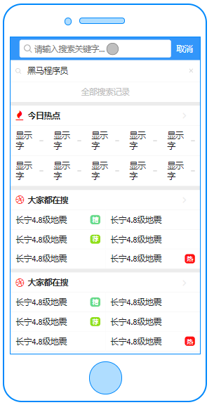
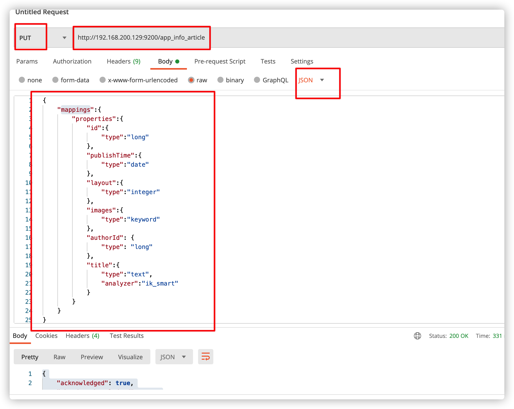
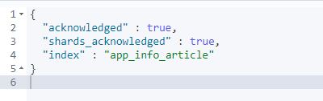
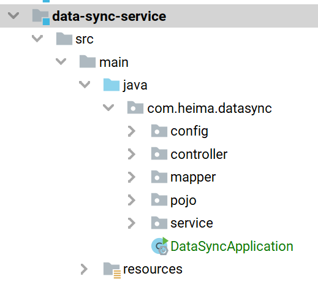
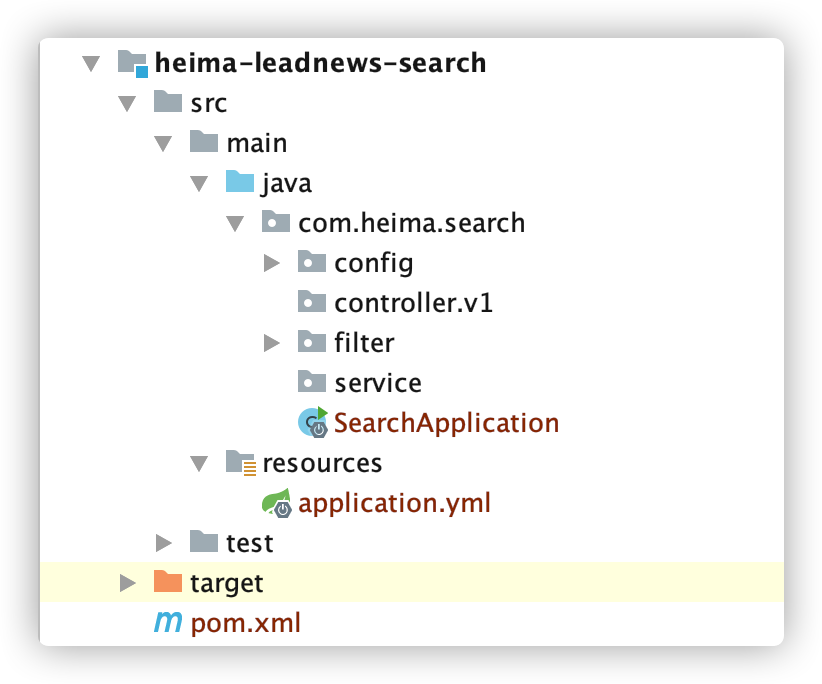
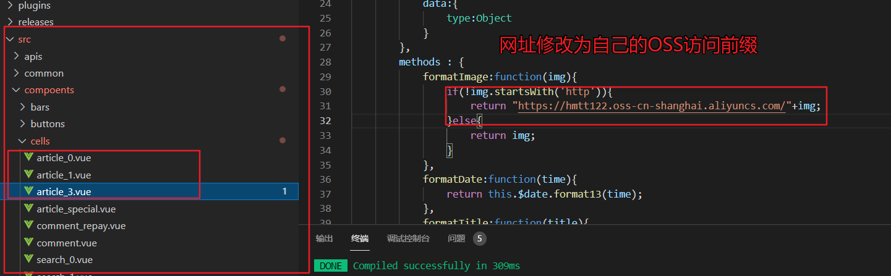
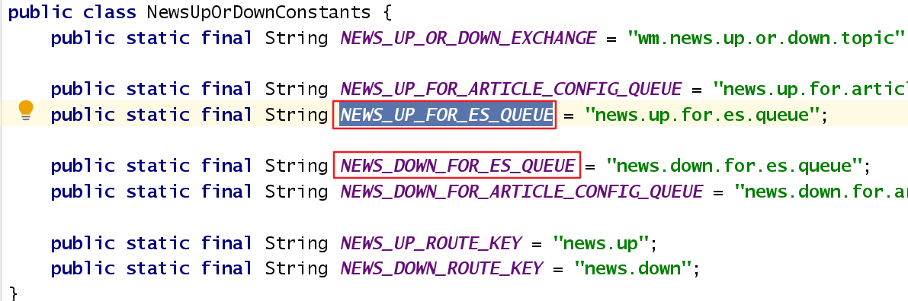
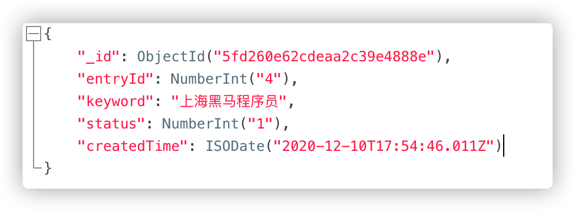
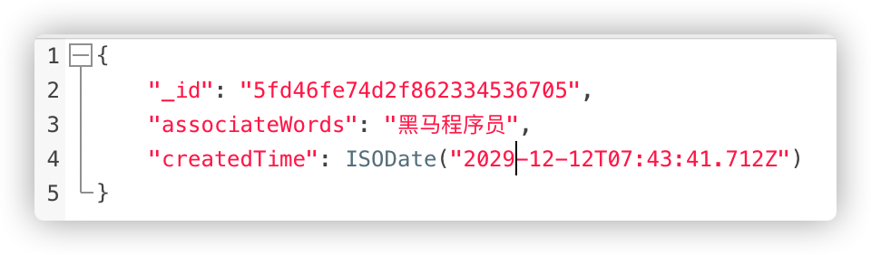

# 第十二章 app端文章搜索

## 今日目标

- 能够熟悉docker搭建ElasticSearch的环境
- 能够掌握创建索引的思路
- 能够完成app端文章的搜索
- 能够完成app端搜索记录的管理


## 1 搭建ElasticSearch环境


### 1.1 拉取镜像

```shell
docker pull elasticsearch:7.12.1
```

### 1.2 创建容器

```shell
docker run -id --name elasticsearch \
    -e "cluster.name=elastic-cluster" \
    -e "http.host=0.0.0.0" \
    -e "ES_JAVA_OPTS=-Xms1g -Xmx1g" \
    -e "discovery.type=single-node" \
    -e http.cors.enabled=true \
    -e http.cors.allow-origin="*" \
    -e http.cors.allow-headers=X-Requested-With,X-Auth-Token,Content-Type,Content-Length,Authorization \
    -e http.cors.allow-credentials=true \
    -v es-data:/usr/share/elasticsearch/data \
    -v es-logs:/usr/share/elasticsearch/logs \
    -v es-plugins:/usr/share/elasticsearch/plugins \
    --privileged \
    --hostname elasticsearch \
    -p 9200:9200 \
    -p 9300:9300 \
elasticsearch:7.12.1
```

注意: es默认占用内存较大，需要修改 jvm.properties中 内存的大小

### 1.3 配置中文分词器 ik

因为在创建elasticsearch容器的时候，映射了目录，所以可以在宿主机上进行配置ik中文分词器

在去选择ik分词器的时候，需要与elasticsearch的版本好对应上

把资料中的`elasticsearch-analysis-ik-7.12.1.zip`上传到服务器上,放到对应目录（plugins）解压

```shell
#切换目录
cd /var/lib/docker/volumes/es-plugins/_data
#新建目录
mkdir analysis-ik
cd analysis-ik

#上传资料中的ik分词器压缩包到此目录


unzip elasticsearch-analysis-ik-7.12.1.zip
```

### 1.4 测试

http://192.168.200.130:9200


### 1.5 设置开机启动

```shell
docker update --restart=always  elasticsearch
```


### 1.6 安装kibana

拉取镜像

```shell
docker pull kibana:7.12.1
```

创建容器

```shell
docker run -d -p 5601:5601 --name kibana --link elasticsearch -e "ELASTICSEARCH_HOSTS=http://192.168.200.130:9200" kibana:7.12.1
```

测试:http://192.168.200.130:5601/


### 1.7 准备Elasticsearch起步依赖

注意先修改parent工程的pom文件，将es版本调整未7.12.1


（1）创建start工程 `heima-es-spring-boot-starter`导入依赖

```xml
<dependencies>
        <dependency>
            <groupId>commons-beanutils</groupId>
            <artifactId>commons-beanutils</artifactId>
            <version>1.9.4</version>
        </dependency>
        <dependency>
            <groupId>com.heima</groupId>
            <artifactId>heima-leadnews-model</artifactId>
            <scope>provided</scope>
        </dependency>
        <!-- ES 依赖 -->
        <dependency>
            <groupId>org.elasticsearch.client</groupId>
            <artifactId>elasticsearch-rest-high-level-client</artifactId>
        </dependency>
        <dependency>
            <groupId>org.springframework.boot</groupId>
            <artifactId>spring-boot-autoconfigure</artifactId>
        </dependency>
        <dependency>
            <groupId>com.google.guava</groupId>
            <artifactId>guava</artifactId>
            <version>21.0</version>
        </dependency>
        <dependency>
            <groupId>org.springframework.boot</groupId>
            <artifactId>spring-boot-starter</artifactId>
        </dependency>
        <dependency>
            <groupId>org.springframework.boot</groupId>
            <artifactId>spring-boot-configuration-processor</artifactId>
            <optional>true</optional>
        </dependency>
        <dependency>
            <groupId>org.springframework.boot</groupId>
            <artifactId>spring-boot-starter-actuator</artifactId>
        </dependency>
    </dependencies>
```

（2）创建配置类`com.heima.es.config.ElasticSearchConfig`

```java
@Getter
@Setter
@Configuration
@ConfigurationProperties(prefix = "elasticsearch")
@ComponentScan("com.heima.es.service.impl")
public class ElasticSearchConfig {
    private String host;
    private int port;
    @Bean
    public RestHighLevelClient client(){
        return new RestHighLevelClient(RestClient.builder(
                new HttpHost(
                        host,
                        port,
                        "http"
                )
        ));
    }
}
```

（3）创建id注解类`EsId`

**heima-leadnews-model**工程中添加注解类

创建包`com.heima.model.common.anno`

拷贝下面类

```java
// 标记此注解的字段 为id字段
@Target({ElementType.FIELD})
@Retention(RetentionPolicy.RUNTIME)
@Documented
public @interface EsId {
}
```


（4）创建操作es工具接口`com.heima.es.service.EsService`

```java
public interface EsService<T> {
    void createIndex(String source,String indexName);
    boolean existIndex(String indexName);
    void deleteIndex(String indexName);
    void save(T t,String indexName);
    void saveBatch(List<T> list,String indexName);
    void deleteById(String id,String indexName);
    T getById(String id,Class<T> tClass,String indexName);
    PageResponseResult search(SearchSourceBuilder sourceBuilder,Class<T> tClass,String indexName);
}
```

（5）创建工具实现类`com.heima.es.service.EsService`

```java
package com.heima.es.service.impl;
import com.alibaba.fastjson.JSON;
import com.heima.model.common.anno.EsId;
import com.heima.es.service.EsService;
import com.heima.model.common.dtos.PageResponseResult;
import lombok.extern.slf4j.Slf4j;
import org.apache.commons.beanutils.BeanUtils;
import org.apache.commons.lang3.StringUtils;
import org.elasticsearch.action.admin.indices.delete.DeleteIndexRequest;
import org.elasticsearch.action.bulk.BulkRequest;
import org.elasticsearch.action.delete.DeleteRequest;
import org.elasticsearch.action.get.GetRequest;
import org.elasticsearch.action.get.GetResponse;
import org.elasticsearch.action.index.IndexRequest;
import org.elasticsearch.action.search.SearchRequest;
import org.elasticsearch.action.search.SearchResponse;
import org.elasticsearch.client.RequestOptions;
import org.elasticsearch.client.RestHighLevelClient;
import org.elasticsearch.client.indices.CreateIndexRequest;
import org.elasticsearch.client.indices.CreateIndexResponse;
import org.elasticsearch.client.indices.GetIndexRequest;
import org.elasticsearch.common.xcontent.XContentType;
import org.elasticsearch.search.SearchHit;
import org.elasticsearch.search.SearchHits;
import org.elasticsearch.search.builder.SearchSourceBuilder;
import org.elasticsearch.search.fetch.subphase.highlight.HighlightField;
import org.springframework.beans.factory.annotation.Autowired;
import org.springframework.stereotype.Service;
import java.io.IOException;
import java.lang.reflect.Field;
import java.lang.reflect.InvocationTargetException;
import java.util.ArrayList;
import java.util.List;
import java.util.Map;
@Service
@Slf4j
public class EsServiceImpl<T> implements EsService<T> {
    @Autowired
    RestHighLevelClient client;
    @Override
    public void createIndex(String source, String indexName) {
        try {
            // 1.创建Request对象
            CreateIndexRequest request = new CreateIndexRequest(indexName);
            // 2.准备参数，settings和mappings
            request.source(source, XContentType.JSON);
            // 3.发出请求
            CreateIndexResponse response = client.indices().create(request, RequestOptions.DEFAULT);
            // 4.判断
            if (!response.isAcknowledged()) {
                // 创建索引库失败！
                throw new RuntimeException("索引库创建失败！");
            }
        } catch (IOException e) {
            throw new RuntimeException("索引库创建失败！", e);
        }
    }
    @Override
    public boolean existIndex(String indexName){
        try {
            // 1.创建Request对象
            GetIndexRequest request = new GetIndexRequest(indexName);
            // 3.发出请求
            return client.indices().exists(request, RequestOptions.DEFAULT);
        } catch (IOException e) {
            throw new RuntimeException("索引库创建失败！", e);
        }
    }
    /**
     * 删除索引库
     *
     */
    @Override
    public void deleteIndex(String indexName){
        try {
            // 1.创建Request对象
            DeleteIndexRequest request = new DeleteIndexRequest(indexName);
            // 2.发出请求
            client.indices().delete(request, RequestOptions.DEFAULT);
        } catch (IOException e) {
            throw new RuntimeException("索引库删除失败！", e);
        }
    }
    /**
     * 文档的新增
     */
    @Override
    public void save(T t, String indexName) {
        try {
            // 1.创建Request对象
            IndexRequest request = new IndexRequest(indexName);
            // 2.准备参数，id和文档数据
            request.id(getId(t));
            request.source(JSON.toJSONString(t), XContentType.JSON);
            // 3.发出请求
            client.index(request, RequestOptions.DEFAULT);
        } catch (IOException e) {
            throw new RuntimeException("新增文档失败！", e);
        }
    }
    /**
     * 文档批量新增
     * @param list 数据集合
     */
    @Override
    public void saveBatch(List<T> list, String indexName){
        try {
            // 1.创建Request对象
            BulkRequest request = new BulkRequest(indexName);
            // 2.准备参数
            for (T t : list) {
                request.add(new IndexRequest().id(getId(t)).source(JSON.toJSONString(t), XContentType.JSON));
            }
            // 3.发出请求
            client.bulk(request, RequestOptions.DEFAULT);
        } catch (IOException e) {
            throw new RuntimeException("批量新增失败！", e);
        }
    }
    @Override
    public void deleteById(String id, String indexName){
        try {
            // 1.请求
            DeleteRequest request = new DeleteRequest(indexName, id);
            // 2.发出请求
            client.delete(request, RequestOptions.DEFAULT);
        } catch (IOException e) {
            throw new RuntimeException("删除文档失败！", e);
        }
    }
    @Override
    public T getById(String id, Class<T> tClass, String indexName) {
        try {
            // 1.请求
            GetRequest request = new GetRequest(indexName, id);
            // 2.发出请求
            GetResponse response = client.get(request, RequestOptions.DEFAULT);
            // 3.解析结果
            String json = response.getSourceAsString();
            // 4.反序列化
            return JSON.parseObject(json, tClass);

        } catch (IOException e) {
            throw new RuntimeException("删除文档失败！", e);
        }
    }
    /**
     * 查询并返回结果，并且带高亮、分页、排序
     * @param sourceBuilder 条件
     * @return 分页结果
     */
    @Override
    public PageResponseResult search(SearchSourceBuilder sourceBuilder,Class<T> clazz,String indexName){
        try {
            // 封装分页结果
            PageResponseResult result = new PageResponseResult();
            int from = sourceBuilder.from();
            int size = sourceBuilder.size();
            result.setCurrentPage(from / size + 1);
            result.setSize(size);
            // 1.准备request
            SearchRequest request = new SearchRequest(indexName);
            // 2.准备参数
            request.source(sourceBuilder);
            // 3.发出请求
            SearchResponse response = client.search(request, RequestOptions.DEFAULT);
            // 4.解析结果
            SearchHits searchHits = response.getHits();
            // 4.1.获取总条数
            long total = searchHits.getTotalHits().value;
            // 4.2.获取数据
            SearchHit[] hits = searchHits.getHits();
            List<T> list = new ArrayList<>(hits.length);
            // 4.3.循环处理
            for (SearchHit hit : hits) {
                // 获取source
                String json = hit.getSourceAsString();
                // 反序列化
                T t = JSON.parseObject(json, clazz);
                list.add(t);
                // 高亮处理
                handleHighlight(t, hit);
            }
            result.setTotal(total);
            result.setData(list);
            return result;
        } catch (Exception e) {
            throw new RuntimeException("查询文档失败！", e);
        }
    }
    private void handleHighlight(T t, SearchHit hit) throws InvocationTargetException, IllegalAccessException {
        Map<String, HighlightField> highlightFields = hit.getHighlightFields();
        for (HighlightField highlightField : highlightFields.values()) {
            // 获取高亮字段名称
            String fieldName = highlightField.getName();
            // 获取高亮结果
            String highlightValue = StringUtils.join(highlightField.getFragments());
            // 获取字节码
            BeanUtils.setProperty(t, fieldName, highlightValue);
            /*Class<?> tClass = t.getClass();
            Field field = tClass.getDeclaredField(fieldName);
            field.setAccessible(true);
            field.set(t, highlightValue);*/
        }
    }
    private String getId(Object t) {
        try {
            Class<?> tClass = t.getClass();
            Field[] declaredFields = tClass.getDeclaredFields();
            Object id = null;
            for (Field declaredField : declaredFields) {
                declaredField.setAccessible(true);
                if (declaredField.isAnnotationPresent(EsId.class)) {
                    id = declaredField.get(t);
                }
            }
            if (id == null) {
                log.error("es工具类出错， 未发现标记@EsId注解 ");
                throw new RuntimeException("实体类中必须包含@TableId注解！");
            }
            return id.toString();
        } catch (IllegalAccessException e) {
            throw new RuntimeException(e);
        }
    }
}
```

（6）创建自动配置文件`META-INF/spring.factories`

```properties
org.springframework.boot.autoconfigure.EnableAutoConfiguration=\
 com.heima.es.config.ElasticSearchConfig
```

## 2 app端文章搜索

### 2.1 需求分析

搜索页面



搜索结果页面


- 用户输入关键可搜索文章列表
- 关键词高亮显示
- 文章列表展示与home展示一样，当用户点击某一篇文章，可查看文章详情

### 2.2 思路分析

为了加快检索的效率，在查询的时候不会直接从数据库中查询文章，需要在elasticsearch中进行高速检索。

实现思路

- 需要把文章相关的数据存储到es索引库中
- 在搜索微服务中进行检索，查询的是es库，展示文章列表，需要根据关键字进行查询
- 在搜索的时候，用户输入了关键字，需要对当前用户记录搜索历史

### 2.3 功能实现




GET请求查询映射：http://192.168.200.129:9200/app_info_article

DELETE请求，删除索引及映射：http://192.168.200.129:9200/app_info_article

GET请求，查询所有文档：http://192.168.200.129:9200/app_info_article/_search

(1)在kibana中手动创建索引和映射

```json
PUT app_info_article
{
    "mappings":{
        "properties":{
            "id":{
                "type":"long"
            },
            "publishTime":{
                "type":"date"
            },
            "layout":{
                "type":"integer"
            },
            "images":{
                "type":"keyword",
                "index": false
            },
           "staticUrl":{
                "type":"keyword",
                "index": false
            },
            "authorId": {
          		"type": "long"
       		},
          "title":{
            "type":"text",
            "analyzer":"ik_smart"
          }
        }
    }
}
```



创建成功后：

可查询当前索引库，只需要把put请求改为get请求即可。

```java
GET app_info_article
```

(2)使用postman添加映射和查询

创建索引库并且添加映射

put请求 ： http://192.168.200.130:9200/app_info_article

#### 2.3.2 搭建数据同步服务

**目的：**完成从文章库中将所有的数据导入到 ElasticSearch 索引库中

（1）新建接收索引库文章存储对象

```java
package com.heima.model.search.vos;
import com.heima.model.common.anno.EsId;
import lombok.Data;
import java.util.Date;
@Data
public class SearchArticleVO {
    // 文章id
    @EsId
    private Long id;
    // 文章标题
    private String title;
    // 文章发布时间
    private Date publishTime;
    // 文章布局
    private Integer layout;
    // 封面
    private String images;
    // 作者
    private Long authorId;
    // 作者名字
    private String authorName;
    //静态url
    private String staticUrl;
}
```

（2）创建数据同步微服务`data-sync-service`



pom引入依赖

```xml
	<dependencies>
        <!-- ES  起步依赖 -->
        <dependency>
            <groupId>com.heima</groupId>
            <artifactId>heima-es-spring-boot-starter</artifactId>
            <version>1.0-SNAPSHOT</version>
        </dependency>
    </dependencies>
```

（3）编写启动类

```java
package com.heima.datasync;
import com.baomidou.mybatisplus.extension.plugins.PaginationInterceptor;
import org.mybatis.spring.annotation.MapperScan;
import org.springframework.boot.SpringApplication;
import org.springframework.boot.autoconfigure.SpringBootApplication;
import org.springframework.context.annotation.Bean;
@SpringBootApplication
@MapperScan("com.heima.datasync.mapper")
public class DataSyncApplication {
    public static void main(String[] args) {
        SpringApplication.run(DataSyncApplication.class, args);
    }
    @Bean
    PaginationInterceptor paginationInterceptor(){
        return new PaginationInterceptor();
    }
}
```

（4）`bootstrap.yml`

```yml
spring:
  application:
    name: leadnews-datasync # 服务名称
  profiles:
    active: dev # 开发环境配置
    ip: 192.168.200.130  # 环境ip地址
  cloud:
    nacos:
      discovery: # 注册中心地址配置
        server-addr: ${spring.profiles.ip}:8848
        namespace: ${spring.profiles.active}
      config: # 配置中心地址配置
        server-addr: ${spring.profiles.ip}:8848
        namespace: ${spring.profiles.active}
        file-extension: yml # data-id 后缀
        name: ${spring.application.name} # data-id名称
        shared-configs: # 共享配置
          - data-id: share-feign.yml
            group: DEFAULT_GROUP
            refresh: false
```


（5）配置中心创建`leadnews-datasync.yml`

```yaml
server:
  port: 9101
spring:
  datasource:
    driver-class-name: com.mysql.jdbc.Driver
    url: jdbc:mysql://${spring.profiles.ip}:3306/leadnews_article?useSSL=false&useUnicode=true&characterEncoding=UTF-8&serverTimezone=UTC
    username: root
    password: root
# 设置Mapper接口所对应的XML文件位置，如果你在Mapper接口中有自定义方法，需要进行该配置
mybatis-plus:
  mapper-locations: classpath*:mapper/*.xml
  # 设置别名包扫描路径，通过该属性可以给包中的类注册别名
  type-aliases-package: com.heima.model.article.pojos
#自定义elasticsearch连接配置
elasticsearch:
  host: ${spring.profiles.ip}
  port: 9200

```

#### 2.3.3 导入索引库初始化数据

（1）创建ApArticleMapper

```java
package com.heima.datasync.mapper;
import com.baomidou.mybatisplus.core.mapper.BaseMapper;
import com.heima.model.article.pojos.ApArticle;
import org.apache.ibatis.annotations.Select;
import java.util.List;
public interface ApArticleMapper extends BaseMapper<ApArticle> {
    @Select("select aa.* from ap_article aa left join ap_article_config" +
            " aac on aa.id = aac.article_id where aac.is_delete !=1 and aac.is_down !=1")
    List<ApArticle> findAllArticles();
}
```

（2）创建EsDataService

```java
package com.heima.datasync.service;
import com.heima.model.common.dtos.ResponseResult;
public interface EsDataService {
    ResponseResult dataInit();
}
```

（3）创建EsDataServiceImpl

```java
package com.heima.datasync.service.impl;
import com.heima.datasync.mapper.ApArticleMapper;
import com.heima.datasync.service.EsDataService;
import com.heima.es.service.EsService;
import com.heima.model.article.pojos.ApArticle;
import com.heima.model.common.dtos.ResponseResult;
import com.heima.model.common.enums.AppHttpCodeEnum;
import com.heima.model.search.vos.SearchArticleVO;
import org.springframework.beans.BeanUtils;
import org.springframework.beans.factory.annotation.Autowired;
import org.springframework.stereotype.Service;
import java.util.ArrayList;
import java.util.List;
@Service
public class EsDataServiceImpl implements EsDataService {
    public static final String ARTICLE_INDEX_NAME = "app_info_article";
    @Autowired
    private ApArticleMapper apArticleMapper;
    @Autowired
    private EsService<SearchArticleVO> esService;
    @Override
    public ResponseResult dataInit() {
        // 判断索引库是否存在
        boolean isExist = esService.existIndex(ARTICLE_INDEX_NAME);
        if (isExist) {
            esService.deleteIndex(ARTICLE_INDEX_NAME);
        }
        esService.createIndex(
                "{\n" +
                "    \"mappings\":{\n" +
                "        \"properties\":{\n" +
                "            \"id\":{\n" +
                "                \"type\":\"long\"\n" +
                "            },\n" +
                "            \"publishTime\":{\n" +
                "                \"type\":\"date\"\n" +
                "            },\n" +
                "            \"layout\":{\n" +
                "                \"type\":\"integer\"\n" +
                "            },\n" +
                "            \"images\":{\n" +
                "                \"type\":\"keyword\",\n" +
                "                \"index\": false\n" +
                "            },\n" +
                "           \"staticUrl\":{\n" +
                "                \"type\":\"keyword\",\n" +
                "                \"index\": false\n" +
                "            },\n" +
                "            \"authorId\": {\n" +
                "          \t\t\"type\": \"long\"\n" +
                "       \t\t},\n" +
                "          \"title\":{\n" +
                "            \"type\":\"text\",\n" +
                "            \"analyzer\":\"ik_smart\"\n" +
                "          }\n" +
                "        }\n" +
                "    }\n" +
                "}", ARTICLE_INDEX_NAME);
        // 批量导入数据:
        // 一般建议是1000-5000个文档，如果你的文档很大，可以适当减少队列，大小建议是5-15MB，默认不能超过100M
        // TODO 如果数据库数据过多 建议分段批量插入
        // 分页查询第一页文章数据
        List<ApArticle> apArticles = apArticleMapper.findAllArticles();
        if (apArticles == null || apArticles.size() == 0) {
            return ResponseResult.errorResult(AppHttpCodeEnum.SERVER_ERROR, "数据库文章信息不存在");
        }
        // 遍历页码批量插入到索引库
        List<SearchArticleVO> list = new ArrayList<>();
        for (ApArticle record : apArticles) {
            // 封装数据
            SearchArticleVO articleVo = new SearchArticleVO();
            BeanUtils.copyProperties(record, articleVo);
            list.add(articleVo);
        }
        esService.saveBatch(list, ARTICLE_INDEX_NAME);
        return ResponseResult.okResult();
    }
}
```

（4）创建EsDataController

```java
package com.heima.datasync.controller;
import com.heima.datasync.service.EsDataService;
import com.heima.model.common.dtos.ResponseResult;
import org.springframework.beans.factory.annotation.Autowired;
import org.springframework.web.bind.annotation.GetMapping;
import org.springframework.web.bind.annotation.RequestMapping;
import org.springframework.web.bind.annotation.RestController;

@Api(value="同步数据API",tags="同步数据API")
@RestController
@RequestMapping("esdata")
public class DataSyncController {
    @Autowired
    EsDataService esDataService;
    @ApiOperation(value="全量索引数据同步",notes="查询所有文章数据库数据，导入到es索引库中")
    @GetMapping("init")
    public ResponseResult esDataInit(){
        return esDataService.dataInit();
    }
}
```

（5）查看导入结果

**调用初始化数据方法:**  http://localhost:9101/esdata/init

```json
# kibana中查看发布文章数据是否正确导入
GET /app_info_article/_search
{
  "query": {
    "match_all": {}
  },
  "size": 2000,
  "sort": [
    {
      "publishTime": {
        "order": "desc"
      }
    }
  ]
}
```

#### 2.3.4 搜索微服务导入

（1）创建微服务 `search-service`



（2）添加pom依赖引导类

```xml
<dependencies>
        <!--mongoDB-->
        <dependency>
            <groupId>org.springframework.boot</groupId>
            <artifactId>spring-boot-starter-data-mongodb</artifactId>
        </dependency>
        <!-- ES  起步依赖 -->
        <dependency>
            <groupId>com.heima</groupId>
            <artifactId>heima-es-spring-boot-starter</artifactId>
            <version>1.0-SNAPSHOT</version>
        </dependency>
    </dependencies>
```

```java
@SpringBootApplication
public class SearchApplication {
    public static void main(String[] args) {
        SpringApplication.run(SearchApplication.class, args);
    }
}
```

（3）创建`bootstrap.yml`配置

```yml
spring:
  application:
    name: leadnews-search # 服务名称
  profiles:
    active: dev # 开发环境配置
    ip: 192.168.200.130  # 环境ip地址
  cloud:
    nacos:
      discovery: # 注册中心地址配置
        server-addr: ${spring.profiles.ip}:8848
        namespace: ${spring.profiles.active}
      config: # 配置中心地址配置
        server-addr: ${spring.profiles.ip}:8848
        namespace: ${spring.profiles.active}
        file-extension: yml # data-id 后缀
        name: ${spring.application.name} # data-id名称
        shared-configs: # 共享配置
          - data-id: share-feign.yml
            group: DEFAULT_GROUP
            refresh: false
```

（4）配置中心 添加`leadnews-search.yml`配置

```yaml
server:
  port: 9007
spring:
  autoconfigure:
    exclude: org.springframework.boot.autoconfigure.jdbc.DataSourceAutoConfiguration,org.springframework.boot.autoconfigure.jdbc.DataSourceTransactionManagerAutoConfiguration
  data:
    mongodb:
      host: ${spring.profiles.ip}
      port: 27017
      database: leadnews-search
#取消对elastsearch的健康检查
management:
  health:
    elasticsearch:
      enabled: false
#自定义elasticsearch连接配置
elasticsearch:
  host: ${spring.profiles.ip}
  port: 9200
file:
  minio:
    readPath: http://${spring.profiles.ip}:9090/

```

#### 2.3.5 搜索接口定义

```java
@Api(value = "文章搜索API",tags = "文章搜索API")
@RestController
@RequestMapping("/api/v1/article/search")
public class ArticleSearchController{
    @ApiOperation("文章搜索")
    @PostMapping("/search")
    public ResponseResult search(@RequestBody UserSearchDTO userSearchDto) {
        // 文章搜索接口
        return null;
    }
}
```

UserSearchDto

```java
package com.heima.model.search.dto;
import lombok.Data;
import java.util.Date;
@Data
public class UserSearchDTO {

    // 设备ID
    Integer equipmentId;
    /**
    * 搜索关键字
    */
    String searchWords;
    /**
    * 当前页
    */
    int pageNum;
    /**
    * 分页条数
    */
    int pageSize;
    
    Integer entryId;
    /**
    * 最小时间
    */
    Date minBehotTime;
    public int getFromIndex(){
        if(this.pageNum<1)return 0;
        if(this.pageSize<1) this.pageSize = 10;
        return this.pageSize * (pageNum-1);
    }
}
```

#### 2.3.6 业务层实现

创建业务层接口：ApArticleSearchService

```java
package com.heima.search.service;
import com.heima.model.common.dtos.ResponseResult;
import com.heima.model.search.dtos.UserSearchDTO;
public interface ArticleSearchService {
    /**
     ES文章分页搜索
     @return
     */
    ResponseResult search(UserSearchDTO userSearchDto);
}
```

实现类：

```java
package com.heima.search.service.impl;

import com.heima.es.service.EsService;
import com.heima.model.common.dtos.PageResponseResult;
import com.heima.model.common.dtos.ResponseResult;
import com.heima.model.common.enums.AppHttpCodeEnum;
import com.heima.model.search.dtos.UserSearchDTO;
import com.heima.model.search.vos.SearchArticleVO;
import com.heima.search.service.ArticleSearchService;
import lombok.extern.slf4j.Slf4j;
import org.apache.commons.collections.CollectionUtils;
import org.apache.commons.lang3.StringUtils;
import org.elasticsearch.index.query.BoolQueryBuilder;
import org.elasticsearch.index.query.MatchQueryBuilder;
import org.elasticsearch.index.query.QueryBuilders;
import org.elasticsearch.index.query.RangeQueryBuilder;
import org.elasticsearch.search.builder.SearchSourceBuilder;
import org.elasticsearch.search.fetch.subphase.highlight.HighlightBuilder;
import org.elasticsearch.search.sort.SortOrder;
import org.springframework.beans.factory.annotation.Autowired;
import org.springframework.beans.factory.annotation.Value;
import org.springframework.stereotype.Service;

import java.util.List;
@Service
@Slf4j
public class ArticleSearchServiceImpl implements ArticleSearchService {
    public static final String APP_INFO_ARTICLE = "app_info_article";
    @Value("${file.minio.readPath}")
    String readPath;
    @Autowired
    EsService esService;
    @Override
    public ResponseResult search(UserSearchDTO userSearchDto) {
        //1 参数检查
        String searchWords = userSearchDto.getSearchWords();
        if (userSearchDto == null || StringUtils.isBlank(searchWords)) {
              return ResponseResult.errorResult(AppHttpCodeEnum.PARAM_REQUIRE);
        }
        //2 构建查询条件执行查询
        SearchSourceBuilder searchSourceBuilder = new SearchSourceBuilder();
        // 构建查询条件和过滤等
        BoolQueryBuilder boolQueryBuilder = new BoolQueryBuilder();
        // 关键词查询
        MatchQueryBuilder queryBuilder = QueryBuilders.matchQuery("title", searchWords);
        boolQueryBuilder.must(queryBuilder);
        // 查询小于mindate的数据
        RangeQueryBuilder rangeQueryBuilder = QueryBuilders.rangeQuery("publishTime").lt(userSearchDto.getMinBehotTime().getTime());
        boolQueryBuilder.filter(rangeQueryBuilder);
        // 分页
        searchSourceBuilder.from(0);
        searchSourceBuilder.size(userSearchDto.getPageSize());
        // 按照发布时间倒序
        searchSourceBuilder.sort("publishTime", SortOrder.DESC);
        // 高亮 三要素
        HighlightBuilder highlightBuilder = new HighlightBuilder();
        highlightBuilder.field("title");
        highlightBuilder.preTags("<font style='color: red; font-size: inherit;'>");
        highlightBuilder.postTags("</font>");
        searchSourceBuilder.highlighter(highlightBuilder);
        searchSourceBuilder.query(boolQueryBuilder);
        PageResponseResult searchResult = esService.search(searchSourceBuilder, SearchArticleVO.class,APP_INFO_ARTICLE);
        //4 返回结果 staticUrl 需要拼接 minIO文章服务器的前缀路径
        List<SearchArticleVO> list = (List<SearchArticleVO>)searchResult.getData();
        if(CollectionUtils.isNotEmpty(list)){
            for (SearchArticleVO searchArticleVo : list) {
                searchArticleVo.setStaticUrl(readPath + searchArticleVo.getStaticUrl());
            }
        }
        return searchResult;
    }
}
```

#### 2.3.7 控制层实现

新建控制器ArticleSearchController

```java
package com.heima.search.controller.v1;

import com.heima.model.common.dtos.ResponseResult;
import com.heima.model.search.dtos.UserSearchDTO;
import com.heima.search.service.ArticleSearchService;
import io.swagger.annotations.Api;
import io.swagger.annotations.ApiOperation;
import org.springframework.beans.factory.annotation.Autowired;
import org.springframework.web.bind.annotation.PostMapping;
import org.springframework.web.bind.annotation.RequestBody;
import org.springframework.web.bind.annotation.RequestMapping;
import org.springframework.web.bind.annotation.RestController;
@Api(value = "文章搜索API",tags = "文章搜索API")
@RestController
@RequestMapping("/api/v1/article/search")
public class ArticleSearchController{
    @Autowired
    ArticleSearchService articleSearchService;
    @ApiOperation("文章搜索")
    @PostMapping("/search")
    public ResponseResult search(@RequestBody UserSearchDTO userSearchDto) {
        // 文章搜索接口
        return articleSearchService.search(userSearchDto);
    }
}
```

#### 2.3.8 测试

首先需要在app的网关中添加搜索微服务的路由配置

```yaml
#搜索微服务
- id: leadnews-search
  uri: lb://leadnews-search
  predicates:
  - Path=/search/**
  filters:
  - StripPrefix= 1
```

启动项目进行测试，至少要启动文章微服务，用户微服务，搜索微服务，app网关微服务，app前端工程

**注意**:

查看文章详情时，会出现文章查找不到 原因 是因为id的long值 精度丢失  

```java
@Data
public class SearchArticleVO {
    // 文章id
    @JsonSerialize(using = ToStringSerializer.class)
    @EsId
    private Long id;
    // 文章标题
    private String title;
    // 文章发布时间
    private Date publishTime;
    // 文章布局
    private Integer layout;
    // 封面
    private String images;
    // 作者
    private Long authorId;
    // 作者名字
    private String authorName;
    //静态url
    private String staticUrl;
}
```


**前端修改**

使用资料中最新的app前端压缩包

将 **article_1.vue**    **article_3.vue**中的 图片网址 改为自己的**oss访问前缀**




### 2.4 索引库文章的自动更新

说明:

索引库中的文章数据，要和ap_article库中的文章数据保持一致, 上面在项目初始化阶段我们已经将文章数据导入到索引库，后期当文章库数据发生变化时，我们也要保证索引库数据的一致性。

1. 当article微服务的发布文章方法成功时，需要通知search微服务添加文章索引
2. 当wemedia微服务的上架调用后，需要通知search微服务添加文章索引
3. 当wemedia微服务的下架调用后，需要通知search微服务删除文章索引


#### 2.5.1 定义索引库添加或删除消息队列

前面课程，文章上下架时  我们已经定义好了通知es文索引库 新增 或 删除的mq队列， 目前只需要在article中发布文章成功后，直接向

`news.up.for.es.queue`队列中发送消息即可




#### 2.5.2 article发布文章发送消息通知

article微服务发布文章方法，发布成功发送消息

`com.heima.article.service.impl.ApArticleServiceImpl#publishArticle`

```java
	@Transactional
    @Override
    public void publishArticle(Integer newsId) {
        // 1. 查询并检查自媒体文章  wmNews
        // 2. 封装 ApArticle
        // 3. 保存或修改 article信息
        // 4. 保存关联配置和内容信息
        // 5. 文章页面静态化
        // 6. 更新 wmNews状态  改为9  并设置articleId
        // 7. 通知es索引库添加文章索引
        rabbitTemplate.convertAndSend(NewsUpOrDownConstants.NEWS_UP_FOR_ES_QUEUE,apArticle.getId());
        log.info("文章发布成功，并发送索引库更新通知   文章id: {}",apArticle.getId());
    }
```

#### 2.5.3 定义文章远程调用接口

1. ArticleFeign增加接口方法

```java
@FeignClient(value = "leadnews-article",
        fallbackFactory = ArticleFeignFallback.class,
        configuration = HeimaFeignAutoConfiguration.class
)
public interface ArticleFeign {
    // =======================  新增接口  ==========================
    @GetMapping("/api/v1/article/{id}")
    ResponseResult<SearchArticleVO> findArticle(@PathVariable("id") Long id);
    // =======================  新增接口  ==========================

    @GetMapping("/api/v1/author/findByUserId/{userId}")
    ResponseResult<ApAuthor> findByUserId(@PathVariable("userId") Integer userId);
    @PostMapping("/api/v1/author/save")
    ResponseResult save(@RequestBody ApAuthor apAuthor);
}
```

2. 增加对应服务降级方法

```java
@Component
@Slf4j
public class ArticleFeignFallback  implements FallbackFactory<ArticleFeign> {
    @Override
    public ArticleFeign create(Throwable throwable) {
        throwable.printStackTrace();
        return new ArticleFeign() {
            // =================== 新增服务降级方法=====================
            @Override
            public ResponseResult<SearchArticleVO> findArticle(Long id) {
                log.error(" 远程调用文章微服务  中  findArticle方法出错   ,  参数:{}      异常原因: {}",id,throwable.getCause());
                return ResponseResult.errorResult(AppHttpCodeEnum.REMOTE_SERVER_ERROR,"远程调用查询Article出错,"+throwable.getMessage());
            }
            // =================== 新增服务降级方法=====================
            @Override
            public ResponseResult findByUser(Integer userId) {
                log.error(" 远程调用文章微服务  中  findByUser方法出错   ,  参数:{}      异常原因: {}",userId,throwable.getCause());
                return ResponseResult.errorResult(AppHttpCodeEnum.REMOTE_SERVER_ERROR,"远程调用查询作者信息出错,"+throwable.getMessage());
            }
            @Override
            public ResponseResult save(ApAuthor apAuthor) {
                log.error(" 远程调用文章微服务  中  save方法出错   ,  参数:{}      异常原因: {}",apAuthor,throwable.getCause());
                return ResponseResult.errorResult(AppHttpCodeEnum.REMOTE_SERVER_ERROR,"远程调用保存作者信息出错,"+throwable.getMessage());
            }
        };
    }
}
```

3. article微服务 `com.heima.article.controller.v1.ApArticleController`实现方法

```java
@Api
@RestController
@RequestMapping("/api/v1/article")
public class ApArticleController {
    @Autowired
    ApArticleService apArticleService;
    @ApiOperation("根据ID查询文章搜索VO")
    @GetMapping("{id}")
    public ResponseResult<SearchArticleVO> findArticle(@PathVariable Long id) {
        SearchArticleVO searchArticleVo = null;
        ApArticle article = apArticleService.getById(id);
        if(article!=null){
            searchArticleVo = new SearchArticleVO();
            BeanUtils.copyProperties(article,searchArticleVo);
        }
        return ResponseResult.okResult(searchArticleVo);
    }
}
```

#### 2.5.4 定义RabbitMQ消息监听

search微服务引入RabbitMQ依赖

```xml
        <!--AMQP依赖，包含RabbitMQ-->
        <dependency>
            <groupId>org.springframework.boot</groupId>
            <artifactId>spring-boot-starter-amqp</artifactId>
        </dependency>
```

search微服务添加rabbit共享配置

```yml
          - data-id: share-rabbit.yml
            group: DEFAULT_GROUP
            refresh: false
```

定义处理`com.heima.search.service.ArticleSearchService`方法

```java
/**
     * 添加索引文章
     * @param article
     */
    void saveArticle(SearchArticleVO article);
    /**
     * 删除索引文章
     * @param articleId
     */
    void deleteArticle(String articleId);
```

3. 实现service方法

```java
    @Override
    public void saveArticle(SearchArticleVO article) {
        esService.save(article,APP_INFO_ARTICLE);
    }
    @Override
    public void deleteArticle(String articleId) {
        esService.deleteById(APP_INFO_ARTICLE,articleId);
    }
```

4. 定义消息监听 `com.heima.search.listen.ArticleAddOrRemoveListener`

```java
package com.heima.search.listen;
import com.heima.feigns.ArticleFeign;
import com.heima.model.common.constants.message.NewsUpOrDownConstants;
import com.heima.model.common.dtos.ResponseResult;
import com.heima.model.search.vos.SearchArticleVO;
import com.heima.search.service.ArticleSearchService;
import lombok.extern.slf4j.Slf4j;
import org.springframework.amqp.rabbit.annotation.Queue;
import org.springframework.amqp.rabbit.annotation.RabbitListener;
import org.springframework.beans.factory.annotation.Autowired;
import org.springframework.stereotype.Component;
@Component
@Slf4j
public class ArticleAddOrRemoveListener {
    @Autowired
    ArticleFeign articleFeign;
    @Autowired
    ArticleSearchService articleSearchService;
    @RabbitListener(queuesToDeclare = @Queue(value = NewsUpOrDownConstants.NEWS_UP_FOR_ES_QUEUE))
    public void addArticle(String articleId){
        log.info("搜索微服务 接收到添加文章到索引库消息==> {}",articleId);
        ResponseResult<SearchArticleVO> articleVoResult = articleFeign.findArticle(Long.valueOf(articleId));
        if (!articleVoResult.checkCode()) {
            log.error("索引库添加失败 远程调用文章信息失败   文章id: {}",articleId);
        }
        SearchArticleVO searchArticleVo = articleVoResult.getData();
        if(searchArticleVo == null){
            log.error("索引库添加失败 未获取到对应文章信息   文章id: {}",articleId);
        }
        try {
            articleSearchService.saveArticle(searchArticleVo);
            log.info("成功更新索引信息   add: {}",articleId);
        } catch (Exception e) {
            e.printStackTrace();
            log.error("消息消费确认失败   文章id: {}  原因: {}",articleId,e.getMessage());
        }
    }
    @RabbitListener(queuesToDeclare = @Queue(value = NewsUpOrDownConstants.NEWS_DOWN_FOR_ES_QUEUE))
    public void removeArticle(String articleId){
        log.info("搜索微服务 接收到删除索引库文章消息==> {}",articleId);
        try {
            articleSearchService.deleteArticle(articleId);
            log.info("成功更新索引信息   delete: {}",articleId);
        } catch (Exception e) {
            e.printStackTrace();
            log.error("消息消费确认失败   文章id: {}  原因: {}",articleId,e.getMessage());
        }
    }
}
```

#### 2.5.5 测试

启动wemedia微服务 调用文章上下架接口，查看索引库的文章是否能够添加和删除

启动admin微服务 发布一个文章，当自动审核通过后，查看索引库中是否添加了该文章


## 3 app端搜索-搜索记录

### 3.1 需求分析


- 展示用户的搜索记录10条，按照搜索关键词的时间倒序
- 可以删除搜索记录
- 保存历史记录
  - 异步的保存

### 3.2 思路分析

表结构：

ap_user_search APP用户搜索信息表 — 存储到 MongoDB/Redis 数据库中



对应实体：

```java
package com.heima.model.search.pojos;
import lombok.Data;
import org.springframework.data.mongodb.core.mapping.Document;
import java.io.Serializable;
import java.util.Date;
/**
 * APP用户搜索信息表
 * @author itheima
 */
@Data
@Document("ap_user_search")
public class ApUserSearch implements Serializable {
    private static final long serialVersionUID = 1L;
    /**
     * 主键
     */
    private String id;
    /**
     * 行为实体id
     */
    private String entryId;
    /**
     * 搜索词
     */
    private String keyword;
    /**
     * 创建时间
     */
    private Date createdTime;

}
```

### 3.3 保存用户搜索记录

#### 3.3.1 实现思路

1. 用户输入关键字进行搜索的异步记录关键字
2. 利用线程池重用，减少创建和销毁线程的性能开销
3. 保存关键字需要先查询行为实体（登录用户或设备用户）
4. 如果是已经存在的关键字，如果则修改时间


#### 3.3.2 定义远程接口调用查询行为实体

行为微服务提供行为实体调用web接口

```java
package com.heima.behavior.controller.v1;
import com.heima.behavior.service.ApBehaviorEntryService;
import com.heima.model.behavior.pojos.ApBehaviorEntry;
import com.heima.model.common.dtos.ResponseResult;
import org.springframework.beans.factory.annotation.Autowired;
import org.springframework.web.bind.annotation.GetMapping;
import org.springframework.web.bind.annotation.RequestMapping;
import org.springframework.web.bind.annotation.RequestParam;
import org.springframework.web.bind.annotation.RestController;
@RestController
@RequestMapping("/api/v1/behavior_entry")
public class ApBehaviorEntryController {
    @Autowired
    ApBehaviorEntryService apBehaviorEntryService;
    @GetMapping("/one")
    public ResponseResult<ApBehaviorEntry> findByUserIdOrEquipmentId
        (@RequestParam(value = "userId",required = false) Integer userId,
        @RequestParam(value = "equipmentId",required = false) Integer equipmentId){
        ApBehaviorEntry apBehaviorEntry = apBehaviorEntryService.findByUserIdOrEquipmentId(userId, equipmentId);
        return ResponseResult.okResult(apBehaviorEntry);
    }
}
```

定义行为微服务feign接口

```java
@FeignClient(value = "leadnews-behavior",
        fallbackFactory = BehaviorFeignFallback.class,
        configuration = HeimaFeignAutoConfiguration.class)
public interface BehaviorFeign {
   @GetMapping("/api/v1/behavior_entry/one")
    public ResponseResult<ApBehaviorEntry> findByUserIdOrEquipmentId(@RequestParam("userId") Integer userId,
                                                                    @RequestParam("equipmentId") Integer equipmentId);
}
```

服务降级方法

```java
@Component
@Slf4j
public class BehaviorFeignFallback implements FallbackFactory<BehaviorFeign> {
    @Override
    public BehaviorFeign create(Throwable throwable) {
        throwable.printStackTrace();
        return new BehaviorFeign() {
            @Override
            public ResponseResult<ApBehaviorEntry> findByUserIdOrEquipmentId(Integer userId, Integer equipmentId) {
                log.error("Feign服务降级触发 远程调用:BehaviorFeign  findByUserIdOrEquipmentId 失败,参数:userId={} equipmentId={}",userId,equipmentId);
                return ResponseResult.errorResult(AppHttpCodeEnum.SERVER_ERROR,"远程服务调用出现异常");
            }
        };
    }
}
```


#### 3.3.3 集成AppTokenFilter过滤器

```java
@Order(1)
@WebFilter(filterName = "appTokenFilter", urlPatterns = "/*")
@Component
@Slf4j
public class AppTokenFilter extends GenericFilterBean {
    @Override
    public void doFilter(ServletRequest req, ServletResponse res, FilterChain chain) throws IOException, ServletException {
        HttpServletRequest request = (HttpServletRequest) req;
        HttpServletResponse response = (HttpServletResponse) res;
        // 测试和开发环境不过滤
        String userId = request.getHeader("userId");
        //如果userId为0，说明当前设备没有登录
        if(userId!=null && Integer.valueOf(userId).intValue()!=0){
            ApUser apUser = new ApUser();
            apUser.setId(Integer.valueOf(userId));
            AppThreadLocalUtils.setUser(apUser);
        }
        chain.doFilter(req,res);
        // 在过滤器的后置方法中清除当前登录用户
        AppThreadLocalUtils.clear();
    }
}
```


#### 3.3.4 修改文章搜索方法

修改类ArticleSearchServiceImpl类的search方法，完整代码如下：

```java
 public ResponseResult search(UserSearchDto userSearchDto) {
        //1 参数检查
        String searchWords = userSearchDto.getSearchWords();
        if (userSearchDto == null || StringUtils.isBlank(searchWords)) {
              return ResponseResult.errorResult(AppHttpCodeEnum.PARAM_REQUIRE);
        }
        //===================  记录搜索历史记录
        ApUser user = AppThreadLocalUtils.getUser();
        if(user !=null) userSearchDto.setEntryId(user.getId());
        // 异步调用保存用户输入关键词记录
        apUserSearchService.insert( userSearchDto);     
     	// ========================== 
        //2 构建查询执行查询
```

#### 3.3.5 搜索历史异步任务

新增ApUserSearchService接口，由于是在搜索的时候异步调用保存关键字，暂时不需要定义api接口

```java
package com.heima.search.service;
import com.heima.model.search.dtos.UserSearchDTO;
public interface ApUserSearchService {

    /**
     * 保存用户搜索历史记录
     * @param userSearchDto
     */
    public void insert( UserSearchDTO userSearchDto);
}
```

实现类：

在插入方法中使用注解`@Async("taskExecutor")`进行异步调用，使得该方法加入线程池运行，这个值为在是线程池中的方法名称，需要与`@EnableAsync`一块使用

配置线程池

```java
package com.heima.search.config;
import lombok.Data;
import org.springframework.context.annotation.Bean;
import org.springframework.context.annotation.Configuration;
import org.springframework.scheduling.annotation.EnableAsync;
import org.springframework.scheduling.concurrent.ThreadPoolTaskExecutor;
import java.util.concurrent.ThreadPoolExecutor;
@Data
@Configuration
@EnableAsync //开启异步请求
public class ThreadPoolConfig {
    private static final int corePoolSize = 10;   // 核心线程数（默认线程数）
    private static final int maxPoolSize = 100;   // 最大线程数
    private static final int keepAliveTime = 10;  // 允许线程空闲时间（单位：默认为秒）
    private static final int queueCapacity = 500; // 缓冲队列数
    /**
     * 默认异步线程池
     * @return
     */
    @Bean("taskExecutor")
    public ThreadPoolTaskExecutor taskExecutor(){
        ThreadPoolTaskExecutor pool = new ThreadPoolTaskExecutor();
        pool.setThreadNamePrefix("--------------全局线程池-----------------");
        pool.setCorePoolSize(corePoolSize);
        pool.setMaxPoolSize(maxPoolSize);
        pool.setKeepAliveSeconds(keepAliveTime);
        pool.setQueueCapacity(queueCapacity);
        // 直接在execute方法的调用线程中运行
        pool.setRejectedExecutionHandler(new ThreadPoolExecutor.CallerRunsPolicy());
        // 初始化
        pool.initialize();
        return pool;
    }
}
```

实现类

```java
package com.heima.search.service.impl;
import com.heima.common.exception.CustException;
import com.heima.feigns.BehaviorFeign;
import com.heima.model.behavior.pojos.ApBehaviorEntry;
import com.heima.model.common.dtos.ResponseResult;
import com.heima.model.common.enums.AppHttpCodeEnum;
import com.heima.model.search.dtos.UserSearchDTO;
import com.heima.model.search.pojos.ApUserSearch;
import com.heima.search.service.ApUserSearchService;
import lombok.extern.slf4j.Slf4j;
import org.springframework.beans.factory.annotation.Autowired;
import org.springframework.data.mongodb.core.MongoTemplate;
import org.springframework.data.mongodb.core.query.Criteria;
import org.springframework.data.mongodb.core.query.Query;
import org.springframework.scheduling.annotation.Async;
import org.springframework.stereotype.Service;
import java.util.Date;
@Service
@Slf4j
public class ApUserSearchServiceImpl implements ApUserSearchService {
  @Autowired
  MongoTemplate mongoTemplate;
  @Autowired
  BehaviorFeign behaviorFeign;
    /**
     * 保存用户搜索历史记录
     * @param userSearchDto
     */
    @Override
    @Async("taskExecutor")
    public void insert( UserSearchDTO userSearchDto) {
        //1 参数检查
        String searchWords = userSearchDto.getSearchWords();
        Integer entryId = userSearchDto.getEntryId();
        //2 查询行为实体
        ResponseResult<ApBehaviorEntry> behaviorResponse = behaviorFeign.findByUserIdOrEquipmentId(entryId, userSearchDto.getEquipmentId());
        if (!behaviorResponse.checkCode()) {
            CustException.cust(AppHttpCodeEnum.REMOTE_SERVER_ERROR);
        }
        ApBehaviorEntry apBehaviorEntry = behaviorResponse.getData();
        if (apBehaviorEntry==null) {
            CustException.cust(AppHttpCodeEnum.DATA_NOT_EXIST);
        }
        log.info("ApUserSearchServiceImpl insert entryId:{}, searchWords:{}", entryId, searchWords);
        //3 查询当前用户搜索的关键词是否存在
        ApUserSearch apUserSearch = mongoTemplate.findOne(Query.query(Criteria.where("entryId").is(entryId).and("keyword").is(searchWords)), ApUserSearch.class);
        //3.1 存在则更新最新时间，更新状态
        if (apUserSearch != null) {
            apUserSearch.setCreatedTime(new Date());
            mongoTemplate.save(apUserSearch);
            return;
        }
        //3.2 不存在则新增
        apUserSearch = new ApUserSearch();
        apUserSearch.setCreatedTime(new Date());
        apUserSearch.setEntryId(apBehaviorEntry.getId());
        apUserSearch.setKeyword(searchWords);
        mongoTemplate.save(apUserSearch);
    }
}
```

#### 3.3.6 测试

在app端搜索一个词，是否能存入到MongoDB数据库中，搜索相同的词，只保存一次，按照时间倒序。

### 3.4 加载搜索记录列表

#### 3.4.1 思路分析

根据行为实体查询用户搜索记录表，默认加载10条数据，按照时间倒序

#### 3.4.2 接口定义

```java
package com.heima.search.controller.v1;
import com.heima.model.common.dtos.ResponseResult;
import com.heima.model.search.dtos.UserSearchDTO;
import com.heima.search.service.ApUserSearchService;
import io.swagger.annotations.Api;
import io.swagger.annotations.ApiOperation;
import lombok.extern.slf4j.Slf4j;
import org.springframework.beans.factory.annotation.Autowired;
import org.springframework.web.bind.annotation.PostMapping;
import org.springframework.web.bind.annotation.RequestBody;
import org.springframework.web.bind.annotation.RequestMapping;
import org.springframework.web.bind.annotation.RestController;
/**
 * APP用户搜索信息表 前端控制器
 * @author itheima
 */
@Slf4j
@Api(value="搜索历史记录API",tags="搜索历史记录API")
@RestController
@RequestMapping("/api/v1/history")
public class ApUserSearchController{
    @Autowired
    private ApUserSearchService apUserSearchService;
    @ApiOperation("加载搜索历史记录")
    @PostMapping("/load")
    public ResponseResult findUserSearch(@RequestBody UserSearchDTO userSearchDto) {
        return apUserSearchService.findUserSearch(userSearchDto);
    }
}
```

#### 3.4.3 业务层

在ApUserSearchService中新增接口方法

```java

    /**
     查询搜索历史
     @param userSearchDto
     @return
     */
    ResponseResult findUserSearch(UserSearchDTO userSearchDto);
```

实现方法

```java
/**
     * 查询用户搜索历史记录  显示10条
     * @param userSearchDto
     * @return
     */
    @Override
    public ResponseResult findUserSearch(UserSearchDTO userSearchDto) {
        if(userSearchDto.getMinBehotTime() == null){
            userSearchDto.setMinBehotTime(new Date());
        }
        List<ApUserSearch> userSearchList = new ArrayList<>();
        int size = 10;
        ApUser user = AppThreadLocalUtils.getUser();
        //1 查询实体 60ed86609d88f41a1da5e770
        ResponseResult<ApBehaviorEntry> behaviorResult = behaviorFeign.findByUserIdOrEquipmentId(user==null?null:user.getId(), userSearchDto.getEquipmentId());
        if (behaviorResult.getCode().intValue()!=0) {
            CustException.cust(AppHttpCodeEnum.SERVER_ERROR,behaviorResult.getErrorMessage());
        }
        ApBehaviorEntry apBehaviorEntry = behaviorResult.getData();
        if (apBehaviorEntry == null) {
            CustException.cust(AppHttpCodeEnum.DATA_NOT_EXIST);
        }
        if (apBehaviorEntry != null) {
            // 查询当前用户的搜索列表  按照时间倒序 .limit(userSearchDto.getPageSize())
            userSearchList = mongoTemplate.find(Query.query(Criteria.where("entryId").is(apBehaviorEntry.getId()).and("createdTime").lt(userSearchDto.getMinBehotTime()))
                    .with(Sort.by(Sort.Direction.DESC,"createdTime")).limit(size),ApUserSearch.class);
            return ResponseResult.okResult(userSearchList);
        }
        return ResponseResult.okResult(userSearchList);
    }
```

#### 3.4.5 控制器

```java
package com.heima.search.controller.v1;
import com.heima.apis.search.ApUserSearchControllerApi;
import com.heima.model.common.dtos.ResponseResult;
import com.heima.model.search.dtos.UserSearchDto;
import com.heima.search.service.ApUserSearchService;
import lombok.extern.slf4j.Slf4j;
import org.springframework.beans.factory.annotation.Autowired;
import org.springframework.web.bind.annotation.PostMapping;
import org.springframework.web.bind.annotation.RequestBody;
import org.springframework.web.bind.annotation.RequestMapping;
import org.springframework.web.bind.annotation.RestController;
/**
 * APP用户搜索信息表 前端控制器
 * @author itheima
 */
@Slf4j
@Api(value="搜索历史记录API",tags="搜索历史记录API")
@RestController
@RequestMapping("/api/v1/history")
public class ApUserSearchController{
    @Autowired
    private ApUserSearchService apUserSearchService;
    @ApiOperation("加载搜索历史记录")
    @PostMapping("/load")
    public ResponseResult findUserSearch(@RequestBody UserSearchDto userSearchDto) {
        return apUserSearchService.findUserSearch(userSearchDto);
    }
}
```

#### 3.4.6 测试

打开app的搜索页面，可以查看搜索记录列表

### 3.5 删除搜索记录(实战需求)

#### 3.5.1 思路分析

根据行为实体和当前id删除搜索记录

#### 3.5.2 接口定义

在ApUserSearchController接口新增方法

```java
@ApiOperation("删除搜索历史记录")
    @PostMapping("/del")
    public ResponseResult delUserSearch(@RequestBody HistorySearchDTO dto) {
        return apUserSearchService.delUserSearch(dto);
    }
```

添加 HistorySearchDto

```java
package com.heima.model.search.dtos;

import lombok.Data;
@Data
public class HistorySearchDTO {

    // 设备ID
    Integer equipmentId;
    /**
     * 接收搜索历史记录id
     */
    String id;
}

```

#### 3.5.3 业务层

在ApUserSearchService中新增方法

```java
/**
     删除搜索历史
     @param userSearchDto
     @return
     */
ResponseResult delUserSearch(HistorySearchDTO historySearchDto);
```

实现方法

```java
@Override
    public ResponseResult delUserSearch(HistorySearchDTO historySearchDto) {
        if(historySearchDto.getId() == null){
            return ResponseResult.errorResult(AppHttpCodeEnum.PARAM_INVALID);
        }
        ApUser user = AppThreadLocalUtils.getUser();
        ResponseResult<ApBehaviorEntry> behaviorEntryResult = behaviorFeign.findByUserIdOrEquipmentId(user == null ? null : user.getId(), historySearchDto.getEquipmentId());
        if(!behaviorEntryResult.checkCode()){
            return ResponseResult.errorResult(AppHttpCodeEnum.REMOTE_SERVER_ERROR,"远程调用行为服务失败");
        }
        ApBehaviorEntry behaviorEntry = behaviorEntryResult.getData();
        if(behaviorEntry == null){
            return ResponseResult.errorResult(AppHttpCodeEnum.DATA_NOT_EXIST,"行为实体数据不存在");
        }
        mongoTemplate.remove(Query.query(Criteria.where("_id").is(historySearchDto.getId()).and("entryId").is(behaviorEntry.getId())),ApUserSearch.class);
        return ResponseResult.okResult();
    }
```

#### 3.5.4 控制器

修改ApUserSearchController，新增方法

```java
	@ApiOperation("删除搜索历史记录")
    @PostMapping("/del")
    public ResponseResult delUserSearch(@RequestBody HistorySearchDTO historySearchDto) {
        return apUserSearchService.delUserSearch(historySearchDto);
    }
```

#### 3.5.5 测试

打开app可以删除搜索记录

## 4 app端搜索-关键字联想词(实战需求)

### 4.1 需求分析

当关键词在一定的时间被频繁搜索，会被判定为受到用户更需求的行为，搜索功能根据用户搜索的时候给到下拉的联想推荐。

操作方法如下：


- 根据用户输入的关键字展示联想词

### 4.2 思路分析


表结构：

ap_associate_words 联想词表



```json
{
    _id: "5fd46fe74d2f862334536705",
    associateWords: "黑马程序员",
    createdTime: ISODate("2029-12-12T07:43:41.712Z")
}
```


对应实体：

```java
package com.heima.search.pojo;
import lombok.Data;
import org.springframework.data.mongodb.core.mapping.Document;
import java.io.Serializable;
import java.util.Date;
/**
 * 联想词表
 * @author itheima
 */
@Data
@Document("ap_associate_words")
public class ApAssociateWords implements Serializable {
    private static final long serialVersionUID = 1L;
    private String id;
    /**
     * 联想词
     */
    private String associateWords;
    /**
     * 创建时间
     */
    private Date createdTime;
}
```

根据当前时间进行检索数据

### 4.3 功能实现

#### 4.3.1 接口定义

新建接口

```java
package com.heima.search.controller.v1;
import com.heima.model.common.dtos.ResponseResult;
import com.heima.model.search.dtos.UserSearchDTO;
import com.heima.search.service.ApAssociateWordsService;
import lombok.extern.slf4j.Slf4j;
import org.springframework.beans.factory.annotation.Autowired;
import org.springframework.web.bind.annotation.PostMapping;
import org.springframework.web.bind.annotation.RequestBody;
import org.springframework.web.bind.annotation.RequestMapping;
import org.springframework.web.bind.annotation.RestController;
/**
 * 联想词表 前端控制器
 * @author itheima
 */
@Api(value="搜索联想词API",tags="搜索联想词API")
@Slf4j
@RestController
@RequestMapping("/api/v1/associate")
public class ApAssociateWordsController {
    @Autowired
    private ApAssociateWordsService apAssociateWordsService;
    @ApiOperation("搜索联想词")
    @PostMapping("/search")
    public ResponseResult findAssociate(@RequestBody UserSearchDTO userSearchDto) {
        return apAssociateWordsService.findAssociate(userSearchDto);
    }
}
```

#### 4.3.2 业务层

新建联想词业务层接口

```java
package com.heima.search.service;

import com.baomidou.mybatisplus.extension.service.IService;
import com.heima.model.common.dtos.ResponseResult;
import com.heima.model.search.dtos.UserSearchDTO;
import com.heima.model.search.pojos.ApAssociateWords;

/**
 * <p>
 * 联想词表 服务类
 * </p>
 *
 * @author itheima
 */
public interface ApAssociateWordsService {

    /**
     联想词
     @param userSearchDto
     @return
     */
    ResponseResult findAssociate(UserSearchDTO userSearchDto);

}
```

实现类

```java
package com.heima.search.service.impl;
import com.heima.model.common.dtos.ResponseResult;
import com.heima.model.common.enums.AppHttpCodeEnum;
import com.heima.model.search.dtos.UserSearchDTO;
import com.heima.model.search.pojos.ApAssociateWords;
import com.heima.search.service.ApAssociateWordsService;
import org.apache.commons.lang3.StringUtils;
import org.springframework.beans.factory.annotation.Autowired;
import org.springframework.data.mongodb.core.MongoTemplate;
import org.springframework.data.mongodb.core.query.Criteria;
import org.springframework.data.mongodb.core.query.Query;
import org.springframework.stereotype.Service;
import java.util.List;
@Service
public class ApAssociateWordsServiceImpl implements ApAssociateWordsService {
    @Autowired
    MongoTemplate mongoTemplate;
    @Override
    public ResponseResult findAssociate(UserSearchDTO userSearchDto) {
        //1 参数检查
        if(StringUtils.isBlank(userSearchDto.getSearchWords())){
            return ResponseResult.errorResult(AppHttpCodeEnum.PARAM_INVALID);
        }
        //2 执行查询 模糊查询
        List<ApAssociateWords> wordsList = mongoTemplate.find(Query.query(Criteria.where("associateWords")
                .regex(".*" +userSearchDto.getSearchWords()+ ".*")), ApAssociateWords.class);
        return ResponseResult.okResult(wordsList);
    }
}
```

#### 4.3.3  控制器

新建联想词控制器

```java
package com.heima.search.controller.v1;
import com.heima.model.common.dtos.ResponseResult;
import com.heima.model.search.dtos.UserSearchDTO;
import com.heima.search.service.ApAssociateWordsService;
import io.swagger.annotations.Api;
import io.swagger.annotations.ApiOperation;
import lombok.extern.slf4j.Slf4j;
import org.springframework.beans.factory.annotation.Autowired;
import org.springframework.web.bind.annotation.PostMapping;
import org.springframework.web.bind.annotation.RequestBody;
import org.springframework.web.bind.annotation.RequestMapping;
import org.springframework.web.bind.annotation.RestController;
@Api(value="搜索联想词API",tags="搜索联想词API")
@Slf4j
@RestController
@RequestMapping("/api/v1/associate")
public class ApAssociateWordsController {
    @Autowired
    private ApAssociateWordsService apAssociateWordsService;
    @ApiOperation("搜索联想词")
    @PostMapping("/search")
    public ResponseResult findAssociate(@RequestBody UserSearchDTO userSearchDto) {
        return apAssociateWordsService.findAssociate(userSearchDto);
    }
}
```

#### 4.3.5 测试

同样，打开前端联调测试效果

