# 基于阿里云ECS服务器实战部署

## 1 单架构部署方案

### 1.1 部署流程


**传统方案**

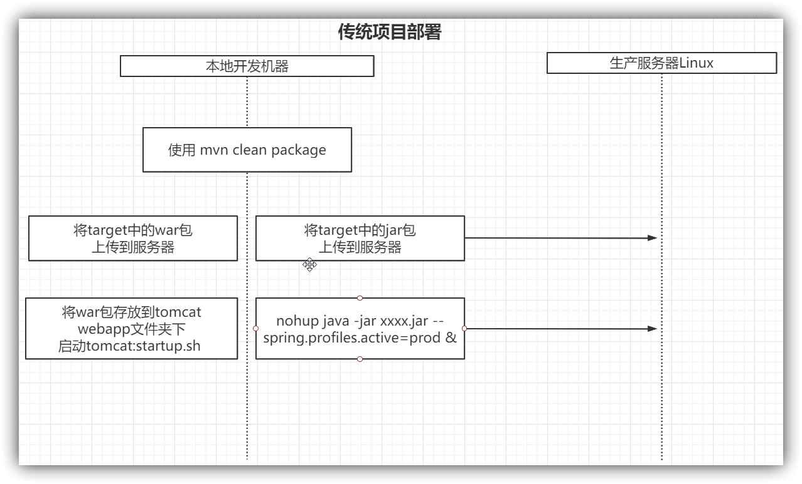


**基于docker**

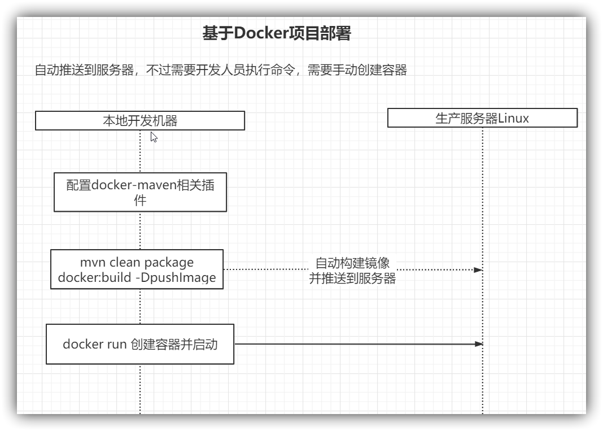

## 2 持续集成&持续部署方案

随着软件开发复杂度的不断提高，团队开发成员间如何更好地协同工作以确保软件
开发的质量已经慢慢成为开发过程中不可回避的问题。互联网软件的开发和发布，已经形成了一套标准流程。

如: 在互联网企业中，每时每刻都有需求的变更，bug的修复， 为了将改动及时更新到生产服务器上，下面的图片我们需要每天执行N多次，开发人员完整代码自测后提交到git，然后需要将git中最新的代码生成镜像并部署到测试服务器，如果测试通过了还需要将最新代码部署到生产服务器。如果采用手动方式操作，那将会浪费大量的时间浪费在运维部署方面。

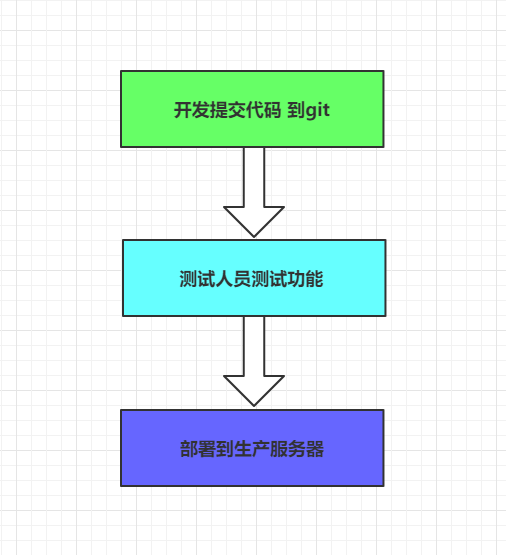

现在的互联网企业，基本都会采用以下方案解决:  

**持续集成（Continuous integration，简称 CI）。**

**持续部署（continuous deployment, 简称 CD）**   


### 2.1 持续集成

持续集成 （Continuous integration，简称 CI） 指的是，频繁地（一天多次）将代码集成到主干。

它的好处主要有两个。

> 1、快速发现错误。每完成一点更新，就集成到主干，可以快速发现错误，定位错误也比较容易。

> 2、防止分支大幅偏离主干。如果不是经常集成，主干又在不断更新，会导致以后集成的难度变大，甚至难以集成。

持续集成的目的，就是让产品可以快速迭代，同时还能保持高质量。它的核心措施是，代码集成到主干之前，必须通过自动化测试。只要有一个测试用例失败，就不能集成。

Martin Fowler 说过，”持续集成并不能消除 Bug，而是让它们非常容易发现和改正。”

与持续集成相关的，还有两个概念，分别是持续交付和持续部署。

### 2.2 持续部署

持续部署（continuous deployment）是持续交付的下一步，指的是代码通过评审以后，**自动部署**到生产环境。

持续部署的目标是，代码在任何时刻都是可部署的，可以进入生产阶段。

持续部署的前提是能自动化完成测试、构建、部署等步骤。

### 2.3 流程说明

为了保证团队开发人员提交代码的质量，减轻了软件发布时的压力；
持续集成中的任何一个环节都是自动完成的，无需太多的人工干预，有利于减少重复
过程以节省时间、费用和工作量；接下来我们会演示一套基本的自动化持续集成和持续部署方案，来帮助大家理解互联网企业的软件部署方案。

计划如下:

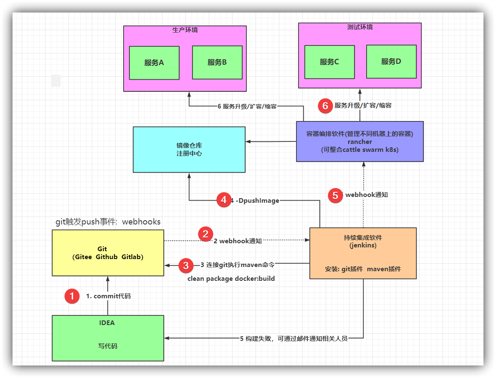

```
1. 开发人员将代码提交到 git 指定分支   如: dev

2. git仓库触发push事件，发送webhooks通知到持续集成软件

3. 持续集成软件触发构建任务，对dev分支的代码进行构建、编译、单元测试

4. 如果构建失败，发送邮件提醒代码提交人员或管理员

5. 如果构建成功，最新代码将会被构建Docker镜像并上传到注册中心

6. 构建成功触发webhooks通知容器编排软件，进行服务升级

7. 容器编排软件，触发对应的服务升级任务， 将创建对应服务的新容器替换之前的容器

8. 完成最新代码的自动构建与自动部署，全程无工作人员干预
```


## 3 ECS服务器准备

### 3.1 ECS服务器购买

购买地址: [阿里云ECS](https://ecs-buy.aliyun.com/wizard?spm=5176.13329450.0.0.42264df5YvIwaZ&accounttraceid=b4bbaacd3dcc4d01b91a78338c04d06ehymz#/postpay/cn-shanghai)

1 选择配置

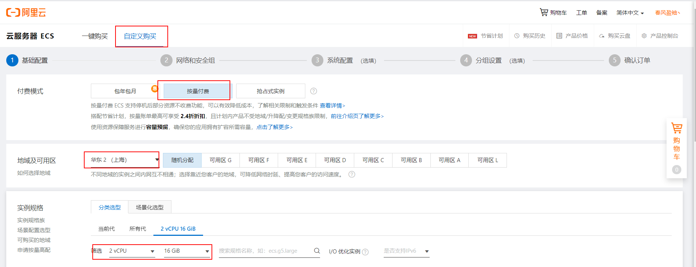

2 选择服务和对应的操作系统

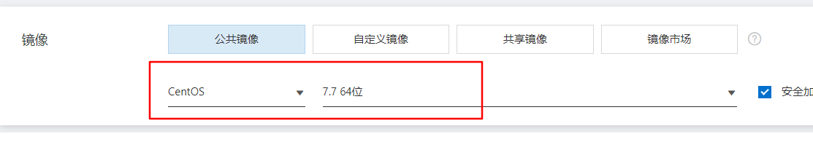

3 选择网络带宽 5M

默认5m即可，当然想更快可以设置大一些，但流量是单独收费的

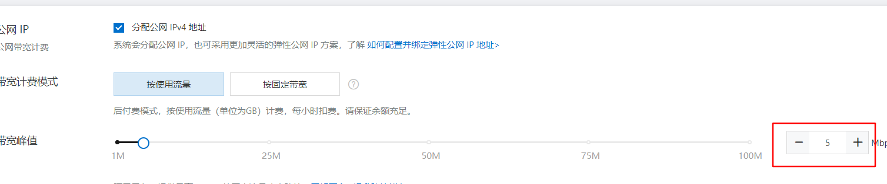

4 直接点击确认订单


5 点击创建实例

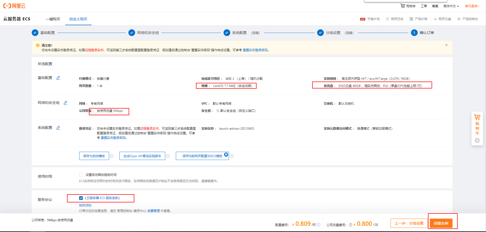

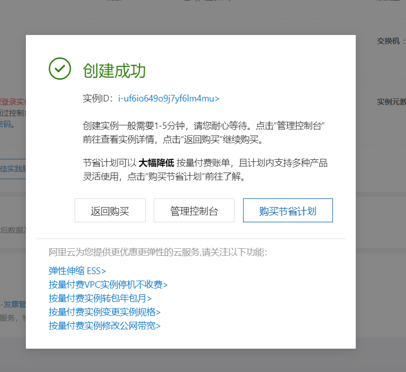

点击管理控制台进入服务器管理界面如下: 

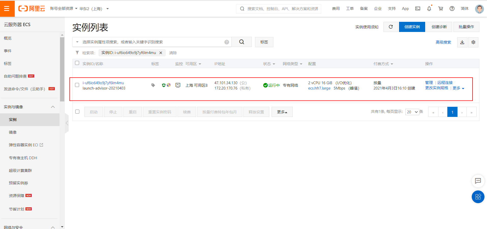

其中:

公网IP: 47.103.2.34.130

私网IP: 172.20.170.76

收到短信: 发送服务器的 密码

重置密码:

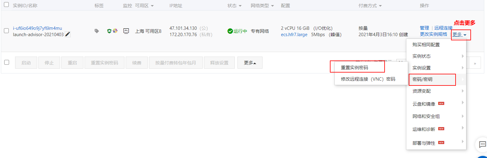

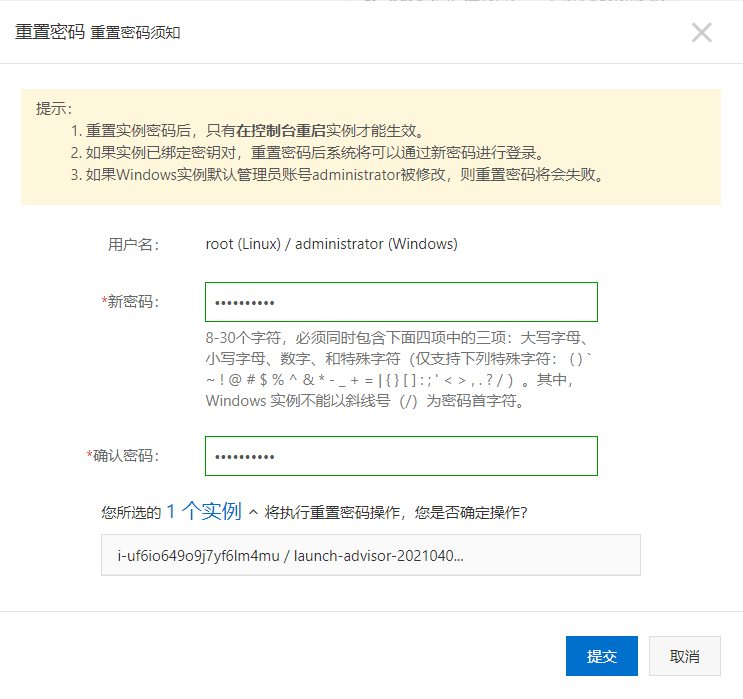

接收短信后,立即重启生效.

### 3.2 客户端工具连接

推荐使用 finalshell 连接.

1 打开 finalshell 创建 ssh 连接

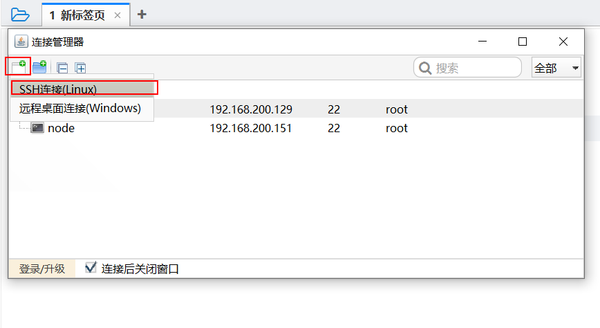

2 输入 阿里云的  用户名(root) 和 设置的新密码

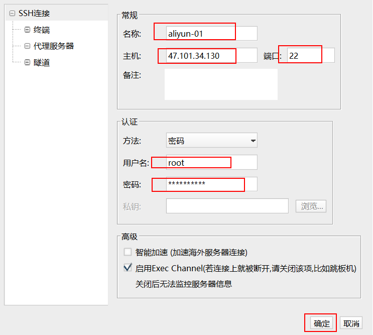

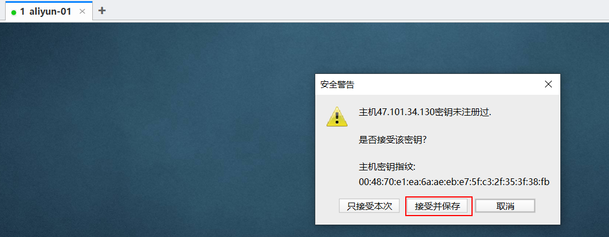

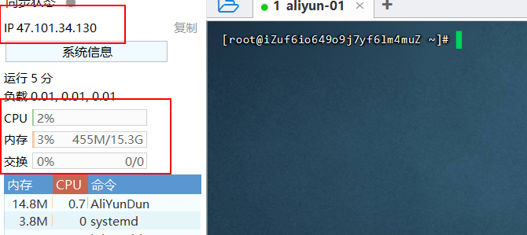

### 3.3 安全组设置

在云服务器中，只有配置了安全规则的端口才允许被外界访问

一般默认   开启:    80 (http)   443 （https）  22 (ssh远程连接)  3389 (windows远程连接)


那如果你安装了mysql 端口是3306  ，那么外界是无法直接访问到的，需要配置一下规则


在入方向中配置安全规则:  ( 用户  访问 -->  阿里云)

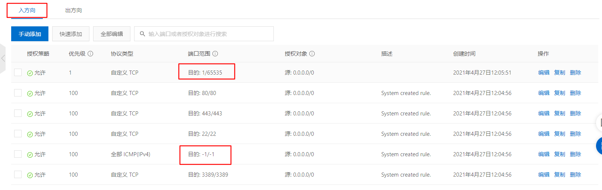

如果配置端口范围:   3306/3306  那就是允许3306端口访问

但是我们的软件很多， 可以通过 `1/65535` 范围 来开放所有的端口访问（不安全，学习阶段这么搞）


## 4  基础环境配置

### 4.1 配置docker环境

（1）yum 包更新到最新

```
sudo yum update -y
```

（2）安装需要的软件包， yum-util 提供yum-config-manager功能，另外两个是devicemapper驱动依赖的

```shell
sudo yum install -y yum-utils device-mapper-persistent-data lvm2
```

（3）设置yum源为阿里云

```shell
sudo yum-config-manager --add-repo http://mirrors.aliyun.com/docker-ce/linux/centos/docker-ce.repo
```

（4）安装docker

```shell
sudo yum -y install docker-ce
```

（5）安装后查看docker版本

```shell
docker -v
```

（6）启动docker

```properties
systemctl start docker

#设置开机自启
systemctl enable docker
```

（7）阿里云镜像加速

阿里云开设了一个[容器开发平台](https://www.aliyun.com/product/acr?spm=5176.19720258.J_8058803260.326.57a22c4aJHmwq7)

需要注册一个属于自己的阿里云账户，登录后进入管理中心

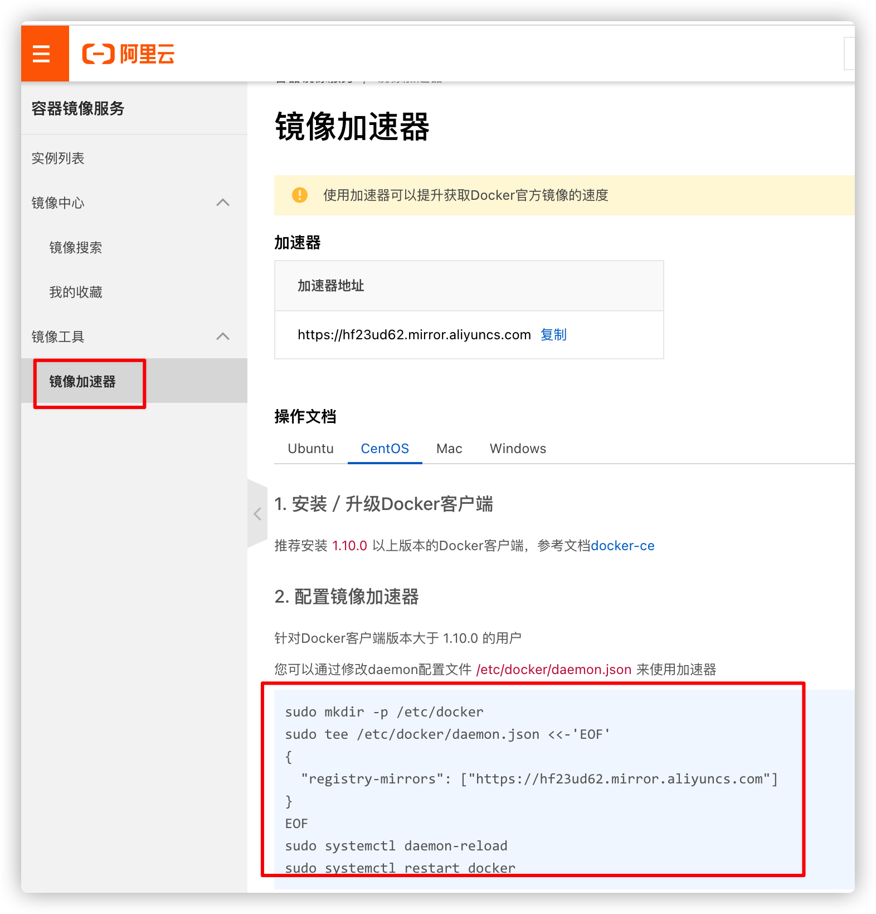

针对Docker客户端版本大于 3.2.10.0 的用户

您可以通过修改daemon配置文件[/etc/docker/daemon.json](/etc/docker/daemon.json)来使用加速器

```shell
sudo mkdir -p /etc/docker
sudo tee /etc/docker/daemon.json <<-'EOF'
{
  "registry-mirrors": ["https://hf23ud62.mirror.aliyuncs.com"]
}
EOF
sudo systemctl daemon-reload
sudo systemctl restart docker
```

观察镜像是否生效：

```shell
docker info
```

### 4.2 配置jdk环境

云服务可以直接使用下面命令 一键安装jdk1.8

```
yum install java-1.8.0-openjdk* -y
```

### 4.3 资料上传阿里云

全部上传到阿里云的**/root目录**

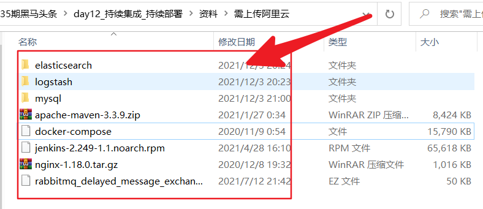

**修改logstash下的logstash.conf**

```json
input {    
    tcp {         
        port => 5044         
        codec => json_lines             
    } 
} 
output{  
    elasticsearch { 
    	hosts => ["47.102.135.173:9200"] 
    } 
}
```


### 4.3 配置maven环境

1. 下载安装包

   下载地址： https://maven.apache.org/download.cgi

2. 解压安装包

   ```sh
   mkdir -p /usr/local/maven
   cd /usr/local/maven
   
   
   # 下载unzip命令
   yum install -y unzip
   
   cp /root/apache-maven-3.3.9.zip /usr/local/maven
   
   # 将压缩包上传至 /usr/local/maven下 解压
   unzip -o apache-maven-3.3.9.zip
   ```

3. 配置

   环境变量配置

   ```sh
   vi /etc/profile
   ```

   增加：

   ```sh
   export MAVEN_HOME=/usr/local/maven/apache-maven-3.3.9
   export PATH=$PATH:$MAVEN_HOME/bin
   ```

   如果权限不够，则需要增加当前目录的权限

   ```shell
   chmod 777 /usr/local/maven/apache-maven-3.3.9/bin/mvn
   ```

   ```sh
   
   # 让配置生效
   source /etc/profile
   
   # 测试是否安装成功
   mvn -v
   ```


### 4.4 配置git环境

```
# 安装git客户端
yum -y install git 
```


## 5 docker-compose安装依赖软件

黑马头条涉及前端后端服务众多，设备性能有限 所以我们简化下部署步骤， 基于docker + docker-compose方式快速部署，先来了解下黑马头条的部署架构

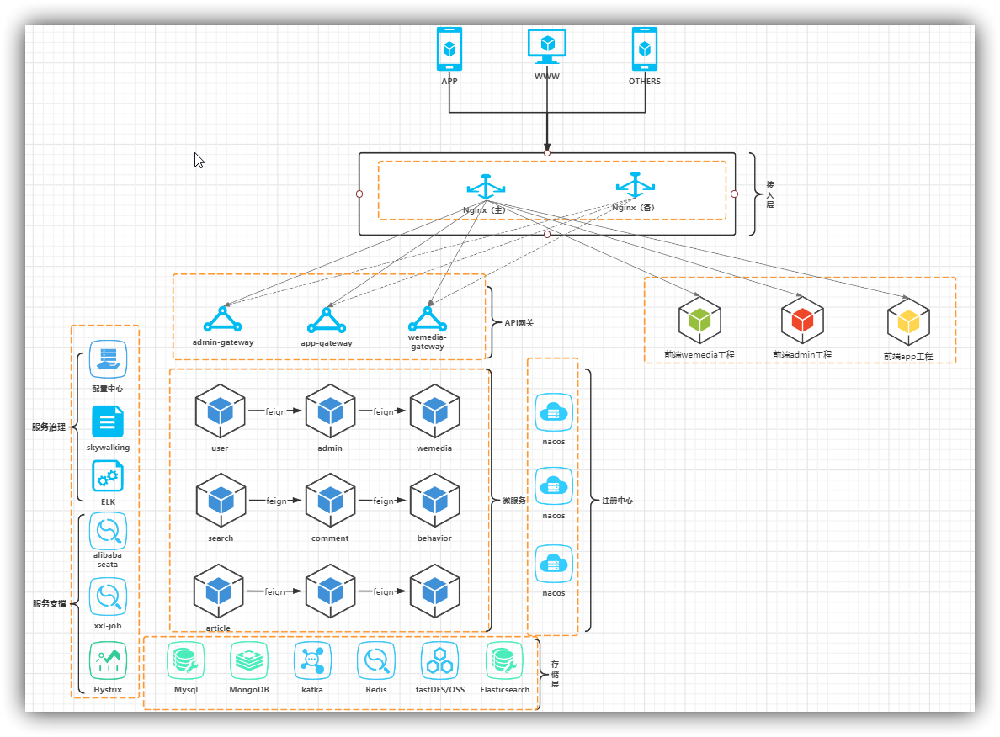

1. nginx作为接入层 所有请求全部通过nginx进入 (部署在100服务 端口80)
2. 前端工程app、admin、wemedia全部部署在nginx中
3. nginx通过反向代理将对微服务的请求，代理到网关
4. 网关根据路由规则，将请求转发到下面的微服务
5. 所有微服务都会注册到nacos注册中心
6. 所有微服务都会将配置存储到nacos中进行统一配置
7. 网关服务及所有微服务部署在 100  服务器   jenkins    微服务
8. 所有依赖的软件部署在    131   服务器

### 5.1 相关软件部署

MAC下或者Windows下的Docker自带Compose功能，无需安装。

Linux下需要通过命令安装：

```sh
# * 如果下载慢，可以上传资料中的 docker-compose 文件到 /usr/local/bin/
cp /root/docker-compose /usr/local/bin/
# 修改权限
chmod +x /usr/local/bin/docker-compose

ln -s /usr/local/bin/docker-compose /usr/bin/docker-compose
```


**黑马头条相关软件 一键脚本**

在`root`目录 创建  `docker-compose.yml` 脚本文件  拷贝下面内容

```yaml
# 通过docker命令即可启动所有软件
version: '3'
services:
  mysql:
    image: mysql:5.7
    ports:
      - "3306:3306"
    volumes:
      - "/root/mysql/conf:/etc/mysql/conf.d"
      - "/root/mysql/logs:/logs"
      - "/root/mysql/data:/var/lib/mysql"
      - "/root/mysql/init:/docker-entrypoint-initdb.d/"
    environment:
      - MYSQL_ROOT_PASSWORD=root
    restart: always
  nacos:
    image: nacos/nacos-server:1.3.2
    ports:
      - "8848:8848"
    restart: always
    environment:
      - MODE=standalone
      - JVM_XMS=512m
      - JVM_XMX=512m
      - JVM_XMN=256m
      - SPRING_DATASOURCE_PLATFORM=mysql
      - MYSQL_SERVICE_HOST=mysql
      - MYSQL_SERVICE_PORT=3306
      - MYSQL_SERVICE_USER=root
      - MYSQL_SERVICE_PASSWORD=root
      - MYSQL_SERVICE_DB_NAME=nacos_config
      - NACOS_SERVER_IP=47.102.135.173
    depends_on:
      - mysql
  seata:
    image: seataio/seata-server:1.4.2
    ports:
      - "8091:8091"
    volumes:
      - "seata-config:/seata-server/resources"
    environment:
      - "SEATA_IP=47.102.135.173"
    restart: always
  xxljob:
    image: xuxueli/xxl-job-admin:2.2.0
    volumes:
      - "/tmp:/data/applogs"
    environment:
      PARAMS: "--spring.datasource.url=jdbc:mysql://47.102.135.173:3306/xxl_job?useUnicode=true&characterEncoding=UTF-8&autoReconnect=true&serverTimezone=Asia/Shanghai --spring.datasource.username=root --spring.datasource.password=root"
    ports:
      - "8888:8080"
    depends_on:
      - mysql
    restart: always
  redis:
    image: redis:6.2.5
    ports:
      - "6379:6379"
    restart: always
    command: redis-server --appendonly yes --requirepass root
  mongo:
    image: mongo:4.2.5
    ports:
      - "27017:27017"
    restart: always
  elasticsearch:
    image: elasticsearch:7.12.1
    ports:
      - "9200:9200"
      - "9300:9300"
    environment:
      - "discovery.type=single-node"
      - "ES_JAVA_OPTS=-Xms512m -Xmx512m"
    volumes:
      - "/root/elasticsearch:/usr/share/elasticsearch/plugins"
    restart: always
  kibana:
    image: kibana:7.12.1
    links:
      - elasticsearch
    environment:
      - "ELASTICSEARCH_URL=http://elasticsearch:9200"
    ports:
      - "5601:5601"
    depends_on:
      - elasticsearch
    restart: always
  minio:
    image: minio/minio:RELEASE.2021-06-14T01-29-23Z
    ports:
      - 9090:9000
    environment:
      - "MINIO_ACCESS_KEY=minio"
      - "MINIO_SECRET_KEY=minio123"
    volumes:
      - "/home/data:/data"
      - "/home/config:/root/.minio"
    command: server /data
    restart: always
  logstash:
    image: logstash:7.12.1
    ports:
      - 5044:5044
    volumes:
      - "/root/logstash:/usr/share/logstash/pipeline"
    restart: always
  mq:
    image: rabbitmq:3.8-management
    restart: always
    ports:
      - 5672:5672
      - 15672:15672
    volumes:
      - "mq-config:/plugins"
    environment:
      - "RABBITMQ_DEFAULT_USER=itcast"
      - "RABBITMQ_DEFAULT_PASS=123321"
volumes:
  seata-config:
  mq-config: 
```

**使用步骤**

1. 运行所有容器：

```
# 运行
docker-compose up -d
# 停止
docker-compose stop
# 停止并删除容器
docker-compose down
# 查看日志
docker-compose logs -f [service...]
# 查看命令
docker-compose --help
```


### 5.2 相关软件配置

**创建es索引库**

```
PUT app_info_article
{
    "mappings":{
        "properties":{
            "id":{
                "type":"long"
            },
            "publishTime":{
                "type":"date"
            },
            "layout":{
                "type":"integer"
            },
            "images":{
                "type":"keyword",
                "index": false
            },
           "staticUrl":{
                "type":"keyword",
                "index": false
            },
            "authorId": {
          		"type": "long"
       		},
          "title":{
            "type":"text",
            "analyzer":"ik_smart"
          }
        }
    }
}
```

**rabbitmq安装延迟队列**

```shell


# 将mq的延迟插件拷贝至挂在目录
cp /root/rabbitmq_delayed_message_exchange-3.8.9-0199d11c.ez /var/lib/docker/volumes/root_mq-config/_data

# 进入rabbitmq容器
docker exec -it root_mq_1 bash

# 开启插件
rabbitmq-plugins enable rabbitmq_delayed_message_exchange
```

**minio中创建bucket 设置读写权限**

```
将项目minio中的article文件夹下载
并上传到外网服务器的minio中

注意:  minIO ==> bucket ==> article ==> plugins ==> js ==> index.js  中对于后台的请求路径需要改为 外网服务器路径
```

**修改seata配置**

**先修改nacos中 seata的数据库配置**

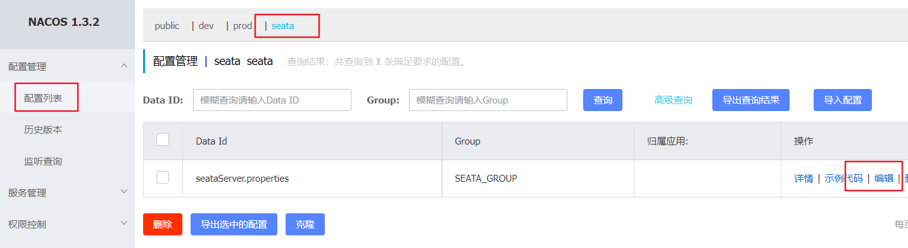

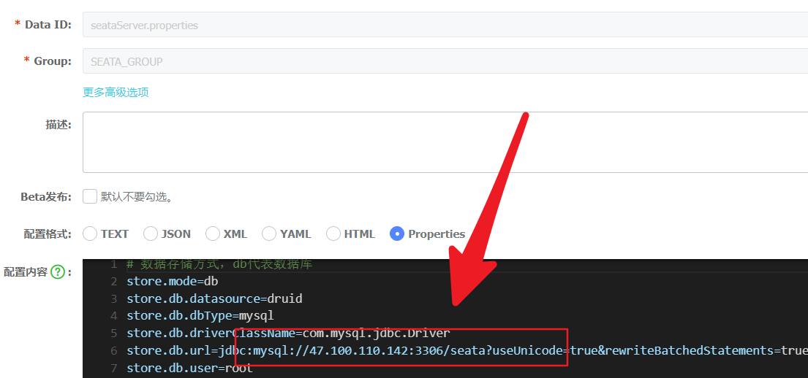


**然后修改seata挂在目录中的配置文件**

```
cd /var/lib/docker/volumes/root_seata-config/_data

rm -rf registry.conf

vi registry.conf 
```

贴入下面配置  然后重启seata  `docker restart root_seata_1`

```json
registry {
  # tc服务的注册中心类，这里选择nacos，也可以是eureka、zookeeper等
  type = "nacos"
  nacos {
    # seata tc 服务注册到 nacos的服务名称，可以自定义 spring.application.name
    application = "seata-tc-server"
    serverAddr = "47.102.135.173:8848"
    group = "SEATA_GROUP"
    namespace = "seata"
    cluster = "SH"
    username = "nacos"
    password = "nacos"
  }
}
config {
  # 读取tc服务端的配置文件的方式，这里是从nacos配置中心读取，这样如果tc是集群，可以共享配置
  type = "nacos"
  # 配置nacos地址等信息
  nacos {
    serverAddr = "47.102.135.173:8848"
    namespace = "seata"
    group = "SEATA_GROUP"
    username = "nacos"
    password = "nacos"
    dataId = "seataServer.properties"
  }
}
```

```
# 进入root目录
cd ~

# 重启seata服务
docker-compose restart seata
```


### 5.3 实现nacos统一配置

修改每个微服务  **bootstrap.yml** 配置 ,将ip 改为外网

**查找**

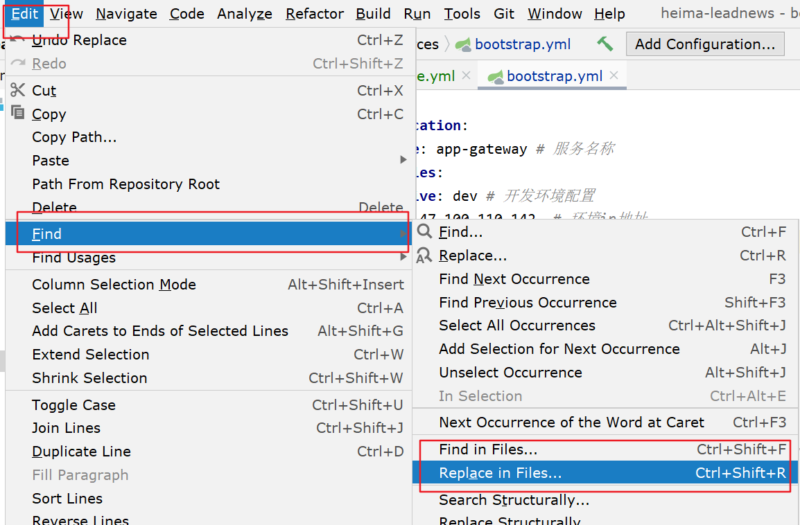

**替换**

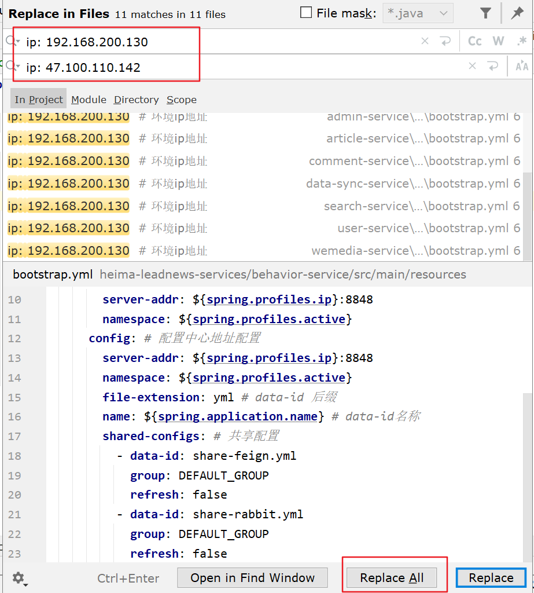

```yml

```


## 6. 准备持续集成软件jenkins

### 6.1 Jenkins环境搭建

1. 采用YUM方式安装

   加入jenkins安装源：

   ```sh
   sudo wget -O /etc/yum.repos.d/jenkins.repo https://pkg.jenkins.io/redhat-stable/jenkins.repo --no-check-certificate
   
   sudo rpm --import https://pkg.jenkins.io/redhat-stable/jenkins.io.key
   ```

   执行yum命令安装：

   ```sh
   yum -y install jenkins
   ```

2. **采用RPM安装包方式（采用）**

   [Jenkins安装包下载地址](https://pkg.jenkins.io/redhat-stable/)

​      

**可以直接使用 资料中提供的jenkins安装包**

   **执行安装：**

   ```sh
   cd /root
   
   rpm -ivh jenkins-2.249-1.1.noarch.rpm
   ```

3. 配置：

   修改配置文件：

   ```sh
   vi /etc/sysconfig/jenkins
   ```

   修改内容：

   ```sh
   # 修改为对应的目标用户， 这里使用的是root
   $JENKINS_USER="root"
   # 服务监听端口
   JENKINS_PORT="16060"
   ```

   目录权限：

   ```sh
   chown -R root:root /var/lib/jenkins
   chown -R root:root /var/cache/jenkins
   chown -R root:root /var/log/jenkins
   ```

   重启：

   ```sh
   systemctl restart jenkins
   ```

   管理后台初始化设置

   http://阿里云外网IP地址:16060/


   需要输入管理密码， 在以下位置查看：

   ```sh
   cat /var/lib/jenkins/secrets/initialAdminPassword
   ```

   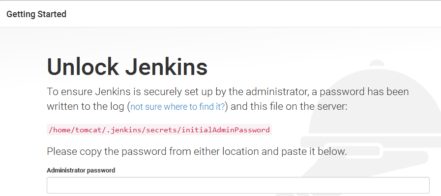

   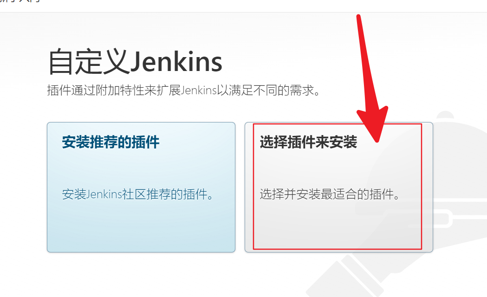


   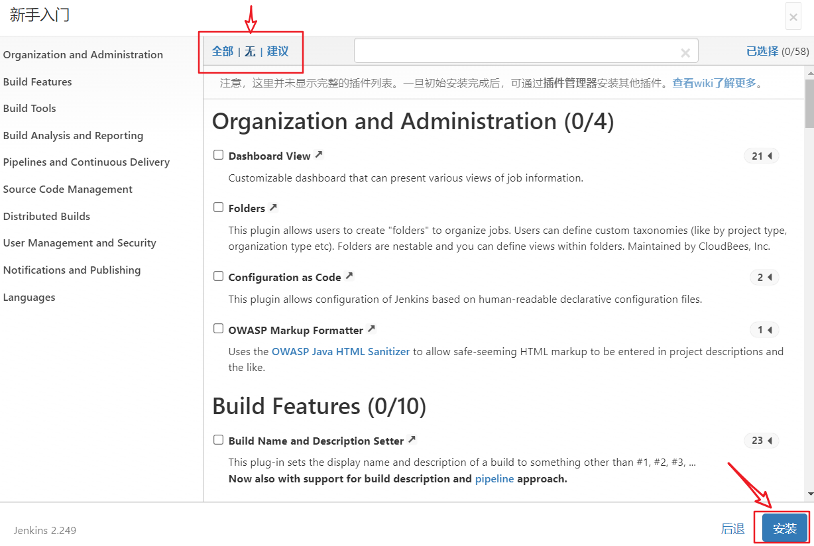

这一步等待时间较长， 安装完成之后， 创建管理员用户：

   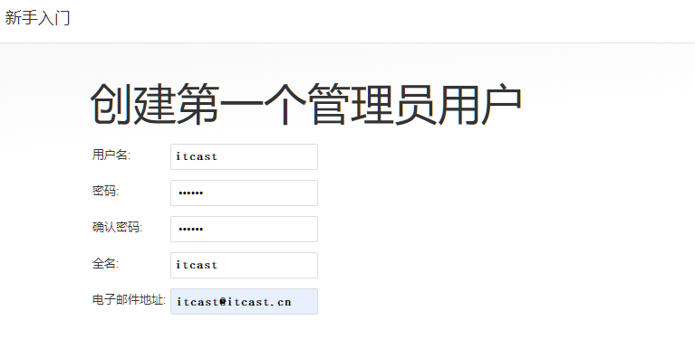


**升级jenkins版本**

升级完毕后，重启jenkins


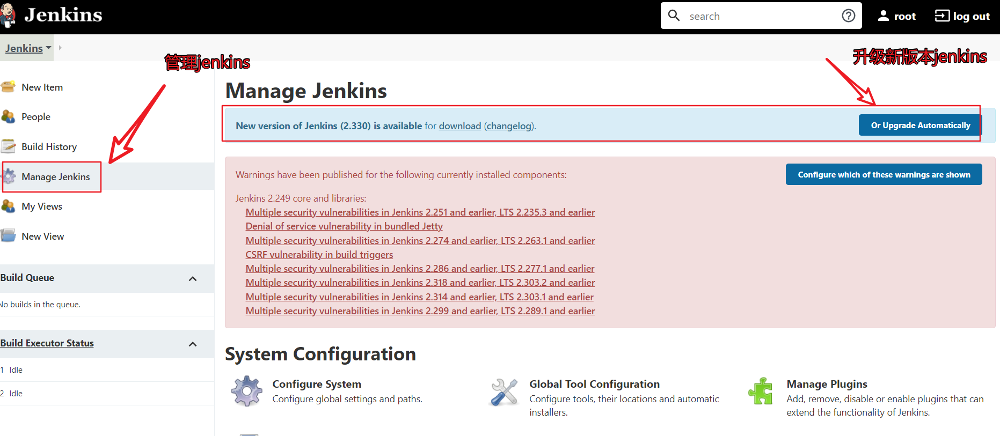


**准备安装插件:**


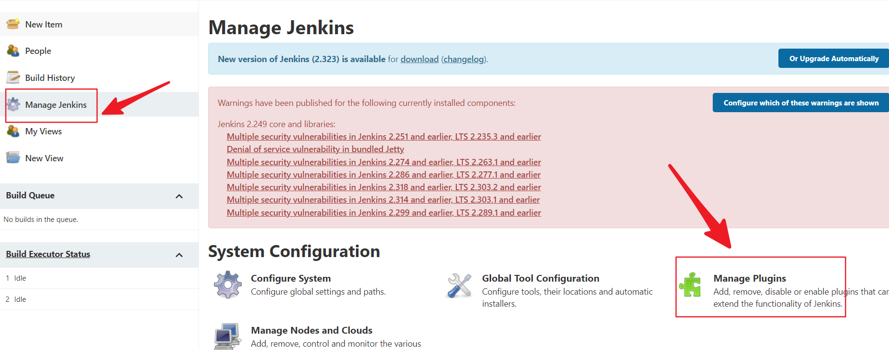


**安装中文插件**


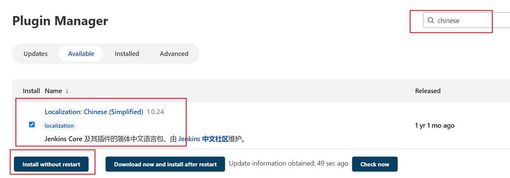


**安装 maven集成插件**

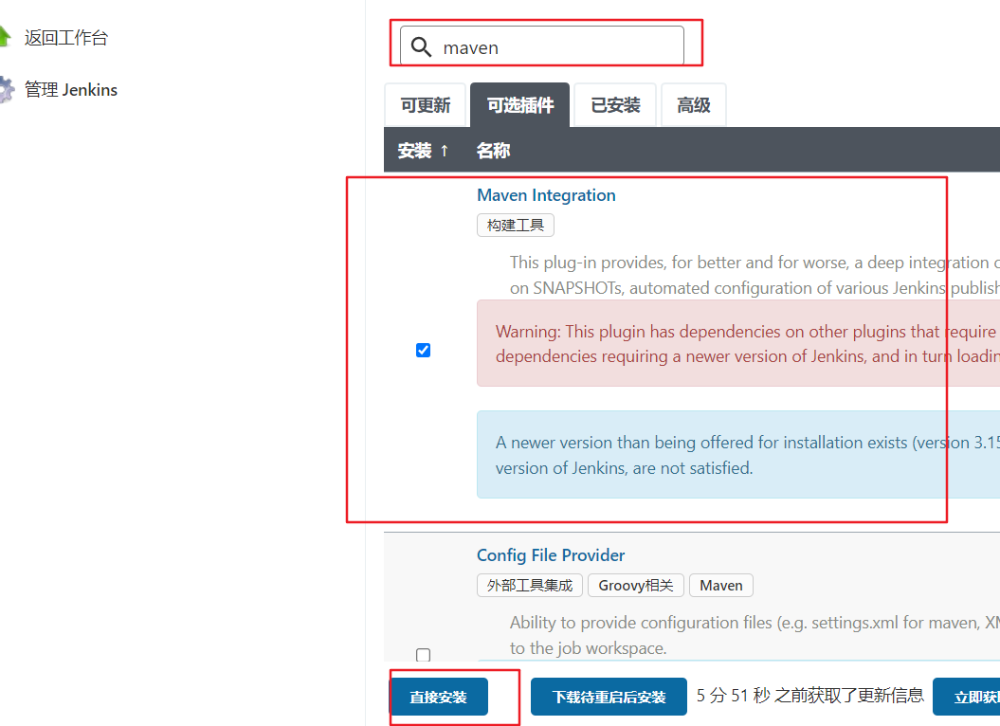

**安装git插件**

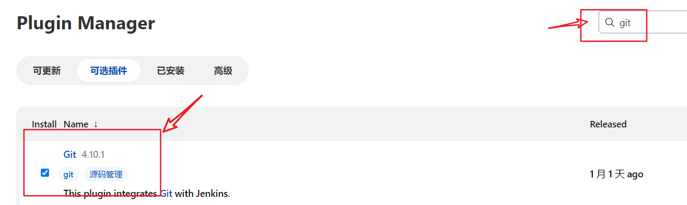

### 6.2  Jenkins插件安装

在实现持续集成之前， 需要确保以下插件安装成功。

- `Maven Integration plugin`： Maven 集成管理插件。**(必装)**
- `Git Plugin`： Git 集成插件。**（必装）**


- `Docker plugin`： Docker集成插件。**( 可选 )**
- `GitLab Plugin`： GitLab集成插件。**( 可选 )**
- `Publish Over SSH`：远程文件发布插件。**( 可选 )**
- `SSH`: 远程脚本执行插件。**( 可选 )**

安装方法：

1. 进入【系统管理】-【插件管理】

2. 点击标签页的【可选插件】

   在过滤框中搜索插件名称

   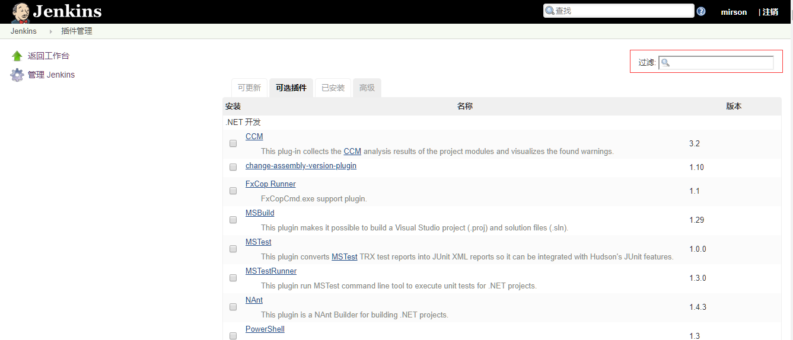

3. 勾选插件， 点击直接安装即可。

> **注意，如果上面安装正常，无需配置     如果没有安装按钮，或者安装失败  需要更改配置** 
>
>
>
> 在安装插件的高级配置中，修改升级站点的连接为：http://updates.jenkins.io/update-center.json   保存
>
> 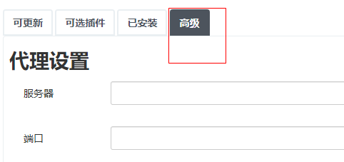
>
> 

1. 安装完毕后重启jenkins

```
systemctl restart jenkins
```


### 6.3 jenkins全局配置

1. 进入【系统管理】--> 【全局工具配置】

   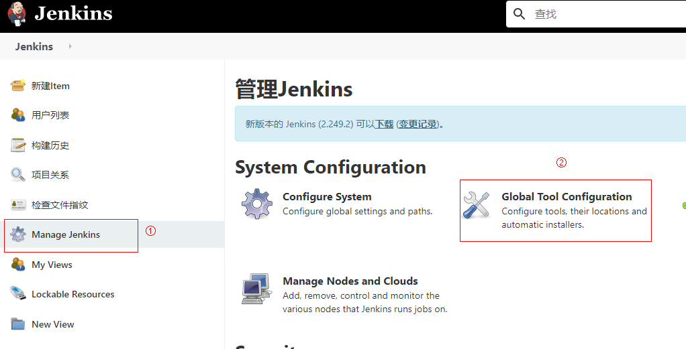

2. MAVEN配置全局设置

   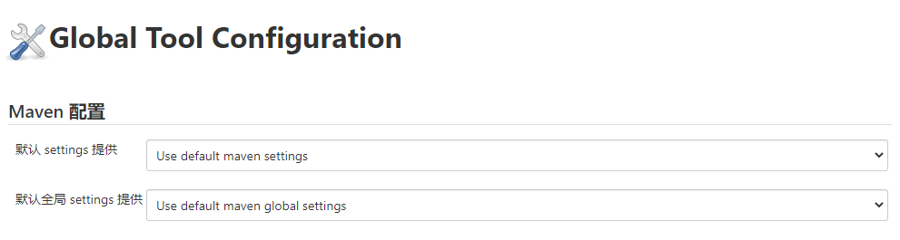

3. 指定JDK配置

   不用指定， 前面已安装


1. 指定MAVEN 目录

   点击新增maven **配置name:** maven  **配置maven地址:**  /usr/local/maven/apache-maven-3.3.9

   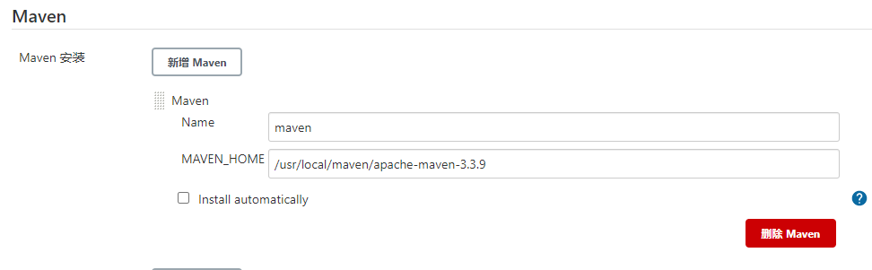

## 

## 7 微服务持续部署

每个微服务使用的dockerfile的方式进行构建镜像后创建容器，需要在每个微服务中添加docker相关的配置

（1）修改**每个微服务**的pom文件，添加Dockerfile的插件

finalName的命名规则一定要以 **heima-**开头，后续有脚本使用到这个名字

> **heima-leadnews-wemedia**
>
> **heima-leadnews-admin**
>
> **heima-leadnews-article**
>
> **heima-leadnews-behavior**
>
> **heima-leadnews-comment**
>
> **heima-leadnews-search**
>
> **heima-leadnews-user**
>
> **heima-admin-gateway**
>
> **heima-wemedia-gateway**
>
> **heima-app-gateway**


```xml
<build>
        <finalName>heima-admin-gateway</finalName>
        <plugins>
            <plugin>
                <groupId>org.springframework.boot</groupId>
                <artifactId>spring-boot-maven-plugin</artifactId>
                <executions>
                    <execution>
                        <goals>
                            <goal>repackage</goal>
                        </goals>
                    </execution>
                </executions>
            </plugin>
            <plugin>
                <groupId>org.apache.maven.plugins</groupId>
                <artifactId>maven-compiler-plugin</artifactId>
                <version>3.7.0</version>
                <configuration>
                    <source>${java.version}</source>
                    <target>${java.version}</target>
                </configuration>
            </plugin>
            <plugin>
                <groupId>com.spotify</groupId>
                <artifactId>dockerfile-maven-plugin</artifactId>
                <version>1.3.6</version>
                <configuration>
                    <repository>docker_storage/${project.build.finalName}</repository>
                    <buildArgs>
                        <JAR_FILE>target/${project.build.finalName}.jar</JAR_FILE>
                    </buildArgs>
                </configuration>
            </plugin>
        </plugins>
    </build>
```

（2）在每个微服务的根目录下创建Dockerfile文件，如下：

```dockerfile
# 设置JAVA版本
FROM java:8
# 指定存储卷, 任何向/tmp写入的信息都不会记录到容器存储层
VOLUME /tmp
# 拷贝运行JAR包
ARG JAR_FILE
COPY ${JAR_FILE} app.jar
# 设置JVM运行参数， 这里限定下内存大小，减少开销
ENV JAVA_OPTS="\
-server \
-Xms256m \
-Xmx512m \
-XX:MetaspaceSize=256m \
-XX:MaxMetaspaceSize=512m"
# 入口点， 执行JAVA运行命令
ENTRYPOINT java ${JAVA_OPTS}  -jar /app.jar
```

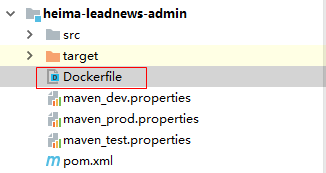


(3) 每个微服务的**resources**目录下，创建**banner.txt**  

```
${AnsiColor.BRIGHT_GREEN}
////////////////////////////////////////////////////////////////////
//                          _ooOoo_                               //
//                         o8888888o                              //
//                         88" . "88                              //
//                         (| ^_^ |)                              //
//                         O\  =  /O                              //
//                      ____/`---'\____                           //
//                    .'  \\|     |//  `.                         //
//                   /  \\|||  :  |||//  \                        //
//                  /  _||||| -:- |||||-  \                       //
//                  |   | \\\  -  /// |   |                       //
//                  | \_|  ''\---/''  |   |                       //
//                  \  .-\__  `-`  ___/-. /                       //
//                ___`. .'  /--.--\  `. . ___                     //
//              ."" '<  `.___\_<|>_/___.'  >'"".                  //
//            | | :  `- \`.;`\ _ /`;.`/ - ` : | |                 //
//            \  \ `-.   \_ __\ /__ _/   .-` /  /                 //
//      ========`-.____`-.___\_____/___.-`____.-'========         //
//                           `=---='                              //
//      ^^^^^^^^^^^^^^^^^^^^^^^^^^^^^^^^^^^^^^^^^^^^^^^^^^        //
//            佛祖保佑       永不宕机      永无BUG                //
////////////////////////////////////////////////////////////////////
```


### 7.1 基础依赖打包配置

在微服务运行之前需要在本地仓库中先去install所依赖的jar包，所以第一步应该是从git中拉取代码，并且把基础的依赖部分安装到仓库中

（1）新创建一个item,起名为heima-leadnews

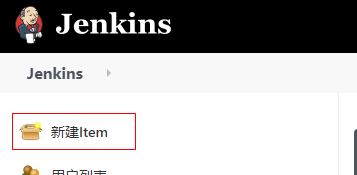


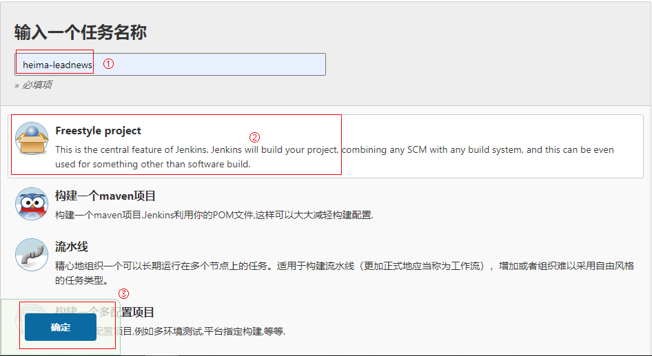

（2）配置当前heima-leadnews

- 描述项目

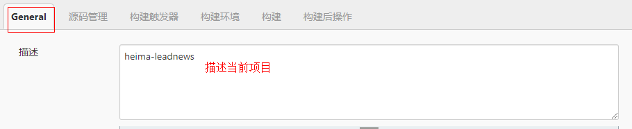

- 源码管理：

  选中git，输入git的仓库地址（前提条件，需要把代码上传到gitee仓库中），最后输入gitee的用户名和密码

  如果没有配置Credentials，可以选择添加，然后输入用户名密码即可 **(公开仓库无需密码)**


  **jenkins拉取gitlab代码 ssh配置**
  https://blog.csdn.net/weixin_33709590/article/details/92425799


- 其中构**建触发器**与**构建环境**暂不设置

- 设置**构建**配置

  选择`Invoke top-level Maven targets`

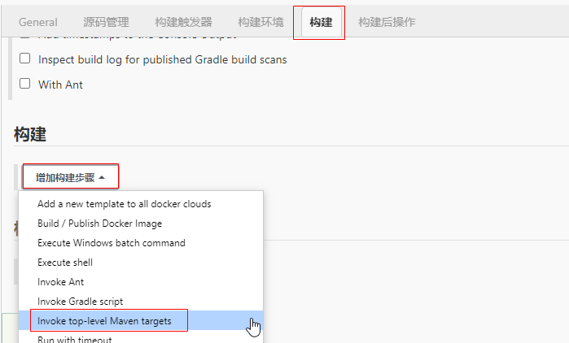

​	maven版本：就是之前在jenkins中配置的maven


​	**目标：输入maven的命令**  `clean install -Dmaven.test.skip=true`  跳过测试安装


(3)启动项目

创建完成以后可以在主页上看到这个item


启动项目：点击刚才创建的项目，然后Build Now

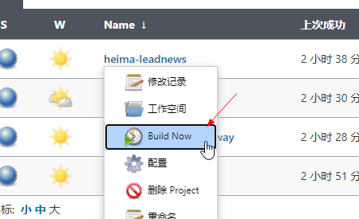

在左侧可以查看构建的进度：

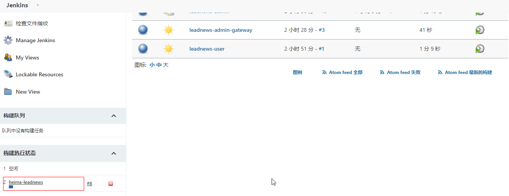

点进去以后，可以查看构建的日志信息

构建的过程中，会不断的输入日志信息，如果报错也会提示错误信息

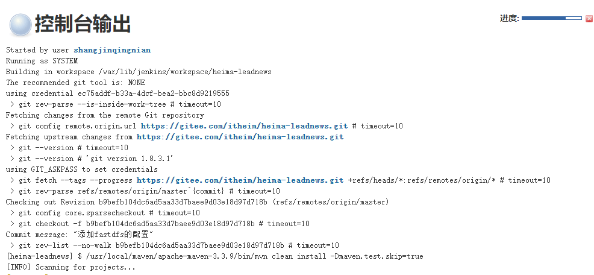

jenkins会先从git仓库中拉取代码，然后执行maven的install命令，把代码安装到本地仓库中

最终如果是success则为构建成功

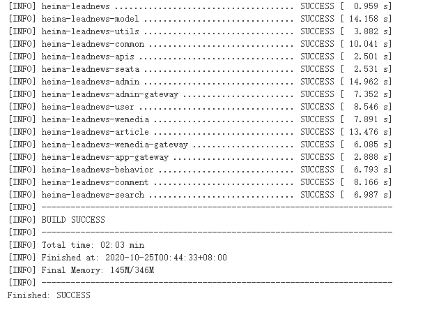

### 7.2 微服务打包配置

（1）新建item，以**heima-leadnews-admin**微服务为例

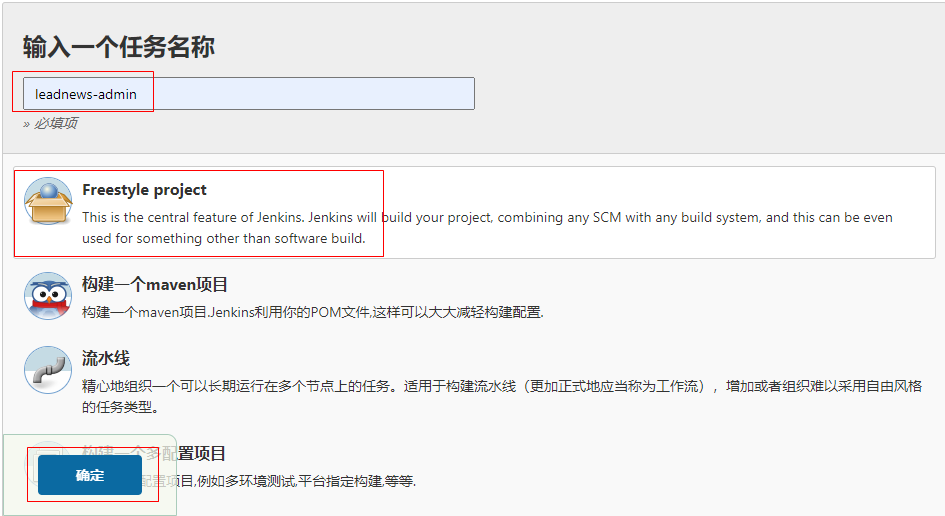

(2)配置

- 概述

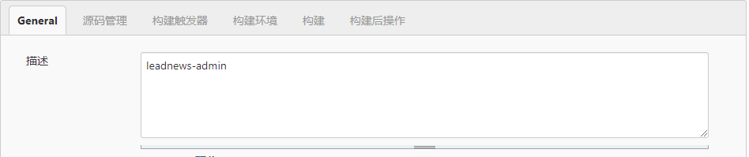

- 源码管理

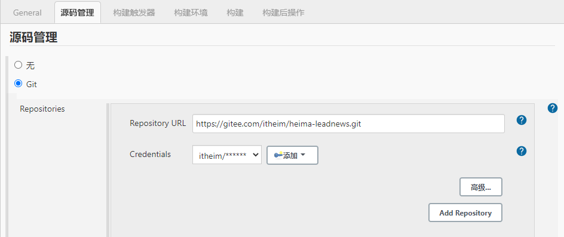

- 构建

配置maven

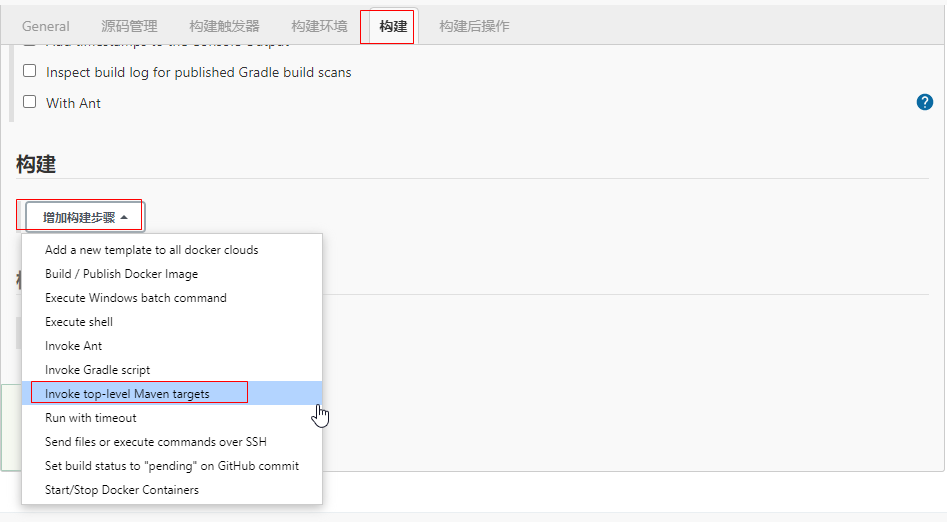

**执行maven命令：**

```
clean install -Dmaven.test.skip=true -P dev dockerfile:build -f heima-leadnews-services/admin-service/pom.xml
```

**注意目录接口， maven命令要找到pom.xml的位置**

>-Dmaven.test.skip=true   跳过测试
>
>-P prod  指定环境为生成环境
>
>dockerfile:build  启动dockerfile插件构建容器
>
>-f heima-leadnews-admin/pom.xml  指定需要构建的文件（必须是pom）

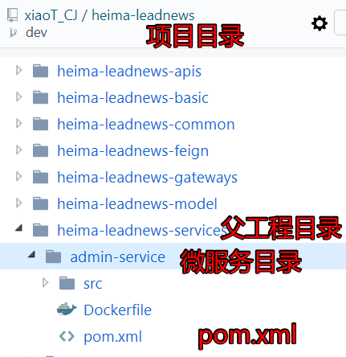

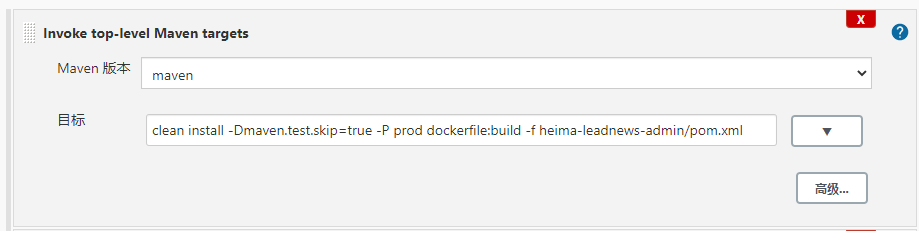

执行shell命令

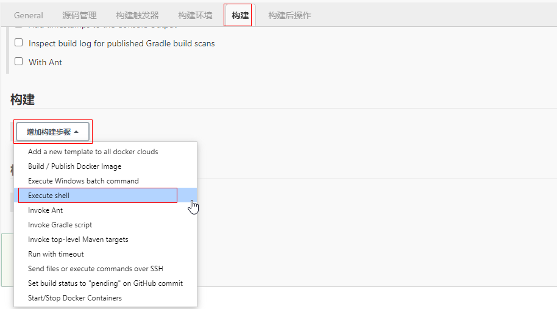

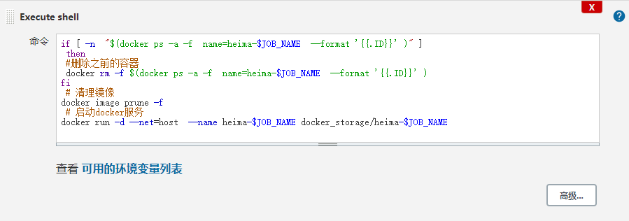

```shell
if [ -n  "$(docker ps -a -f  name=heima-$JOB_NAME  --format '{{.ID}}' )" ]
 then
 #删除之前的容器
 docker rm -f $(docker ps -a -f  name=heima-$JOB_NAME  --format '{{.ID}}' )
fi
 # 清理镜像
docker image prune -f 
 # 启动docker服务
docker run -d --net=host  --name heima-$JOB_NAME docker_storage/heima-$JOB_NAME
```


**到此就配置完毕了，保存即可**

（3）启动该项目 Build Now

- 首先从git中拉取代码
- 编译打包项目
- 构建镜像
- 创建容器
- 删除多余的镜像

可以从服务器中查看镜像


容器也已创建完毕

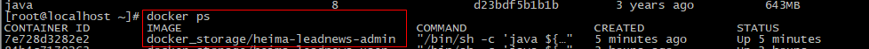

可以使用postman测试测试该服务接口

### 7.3 构建其他微服务

可以参考admin微服务创建其他微服务，每个项目可能会有不同的maven构建命令，请按照实际需求配置

- heima-admin-gateway微服务的配置：

```
maven命令：

clean install -Dmaven.test.skip=true dockerfile:build -f  heima-leadnews-gateways/admin-gateway/pom.xml
```


>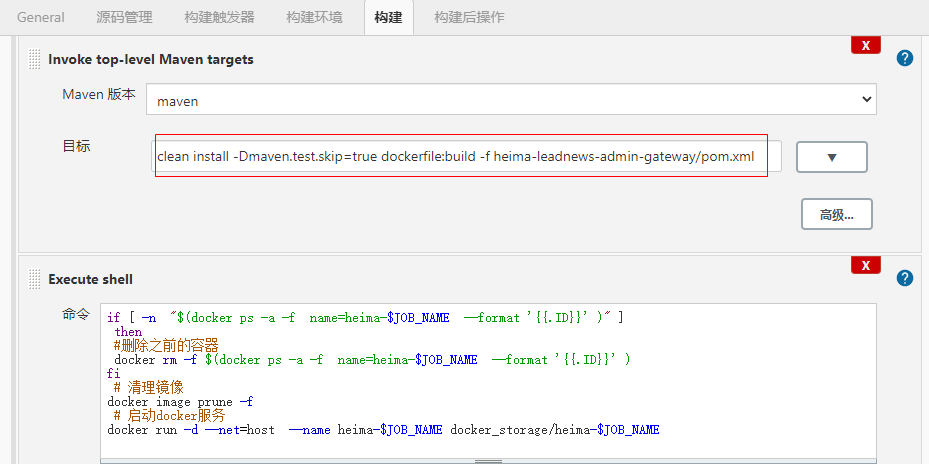


heima-leadnews-user微服务的配置：

```
maven命令：

clean install -Dmaven.test.skip=true dockerfile:build -f heima-leadnews-services/user-service/pom.xml
```

>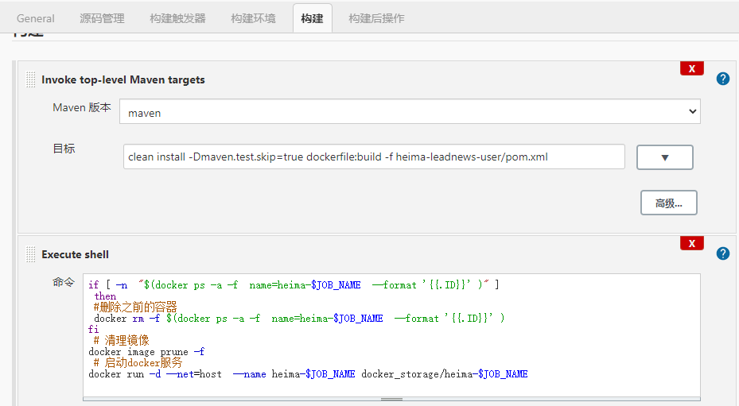

所有项目构建完成以后，在本地启动admin前端工程，修改configs中的网关地址为：`192.168.200.100`,进行效果测试

**同样方式配置其它微服务**


## 8 接入层及前端部署

### 8.1 接入层nginx搭建

官方网站下载 nginx：http://nginx.org/，也可以使用资料中的安装包，版本为：nginx-1.18.0

**安装依赖**

- 需要安装 gcc 的环境

```shell
yum install -y gcc-c++
```

- 第三方的开发包。

  - PCRE(Perl Compatible Regular Expressions)是一个 Perl 库，包括 perl 兼容的正则表达式库。nginx 的 http 模块使用 pcre 来解析正则表达式，所以需要在 linux 上安装 pcre 库。

    ```shell
    yum install -y pcre pcre-devel
    ```

    注：pcre-devel 是使用 pcre 开发的一个二次开发库。nginx 也需要此库。

  - zlib 库提供了很多种压缩和解压缩的方式，nginx 使用 zlib 对 http 包的内容进行 gzip，所以需要在 linux 上安装 zlib 库。

    ```shell
    yum install -y zlib zlib-devel
    ```

  - OpenSSL 是一个强大的安全套接字层密码库，囊括主要的密码算法、常用的密钥和证书封装管理功能及 SSL 协议，并提供丰富的应用程序供测试或其它目的使用。nginx
    不仅支持 http 协议，还支持 https（即在 ssl 协议上传输 http），所以需要在 linux安装 openssl 库。

    ```shell
    yum install -y openssl openssl-devel
    ```

**Nginx安装**

第一步：把 nginx 的源码包nginx-1.18.0.tar.gz上传到 linux 系统

第二步：解压缩

```shell
tar -zxvf nginx-1.18.0.tar.gz
```

第三步：进入**nginx-1.18.0**目录   使用 configure 命令创建一 makeFile 文件。

```shell
./configure \
--prefix=/usr/local/nginx \
--pid-path=/var/run/nginx/nginx.pid \
--lock-path=/var/lock/nginx.lock \
--error-log-path=/var/log/nginx/error.log \
--http-log-path=/var/log/nginx/access.log \
--with-http_gzip_static_module \
--http-client-body-temp-path=/var/temp/nginx/client \
--http-proxy-temp-path=/var/temp/nginx/proxy \
--http-fastcgi-temp-path=/var/temp/nginx/fastcgi \
--http-uwsgi-temp-path=/var/temp/nginx/uwsgi \
--http-scgi-temp-path=/var/temp/nginx/scgi
```

执行后可以看到Makefile文件

第四步：编译

```shell
make
```

第五步：安装

```shell
make install
```

第六步：启动

注意：启动nginx 之前，上边将临时文件目录指定为/var/temp/nginx/client， 需要在/var  下创建此
目录

```shell
mkdir /var/temp/nginx/client -p
```

进入到Nginx目录下的sbin目录

```shell
cd /usr/local/nginx/sbin
```

输入命令启动Nginx

```shell
./nginx
```

启动后查看进程

```shell
ps aux|grep nginx
```

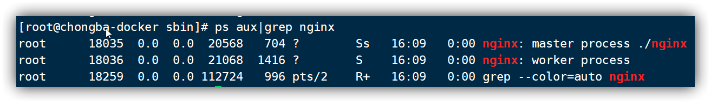


### 8.2 发布前端工程

前端在开发时，是基于node环境在本地开发，引用了非常多的基于node的js 在开发完毕后也许要发布，webpack依赖就是用于发布打包的，它会将很多依赖的js进行整合，最终打包成 html css js 这三种格式的文件，我们把发布后的静态文件拷贝到nginx管理的文件夹中，即可完成部署

```shell
# 创建目录  用于存放对应的前端静态资源
mkdir -p /root/workspace/admin 
mkdir -p /root/workspace/web
mkdir -p /root/workspace/wemedia
```

**admin前端工程发布**

在admin工程下，打开cmd  输入: `npm run build` 进行发布

发布后的静态文件，会存放到dist文件夹中

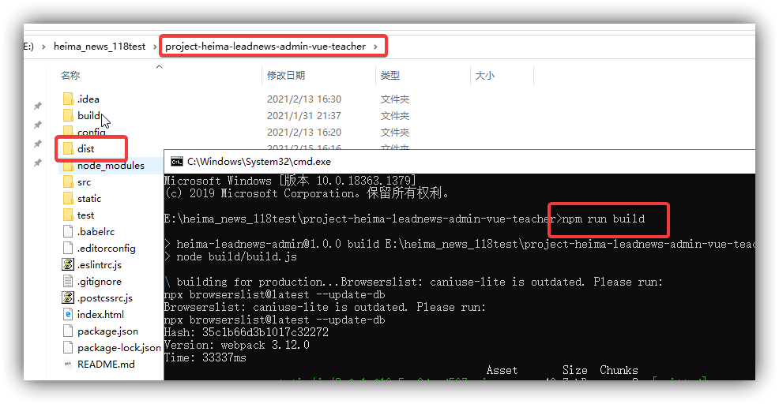

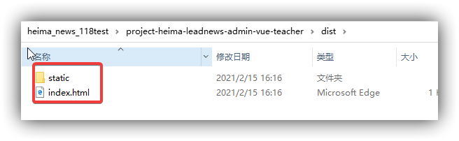

把dist文件夹上传到服务器上，拷贝到150虚拟机的/root/workspace/admin目录中

**wemedia前端工程发布**

在wemedia工程下，打开cmd  输入: `npm run build` 进行发布

发布后的静态文件，会存放到dist文件夹中

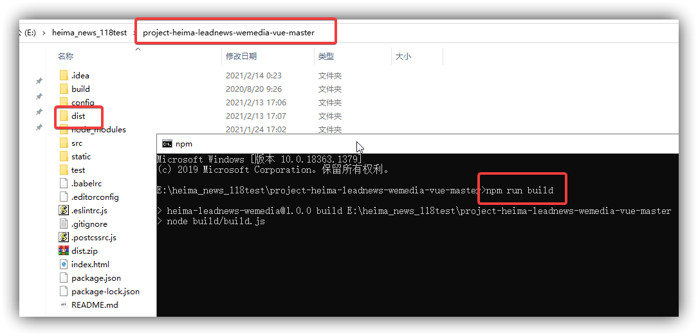

把dist文件夹上传到服务器上，拷贝到150虚拟机的/root/workspace/wemedia目录中

**app前端工程发布**

前端工程比较特殊，因为使用了被称为三端合一的weex框架,也就是说它即可以发布android端，也可以发布ios端，也可以发布web端。命令会有区别

在app工程下，打开cmd  输入: `npm run clean:web && npm run build:prod:web` 进行发布web端

```
小贴士: 其它端需要安装对应软件才能发布，比如android需要有android studio
npm run pack:android   发布安卓
npm run pack:ios       发布ios
```

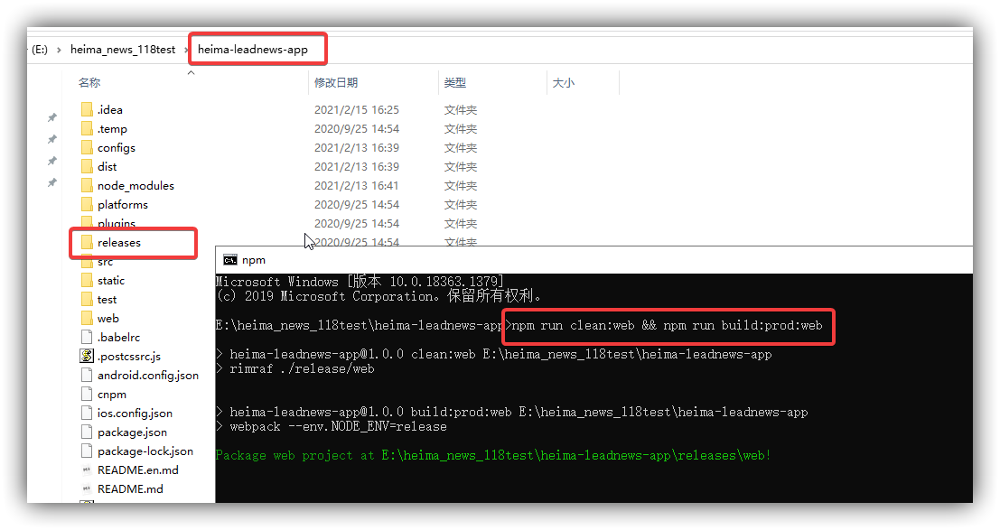

把releases文件夹下的web文件夹上传到服务器上，拷贝到150虚拟机的/root/workspace/目录中

### 8.3 nginx配置前端工程访问

对于不同的前端工程 ， 我们会通过不同的域名来访问, 先给三个前端工程准备3个访问域名

1. 使用type下载hosts插件
2. 配置3个域名:   

```
47.102.135.173  admin.leadnews.com
47.102.135.173  wemedia.leadnews.com
47.102.135.173  web.leadnews.com
```

**打开linux的目录：/usr/local/nginx/conf**

编辑**nginx.conf**文件，替换如下:

**网关地址请按自己实际地址配置**

**访问三个端的域名，请按自己实际地址配置**


**有域名方案**

```nginx
user  root;
worker_processes  1;
events {
    worker_connections  1024;
}
http {
    include       mime.types;
    default_type  application/octet-stream;
    
    # 反向代理配置 代理admin gateway
    upstream  heima-admin-gateway{
        server 47.102.135.173:6001;  
    }
    # 反向代理配置 代理wemedia gateway
    upstream  heima-wemedia-gateway{
       server 47.102.135.173:6002;
    }
    # 反向代理配置 代理app gateway
    upstream  heima-app-gateway{
       server 47.102.135.173:5001;
    }
    
    server {
	listen 80;
	server_name localhost;
        location / {
            root /usr/local/nginx/html;
            index index.html ;
        }	
     }
     server {
        listen 80;
        server_name app.chenjin.net.cn;
        location / {
            root /root/workspace/web;
            index index.html ;
        }   
        location ~/app/(.*) {
            proxy_pass http://heima-app-gateway/$1;
            proxy_set_header HOST $host;
            proxy_pass_request_body on;
            proxy_pass_request_headers on;
            proxy_set_header X-Real-IP $remote_addr;
            proxy_set_header X-Forwarded-For $proxy_add_x_forwarded_for;
        }
     }
     server {
        listen 80;
        server_name admin.chenjin.net.cn;
        location / {
            root /root/workspace/admin/dist;
            index index.html ;
        }
        location ~/service_6001/(.*) {
            proxy_pass http://heima-admin-gateway/$1;
            proxy_set_header HOST $host;
            proxy_pass_request_body on;
            proxy_pass_request_headers on;
            proxy_set_header X-Real-IP $remote_addr;
            proxy_set_header X-Forwarded-For $proxy_add_x_forwarded_for;
        }          
     }  
     server {
        listen 80;
        server_name wemedia.chenjin.net.cn;
        location / {
            root /root/workspace/wemedia/dist;
            index index.html ;
        }
        location ~/wemedia/MEDIA/(.*) {
            proxy_pass http://heima-wemedia-gateway/$1;
            proxy_set_header HOST $host;
            proxy_pass_request_body on;
            proxy_pass_request_headers on;
            proxy_set_header X-Real-IP $remote_addr;
            proxy_set_header X-Forwarded-For $proxy_add_x_forwarded_for;
        }                              
     } 
}
```

**没域名方案**

```nginx
user  root;
worker_processes  1;
events {
    worker_connections  1024;
}
http {
    include       mime.types;
    default_type  application/octet-stream;
    
    # 反向代理配置 代理admin gateway
    upstream  heima-admin-gateway{
        server 47.102.135.173:6001;  
    }
    # 反向代理配置 代理wemedia gateway
    upstream  heima-wemedia-gateway{
       server 47.102.135.173:6002;
    }
    # 反向代理配置 代理app gateway
    upstream  heima-app-gateway{
       server 47.102.135.173:5001;
    }
    
    server {
	listen 80;
	server_name localhost;
        location / {
            root /usr/local/nginx/html;
            index index.html ;
        }	
     }
     server {
        listen 81;
        server_name localhost;
        location / {
            root /root/workspace/web;
            index index.html ;
        }   
        location ~/app/(.*) {
            proxy_pass http://heima-app-gateway/$1;
            proxy_set_header HOST $host;
            proxy_pass_request_body on;
            proxy_pass_request_headers on;
            proxy_set_header X-Real-IP $remote_addr;
            proxy_set_header X-Forwarded-For $proxy_add_x_forwarded_for;
        }
     }
     server {
        listen 82;
        server_name localhost;
        location / {
            root /root/workspace/admin/dist;
            index index.html ;
        }
        location ~/service_6001/(.*) {
            proxy_pass http://heima-admin-gateway/$1;
            proxy_set_header HOST $host;
            proxy_pass_request_body on;
            proxy_pass_request_headers on;
            proxy_set_header X-Real-IP $remote_addr;
            proxy_set_header X-Forwarded-For $proxy_add_x_forwarded_for;
        }          
     }  
     server {
        listen 83;
        server_name localhost;
        location / {
            root /root/workspace/wemedia/dist;
            index index.html ;
        }
        location ~/wemedia/MEDIA/(.*) {
            proxy_pass http://heima-wemedia-gateway/$1;
            proxy_set_header HOST $host;
            proxy_pass_request_body on;
            proxy_pass_request_headers on;
            proxy_set_header X-Real-IP $remote_addr;
            proxy_set_header X-Forwarded-For $proxy_add_x_forwarded_for;
        }                              
     } 
}
```


配置完毕后，重启nginx

命令: `/usr/local/nginx/sbin/nginx -s reload`

输入网址访问前端工程:

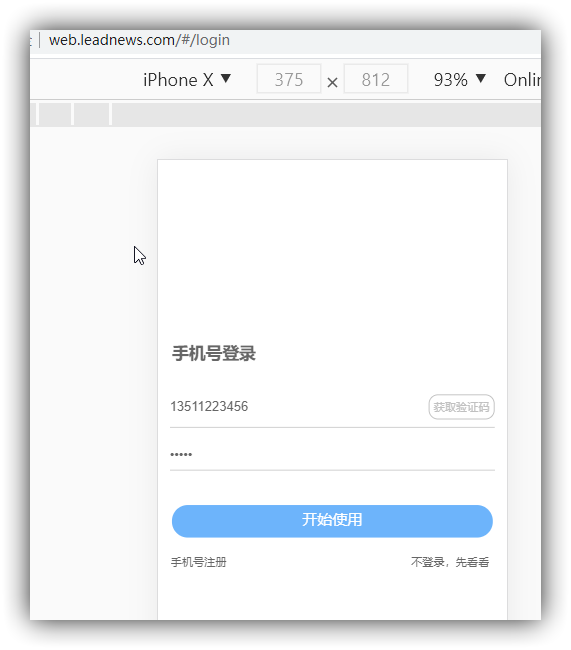

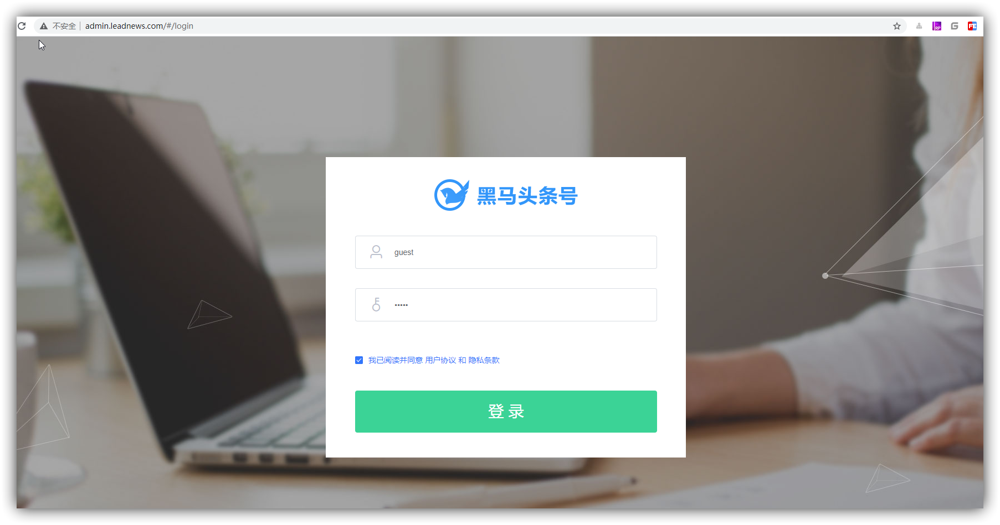


## 9 域名设置与绑定（了解）

### 9.1 域名购买

在阿里云服务上部署完项目，你的项目就已经正式在互联网上线了
不过目前还是只能通过 外网的IP地址访问

如果要买域名 ==>  https://mi.aliyun.com/

### 9.2 域名备案

域名购买完毕后是需要备案的

如果您的网站托管在阿里云中国内地（大陆）节点服务器上，且网站的主办人和域名从未办理过备案，在网站开通服务前，您需通过阿里云ICP代备案系统完成ICP备案。

备案前您需准备备案所需的相关资料，通过PC端或App端进行备案信息填写、资料上传、真实性核验等，备案信息提交后需通过阿里云初审、短信核验和管局审核，整个备案流程预计所需时长约1~22个工作日左右，具体时长以实际操作时间为准。

http://help.aliyun.com/knowledge_detail/36922.html


### 9.3 域名绑定

域名需要和你的外网阿里云IP地址 绑定方可使用

配置域名解析地址==>  https://dns.console.aliyun.com/

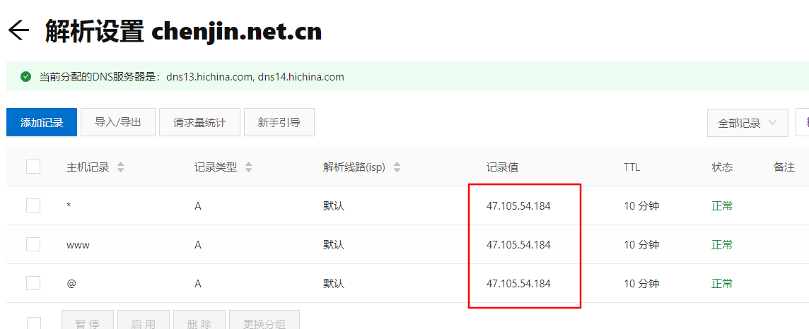

我们使用内网穿透 将地址 映射的 阿里云外网IP即可


## 10 自动通知jenkins触发任务（了解）

主流的git软件都提供了webhooks功能(web钩子), 通俗点说就是git在发生某些事件的时候可以通过POST请求调用我们指定的URL路径，那在这个案例中，我们可以在push事件上指定jenkins的任务通知路径。

### 10.1 jenkins配置Gitee插件

**jenkins下载webhooks插件**

gitee插件介绍: https://gitee.com/help/articles/4193#article-header0

jenkins也支持通过url路径来启动任务，具体设置方法: 

jenkins的默认下载中仅下载了github的通知触发,我们需要先下载一个插件

下载gitee插件

系统管理-->插件管理-->可选插件-->搜索 `Gitee` 下载-->重启jenkins

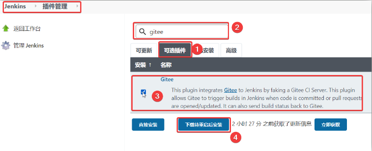

### 10.2 修改jenkins构建任务

**修改配置接收webhooks通知**

任务详情中点击配置来修改任务

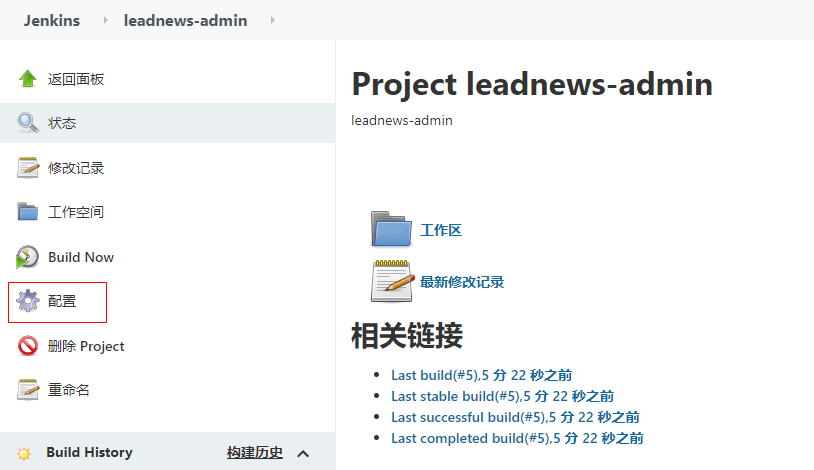

点击构建触发器页签,勾选`Gitee webhook`

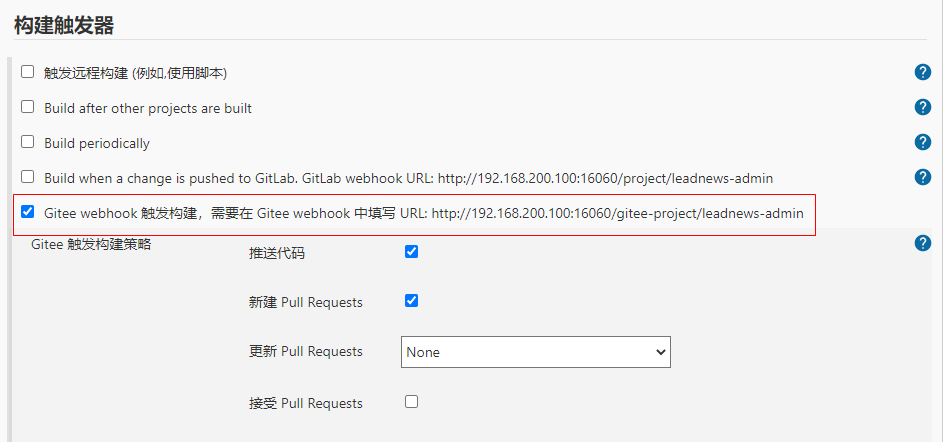

生成Gitee Webhook密码

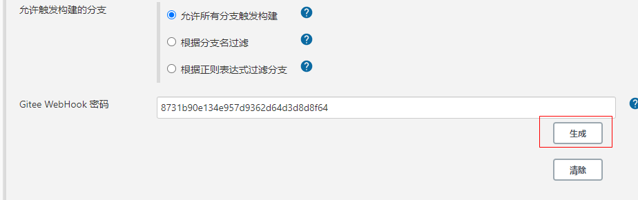

保存好触发路径和webhook密码，到gitee中配置webhook通知

如: 

**触发路径:**  http://192.168.200.151:8888/gitee-project/dockerDemo

**触发密码:** a591baa17f90e094500e0a11b831af9c

### 10.3 Gitee添加webhooks通知

**gitee仓库配置webhooks通知**

点击仓库页面的管理

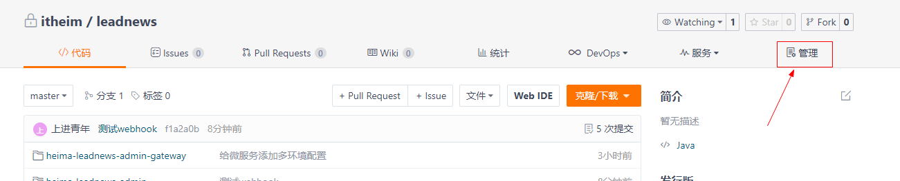

添加webhook

1. 点击webhooks菜单，然后点击添加
2. 配置jenkins通知地址
3. 填写密码
4. 点击添加

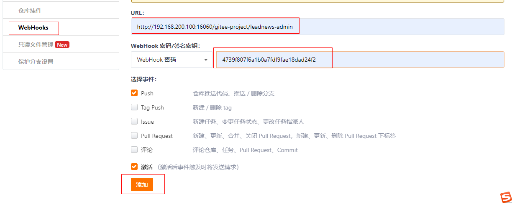

### 10.4 测试自动构建

添加完毕后测试一下:

提交leadnews-admin的代码测试是否自动触发了jenkins中的构建任务

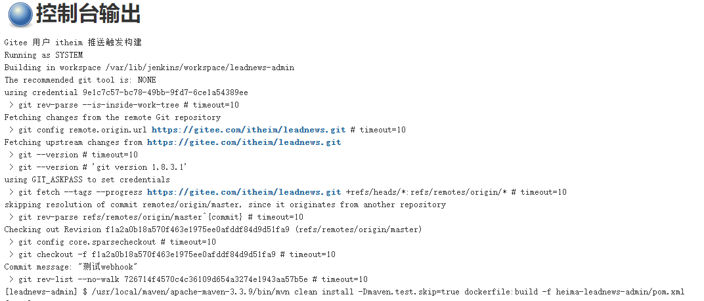

