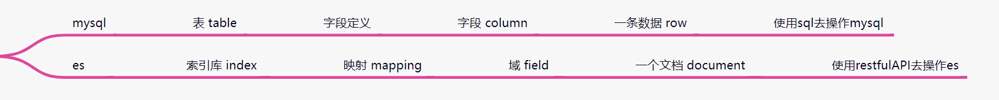
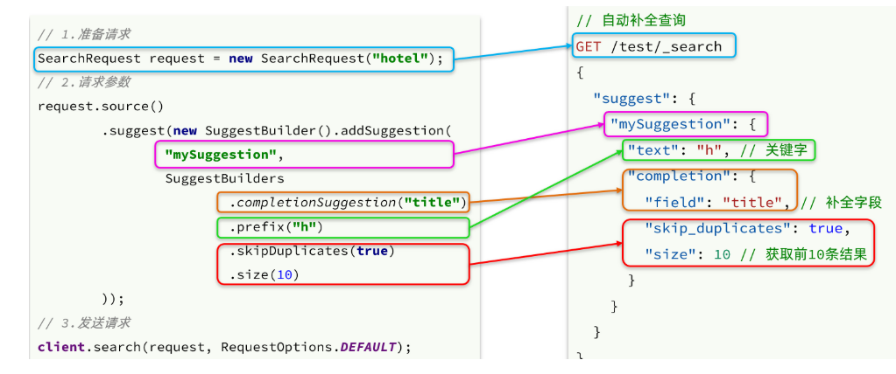
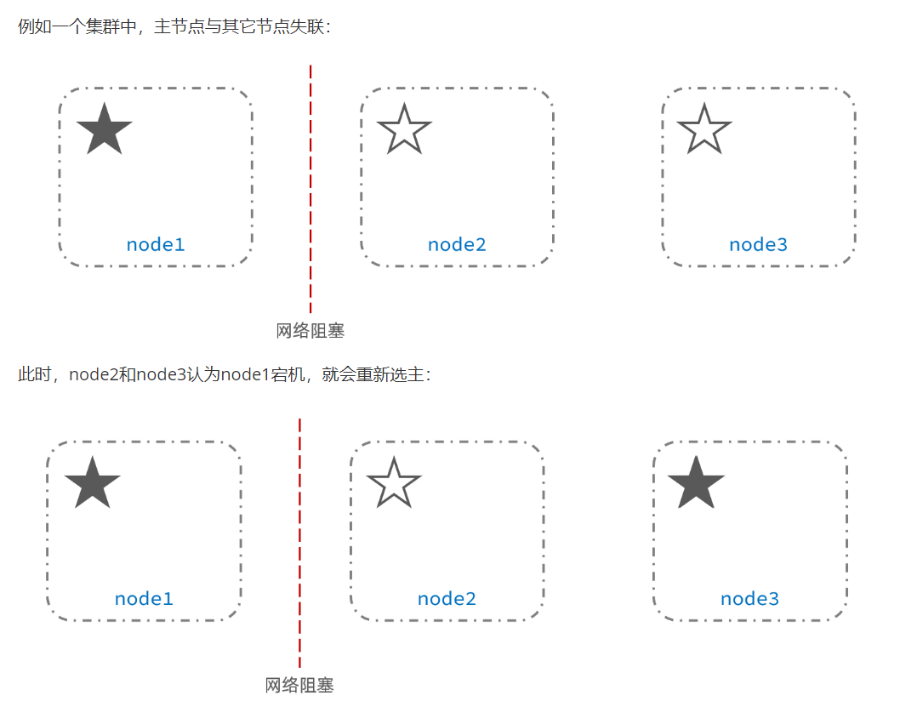
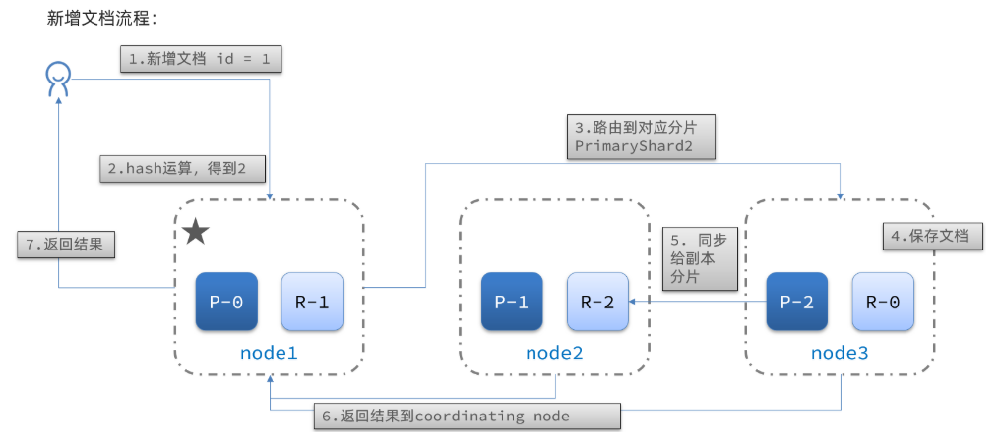

##### 请介绍一下elasticsearch ?

```
基于lucene开发的全文搜索引擎

并且操作API简单 易于上手

扩展性强， 天生的分布式集群架构
```

##### mysql 与 es 的区别 ?

```
两者都是数据库，都能提供数据的CRUD

mysql是关系型数据库，具有ACID的事务特性能够保证数据的一致性，
不过当数据量大 并发量高时 性能较差   无法应对高效复杂的查询业务

es主要就是为海量数据的实时搜索而设计的，底层采用倒排索引 能够快速的实现
海量数据复杂搜索 ，但不支持事务 

所以在我们项目中， mysql用于维护项目中的核心数据

而 es则用于项目中核心数据搜索实现

也可以 用于存储项目中的所有日志信息
```



##### 什么是倒排索引?

```
根据要检索的内容，创建词汇表，查询时 先查询词汇表，根据关键词得到对应的内容

减少磁盘IO的次数
词汇表一次创建   多次查询受益
```

##### IK分词器的作用 ?

```
分词器:   基于算法对要存储的内容按照规则拆分成多个词汇

es中自带的分词器对中文的分词效果不理想

项目中 我们使用的是IK分词器 (安装IK分词器插件即可)

IK分词器 有两种类型可选:

	ik_smart  精简切分  (搜索条件分词使用)
	
	ik_max_word  最细切分   (存储内容分词使用) 


不过IK分词器是基于词典来分词的， 一些新的热点词汇可能不认识，或者有些敏感词需要忽略  可以通过配置  扩展词词典  、 停顿词词典来实现

ik为我们提供了三种常见的词典分别是：
1）main.dic：主词典，一些常用词
2）ext.dic：扩展词词典
3）stopword.dic：停用词
这些词典用户都可以自行扩展，只需要配置IKAnalyzer.cfg.xml文件即可

词典是怎么加载的呢，常用的字典树 tire tree 是一种结构简单的树，也叫做前缀树，

从根节点触发，把一个词挂在这颗树上。其中词的开头，都是根节点的孩子节点，每个字都是前一个字的孩子节点，红色的节点表示词的结尾。上图中间表示，前门是一个词，门是结尾；前门巨虎也是一个词，虎结尾。

```


##### 如何在es中创建索引库? 

```
创建索引库:  PUT  索引库名称  
           创建参数:  
           		{
                    setting:  设置信息   {
                          分片数量: 
                          副本数量:
                    },
                    mapping: 映射信息 {
                         properties: {
                             title: {
                                 type: keyword   text
                                 index: 是否索引
                                 analyzer: 分词器
                             }
                             
                         }
                    }
                    
           		}
删除索引库:  DELETE 索引库名称
```

##### 如何在es中管理文档?

```
根据id查询  GET {索引库}/_doc/{id}
添加文档    POST {索引库}/_doc/{id}
修改文档    PUT {索引库}/_doc/{id}
删除文档    DELETE {索引库}/_doc/{id}
```

##### es中搜索的语法?

```
// 搜索语法
GET {索引库}/_search

// 搜索参数
{
    query 查询条件: {
        查询类型: {
            查询字段 : 值
        }
    },
    sort  排序条件: {
    },
    from  分页条件: 0,  
    size: 10,
    highlight 高亮条件: {
        高亮字段
        前置标签
        后置标签
    },
    aggs 聚合条件: {
        度量聚合
        桶聚合
    },
    suggest 自动补全: {
    }
}

query常用查询类型:   match_all、match、term、range、 
bool（must、should、must_not、filte） 、function_score
```

##### 如何使用java操作es ?

```java
es官方提供了java的客户端 ，引入后即可使用

		// 1. 引入依赖:
		<dependency>
            <groupId>org.elasticsearch.client</groupId>
            <artifactId>elasticsearch-rest-high-level-client</artifactId>
        </dependency>
    
    
    	// 2. 初始化客户端:   
   		client = new RestHighLevelClient(RestClient.builder(
            HttpHost.create("http://192.168.200.130:9200")
        ));
    

     	//  3.1. 先创建请求对象 CreateIndexRequest
        CreateIndexRequest request = new CreateIndexRequest("hotel");
        //       请求设置参数:  索引库名称     映射json字符串
        //  3.2. 调用客户端执行对应得请求  client.indices().create();    client.delete()
        CreateIndexResponse response = client.indices().create(request, RequestOptions.DEFAULT);
        //  3.3.  解析相应结果
        System.out.println(response.isAcknowledged()?"创建成功":"创建失败"); 
```


##### 实际场景 - 多条件检索 及 结果高亮处理 


```
业务描述: 

在项目web页面首页 就是系统的搜索页面，  包含: 搜索框 、 搜索条件面板 、 排序条件 、 分页条件
 		搜索框: 支持拼音搜索、多字段搜索、自动补全
 		搜索条件面板： 条件都是动态生成的 ， 会根据搜索框的内容 生成对应的搜索条件  如: 分类  品牌
 		排序: 默认相关度排序、 还支持： 评价  价格  销量  距离 
 		
当点击页面搜索按钮后，从es中查询相关业务数据，  返回的数据做了 排序 分页  还有高亮处理


实现流程: 

1. es中创建索引库
	 索引库中需要分词的字段  类型设置为 text
	 
	 因为项目中要支持中文分词  还 有拼音查询，需要安装 ik分词器  及 pinyin分词器  插件
	 
2. 同步数据
     实际的业务数据存储在mysql中，项目开始后将mysql中的业务数据一次性同步到es索引库
     
     后续数据的变化都通过mq保证数据的一致性
3. 多条件搜索
     实现es提供的java客户端实现
     
     3.1 创建es 客户端
     
     3.2 构建搜索请求
     
     	查询条件构建: 
     	   创建bool条件
     	   
     	   		创建搜索框 match 分词条件
     	   
     	        创建品牌、分类  term 词条条件
     	        
     	        创建价格区间  range 范围条件
     	   
     	   通过bool条件的 must  must_not should filter 将上面条件关联
     	
       分页条件构建:
           
           from  + size : 注意 from + size值不能超过10000
           会有深度分页问题
           
       
       排序条件：  
       
           默认按照相关度排序， es会根据搜索内容计算和文档的相关度得分
           
           按照得分降序排序
           
           根据前端传过来的值: 可以选用 距离  价格  销量排序
           
       高亮条件: 
       
           设置好高亮处理的字段
           
           前置标签
           
           后置标签
           
           es会进行高亮处理，结果单独解析高亮处理内容
       
       算分条件:
          项目中的数据，是支持竞价排名的，算分条件可以增加指定数据的得分权重
          
    3.3 执行搜索
    
    3.4 解析搜索结果
    
        执行搜索 和 解析结果都是按照固定的格式解析
        
        所以已经封装了工具类处理，很简单
```


##### 实际场景 - 按距离排序附近的酒店


```
业务描述:

项目中支持  搜索指定距离范围内的数据，也可以把数据 按照距离进行排序，查询附近的酒店


实现流程:

存入es中的每条文档，都带坐标字段: "location" : "30.871729, 121.81959" 代表这个酒店的经纬度

es中提供了专门的geo 地理坐标，查询语法来实现

	如： 查询 15KM内的所有 酒店
		
		查询时: 只需要给一个当前坐标点  和  半径距离
		es会以这个点为圆心， 查询出半径距离内所有文档数据
	
		GET hotel/_search
		{
			"query":{
                "geo_distance": {
                    "distance": "5km",
                    "location": "31.21,121.35"
            	}
			}
		}

    如: 查询附近的酒店, 实际就是按照距离  升序排序

       GET hotel/_search
		{
			"sort":{
                "_geo_distance": {
                    "location": "31.21,121.35",  // 提供坐标点
                    "order": "asc", // 升序还是降序
                    "unit": "km" // 距离单位
            	}
			}
		}
```


##### 实际场景 - 酒店(商品)竞价排名


```
业务描述: 
项目中的搜索数据的排序，默认是按照相关度排序的， 也就是数据 和 搜索条件越相似 越靠前， 不过需求中 酒店是可以竞价排名的，也就是交了广告费的  搜索排名要考前。

实现流程: 
在es中  提供了  function_score的查询API (算分查询) , 可以根据条件  修改指定文档的相关度得分，来影响文档的排名。 

具体实现:

   1. 广告文档数据  将isAD字段 设置为true
   
   2. 搜索时，添加算分查询条件
   
   		GET /hotel/_search
   		{
            query: {
            	// 算分查询条件
                function_score: {
                    query: "原来的查询条件",
                    
                    functions : [ // 算分函数，用于修改指定文档得分
                        {
                        	// 过滤条件， 哪些文档需要算分
                            "filter" : {term : {isAD : true}},
                            
                            // 算分的值: 可以提供生成方法，也可以直接给个分值
                            "weight" : 10
                        }
                    ],
                    // 加权方式:  默认相乘      原得分 * 算分 = 新的得分
                    "boost_mode": "multiply"
                }
            }
   		}
  
```

##### 实际场景 - 动态查询搜索条件面板


```
业务描述: 
项目中的搜索面板的条件，都是动态生成的，  如: 搜索东方明珠，  城市只有上海有  那么条件上只会显示上海

实现流程: 
主要基于es的聚合函数实现，  如查询条件 还是按原来的搜索条件来， 在额外设置聚合条件

es支持多种聚合处理  如:  分桶聚合(类似数据库中的分组)
                      度量聚合(类似数据库中的聚合函数)

这里使用的就是词条分桶 terms , 把搜索出来的结果按照指定字段分组  

    你搜的是东方明珠  ，按照城市分组  得到上海
    
                     按照品牌分组  得到相关的  品牌分组

```

##### 实际场景 - 自动补全及拼音查询


```
业务描述:

用户在搜索框输入拼音 或 汉字，自动提示相关热点内容方便快捷搜索，这个功能就是自动联想 或 自动补全

实现流程:

es中专门提供了 联想搜索，支持 输入前缀内容， 匹配相关热点内容

1. 文档中添加字段 suggestion 用于存储联想提示词汇

2. 添加文档时，将文档中的关键词作为提示词， 如果酒店中 商区、分类、品牌

3. 使用es语法实现联想查询
```



##### 实际场景 - 分布式日志

```
业务描述:
项目采用的是微服务架构，  如黑马头条 共11个微服务， 项目上线后 如果出现问题 需要查看日志排查， 但挨个微服务的看日志非常麻烦。 我们采用elk的架构 来存储整个微服务中的日志内容。

实现流程: 
1. 部署elk
	e: elasticsearch 用于存储日志
	
	l: logstash 采集日志数据
	
	k: kibana 用于可视化查看分析日志

2. 配置每个微服务
	
	引入相关依赖 (logback + logstash整合依赖)
	
	修改logback.xml 日志配置文件，指定日志除输出到控制台外还输出到logstash中
	
	通过kibana分析日志
3. 打开kibana管理页面

    查看相关日志
    
    	服务名称
    	
    	日志信息
    	
    	日志级别
    	
    	日志时间
    	
    	...
```

##### 项目中具体使用了几台es ?   (如何保证es高可用?)

```
我们是在linux服务器搭建的es集群，具体几台不清楚 因为软件的部署安装都是运维负责的

不过es集群原理我知道些

es可以通过多台es节点  组成高可用集群 ，一个集群中会有一个master节点  负责管理集群状态 如索引库分片:

搭建集群后，我们在创建索引库时可以设置分片数量 (分片把一个索引库的数据分成若干份,每一份就是一个分片)

                            设置副本数量 (每一个主分片 都可以设置副本 保证分片安全 可用)
                            
 
如:  我们搭建一个 3节点es集群   主分片: 3   副本分片: 1   一共6份分片数据，master节点可以将6份分片数据分配到不同的clusterNode中， 并且保证 对应的 主分片 和 副本分片不在一起 这样分片越多能存储的数据量越大， 因为有副本 数据也是高可用的


自动选举:
如果master节点挂掉了，其它节点可以感应到 (集群节点会相互通信) 默认 ： 超过半数节点认为master挂掉了  会投票选举新的master节点


故障恢复:   (green   yellow  red)
如果任意节点挂掉，分片信号丢失此时集群状态为 yellow es会触发故障恢复，
                 
                 如果主分片信号丢失   ，会基于副本 将丢失的分片数据恢复 

                 如果副本分片信号丢失  ， 会基于主分片 生成副本数据
```


##### 项目中 索引库及分片  是如何设计的? 

```
一般，在使用es实现海量数据存储和搜索时 不会将所有数据都存放到一个索引库中，也会采用类似数据库中分库分表的概念 创建多个es 索引库，而且每个索引库也会设置多个分片 将数据分散存储。

如: 黑马头条场景 存放资讯类数据  但每天都会有大量的资讯文章发表， 我们可以按照周滚动创建索引库  每个索引库创建 3个主分片   每个主分片 2个副本即可 

主分片的数量 根据区间段所产生的数据量来，一个每个主分片建议存储的数据量 
									搜索场景 : 单个分片不超过 20G
                                    日志场景 : 单个分片不超过 50G
虽然分片数量越大 能存储的数据量上限越高，但也会有很多负面影响:
1. 创建分片慢：Elasticsearch创建分片的速度会随着集群内分片数的增加而变慢。
2. 集群易崩溃：在凌晨触发Elasticsearch自动创建Index时，由于创建速度太慢，容易导致大量写入请求堆积在内存，从而压垮集群。 　　
3. 写入拒绝：分片过多的场景中，如果不能及时掌控业务变化，可能经常遇到单分片记录超限、写入拒绝等问题。
```

##### 是否了解脑裂现象?

```
一个集群只能有一个master节点来管理集群状态

但如果 master节点未宕机，却因为网络问题，或者其它延迟问题造成过半候选者节点触发自动选举机制，选出了一个新的master节点，则  此时集群中 出现了两个master节点， 造成集群分裂，数据错误  成为脑裂
```



##### 是否了解分片路由?

```
elasticsearch会通过hash算法来计算文档应该存储到哪个分片：
 
 shard = hash(_routing) % shard_number

- _routing默认是文档的id

- 算法与分片数量有关，因此索引库一旦创建，分片数量不能修改！ (副本数量可以修改)
```



##### ElasticSearch在数据量很大的情况下（数十亿级别）如何提高查询效率？

```
这个问题说白了，就是看你有没有实际用过 ES，因为啥？其实 ES 性能并没有你想象中那么好的。
很多时候数据量大了，特别是有几亿条数据的时候，可能你会懵逼的发现，跑个搜索怎么一下 5~10s，坑爹了。
第一次搜索的时候，是 5~10s，后面反而就快了，可能就几百毫秒。
```

**性能优化的杀手锏：Filesystem Cache**


```
你往 ES 里写的数据，实际上都写到磁盘文件里去了，查询的时候，操作系统会将磁盘文件里的数据自动缓存到 Filesystem Cache 里面去。

ES 的搜索引擎严重依赖于底层的 Filesystem Cache，你如果给 Filesystem Cache 更多的内存，尽量让内存可以容纳所有的 IDX Segment File 索引数据文件，那么你搜索的时候就基本都是走内存的，性能会非常高。

性能差距究竟可以有多大？我们之前很多的测试和压测，如果走磁盘一般肯定上秒，搜索性能绝对是秒级别的，1 秒、5 秒、10 秒。

但如果是走 Filesystem Cache，是走纯内存的，那么一般来说性能比走磁盘要高一个数量级，基本上就是毫秒级的，从几毫秒到几百毫秒不等。

来看一个真实的案例：某个公司 ES 节点有 3 台机器，每台机器看起来内存很多 64G，总内存就是 64 * 3 = 192G。

每台机器给 ES JVM Heap 是 32G，那么剩下来留给 Filesystem Cache 的就是每台机器才 32G，总共集群里给 Filesystem Cache 的就是 32 * 3 = 96G 内存。

而此时，整个磁盘上索引数据文件，在 3 台机器上一共占用了 1T 的磁盘容量，ES 数据量是 1T，那么每台机器的数据量是 300G。

这样性能好吗？ 

Filesystem Cache 的内存才 100G，十分之一的数据可以放内存，其他的都在磁盘，然后你执行搜索操作，大部分操作都是走磁盘，性能肯定差。

归根结底，你要让 ES 性能好，最佳的情况下，就是你的机器的内存，至少可以容纳你的总数据量的一半。

根据生产环境实践经验，最佳的情况下，是仅仅在 ES 中就存少量的数据。

也就是说，你要用来搜索的那些索引，如果内存留给 Filesystem Cache 的是 100G，那么你就将索引数据控制在 100G 以内。这样的话，你的数据几乎全部走内存来搜索，性能非常之高，一般可以在1秒以内。

比如说你现在有一行数据：id，name，age .... 30 个字段。但是你现在搜索，只需要根据 id，name，age 三个字段来搜索。

如果你傻乎乎往 ES 里写入一行数据所有的字段，就会导致 90% 的数据是不用来搜索的。


但是呢，这些数据硬是占据了 ES 机器上的 Filesystem Cache 的空间，单条数据的数据量越大，就会导致 Filesystem Cahce 能缓存的数据就越少。


其实，仅仅写入 ES 中要用来检索的少数几个字段就可以了，比如说就写入 es id，name，age 三个字段。

然后你可以把其他的字段数据存在 MySQL 里

从 ES 中根据 name 和 age 去搜索，拿到的结果可能就 20 个 doc id，然后根据 doc id 到 HBase 里去查询每个 doc id 对应的完整的数据，给查出来，再返回给前端。


而写入 ES 的数据最好小于等于，或者是略微大于 ES 的 Filesystem Cache 的内存容量。


然后你从 ES 检索可能就花费 20ms，然后再根据 ES 返回的 id 去 mysql 里查询，查 20 条数据，可能也就耗费个 30ms。

如果你像原来那么玩儿，1T 数据都放 ES，可能会每次查询都是 5~10s，而现在性能就会很高，每次查询就是 50ms。


```

**数据预热**

```
假如你就按照上述的方案去做了，ES 集群中每个机器写入的数据量还是超过了 Filesystem Cache 一倍。

比如说你写入一台机器 60G 数据，结果 Filesystem Cache 就 30G，还是有 30G 数据留在了磁盘上。

这种情况下，其实可以做数据预热。举个例子，拿微博来说，你可以把一些大 V，平时看的人很多的数据，提前在后台搞个系统。

然后每隔一会儿，自己的后台系统去搜索一下热数据，刷到 Filesystem Cache 里去，后面用户实际上来看这个热数据的时候，他们就是直接从内存里搜索了，很快。

或者是电商，你可以将平时查看最多的一些商品，比如说 iPhone 8，热数据提前后台搞个程序，每隔 1 分钟自己主动访问一次，刷到 Filesystem Cache 里去。

总之，就是对于那些你觉得比较热的、经常会有人访问的数据，最好做一个专门的缓存预热子系统。

然后对热数据每隔一段时间，就提前访问一下，让数据进入 Filesystem Cache 里面去。这样下次别人访问的时候，性能一定会好很多。
```

**冷热分离**

https://blog.csdn.net/wangshuminjava/article/details/107150733

```
ES 可以做类似于 MySQL 的水平拆分，就是说将大量的访问很少、频率很低的数据，单独写一个索引，然后将访问很频繁的热数据单独写一个索引。

最好是将冷数据写入一个索引中，然后热数据写入另外一个索引中，这样可以确保热数据在被预热之后，尽量都让他们留在 Filesystem OS Cache 里，别让冷数据给冲刷掉。

还是来一个例子，假设你有 6 台机器，2 个索引，一个放冷数据，一个放热数据，每个索引 3 个 Shard。3 台机器放热数据 Index，另外 3 台机器放冷数据 Index。

这样的话，你大量的时间是在访问热数据 Index，热数据可能就占总数据量的 10%，此时数据量很少，几乎全都保留在 Filesystem Cache 里面了，就可以确保热数据的访问性能是很高的。

但是对于冷数据而言，是在别的 Index 里的，跟热数据 Index 不在相同的机器上，大家互相之间都没什么联系了。
如果有人访问冷数据，可能大量数据是在磁盘上的，此时性能差点，就 10% 的人去访问冷数据，90% 的人在访问热数据，也无所谓了。
```

**避免关联查询**

```
对于 MySQL，我们经常有一些复杂的关联查询，在 ES 里该怎么玩儿？

ES 里面的复杂的关联查询尽量别用，一旦用了性能一般都不太好。最好是先在 Java 系统里就完成关联，将关联好的数据直接写入 ES 中。搜索的时候，就不需要利用 ES 的搜索语法来完成 Join 之类的关联搜索了。
```

**分页性能优化**

```

如果你有 5 个 Shard，那么就有 5000 条数据，接着协调节点对这 5000 条数据进行一些合并、处理，再获取到最终第 100 页的 10 条数据。

由于是分布式的，你要查第 100 页的 10 条数据，不可能说从 5 个 Shard，每个 Shard 就查 2 条数据，最后到协调节点合并成 10 条数据吧？

你必须得从每个 Shard 都查 1000 条数据过来，然后根据你的需求进行排序、筛选等等操作，最后再次分页，拿到里面第 100 页的数据。

你翻页的时候，翻的越深，每个 Shard 返回的数据就越多，而且协调节点处理的时间越长，非常坑爹。所以用 ES 做分页的时候，你会发现越翻到后面，就越是慢。

我们之前也是遇到过这个问题，用 ES 作分页，前几页就几十毫秒，翻到 10 页或者几十页的时候，基本上就要 5~10 秒才能查出来一页数据了。


有什么解决方案吗？两个思路：
一、不允许深度分页（默认深度分页性能很差）。跟产品经理说，你系统不允许翻那么深的页，默认翻的越深，性能就越差。

二、类似于 App 里的推荐商品不断下拉出来一页一页的；类似于微博中，下拉刷微博，刷出来一页一页的，你可以用 Scroll API，关于如何使用，大家可以自行上网搜索学习一下。

Scroll是如何做的呢？它会一次性给你生成所有数据的一个快照，然后每次滑动向后翻页就是通过游标 scroll_id 移动，获取下一页、下一页这样子，性能会比上面说的那种分页性能要高很多很多，基本上都是毫秒级的。

但是，唯一的一点就是，这个适合于那种类似微博下拉翻页的，不能随意跳到任何一页的场景。也就是说，你不能先进入第 10 页，然后去第 120 页，然后又回到第 58 页，不能随意乱跳页。

所以现在很多产品，都是不允许你随意翻页的，你只能往下拉，一页一页的翻。

使用时需要注意，初始化必须指定 Scroll 参数，告诉 ES 要保存此次搜索的上下文多长时间。你需要确保用户不会持续不断翻页翻几个小时，否则可能因为超时而失败。

除了用 Scroll API，你也可以用 search_after 来做。search_after 的思想是使用前一页的结果来帮助检索下一页的数据。

显然，这种方式也不允许你随意翻页，你只能一页页往后翻。初始化时，需要使用一个唯一值的字段作为 Sort 字段。

```


